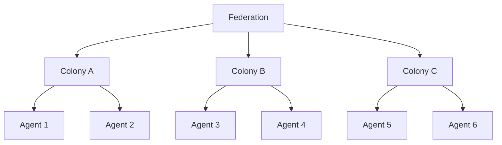

# Agentis Colonies

Open-source agent colonies built on the [Agentis](https://github.com/Replikanti/agentis) runtime.

**Agentis** is a proprietary AI-native platform for agent emergence. It provides the runtime, language, evolution engine, and distributed infrastructure. **Colonies** (this repo) are open-source (Apache 2.0) configurations of agents that solve real-world problems using that runtime.

## Colonies and Federations

A **colony** is a group of specialized agents that collaborate on a single domain. Agents within a colony share context, budget, and evolutionary pressure. They are a team, not a collection of individuals.

A **federation** is a system of colonies that work together to cover a complete workflow. Each colony handles its domain, and the federation coordinates across them.

## Federations

| Federation | Description | Agents | Status |
|------------|-------------|--------|--------|
| [dev-apprenticeship](./dev-apprenticeship/) | Learns a developer's complete workflow by observing how you work on GitLab. Covers triage, code review, planning, implementation, and release. | 21 | Beta |

### Status

| Badge | Meaning |
|-------|---------|
| **Stable** | Battle-tested on real workloads. Safe for production use. |
| **Beta** | All agents built, audited, and linted clean. Not yet validated on live GitLab projects. |
| **Alpha** | Core agents work. Some features incomplete or untested. |
| **Planned** | Design exists, implementation not started. |

## Prerequisites

- [Agentis](https://github.com/Replikanti/agentis) runtime
- An LLM backend (Claude CLI, Ollama, or any OpenAI-compatible API)
- GitLab instance with API access

## License

Apache 2.0. See [LICENSE](./LICENSE).

Agentis runtime is proprietary software by [Replikanti](https://github.com/Replikanti).
