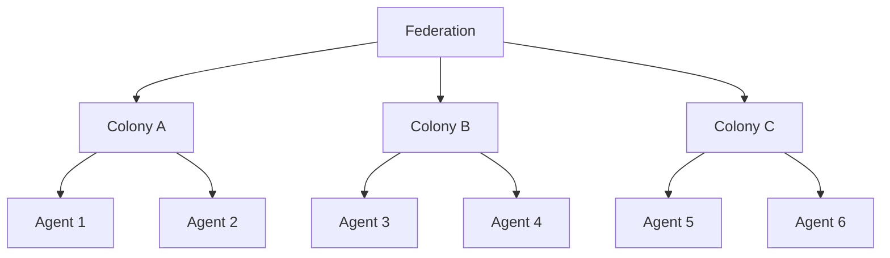

# Agentis Colonies

A home for [Agentis](https://github.com/Replikanti/agentis) agent federations. **Apache 2.0**.

**Agentis** is a proprietary AI-native platform for agent emergence (runtime, language, evolution engine, distributed infrastructure). **This repo** hosts open-source federations and federation-agnostic platform components built on that runtime. [`dev-apprenticeship/`](./dev-apprenticeship/) is the first federation — coder workflow on GitLab/GitHub, 21 agents — and the platform contract in [ADR-0003](./doc/adr/ADR-0003-federation-portability-contract.md) keeps the door open for federations of other kinds (data-ops, research, support-triage, monitoring-ops — sketches in [`doc/federation-patterns.md`](./doc/federation-patterns.md)).

**What makes this repo distinctive:** every agent runs in `shadow` (observe-only) mode by default. It graduates up a four-tier confidence ladder — `shadow` → `propose` → `review-gated` → `autonomous` — based on measured experience, not hand-tuned thresholds. An agent only acts on your project once it has earned the tier. See [`doc/adr/ADR-0001-confidence-tiers.md`](./doc/adr/ADR-0001-confidence-tiers.md).

## Colonies and Federations

A **colony** is a group of specialized agents that collaborate on a single domain. Agents within a colony share context, budget, and evolutionary pressure. They are a team, not a collection of individuals.

A **federation** is a system of colonies that work together to cover a complete workflow. Each colony handles its domain, and the federation coordinates across them.


```mermaid
graph TD
    F["Federation"]
    C1["Colony A"]
    C2["Colony B"]
    C3["Colony C"]
    A1["Agent 1"]
    A2["Agent 2"]
    A3["Agent 3"]
    A4["Agent 4"]
    A5["Agent 5"]
    A6["Agent 6"]

    F --> C1
    F --> C2
    F --> C3
    C1 --> A1
    C1 --> A2
    C2 --> A3
    C2 --> A4
    C3 --> A5
    C3 --> A6
```

[`dev-apprenticeship/`](./dev-apprenticeship/) is the first concrete federation: 5 colonies, 21 agents covering triage, planning, implementation, code review, and release. The platform contract that makes a federation directory "platform-compliant" — and that the platform tooling (dashboard, auto-promote, kill-federation) consumes — is codified in [ADR-0003](./doc/adr/ADR-0003-federation-portability-contract.md).

## Federations

| Federation | Version | Description | Agents | Status |
|------------|---------|-------------|--------|--------|
| [dev-apprenticeship](./dev-apprenticeship/) | [`2.0.0`](https://github.com/Replikanti/agentis-colonies/releases/tag/dev-apprenticeship-v2.0.0) | Learns a developer's complete workflow by observing how you work on GitLab or GitHub. Covers triage, code review, planning, implementation, and release. | 21 | Beta |
| [tribes-bench](./tribes-bench/) | unreleased | Tribal-emergence harness — five seed colonies hunt CVE-grade memory safety bugs in vendored Rust crates via a deterministic verifier. Stage 2 M3 reached: 5-tribe ecosystem vs 1-tribe baseline verdict apparatus + N=3 paired pilot results. | 5 | Experimental |
| [trading-binance](./trading-binance/) | unreleased | Emergence-driven crypto futures strategy discovery on Binance USDT-margined perpetuals. Multi-agent population evolves price-action / volume-profile / CME-gap / fibo / market-structure setups against historical and live OHLCV feeds (no indicators, no oscillators). Backtest-only in Phase 1. | 1 | Experimental |

To start a new federation, see [`tools/new-federation.sh`](./tools/new-federation.sh) and [`doc/federation-patterns.md`](./doc/federation-patterns.md). The contract every federation must satisfy is [ADR-0003](./doc/adr/ADR-0003-federation-portability-contract.md).

## Platform components

Federation-agnostic components are versioned and released independently so fixes ship without forcing any federation re-release. The same install can serve any federation that meets the component's compatibility floor.

| Component | Version | Description |
|-----------|---------|-------------|
| [federation-dashboard](./federation-dashboard/) | [`0.9.1`](https://github.com/Replikanti/agentis-colonies/releases/tag/federation-dashboard-v0.9.1) | Generic web dashboard with operator controls (promote / demote / evolve / restart / kill), 5-tab surface (Status / Cost / Recovery / Logs & Events / Config), per-agent table, federation-wide Experience tile, collapsible Promotion Progress, and Forge Rate Limits tile. Auto-discovers colonies + agents from any federation directory. |

### Status

| Badge | Meaning |
|-------|---------|
| **Stable** | Battle-tested on real workloads. Safe for production use. |
| **Beta** | All agents built, audited, and linted clean. Not yet validated on live GitLab projects. |
| **Alpha** | Core agents work. Some features incomplete or untested. |
| **Experimental** | Research scaffold. Wiring works end-to-end but no claim about findings quality, stability, or backwards compatibility. |
| **Planned** | Design exists, implementation not started. |

## Quickstart

From a release tarball (recommended — install-ready, no git clone needed):

```bash
VERSION=2.0.0   # or any tagged dev-apprenticeship release
curl -LO https://github.com/Replikanti/agentis-colonies/releases/download/dev-apprenticeship-v${VERSION}/dev-apprenticeship-v${VERSION}.tar.gz
tar xzf dev-apprenticeship-v${VERSION}.tar.gz
cd dev-apprenticeship-v${VERSION}/dev-apprenticeship
./install.sh           # interactive: prereqs, config, GitLab creds, confidence seed
./start-federation.sh  # launches 21 daemons
```

From the official Docker image (multi-arch `linux/amd64` + `linux/arm64`, no host-side `agentis` install required, [#324](https://github.com/Replikanti/agentis-colonies/issues/324)):

```bash
docker run --rm -d \
  --name agentis-colonies \
  -e GITLAB_URL=https://gitlab.com \
  -e GITLAB_PROJECT=my-org/my-project \
  -e GITLAB_TOKEN=glpat-... \
  -v $PWD/data:/data \
  ghcr.io/replikanti/agentis-colonies:dev-apprenticeship-2.0.0
```

Sample compose + Kubernetes manifests under [`examples/docker/`](./examples/docker/) and [`examples/k8s/`](./examples/k8s/).

Or from a clone of the repo (useful if you want to contribute):

```bash
git clone https://github.com/Replikanti/agentis-colonies
cd agentis-colonies/dev-apprenticeship
./install.sh
./start-federation.sh
```

You now have 21 agents in `shadow` mode observing your GitLab project. Watch their reasoning via `./watch-suggestions.sh` or the web dashboard via `./dashboard.sh`.

Need the runtime first? See [Replikanti/agentis](https://github.com/Replikanti/agentis).

## Prerequisites

- [Agentis](https://github.com/Replikanti/agentis) runtime
- An LLM backend (Claude CLI, Ollama, or any OpenAI-compatible API)
- GitLab instance with API access

## Repository structure

```
dev-apprenticeship/    # First federation: GitLab/GitHub coder workflow (21 agents, Beta)
federation-dashboard/  # Standalone, separately-versioned platform component (#252)
tools/                 # Shared platform tooling (lint, auto-promote, kill, scaffolders)
doc/                   # Reference docs (auto-promote, federation-dashboard, federation patterns)
doc/adr/               # Architecture Decision Records (normative cross-repo contracts)
```

## Starting a new federation

```bash
./tools/new-federation.sh <federation-name>           # uses "core" as starter colony
./tools/new-federation.sh <federation-name> <colony>  # custom starter colony
```

The scaffolder generates an [ADR-0003](./doc/adr/ADR-0003-federation-portability-contract.md)-compliant directory shape: `VERSION`, `CHANGELOG.md`, `BUNDLE.manifest`, `README.md`, `install.sh`, plus one starter colony with a `start-colony.sh` that already supports `--restart-agent` (so the dashboard can restart its agents) and `--rate-limit-status` (so the Forge Rate Limits tile renders). Output passes `colony-lint.sh` clean. Federation patterns beyond the coder workflow live in [`doc/federation-patterns.md`](./doc/federation-patterns.md).

## Operator scripts

End-user scripts live inside each federation. For `dev-apprenticeship/`:

| Script | Purpose |
|--------|---------|
| [`install.sh`](./dev-apprenticeship/install.sh) | Interactive setup: prerequisites, config, GitLab creds, confidence seed |
| [`start-federation.sh`](./dev-apprenticeship/start-federation.sh) | Launch all 5 colonies (21 daemons) |
| [`watch-suggestions.sh`](./dev-apprenticeship/watch-suggestions.sh) | Live feed of agent suggestions from all 21 logs |
| [`dashboard.sh`](./dev-apprenticeship/dashboard.sh) | Resolver wrapper that launches the standalone [`federation-dashboard`](./federation-dashboard/) component (installed independently, pinned via `dev-apprenticeship/.dashboard-version`). Web UI with operator controls (promote, demote, evolve, restart, kill). Full reference: [`doc/federation-dashboard.md`](./doc/federation-dashboard.md) |
| [`kill-federation.sh`](./dev-apprenticeship/kill-federation.sh) | Reliable shutdown (wraps [`tools/kill-federation.sh`](./tools/kill-federation.sh) with `--fed-dir` scoping) |

`kill-federation.sh` bypasses the `agentis` CLI and uses OS signals with post-kill verification, so it works even when `agentis daemon stop --all` reports false success or false failure. Run with `--help` for options including `--dry-run` and `--json`.

## Tiers

Every agent in this repo gates its behaviour on one of four named confidence tiers, not on raw numeric thresholds. Authors of `.ag` scenarios call the `tier("<agent_name>")` runtime builtin and compare against the tier name:

| Tier           | Range         | What the agent may do |
|----------------|---------------|-----------------------|
| `shadow`       | `[0.4, 0.6)`  | LLM calls + memo writes; no emit, no external write |
| `propose`      | `[0.6, 0.8)`  | ...plus emit on bus + draft external writes |
| `review-gated` | `[0.8, 0.95)` | ...plus direct external writes (non-terminal) |
| `autonomous`   | `[0.95, 1.0]` | ...plus terminal writes (merge, tag, publish) |

Below `0.4` the agent is `dormant`. The full normative contract — per-tier action classes, migration rules, alternatives considered — lives in [`doc/adr/ADR-0001-confidence-tiers.md`](./doc/adr/ADR-0001-confidence-tiers.md).

## Auto-governance

Agents don't stay at their seed confidence forever. [`tools/auto-promote.sh`](./tools/auto-promote.sh) reads the experience store and promotes agents up the tier ladder (or triggers `agentis evolve` when an agent is degrading) based on a statistical fitness signal. Scheduling is installed by `dev-apprenticeship/install.sh` — a sidecar spawned by `start-federation.sh` runs the script every 30 minutes while the federation is up, and dies cleanly when the federation is torn down. The heuristic classifies experience rows by tag — acting rows (`acted`, `review-gated`, `emitted`) contribute to the fitness signal; observe rows (`observed`) do not — so an agent can't earn promotion just by ticking in shadow mode.

Every decision is written to `tools/auto-promote-journal.jsonl` and defaults to dry-run. The full reference — DMN decision table, per-step rationale, statistical derivation of the `ceil(3 / reject_rate_threshold)` acting-floor formula, and operator override workflow — lives in [`doc/auto-promote.md`](./doc/auto-promote.md).

## Test-mode replay

Before swapping a hand-edited or `agentis evolve`-d `.ag` into a running federation, score it against captured history without side effects. The upstream `agentis replay` mode replays an experience pack against the candidate, mocks `exec sh` / `prompt()` / `emit` / `learn()` / external writes, and emits a per-row diff (`predicted_match` vs `expected`) plus a recommend / skip verdict.

- [`doc/replay-mode.md`](./doc/replay-mode.md) — operator workflow, export pipeline, verdict interpretation, integration with `auto-promote`. Wraps the upstream CLI; uses [`tools/replay-export-experience.sh`](./tools/replay-export-experience.sh) to package a federation's experience store as a single replay-friendly JSONL pack keyed by agent name. See [`examples/replay/`](./examples/replay/) for a sample fixture and dry-run walk-through.

## Design decisions

Normative design decisions for this repository are recorded as Architecture Decision Records under [`doc/adr/`](./doc/adr/README.md). External authors of `.ag` federations should treat the ADRs as the source of truth for cross-repo contracts such as the confidence-tier ladder.

## Versioning

Each federation is versioned independently at the federation level (not per-colony — the five colonies inside `dev-apprenticeship/` are coupled by bus events, so they ship as one unit). Tags use the prefixed form `<federation>-v<X.Y.Z>` (e.g. `dev-apprenticeship-v0.1.0`) so tool-level or alternate-federation releases can coexist without collision.

The [`federation-dashboard/`](./federation-dashboard/) component is versioned and released independently (`federation-dashboard-v<X.Y.Z>`) so dashboard fixes ship without forcing a federation re-release, and the same dashboard install can serve any federation that meets its compatibility floor. Federations declare a soft minimum dashboard version via a per-federation pin (`dev-apprenticeship/.dashboard-version`).

See [`dev-apprenticeship/CHANGELOG.md`](./dev-apprenticeship/CHANGELOG.md) and [`federation-dashboard/CHANGELOG.md`](./federation-dashboard/CHANGELOG.md) for release history and compatibility floors. The release process is documented in [`CLAUDE.md`](./CLAUDE.md#release-process).

## License

Apache 2.0. See [LICENSE](./LICENSE).

Agentis runtime is proprietary software by [Replikanti](https://github.com/Replikanti).
