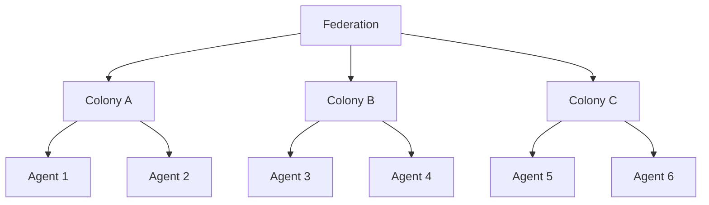

# Agentis Colonies

Open-source agent colonies built on the [Agentis](https://github.com/Replikanti/agentis) runtime.

**Agentis** is a proprietary AI-native platform for agent emergence. It provides the runtime, language, evolution engine, and distributed infrastructure. **Colonies** (this repo) are open-source (Apache 2.0) configurations of agents that solve real-world problems using that runtime.

## Colonies and Federations

A **colony** is a group of specialized agents that collaborate on a single domain. Agents within a colony share context, budget, and evolutionary pressure. They are a team, not a collection of individuals.

A **federation** is a system of colonies that work together to cover a complete workflow. Each colony handles its domain, and the federation coordinates across them.

```mermaid
graph TD
    F["Federation"]
    C1["Colony A"]
    C2["Colony B"]
    C3["Colony C"]
    A1["Agent 1"]
    A2["Agent 2"]
    A3["Agent 3"]
    A4["Agent 4"]
    A5["Agent 5"]
    A6["Agent 6"]

    F --> C1
    F --> C2
    F --> C3
    C1 --> A1
    C1 --> A2
    C2 --> A3
    C2 --> A4
    C3 --> A5
    C3 --> A6
```

## Federations

| Federation | Description | Agents | Status |
|------------|-------------|--------|--------|
| [dev-apprenticeship](./dev-apprenticeship/) | Learns a developer's complete workflow by observing how you work on GitLab. Covers triage, code review, planning, implementation, and release. | 21 | Beta |

### Status

| Badge | Meaning |
|-------|---------|
| **Stable** | Battle-tested on real workloads. Safe for production use. |
| **Beta** | All agents built, audited, and linted clean. Not yet validated on live GitLab projects. |
| **Alpha** | Core agents work. Some features incomplete or untested. |
| **Planned** | Design exists, implementation not started. |

## Prerequisites

- [Agentis](https://github.com/Replikanti/agentis) runtime
- An LLM backend (Claude CLI, Ollama, or any OpenAI-compatible API)
- GitLab instance with API access

## Operator scripts

When you need to reliably stop a federation — agents, dashboard, registry sidecar files, with a backup tarball before cleanup — use [`tools/kill-federation.sh`](./tools/kill-federation.sh) (or its per-federation wrapper, e.g. `dev-apprenticeship/kill-federation.sh`). It bypasses the `agentis` CLI and uses OS signals with post-kill verification, so it works even when `agentis daemon stop --all` reports false success or false failure. Run with `--help` for options including `--dry-run` and `--json`.

## Tiers

Every agent in this repo gates its behaviour on one of four named confidence tiers, not on raw numeric thresholds. Authors of `.ag` scenarios call the `tier("<agent_name>")` runtime builtin and compare against the tier name:

| Tier           | Range         | What the agent may do |
|----------------|---------------|-----------------------|
| `shadow`       | `[0.4, 0.6)`  | LLM calls + memo writes; no emit, no external write |
| `propose`      | `[0.6, 0.8)`  | ...plus emit on bus + draft external writes |
| `review-gated` | `[0.8, 0.95)` | ...plus direct external writes (non-terminal) |
| `autonomous`   | `[0.95, 1.0]` | ...plus terminal writes (merge, tag, publish) |

Below `0.4` the agent is `dormant`. The full normative contract — per-tier action classes, migration rules, alternatives considered — lives in [`doc/adr/ADR-0001-confidence-tiers.md`](./doc/adr/ADR-0001-confidence-tiers.md).

## Auto-governance

Agents don't stay at their seed confidence forever. [`tools/auto-promote.sh`](./tools/auto-promote.sh) is a cron-friendly script that reads the experience store and promotes agents up the tier ladder (or triggers `agentis evolve` when an agent is degrading) based on a statistical fitness signal. The heuristic classifies experience rows by tag — acting rows (`acted`, `review-gated`, `emitted`) contribute to the fitness signal; observe rows (`observed`) do not — so an agent can't earn promotion just by ticking in shadow mode.

Every decision is written to `tools/auto-promote-journal.jsonl` and defaults to dry-run. The full reference — DMN decision table, per-step rationale, statistical derivation of the `ceil(3 / reject_rate_threshold)` acting-floor formula, and operator override workflow — lives in [`doc/auto-promote.md`](./doc/auto-promote.md).

## Design decisions

Normative design decisions for this repository are recorded as Architecture Decision Records under [`doc/adr/`](./doc/adr/README.md). External authors of `.ag` federations should treat the ADRs as the source of truth for cross-repo contracts such as the confidence-tier ladder.

## License

Apache 2.0. See [LICENSE](./LICENSE).

Agentis runtime is proprietary software by [Replikanti](https://github.com/Replikanti).
