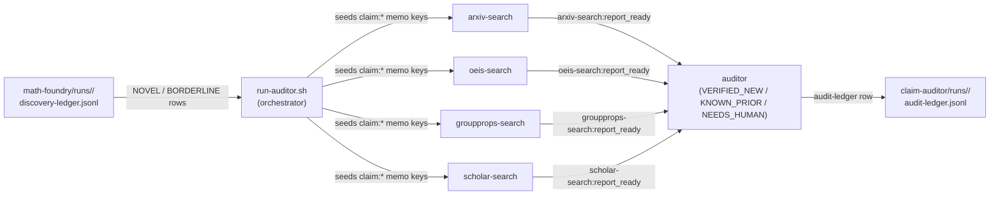

# Claim Auditor

 

**Version:** `0.1.0` · [Changelog](./CHANGELOG.md) · **Requires:** agentis >= `1.4.1`

Literature-verification federation for math-foundry novelty claims
(#595). When math-foundry tags a discovered result as `NOVEL` or
`BORDERLINE`, that signal is non-authoritative: the upstream novelty
referee is a single LLM call comparing against its training prior,
which can miss results published under non-obvious names. This
federation runs that audit step as a continuous, repeatable pipeline:
four searchers hit external math literature sources in parallel, and
an auditor synthesises their reports into a single
`VERIFIED_NEW` / `KNOWN_PRIOR` / `NEEDS_HUMAN` verdict per claim.

## Colonies

| Colony | Description | Agents |
|--------|-------------|--------|
| [arxiv-search](./arxiv-search/) | Builds 3-5 arXiv API queries, fetches abstracts, LLM-judges relevance | 1 |
| [oeis-search](./oeis-search/) | Extracts integer sequences from problem + answer, hits oeis.org/search, LLM-judges | 1 |
| [groupprops-search](./groupprops-search/) | Detects group-theoretic context, queries groupprops.subwiki.org opensearch | 1 |
| [scholar-search](./scholar-search/) | Best-effort Semantic Scholar paper-search (status='unavailable' on 429) | 1 |
| [auditor](./auditor/) | Reads all 4 searcher reports, single Opus LLM call to synthesise verdict | 1 |

## Pipeline



The producer-consumer contract with math-foundry is file-based:
math-foundry's `discovery-ledger.jsonl` is read-only input,
claim-auditor writes its own `audit-ledger.jsonl`. Math-foundry does
not need to know claim-auditor exists.

## Phased pipeline

Each searcher reads the seeded claim memo at `upstream_tick = tick - 1`,
mirroring math-foundry's noticer phasing. The auditor reads four
searcher reports at `upstream_tick = tick - 2` so the four searchers
have one full tick to publish.

| Colony | reads at upstream_tick = | writes at |
|---|---|---|
| arxiv-search | tick_idx − 1 | upstream_tick |
| oeis-search | tick_idx − 1 | upstream_tick |
| groupprops-search | tick_idx − 1 | upstream_tick |
| scholar-search | tick_idx − 1 | upstream_tick |
| auditor | tick_idx − 2 | upstream_tick |

## Quickstart

```bash
./install.sh                                                # prerequisite + config copy
export AUDITOR_SOURCE_RUN=/path/to/math-foundry/runs/<id>   # required
bash tools/run-auditor.sh --dry-run --source-run $AUDITOR_SOURCE_RUN
bash tools/run-auditor.sh --source-run $AUDITOR_SOURCE_RUN  # real run
```

Output: `claim-auditor/runs/<ts>/audit-ledger.jsonl` containing one
row per audited claim, schema documented below.

## Cross-federation memo read paths

The orchestrator (`tools/run-auditor.sh`) probes the upstream
math-foundry run dir's `.agentis/` for the formulator memo values that
were written during the original run. The lookup keys are:

```
formulator:<source_pid>:problem_text:tick-<source_tick>
formulator:<source_pid>:answer:tick-<source_tick>
formulator:<source_pid>:novelty_claim:tick-<source_tick>
```

When the upstream memo store is unreachable (frozen tarball, different
host, garbage-collected state), the orchestrator falls back to handing
the .ag agents the raw `discovery-ledger.jsonl` row as JSON. The
searchers' `if len(problem_text) == 0 { return; }` early-exit then
applies and the row is skipped that tick.

## Env-var matrix

All env vars are read by `tools/run-auditor.sh`. Defaults are tuned for
external-HTTPS workloads where one tick = one fetch round-trip per
searcher (~30-90s) plus an LLM judgement pass.

| Env var | Default | Purpose |
|---|---|---|
| `AUDITOR_SOURCE_RUN` | (required) | Path to math-foundry run dir or a discovery-ledger.jsonl path. |
| `AUDITOR_LLM_BACKEND` | `claude` | Routed into hermetic `.agentis/config` as `llm.backend`. |
| `AUDITOR_CLAUDE_MODEL` | `sonnet` | Searcher model. |
| `AUDITOR_CLAUDE_MODEL_AUDITOR` | `opus` | Auditor model (documented, applied via colony.toml override path; Phase 1 single-block applies sonnet across all 5). |
| `AUDITOR_CLAUDE_EFFORT` | `medium` | Effort knob for both. |
| `AUDITOR_HOST_CLAUDE_DIR` | `$HOME/.claude` | Bind-mounted into the container for Claude CLI session. |
| `AUDITOR_TICK_INTERVAL_S` | `120` | Seconds between ticks. |
| `AUDITOR_TOTAL_TICKS` | `30` | Number of ticks to drive. |
| `AUDITOR_CONFIDENCE_FLOOR` | `0.7` | Documentation-only floor for downstream consumers of audit rows. |
| `AUDITOR_DAEMON_CB_PER_TICK` | `2000` | Per-tick CB replenishment (mirrors trading-binance #579). |
| `AUDITOR_DAEMON_HEARTBEAT_MS` | `1800000` | Watchdog heartbeat (mirrors trading-binance #583). |
| `AUDITOR_RUN_DIR` | auto-timestamped | Output dir override. |
| `AUDITOR_IMAGE_TAG` | `claim-auditor:latest` | Built from `tools/Containerfile.auditor`. |
| `AUDITOR_DRY_RUN` | `""` | `1` = emit_step the plan, skip podman. |

## Output: audit-ledger.jsonl rows

```json
{
  "ts": <epoch_ms>,
  "source_run": "<math-foundry-run-id>",
  "source_tick": <upstream_tick>,
  "source_pid": "<n>",
  "problem_summary": "<one-line>",
  "audit_verdict": "VERIFIED_NEW|KNOWN_PRIOR|NEEDS_HUMAN",
  "evidence": {
    "arxiv": "semicolon-separated arxiv ids or empty",
    "oeis": "semicolon-separated A-numbers or empty",
    "groupprops": "semicolon-separated urls or empty",
    "scholar": "semicolon-separated paper ids or empty"
  },
  "reasoning": "<auditor's synthesis>",
  "confidence": 0.0-1.0
}
```

`VERIFIED_NEW` = none of the 4 searchers reported a direct match.
`KNOWN_PRIOR` = at least one searcher reported a clear prior
publication of the same result. `NEEDS_HUMAN` = reports conflict, are
partial, or scholar is unavailable AND the other three are
inconclusive.

## External network access

Unlike math-foundry, this federation needs outbound HTTPS to:

- `export.arxiv.org` (arxiv API, no auth)
- `oeis.org` (text-format search, no auth)
- `groupprops.subwiki.org` (MediaWiki opensearch, no auth)
- `api.semanticscholar.org` (paper search; 429s on heavy load)

The orchestrator does NOT pass `--network none` to podman. Rootless
podman's default slirp4netns egress is used. No inbound ports are
opened.

## Tier contract

Every agent in this federation gates its behaviour on the four-tier
confidence ladder defined in
[ADR-0001](../doc/adr/ADR-0001-confidence-tiers.md):

- `shadow` — observe + memo, no emit, no external write
- `propose` — emit on bus + draft external writes (searchers' HTTPS
  fetches happen here)
- `review-gated` — direct external writes (non-terminal)
- `autonomous` — terminal external writes (audit-ledger.jsonl row in
  the auditor colony)

Seed confidence: `0.7` (propose) for every agent. The
`auto-promote.sh` sidecar can promote them upward based on measured
experience, as in any other federation in this repo.

## Known limitations (Phase 1)

- **Single LLM-backend block.** The hermetic `.agentis/config` block
  injects one model across all 5 colonies. Per-colony model split
  (Sonnet for searchers, Opus for the auditor) is documented as
  `AUDITOR_CLAUDE_MODEL_AUDITOR` but not yet applied per-colony; this
  needs per-colony `AGENTIS_ROOT` (Phase 2).
- **Batch consume, not incremental tail.** `tools/run-auditor.sh`
  reads the source ledger once at the top of the tick loop. Tailing
  a still-growing ledger is an open design question in #595.
- **No persistent cache.** Same arxiv query within a week hits the
  API twice. A `~/.cache/claim-auditor/` JSON cache is a Phase 2
  enhancement.
- **No `auto-promote.sh` schedule integration.** This federation
  does not (yet) install an auto-promote sidecar; the tier seeds are
  set once at bootstrap and never moved.
