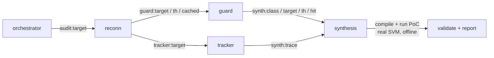
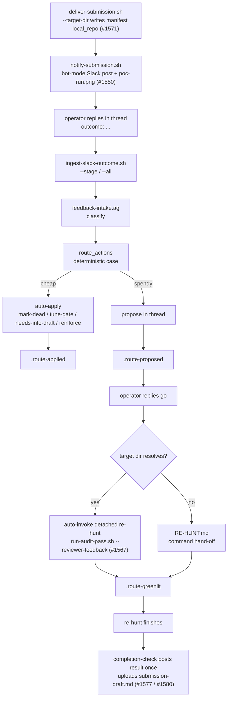

# Dark Factory

 

**Version:** `0.3.0` · [Changelog](./CHANGELOG.md) · **Requires:** agentis >= `1.18.0` · **Status:** Experimental

> An EVM + Solana/Anchor **bounty-hunt** federation on the agentis substrate. Three
> colonies cooperate: `auditor` runs an end-to-end **gated bounty-hunt chain**
> (discover → scope → devise → PoC → impact → dup → report → human-gated submit),
> `prospector` qualifies live on-chain targets worth watching, and `monitor` derives
> and watches read-only protocol invariants. Submission and paging are human-gated
> throughout — no colony ever posts to a bounty platform.

This federation conforms to
[ADR-0003](../doc/adr/ADR-0003-federation-portability-contract.md). The agent
contract follows [ADR-0001](../doc/adr/ADR-0001-confidence-tiers.md) end-to-end.

## The three colonies

- **[`auditor/`](./auditor/)** — the bounty-hunt colony (24 agents). It runs the full
  gated chain: **discovery** (custom-code hunter + DAG fork-matcher), audit-aware
  **DEVISE** of the residual attack surface, several **generate-and-verify** PoC engines,
  the hard **gates** (scope → impact → dup) that spend effort only on payable surface, a
  platform-shaped **report**, and a **human-gated submit** with a feedback loop back into
  learning. Self-orchestrated by `coordinator.ag`. See the
  [auditor colony README](./auditor/README.md) for the full agent inventory + the gated
  submission-pass mermaid.
- **[`prospector/`](./prospector/)** — a read-only monitoring-target qualifier (4 agents):
  takes candidate EVM protocols and decides which are worth standing up the `monitor` colony
  on, and why. Never signs a transaction.
- **[`monitor/`](./monitor/)** — a continuous, non-custodial protocol monitor (8 agents):
  watchers read on-chain state (`cast`/RPC) and emit reasoned anomaly alerts; the `notifier`
  bridges the bus to a configured webhook. Read-only — no agent ever touches funds.

## What the auditor does

At its core the `auditor` colony still carries the original **DAG fork-matcher** pipeline
([`auditor/agents/auditor.ag`](./auditor/agents/auditor.ag)) — a one-shot `agentis go`
pipeline of four cooperating agents wired by the substrate emit/listen bus (no polling):



1. **reconn** — dependency recon, distills each handler sub-graph into a
   content-addressed DAG (structural dedup cache), and looks up a prior
   verdict / federation blacklist for the exact sub-graph (audit-once).
2. **guard** — on a cache HIT reuses the verdict; on a MISS runs structural
   detection (MissingSignerCheck / IntegerOverflow).
3. **tracker** — dataflow trace: does a signer/authority guard dominate the
   state-mutation sink?
4. **synthesis** — generates a **two-sided** PoC (LLM-driven, with a
   deterministic template fallback), compiles + runs it in the hardened
   sandbox, and gates the verdict on the two-sided check: a control path that
   accepts the authorized caller (`CONTROL OK:`) AND an exploit path that
   breaks the safety invariant (`INVARIANT VIOLATED:`). Only then is the
   finding `verified`.

When `SOLANA_HARNESS_DIR` is set, synthesis drives the program through the
real `solana-runtime` SVM via `solana-program-test` + `BanksClient` (real
account model, signer/owner checks, lamport conservation); otherwise it uses
a std-only `rustc` harness (offline-deterministic).

That matcher fires only where in-scope code **recurs a known-bug pattern**. On bespoke,
never-forked protocols the colony runs the **gated bounty-hunt chain** instead —
discovery, DEVISE, PoC verification, the scope/impact/dup gates, report rendering, and a
human-gated submission pass — all self-orchestrated by
[`auditor/agents/coordinator.ag`](./auditor/agents/coordinator.ag). The complete agent
inventory and the gated submission-pass diagram live in the
[auditor colony README](./auditor/README.md); the operator entrypoints that drive it
(`run-audit.sh`, `run-discovery.sh`, `run-audit-pass.sh`, …) are documented below.

## Offline toolchain setup (one-time)

The real-SVM path compiles against a ~711-crate dependency graph. Fetch and
warm-build it ONCE per host (the only step that needs network):

```bash
bash dark-factory/setup-solana-toolchain.sh [WORKDIR]
```

This stages the harness skeleton under `$WORKDIR/.solana-harness` and warm-builds
its dependencies so every subsequent audit run compiles + runs the generated PoC
fully offline inside the hardened sandbox. See
[`solana-harness/README.md`](./solana-harness/README.md) for the offline contract
and the hardened sandbox mask.

## Quick start

**Prerequisites**

- The `agentis` runtime binary on PATH (proprietary closed-source binary, free
  for Linux/macOS: https://github.com/Replikanti/agentis). dark-factory
  requires `agentis >= 1.18.0`.
- The Rust stable toolchain (`cargo`, `rustc`) on PATH.
- Claude Code CLI (`claude`) on PATH for the LLM synthesis path (optional — the
  deterministic template fallback runs without it).

**Recipe**

```bash
bash dark-factory/install.sh                       # idempotent setup
bash dark-factory/setup-solana-toolchain.sh        # one-time offline toolchain build (network ON)
bash dark-factory/auditor/scripts/start-colony.sh  # run one audit (one-shot pipeline)
```

The report and PoC artifacts land under `<rundir>/.agentis/sandbox/`. See the
[auditor colony README](./auditor/README.md) for the
`SOLANA_HARNESS_DIR` / `BOUNTY_TARGET` / `BOUNTY_POC` env contract.

## Run an audit (`run-audit.sh`)

**Full operator runbook: [`docs/RUNBOOK.md`](./docs/RUNBOOK.md)** — prerequisites, scope,
verdicts, where artifacts land, and the manual submission step, in one page.

`run-audit.sh` is the operator entrypoint: it runs the full pipeline against a scope **you
choose** and, on a VERIFIED finding, stages a **human-gated** submission package. Pass
**absolute** paths (the colony runs in its own working dir).

```bash
# native solana-program target
dark-factory/run-audit.sh --target "$PWD/path/to/program.rs" \
    --harness "$PWD/dark-factory/solana-harness"   # default backend = flat-cyborg (flat-rate); add --backend claude for the metered -p path

# Anchor target (+ optional frozen on-chain snapshot for state replay)
dark-factory/run-audit.sh --target "$PWD/path/to/lib.rs" \
    --anchor-harness "$PWD/dark-factory/solana-harness-anchor" \
    --snapshot "$PWD/snap.txt" --out "$PWD/audit-out"

# EVM/Solidity target (M1: Reentrancy) — verified through the real EVM (revm).
# One-time host-side: (cd dark-factory/evm-harness && npm i solc)   # pins solc 0.8.26 for compile.js
dark-factory/run-audit.sh --target "$PWD/path/to/Contract.sol" \
    --evm-harness "$PWD/dark-factory/evm-harness" --out "$PWD/audit-out"
```

On `Verdict: VERIFIED` the package lands at `<out>/submission/`: `report.md` (Immunefi-format —
severity + impact category + severity rationale mapped to the Immunefi bands + an Impact
quantification section stating the funds-at-risk the two-sided PoC demonstrated, embeds the PoC),
`poc.rs`, `target.rs`, `snapshot.txt` (if used), `REPRODUCTION.md` (target sha256 + toolchain +
deterministic rerun command; discloses the snapshot owner-rebind), and `MANIFEST.txt` marked
**PENDING HUMAN REVIEW — NOT SUBMITTED**. The colony never posts to a platform — submission is
a manual human action; `submit-triage.sh --known-issues <file>` scores the staged pile for
readiness, impact-credibility, and duplicate-risk first. `run-audit.sh` requires `--target` and never auto-picks a scope.
`--backend mock` runs offline-deterministically (structural heuristic, no LLM). Produce a
frozen snapshot with `snapshot-rpc.sh --rpc <url> --out snap.txt <pubkey>`.

## Discover bugs in custom code (`run-discovery.sh`)

`run-audit.sh` drives the DAG fork-**matcher** (`auditor.ag`): it fires only where in-scope code
**recurs a known-bug pattern**, so on a bespoke, never-forked protocol it returns nothing. Custom
contest code (a fresh stablecoin, a new vault) needs **discovery**, not matching. `run-discovery.sh`
drives the colony's discovery agent — [`auditor/agents/hunter.ag`](./auditor/agents/hunter.ag) — a
taxonomy-driven, adversarial, per-(subsystem × bug-class) audit that runs **entirely through the
agentis substrate** (`prompt` / `emit` / `learn`), so every hunt is recorded as experience and the
taxonomy's per-class fitness reweights over time. It is the colony-native form of a hand-run
multi-agent audit pass.

The operator supplies three inputs and the colony fans out one substrate agent per cell:

- `--repo <dir>` — the cloned target (use `fetch-target.sh`).
- `--scope <scope.tsv>` — `subsystem | classid,… | file,…` per line (files relative to the repo). Write it
  by hand, or **auto-generate it** with [`map-zones.sh`](#auto-derive-the-scope-manifest-map-zonessh) below. A
  file may be written `file@fn1+fn2` to feed the hunter **only those functions** (+ the contract header)
  — slice big/complex contracts this way so a deep liquidation/redemption read fits the LLM budget.
- `--brief <brief.md>` — the protocol's invariants-to-break, **known issues to exclude**, and trust model.
- `--jobs N` (`-j N`, default `1`) — OPT-IN bounded-concurrency fan-out (#1625, epic #1611 M3): hunt up to N
  cells at once instead of serially. Concurrency is HARD-CAPPED at `min(N, LLM_MAX_DISCOVERY_CELLS)` (default
  cap `4`, tune per host) so concurrent LLM + `forge`/`solc` builds never OOM-thrash the box; each cell runs
  in its OWN isolated store, so #1001 cross-cell steering is off under `--jobs > 1`. `--jobs 1` (the default)
  is **byte-for-byte identical** to the pre-M3 hunt (shared store, live #1001 steering).

```bash
dark-factory/run-discovery.sh \
    --repo "$PWD/target" --scope "$PWD/scope.tsv" --brief "$PWD/brief.md" \
    --out "$PWD/discovery-out"
# cheap wiring smoke (no real LLM):  add  --backend mock --only "<subsystem>" --classes C1
# parallel fan-out (up to 4 cells at once; hard-capped, isolated per-cell stores):  add  --jobs 4
```

The bug classes live in [`auditor/bug-taxonomy.md`](./auditor/bug-taxonomy.md) (15 DeFi classes —
share-price/ERC4626, oracle, cross-chain/LZ, withdrawal-queue, access-control, accounting,
sig-replay, reentrancy, decimals, integration-seam/composability, …), each with a deep "hunt" lens
distilled from real audits. The **integration-seam / composability** class (`C15`, #1644) is the
under-audited cross-protocol boundary — adapters, guards, oracle-read wrappers, routers; `zone-mapper.ag`
auto-tags integration/adapter zones with it and `brief-writer.ag` emits a seam-focused hunt subsection.
Similarly, `zone-mapper.ag` deterministically force-tags `C10`/`C11` (first-depositor/inflation, stability-pool
offset) onto any zone whose code references a lending/CDP/stability-pool interface — direct or ERC4626-wrapped
(#1681) — as a backstop over the LLM's own classification, since a missed lending signal is costlier than a
false positive.

Every `CANDIDATE` in `discovery-out/discovery-report.md` is a **lead, not a finding** — unverified
until it reproduces through the multi-contract Foundry gate:

```bash
dark-factory/evm-harness/forge-verify.sh --repo "$PWD/target" --poc "$PWD/Exploit.t.sol" --lz-symlink
# exit 0 = VERIFIED (the exploit PoC passes); only a VERIFIED lead is worth a human-gated submission.
```

For invariant-shaped leads there is a second, **sound** gate alongside the execution one:
[`evm-harness/halmos-verify.sh`](./evm-harness/halmos-verify.sh) (#1015) runs
[Halmos](https://github.com/a16z/halmos) (symbolic execution + z3) over a `*.t.sol` spec and either
**PROVES** the invariant holds for every input or returns a **concrete counterexample**:

```bash
dark-factory/evm-harness/halmos-verify.sh --repo "$PWD/target" --target test/Spec.t.sol
# exit 0 = PROVED (holds for ALL inputs) ; 1 = COUNTEREXAMPLE (a concrete input is a real bug) ;
#   3 = INCONCLUSIVE (solver unknown / timeout) ; 2 = harness/usage (tools missing, bad args).
# Offline demo + verdict contract: `dark-factory/demo-halmos.sh`, `docs/halmos.md`.
```

`forge-verify.sh` witnesses one concrete exploit path; `halmos-verify.sh` decides the property over all
inputs. They are complementary — see [`docs/halmos.md`](./docs/halmos.md) for the verdict/exit contract,
toolchain install, and how the gate fits the epic (the LLM hypothesizes; Halmos is the sound verdict).
To **generate** the `*.t.sol` spec for a candidate and then verify it through that gate in one substrate
step, see [`run-symbolic.sh`](#generate-and-verify-a-candidate-run-symbolicsh) below.

A clean sweep (no candidate survives) is a **rigorous negative** — a valid outcome on audited code;
nothing is submitted. As with `run-audit.sh`, the colony never posts to a platform.

### Auto-derive the scope manifest (`map-zones.sh`)

Writing `scope.tsv` by hand means reading the repo, grouping contracts into subsystems, and guessing which
bug classes apply. [`map-zones.sh`](./map-zones.sh) (#1612, epic #1611 M1) automates that first pass:
shell plumbing locates in-scope Solidity/Anchor sources, groups them into **zones** by directory, counts
LOC, computes an advisory `hardening_score` (post-audit churn + git file age — **never a gate**), and
function-slices big contracts; the substrate agent [`auditor/agents/zone-mapper.ag`](./auditor/agents/zone-mapper.ag)
does the ONE semantic step — subsystem name × applicable bug classes × description — once per zone.

```bash
dark-factory/map-zones.sh --repo "$PWD/target" --out "$PWD/zonemap" --since <audit-ref>
# emits zonemap/zones.json (structured model) + zonemap/scope.tsv (pipe-delimited, run-discovery-ready)
dark-factory/run-discovery.sh --repo "$PWD/target" --scope "$PWD/zonemap/scope.tsv" --list-cells
# DRY RUN: prints one CELL|<subsystem>|<class>|<files> per cell it WOULD hunt (no --brief, no agentis needed)
```

`scope.tsv` is the **identical, operator-editable** manifest `run-discovery.sh --scope` reads today — M1 is
a starting point, not an authority; fix a mis-clustered zone in one line. `map-zones.sh` is read-only and
never submits. Offline/CI determinism comes from `--fixture` (canned classification, no live LLM). Model,
schema, and the M1..M5 map: [`docs/zone-split-orchestration.md`](./docs/zone-split-orchestration.md).

### Prime the hunt with per-zone briefs (`gen-briefs.sh`)

M1 produces the *manifest*; **M2 (#1619, epic #1611)** produces the *depth*. [`gen-briefs.sh`](./gen-briefs.sh)
(shell plumbing) + the substrate agent [`auditor/agents/brief-writer.ag`](./auditor/agents/brief-writer.ag)
turn `zones.json` + `scope.tsv` into a per-zone **hunt brief** in the EXACT plain-markdown format `hunter.ag`
consumes via `SCOPE_BRIEF`: a header + the zone's bug-class list, the DEPTH body (per-class
invariants-to-break + folded audit residual + prior-pattern hints), the in/out-of-scope boundaries, and the
honesty mandate. The shell assembles the deterministic scaffold; the substrate authors the depth, once per zone.

```bash
dark-factory/gen-briefs.sh --zones "$PWD/zonemap/zones.json" --scope "$PWD/zonemap/scope.tsv" \
  --out "$PWD/zonemap" --repo "$PWD/target"        # optional: --audit-residuals <audit-scout output>
# emits zonemap/briefs/brief_<zone_id>.md per zone + zonemap/briefs/zone_briefs.json (the index)
dark-factory/run-discovery.sh --repo "$PWD/target" --scope "$PWD/zonemap/scope.tsv" \
  --only <subsystem> --brief "$PWD/zonemap/briefs/brief_<zone_id>.md" --list-cells
# DRY RUN: prints BRIEF|<abs>|<lines> (the brief resolved) + the zone's CELL| line(s), offline, no agentis
```

Per-zone briefing needs no new hunt-path wiring — each zone is hunted with the *existing* single-`--brief`
flag. `gen-briefs.sh` is read-only and never submits; offline/CI determinism comes from `--fixture` (canned
brief bodies, no live LLM). Brief **quality is the decisive depth lever and is LLM-backend-gated** — M2 ships
the machinery + a fixture-proven format; live depth is backend-dependent. Schema, the `SCOPE_BRIEF` contract,
and residual sourcing: [`docs/zone-split-orchestration.md`](./docs/zone-split-orchestration.md).

### Fan out the hunt in parallel (`run-discovery.sh --jobs N`)

M1 maps the manifest, M2 primes the depth; **M3 (#1625, epic #1611)** adds THROUGHPUT. `run-discovery.sh
--jobs N` (`-j N`, default `1`) hunts the `(subsystem × class)` cells with **bounded concurrency** instead of
serially — wall-clock drops from the sum of the cells toward the slowest cell per wave.

```bash
# hunt up to 4 cells concurrently; hard-capped, each cell in its own isolated agentis store:
dark-factory/run-discovery.sh --repo "$PWD/target" --scope "$PWD/zonemap/scope.tsv" \
  --brief "$PWD/zonemap/briefs/brief_<zone_id>.md" --jobs 4
# tune the ceiling per host (default 4):  LLM_MAX_DISCOVERY_CELLS=2 dark-factory/run-discovery.sh … --jobs 8
```

Effective concurrency is HARD-CAPPED at `min(--jobs, LLM_MAX_DISCOVERY_CELLS)` (default `4`) by a
self-contained `wait -n` job-slot that **never fails open** — so N concurrent `agentis go` + `forge`/`solc`
builds can't OOM-thrash a single host (a `--jobs` over the cap is clamped with a warning). Under `--jobs > 1`
each cell runs in its OWN isolated store (a `cp -r` of the initialised template), so concurrent memo/build
writes never race; a consequence is that #1001 cross-cell blackboard steering is **off** under parallelism
(each cell's board starts empty — a documented throughput-vs-steering trade). Results are aggregated after the
pool drains in **manifest order**, so `discovery-report.md` (and the additive `discovery-results.json`) is
deterministic and independent of completion order. **`--jobs 1` (the default) keeps the shared store with live
#1001 steering and is byte-for-byte identical to the pre-M3 hunt** — all fan-out machinery sits behind
`--jobs > 1`. Read-only, never submits; offline/CI determinism is pinned by `demo-discovery-parallel.sh` (a
fast stub through the `--agentis` seam — no live agentis/forge/network). Model + the blackboard-under-
concurrency decision: [`docs/zone-split-orchestration.md`](./docs/zone-split-orchestration.md).

### Verify the leads (`verify-findings.sh`)

M3 emits `discovery-results.json` — UNVERIFIED leads. **M4 (#1630, epic #1611)** is the bridge to a verdict.
[`verify-findings.sh`](./verify-findings.sh) drives a gate (`--gate refute` default, or `poc`/`symbolic`) over
EVERY candidate and aggregates the CONFIRMED-only survivors into `verified_findings.json`.

```bash
dark-factory/verify-findings.sh --results "$PWD/discovery-out/discovery-results.json" \
  --repo "$PWD/target" --gate refute --out "$PWD/verify-out"
# emits verify-out/verified_findings.json (CONFIRMED-only; {repo, gate, verified[], totals})
```

It is READ-ONLY over `discovery-results.json` (never mutates it) and never submits; a gate that errors on one
candidate is skipped (not fatal) and an un-confirmed candidate is dropped. Offline determinism via the
`run-refute.sh --agentis` stub seam; proven by `demo-verify-findings.sh`.

### Run the whole loop (`run-zone-hunt.sh`)

**M5 (#1630, epic #1611)** is the CAPSTONE that CLOSES the epic. [`run-zone-hunt.sh`](./run-zone-hunt.sh) chains
the shipped entrypoints into ONE end-to-end zone-hunt — `map-zones → gen-briefs → per-zone run-discovery → merge
→ verify-findings → run-audit-pass → deliver-submission` — and EDITS none of them.

```bash
dark-factory/run-zone-hunt.sh --repo "$PWD/target" --out "$PWD/zone-hunt-out" \
  --in-scope "the in-scope program" --jobs 4        # live: reasons through --backend/--agentis + run-audit-pass --live
# every finding HALTS at PENDING-HUMAN-REVIEW; drafts are STAGED into zone-hunt-out/drop for a human to file
```

The never-submit **HALT** is load-bearing: the capstone adds ZERO egress and reuses two baked-in gates —
`run-audit-pass.sh` halts at `PENDING-HUMAN-REVIEW` and `deliver-submission.sh` refuses any unmarked draft (and
only stages locally). Per-finding errors are logged + skipped so one bad finding never aborts the batch. Offline
via `--map-fixture`/`--brief-fixture`/`--pass-fixture` + the `--agentis` stub; proven by `demo-run-zone-hunt.sh`.
Full chain + the HALT enforcement: [`docs/zone-split-orchestration.md`](./docs/zone-split-orchestration.md).

### Inter-agent coordination (shared blackboard, #1001)

The fan-out is no longer a flat sum of independent cells. Because every (subsystem × class) cell runs
against one shared agentis memo store, `hunter.ag` reads a rolling **blackboard**
(`dark-factory:blackboard:leads`) before it prompts and posts every `CANDIDATE` back to it (also
emitting `dark-factory:lead`). A later cell that sees a sibling's lead on the board is **steered** — its
prompt gains a FOCUS block to corroborate a hit in the same subsystem or pivot toward a related surface
a sibling already flagged — so one cell's finding changes what a later cell does. `run-discovery.sh`
logs a `↳ COORDINATION:` line when a cell is steered and appends an **Inter-agent coordination** table
to the report. The mechanism is inert on a clean sweep (no finding → identical prompt → the
rigorous-negative behavior above is unchanged). Reproduce it offline (no network, deterministic fake
LLM):

```bash
dark-factory/demo-blackboard.sh   # oracle cell posts a lead; downstream liquidation cell reads + is steered
```

This is one coordination step, not emergent behavior; a coordinator that reprioritizes/prunes the cell
manifest from the board is a follow-up.

### Self-orchestrating coordinator (`run-coordinator.sh`, #1014)

The fan-out above still runs in a **fixed order** chosen by a script + an operator. The coordinator moves
that **decision** into the substrate: [`auditor/agents/coordinator.ag`](./auditor/agents/coordinator.ag)
reads the current FACTS each step — open scope, per-class lens fitness, the blackboard, pending
unverified candidates, remaining budget, and the previous action's gate **outcome** (a fact, never an LLM
call) — and an evolving **policy**, then chooses **one** next action (`hunt` / `refute` / `poc-screen` /
`invent-method` / `stop`) by a policy-weighted **argmax** over fact-criteria (verify a pending lead before
more hunting; prefer a blackboard-flagged subsystem and a higher-fitness lens; stop on budget/dry). The
decision policy **evolves**: each action's confirmed-finding → success / dry-or-refuted → failure is
recorded with the same `learn()` mechanic the lens-fitness loop uses (#996), so
`coordinator:policy:<action-type>` reweights which decisions it leans on. Reproduce both halves offline (no
network, deterministic, mock backend):

```bash
dark-factory/demo-coordinator.sh   # (a) distinct facts -> distinct actions; (b) the policy measurably evolves
dark-factory/demo-dispatch.sh      # #1014 M2: every action's DISPATCH moved into the substrate (proof, offline)
dark-factory/demo-orchestrate.sh   # #1014 M3: ONE agentis go self-orchestrates the whole multi-step audit (proof, offline)
```

`decide(options, criteria)` **is** a real substrate builtin, but offline it resolves to the first option
(it does not read the criteria text), so the coordinator does the fact+policy ranking itself and uses
`decide` as the selection step over its already-ranked list.

**#1014 M2 — EVERY action's DISPATCH is now in the substrate.** The coordinator no longer just *decides*;
in **one** `agentis go` it also *dispatches* any real action (hunt / refute / poc-screen / invent-method):
it `emit`s `dark-factory:dispatch` (payload `<type>|<args>`) over the in-process bus and a sibling agent fn
([`auditor/agents/dispatcher.ag`](./auditor/agents/dispatcher.ag), inlined gated in `coordinator.ag`)
derives the gate verdict from a `DISPATCH_FIXTURE` fact and writes it to the durable
`coordinator:last_outcome` memo. Only `stop` is never dispatched. Full model in
[`docs/dispatch.md`](./docs/dispatch.md).

**#1014 M3 — the SHELL LOOP is DISSOLVED; the federation self-orchestrates the whole audit in the
substrate.** Through M2 a thin shell while-loop still *drove* the loop (per step: one `agentis go`, read the
verdict memo, push/pop `PENDING`, advance `DRY_STREAK`/`BUDGET`, re-read the policy, append a `decisions.tsv`
row). M3 moves that **entire loop** into `coordinator.ag`: gated on `ORCHESTRATE_ENABLED`, the top level runs
the audit as a `reduce` over a budget-bounded `STEPS` list — deciding, dispatching in-substrate, reading the
verdict, threading `PENDING` / `DRY_STREAK` / `BUDGET` and the evolving policy **entirely in-process** — and
writes the final `decisions.tsv` body + evolved policy to durable memos. `run-coordinator.sh` is now a thin
**bootstrap** (not a loop driver): it seeds the facts + a `STEPS` budget list, fires **one** `agentis go`,
and reads the final trace + policy back from the memos. With `ORCHESTRATE_ENABLED` **absent** the top level
does **exactly one** decision, **byte-identical** to before (so `demo-coordinator.sh` is unchanged). Honest
scope: the loop self-orchestrates per bootstrap invocation; a long-lived daemon-tick reflex is a separate
refinement. v1 boundary (the live-path executor wiring per action is follow-up; manifest reprioritisation is
follow-up; submission stays human-gated): [`docs/coordinator.md`](./docs/coordinator.md).

**#1015 M3 — the coordinator ROUTES a candidate to the SOUND symbolic engine.** A new `symbolic-prove`
coordinator ACTION lets the self-orchestrating loop **DECIDE** to route a pending candidate through the
generate-and-verify gate (`run-symbolic.sh` / Halmos + z3, #1015 M2): a hunt confirms → pushes a candidate →
the coordinator may CHOOSE `symbolic-prove` for it → the engine's **SOUND** verdict flows back into the
evolving policy, mapped **COUNTEREXAMPLE → confirmed**, **PROVED → refuted** (the lead is killed *by a
proof*), **INCONCLUSIVE → dry**. So the confirmed/refuted signal the policy evolves on now comes from a
sound engine, never an LLM opinion — the epic's thesis as a coordinator decision. `symbolic-prove` sits in
the VERIFY tier (default `refute` > `poc-screen` > `symbolic-prove`, the symbolic route being the most
expensive verify; its policy term is the steepest, so the colony can learn to lift it). The orchestration is
proven offline + deterministically with a fixture standing in for the sound verdict (no live Halmos needed,
exactly like every other action's offline path):

```sh
dark-factory/demo-symbolic-orchestrate.sh   # hunt -> push -> CHOOSE symbolic-prove -> sound verdict ->
                                            #   consumed from PENDING -> policy evolves; deterministic re-run
# or bootstrap it yourself (--sym-policy seeds the symbolic-prove weight so the coordinator chooses it):
dark-factory/run-coordinator.sh --scope <scope.tsv> --executor stub --fixture <fixture.tsv> --sym-policy 1.5
```

See [`docs/generate-verify.md`](./docs/generate-verify.md) (the verdict→outcome mapping) and
[`docs/coordinator.md`](./docs/coordinator.md) (the action). The **live** symbolic route end-to-end from the
coordinator's dispatch path remains follow-up; submission stays human-gated.

### Pre-screen a lead before the Foundry gate (`screen-leads.sh`)

`forge-verify.sh` is the heavyweight gate (a full Foundry deploy + attacker tx). Between a hunter's
*prose* PoC sketch and that repro, `screen-leads.sh` is the **cheap** gate: it lowers a lead's
machine-checkable invariant to a self-contained `.ag` PoC harness and evaluates it through the
substrate's **`eval_ag`** primitive — a metered sub-interpreter with its own CB budget — via
[`auditor/agents/poc-screener.ag`](./auditor/agents/poc-screener.ag). A reproduced screen (return
`101`, the colony's INVARIANT-VIOLATED sentinel) decides a lead is worth the forge-verify cost; a
runaway / malformed harness is **CB-exhaustion-contained** (surfaced as `inner_cb_exhausted` /
`parse_error`), so a runaway harness cannot starve or crash the screener — the screener survives.
Note: `eval_ag` does NOT sandbox `exec` in agentis v1.18.27 — a harness that calls `exec sh` escapes
to the host, so harnesses must be operator-trusted.

```bash
dark-factory/screen-leads.sh --demo          # self-contained: 3 leads -> 1 reproduced, 1 held, 1 indeterminate
dark-factory/screen-leads.sh --manifest leads.tsv    # one `lead-id | harness.ag` per line
```

A reproduced screen is still a **lead, not a finding** — verify it through `forge-verify.sh` and keep
submission human-gated. Which substrate primitives the colony adopted (and why `replicate` / `delegate`
/ `decide` / Lean / confidence-tiers do **not** currently fit) is documented in
[`docs/SUBSTRATE-PRIMITIVES.md`](./docs/SUBSTRATE-PRIMITIVES.md).

## Observe a run (`run-summary.sh`)

dark-factory runs **one-shot** (`agentis go`): no daemons, no `*:confidence` memos — so the
standalone `federation-dashboard` (which assumes daemon-tick agents) has nothing to poll (#995).
`run-summary.sh` closes that gap on the dark-factory side: after a run, point it at the same `--out`
dir and it distills the run's on-disk artifacts (the agentis **experience log** + the run report)
into one stable JSON at `<out>/run-summary.json` — runs/cells executed, candidates found, `learn()`
outcomes, **per-class fitness** (`success / attempts` from the experience rows), last-run timestamp,
and verdict — that a monitor or dashboard can poll. It only reads what the run already wrote.

```bash
dark-factory/run-discovery.sh --repo "$PWD/target" --scope scope.tsv --brief brief.md \
    --out "$PWD/discovery-out"
dark-factory/run-summary.sh --out "$PWD/discovery-out"          # -> discovery-out/run-summary.json
dark-factory/run-summary.sh --out "$PWD/discovery-out" --json | jq .verdict   # stdout is pure JSON
dark-factory/run-summary.sh --out "$PWD/discovery-out" --emit-event           # + one NDJSON event line
```

Schema + the monitor/dashboard consumer contract: [`docs/run-observability.md`](./docs/run-observability.md).

## Refute candidate leads (`run-refute.sh`)

Between discovery and a (costly) Foundry PoC there is a cheaper gate: a **second, independent skeptic**
must fail to break the lead. `run-refute.sh` drives that gate on the substrate via
[`auditor/agents/refuter.ag`](./auditor/agents/refuter.ag) — for each candidate it env-ins the
`file:fn` + claimed exploit + the relevant code, `prompt`s a hostile reader that tries to **REFUTE** the
claim against the actual control/data flow (**defaulting to REFUTED on any doubt**, so only unambiguous
leads survive), `emit`s `dark-factory:refute_verdict`, and `learn`s the attempt so refuter fitness
reweights. This is the colony-native form of the `adversarial-refute` method
([`auditor/methods/registry.md`](./auditor/methods/registry.md)) that previously ran as an external
subagent — the proven pattern (#999) for porting the colony's other deep capabilities (deep
cross-function audit, build-and-run PoC, fork-differential) onto the substrate.

```bash
# candidates.tsv: `file:fn | classid | severity | claimed exploit | code-file`  (one per line)
dark-factory/run-refute.sh --candidates "$PWD/candidates.tsv" --out "$PWD/refute-out"
# cheap wiring smoke (no real LLM):  add  --backend mock
```

A **REAL** verdict is a lead that survived a hostile read — **not a finding**. It still must reproduce
through `evm-harness/forge-verify.sh` before it counts, and submission stays a separate, explicit human
action. A **REFUTED** verdict is killed here and never reaches the forge gate. The colony never posts.

## Generate and verify a candidate (`run-symbolic.sh`)

M1 shipped the **callable** Halmos gate (`evm-harness/halmos-verify.sh`); `run-symbolic.sh` (#1015 M2)
closes the loop from a *candidate* to a SOUND symbolic verdict by **generating the spec** the gate runs.
The **LLM is the hypothesis generator** — it turns a candidate (`file:fn` + the invariant to encode + the
relevant code) into a Halmos `*.t.sol` property spec; **Halmos is the judge** — it PROVES the invariant
holds for all inputs (the lead is refuted **by a proof**, safe) or returns a **concrete counterexample**
(a real bug, **confirmed**). The verdict is Halmos's exit code, **never the LLM's opinion**.
[`auditor/agents/symbolic-prover.ag`](./auditor/agents/symbolic-prover.ag) runs the whole step on the
substrate (`emit`s `dark-factory:symbolic_verdict`, `learn`s the attempt so symbolic-prover fitness
reweights) and prints one `SYMBOLIC|<file:fn>|<verdict>` line.

```bash
# candidates.tsv: `file:fn | class | invariant | code-file | spec-fixture`  (one per line)
dark-factory/run-symbolic.sh --candidates "$PWD/candidates.tsv" --repo "$PWD/target" --out "$PWD/symbolic-out"
# offline / cheap wiring smoke (no real LLM): supply a `spec-fixture` column + add  --backend mock
# offline-deterministic end-to-end proof (real Halmos, fixture specs):  dark-factory/demo-symbolic.sh
```

A `spec-fixture` in the manifest takes the **offline/deterministic** path — that spec is used verbatim and
**no LLM is called** — so the candidate → halmos → verdict loop is provable with zero LLM cost and a real
solver. A **COUNTEREXAMPLE** is still a **lead** a human reviews, not an auto-submission; this colony never
posts. **#1015 M3** wires this step into the self-orchestrating coordinator as the `symbolic-prove` action
(the coordinator DECIDES to route a candidate here; the SOUND verdict maps **COUNTEREXAMPLE → confirmed** /
**PROVED → refuted** / **INCONCLUSIVE → dry** back into its evolving policy — see the coordinator section
above and `dark-factory/demo-symbolic-orchestrate.sh`). See
[`docs/generate-verify.md`](./docs/generate-verify.md) for the verdict-source contract, the fixture-vs-LLM
paths, how it composes with M1, and the verdict→outcome mapping the coordinator routes on.

## Hunt multi-step bugs (`run-invariant-hunt.sh`)

The symbolic gate above PROVES a property over all inputs of **one function**; this gate catches the bug
class that survives a single-function audit — the **multi-step, stateful** one that only emerges from a
SEQUENCE of calls (the ERC4626 inflation attack, an accounting drift that compounds, a re-entrancy that
only breaks on the third interleave). The **LLM is the hypothesis generator** — it turns a target contract
into a Foundry **stateful-invariant test**: a `Handler` exposing the protocol's actions as bounded actor
functions + a set of DEEP `invariant_*` properties (value-conservation, no-depositor-loss,
solvency-under-any-sequence, no-free-value-extraction, share-price-monotonicity). The **fuzzer is the
judge** — Foundry drives randomized multi-call sequences through the Handler, re-checks every invariant
after each call, and on a break **shrinks** the offending sequence to a minimal reproducer.
[`auditor/agents/invariant-prover.ag`](./auditor/agents/invariant-prover.ag) runs the whole step on the
substrate (writes the test injection-safely, runs [`evm-harness/forge-invariant.sh`](./evm-harness/forge-invariant.sh),
`emit`s `dark-factory:invariant_verdict`, `learn`s the attempt so invariant-prover fitness reweights) and
prints one `INVARIANT|<target>|<verdict>` line plus, on a FINDING, the **shrunk exploit call-sequence**.

```bash
dark-factory/run-invariant-hunt.sh --repo "$PWD/target" --target Vault.sol:Vault --class C-erc4626
# offline / cheap wiring smoke (no real LLM): supply --handler-fixture <ready .t.sol> + --backend mock
# offline-deterministic end-to-end proof (real fuzzer, fixture handler):  dark-factory/demo-invariant-hunt.sh
# FM1 (#1041) fork mode — fuzz against the REAL deployed contract at a pinned block (RPC is an arg; no key):
#   --fork-url <http(s)-rpc> [--fork-block <n>] [--fork-target <deployed-addr>]   |   proof: dark-factory/demo-fork-hunt.sh
# FM2 (#1041) composability — compose calls across a context set of deployed contracts (target + dex + flashloan):
#   --fork-target target=<addr> --fork-target dex=<addr> --fork-target flashloan=<addr>   |   proof: dark-factory/demo-composability.sh
# FM3 (#1041) oracle/price perturbation — the harness exposes a price-MOVEMENT action (swap/donation/feed write)
#   so the fuzzer moves the price before the borrow/redeem; manipulate->act sequences reachable.   proof: dark-factory/demo-fm3-oracle.sh
# FM4 (#1041) audit-informed synthesis — run-autoharness.sh --audit-context <file> folds prior audit findings
#   + the gap lens into the gen prompt (target what audits miss; don't re-report disclosed); --dry-prompt
#   dumps the prompt offline.   proof: dark-factory/demo-fm4-audit.sh
```

**Fork mode (FM1, #1041).** `--fork-url <rpc> [--fork-block <n>]` runs the same handler + deep invariants
against **forked REAL on-chain state** (the actual deployed contract at a pinned block) instead of a fresh
deploy — threading forge's own `--fork-url`/`--fork-block-number` into the run. `--fork-target <addr>` tells the
generated test to drive the **live deployed contract by address** with funded actors (`vm.deal`). **Purely
additive**: with no `--fork-url` the forge command is byte-identical to today. An unreachable / un-instantiable
fork RPC is a **`HARNESS_ERROR`, never a false verdict**; the RPC is always an argument (no key hard-coded) and
the pinned block makes a verdict reproducible. [`demo-fork-hunt.sh`](./demo-fork-hunt.sh) is the foundation
proof: it forks the REAL deployed WETH at mainnet block `25318855` via a public RPC and asserts the funded
solvency invariant → `CLEAN` (the machinery ran against real forked state), plus a forced-bad RPC →
`HARNESS_ERROR`. A `FINDING` against real forked state is a **LEAD a human triages** — this colony never posts.

**Cross-contract composability (FM2, #1041).** Fork mode fuzzes the real target, but still as **one contract** —
structurally blind to the highest-value class, **flashloan-funded cross-contract value extraction** (the
canonical oracle/price-manipulation drain). FM2 lets the handler compose call-SEQUENCES across the target
**and the protocols it interacts with**, via a **repeatable `--fork-target '<role>=<addr>'`** (role ∈
{`target`, `dex`, `flashloan`, `oracle`, …}; a bare `--fork-target <addr>` stays the FM1 one-target shorthand).
The role→address **context set** is exported to the prover as `FORK_CONTEXT` (a semicolon-separated `role=addr`
list); the generation prompt then models a **flashloan-funded attacker** who moves price via the `dex` and
checks the **target's** solvency after the cross-contract sequence (no free value extraction). **Purely
additive**: with no role beyond `target`, FM1/#1035/#1037 behaviour is byte-identical. Composability ≠ fork —
**they compose** (a real run pairs `--fork-url` with multiple `--fork-target` roles).
[`demo-composability.sh`](./demo-composability.sh) is the proof: a synthetic `MiniAMM` + `LendingVault` +
`FlashLender` system where the **composable** handler (target + dex + flashloan) finds the drain → `FINDING`
with a shrunk cross-contract witness, while the **single-contract** (vault-only) handler over the same
budget/seed → `CLEAN` — the split proving composability is the lift. A `FINDING` is a **LEAD a human triages** —
this colony never posts.

The verdict is the **fuzzer's exit code, never the LLM's opinion**: `FINDING` = an invariant broke under a
concrete SHRUNK call-sequence (a CANDIDATE with a reproducible witness), `CLEAN` = every invariant held
across the fuzzed search (no finding in this budget — **not** a proof of safety), `HARNESS_ERROR` = the
test did not compile / no invariant matched / forge absent (not a verdict). A `--handler-fixture` takes the
**offline/deterministic** path (used verbatim, no LLM) so the target → fuzzer → verdict loop is provable
with zero LLM cost; `--seed` pins forge's fuzz seed for a reproducible search. A FINDING is still a **LEAD
a human triages**, never an auto-submission — this colony never posts. Honest scope: this ships the
**engine** (one target → handler+invariants → the fuzzer's verdict); coordinator-routing and fan-out over
many targets are follow-up. See [`docs/invariant-hunt.md`](./docs/invariant-hunt.md) for the
verdict-source contract, the fixture-vs-LLM paths, the deep-invariant taxonomy, and how it relates to the
symbolic gate (#1015) and the discovery method-gap (#1033).

## Hunt autonomously (`run-autonomous-hunt.sh`, Int M1)

The fuzzer above is an **engine** an operator calls directly. Integration M1 (#1037) wires it into the
self-orchestrating coordinator so the **federation itself CHOOSES** to spend it: you hand the coordinator a
target and it routes the candidate through a new `invariant-hunt` VERIFY action — by its evolving **policy** (a
policy-weighted argmax, never a fixed sequence) — then LIVE-runs the REAL forge invariant fuzzer and maps its
exit code to the SOUND outcome (`FINDING → confirmed`, `CLEAN → refuted`, `HARNESS_ERROR → dry`). The
**CHOICE** of engine is the coordinator's policy; the **VERDICT** is the fuzzer's shrunk witness — never the
LLM. This mirrors exactly how `symbolic-prove` was given a live coordinator route (#1032).

```bash
dark-factory/run-autonomous-hunt.sh --repo "$PWD/target" --target test/Invariant.t.sol --seed 1
# offline-deterministic proof (real fuzzer, inflation-vault + hardened twin; SKIPs without forge/agentis):
dark-factory/demo-autonomous-hunt.sh
```

`invariant-hunt` sits in the VERIFY tier below `refute`(100) / `poc-screen`(98) / `symbolic-prove`(96) at base
**94** (the stateful fuzzer is the most expensive verify); its ×4 policy term lets the colony learn to lift it.
A FINDING is a **LEAD a human triages**, never an auto-submission — the coordinator decides *which engine to
spend*, the fuzzer decides *whether the bug reproduces*, a human decides *whether to submit*; this colony never
posts. See [`docs/autonomous-hunt.md`](./docs/autonomous-hunt.md) for the end-to-end flow, the verdict→outcome
mapping, and the human-gated submit boundary.

**Multi-candidate carrying (Int M2, #1037).** Each pending lead can carry its **own** repo/target via the
durable `candidate:<id>:{repo,target,match}` memo, so when the loop verifies several leads each `invariant-hunt`
runs on the **right** lead — not one shared operator env. The live route resolves each fact per-candidate-first,
env-fallback (empty memo ⇒ the M1 env path ⇒ byte-identical M1). A repeatable `--candidate
'<id>|<repo>|<target>[|<match>]'` seeds them (the single `--repo/--target` is the one-candidate `cand-0`
shorthand). [`demo-candidate-carry.sh`](./demo-candidate-carry.sh) is the rigorous proof: two candidates, the
flat `INV_REPO`/`INV_TARGET` env left EMPTY, yielding a SPLIT verdict (`cand-0|confirmed` on the vulnerable
vault, `cand-1|refuted` on the hardened twin) that a shared env could not produce.

```bash
# multi-candidate, each lead carrying its OWN target via its candidate:<id>:* memo:
dark-factory/run-autonomous-hunt.sh \
  --candidate "cand-0|$PWD/A|test/Inv.t.sol" --candidate "cand-1|$PWD/B|test/Inv.t.sol" --seed 1
# the split-verdict proof (flat env EMPTY; SKIPs without forge/agentis):
dark-factory/demo-candidate-carry.sh
```

**Pattern memory + invent-method feed (Int M3, #1037).** A winning invariant pattern — one that produced a
FINDING — is **persisted to the pattern DAG** (`invpat:latest:<class>`, reusing the same `dag_put`/
`recall_latest` infra as the `bugpat:*` fork-matcher) and **recalled to seed a later hunt** on the same bug
class (the prover prints `RECALL-INVPAT|<class>|…` / `INVPAT-LEARNED|<class>|…`), and `invent-method` can
propose a **new** invariant class the next hunt then uses. `--pattern-store <dir>` is the persistent cross-run
store; absent it, behaviour is byte-identical to M1/M2. `--method-fixture <file>` seeds an invented class
(`invpat:invented:<class>`) deterministically. [`demo-pattern-memory.sh`](./demo-pattern-memory.sh) proves the
loop: discovered → stored in the DAG → recalled → reused across a structurally-different same-class target,
plus the invent-method leg.

```bash
# Run 1 persists a winning pattern; Run 2 on a same-class target recalls + reuses it (shared store S):
dark-factory/run-autonomous-hunt.sh --repo "$PWD/A" --target test/Inv.t.sol --pattern-store "$PWD/S" --seed 1
dark-factory/run-autonomous-hunt.sh --repo "$PWD/B" --target test/Inv.t.sol --pattern-store "$PWD/S" --seed 1
# the persist -> recall -> reuse proof + the invent-method feed (SKIPs without forge/agentis):
dark-factory/demo-pattern-memory.sh
```

## Exercise the evolve/fitness loop (`evolve-fitness.sh`)

Every hunt the colony runs records a `learn("hunt", "<class>:<subsystem>", ..., outcome, [...])` row in
the agentis experience store; the cumulative `delta` per key (+0.15 per CANDIDATE lead, -0.15 per
rigorous SAFE) is the **per-lens fitness** that reweights which taxonomy classes the colony leans on.
`evolve-fitness.sh` drives that loop across N iterations over a built-in ground-truth corpus and prints
the BEFORE/AFTER fitness so the movement is visible — high-yield lenses (vault accounting, rounding,
reentrancy) pull ahead, speculative lenses (cross-chain, pause) fall behind. It runs the colony's REAL
recording path (`auditor/agents/fitness-driver.ag`, the identical `learn()` call `hunter.ag` makes), is
fully offline and reproducible (`--backend mock` semantics, no LLM call), and exits non-zero if the loop
fails to move fitness.

```bash
dark-factory/evolve-fitness.sh --iters 6 --json
# -> a per-lens before/after/Δ-fitness table + <out>/fitness.json; supply --corpus to use your own
#    `class | subsystem | yield` manifest.
```

## Invent new audit methods (`run-method-discovery.sh`)

The federation's **self-improvement** layer. When the current method-set plateaus, the
method-inventor proposes ONE new audit method and it is adopted into the registry only if it
**discriminates** on a known-bug control corpus. The loop is **invent → validate → adopt**:

1. **invent** — `auditor/agents/method-inventor.ag` reads the current registry
   ([`auditor/methods/registry.md`](./auditor/methods/registry.md)) + a documented GAP
   ([`auditor/methods/gap-stateful.md`](./auditor/methods/gap-stateful.md)) and proposes one new,
   distinct, concretely-runnable method (substrate-native via `agentis go`, direct-LLM as fallback).
2. **validate** — the proposal is run against the paired control corpus under
   `auditor/method-discovery/controls/`: a planted accounting/solvency bug (`BuggyBank`) plus a clean
   twin (`SafeBank`). The two-sided gate is `forge test` on the buggy suite FAILING **and** the safe
   twin PASSING — that is what makes invention empirical, not speculation.
3. **adopt** — only on two-sided discrimination is the method appended to the registry
   (`status=invented`, `fitness=0.50`). An `invented` row keeps the proposal's control-assertion
   before `status` (one more field than a `builtin` row) — that field is what `gen-agent.sh` reads
   to wire the agent's gate. The registry is operator-curated, so adoption is additive and
   re-invented same-name methods are a no-op.

```bash
# Build a /tmp control corpus (controls/ + a local forge-std under lib/), then:
dark-factory/run-method-discovery.sh /tmp/mdctl
# exit 0 = invented + validated + adopted;  2 = proposal did not discriminate (no adoption);
# 1 = the inventor produced no proposal.  Set NO_AGENTIS=1 to force the direct-LLM path.
```

Turn an adopted method into a runnable agent with `gen-agent.sh <method-name>` (#1000), which
materialises `auditor/agents/<name>.ag` from the method's registry line.

## Export / import a trained federation (`state-export.sh`)

A *trained* federation's value is its **evolved state**: the accumulated learned `memo` (fitness
weights, taxonomy/method state) and the content-addressed Merkle DAG of audited patterns.
`state-export.sh` packages that state into a portable, **checksum-verified** artifact so a trained
instance can be moved between machines. It deliberately **excludes** the federation identity (private
key), per-deployment config, and the transient sandbox — an importer keeps their OWN identity and
only inherits the learned state.

```bash
dark-factory/state-export.sh export <rundir> state.tar.gz   # package memo + DAG -> artifact
dark-factory/state-export.sh verify state.tar.gz            # recompute + compare the sha256 digest
dark-factory/state-export.sh import state.tar.gz <dest>     # overlay memo + DAG onto a fresh local store
```

`verify`/`import` prove the state blob matches the manifest digest (no in-transit corruption). The
checksum is **not** a signature: it authenticates integrity, not the source. **Sign the manifest
out-of-band** before distributing a trained federation to a third party.

## Operator config knobs

The bounty-hunt chain adds a few operator-facing knobs (all optional; every one degrades to
a safe no-op or a documented default). Env knobs read by an `.ag` agent must also be on the
`.agentis/config` `exec.env_passthrough` allowlist.

| Knob | Read by | Meaning |
|------|---------|---------|
| `PASS_ENABLED` | `coordinator.ag` (`run-audit-pass.sh`) | Selects the fixed-order submission pass (scope → devise → poc → impact → dup → report → HALT). Absent = the free-choice coordinator mode. |
| `PASS_FIXTURE` | `coordinator.ag` | Offline-deterministic stage verdicts (`scope=payable;devise=residual;poc=finding;impact=…`) for the CI path — no network, no real LLM. |
| `PROJECT_NAME` / `FINDING_ASSET` | `report-writer.ag` | The bounty-platform project name and the specific in-scope asset for the rendered report; default to `<unknown>` when blank. |
| `--bounty-url` / `--drop-dir` (`$DROP_DIR`) | `deliver-submission.sh` | The bounty link embedded in the staged package, and the operator DROP-DIRECTORY exchange point (default `${DARK_FACTORY_DIR:-$HOME/.dark-factory}/drop`). |
| `DARK_FACTORY_SLACK_BOT_TOKEN` | `deliver-submission.sh` → `notify-submission.sh` | Slack **bot-mode** delivery of the complete submission package (`xoxb-…`, a `secret://…` URI or raw; Slack app scopes `chat:write` + `files:write`, optional `chat:write.public`). Takes precedence over the webhook when set. |
| `DARK_FACTORY_SLACK_CHANNEL` (`_WARN` / `_HIGH`) | `notify-submission.sh` | The base channel id (`C0…`) for bot mode, with optional per-severity overrides (Critical/High → `_HIGH`, Medium → `_WARN`). On delivery `notify-submission.sh` records the resolved `slack_thread_ts` + `slack_channel` into `manifest.json` and threads a reply-with-outcome prompt. |
| `--target-dir` | `deliver-submission.sh`, `ingest-slack-outcome.sh` | The operator's local clone path. `deliver-submission.sh --target-dir` threads it into `manifest.json`'s `local_repo` field (#1571); `ingest-slack-outcome.sh --target-dir` overrides that manifest field at ingest time. Either is what the #1567 auto-invoke resolves a target dir from before launching a detached re-hunt. |
| `DARK_FACTORY_SLACK_BOT_TOKEN` | `ingest-slack-outcome.sh` | Closes the loop: reads the operator's outcome REPLY back from the Slack thread (`conversations.replies`, needs the Slack app's `channels:history` scope) into `OUTCOME.md` and folds it into learning via `feedback-intake.ag`. Operator/cron-TRIGGERED (serverless — no always-on listener); idempotent per stage; never a bounty-platform submission. |
| `DARK_FACTORY_RUN_AUDIT_PASS` | `ingest-slack-outcome.sh` | Overrides the path to `run-audit-pass.sh` for the #1567 auto-invoke (default `$SCRIPT_DIR/run-audit-pass.sh`); mirrors `DARK_FACTORY_AUDITOR_DIR`, mainly so the offline demo can inject a stub. |
| `--route-preview <disposition> <root_cause>` | `ingest-slack-outcome.sh` | A pure introspection mode: prints `route_actions`' deterministic action list for the given disposition/root_cause and exits 0 — no token, no Slack, no network. A debug/demo helper for pinning the outcome→action map. |
| `DARK_FACTORY_SLACK_WEBHOOK` | `deliver-submission.sh` | The webhook **fallback** finding-ready alert (`secret://…` URI or a raw webhook URL); falls back to `MONITOR_WEBHOOK_URL`. No webhook = a no-op. |
| `GITHUB_TOKEN` / logged-in `gh` | `deliver-submission.sh` | Enables the best-effort **secret-gist** auto-create (`gh gist create`, secret by default — no `--secret` flag exists) for the PoC-form "secret Gist environment"; with no token it degrades to bundling the exact command in `poc/GIST_COMMAND.txt`. Egress is to the operator's OWN GitHub, never a bounty platform. |

Every alert/gist path is a page to the operator's own channel — the never-submit /
no-bounty-platform-egress invariant is unchanged.

## Capturing the outcome from the Slack thread

When bot-mode delivery is configured, `notify-submission.sh` records the delivery's
`slack_thread_ts` + `slack_channel` into `manifest.json` and threads a
reply-with-outcome prompt under the submission package. The operator files the finding
out-of-band and, when the platform responds, **replies IN THAT SAME THREAD** starting
with `outcome:` then pasting the platform's response **VERBATIM** — the classifier
reads it, so there is no verdict enum to pick:

```
outcome: <paste exactly what the platform wrote>

# optional — force a disposition (wins over the classifier):
verdict: <accepted|rejected|duplicate|needs-info|out-of-scope>
payout: <amount+currency, e.g. 25000 USDC>   # accepted override only
```

`ingest-slack-outcome.sh` reads that reply back and folds it into learning — one place,
no hand-edited local file:

```bash
dark-factory/ingest-slack-outcome.sh --stage <drop-dir>   # one staged submission
dark-factory/ingest-slack-outcome.sh --all                # sweep every staged drop-dir
```

It resolves `DARK_FACTORY_SLACK_BOT_TOKEN` (`secret://…` or raw), reads the thread via
`conversations.replies`, selects the operator's reply (dropping the bot's own snippet
posts), captures the raw response into `OUTCOME.md`'s `platform_response:` block, and
runs `feedback-intake.ag` from the auditor colony dir so its `learn()` persists.
`feedback-intake.ag` **classifies** the raw response into a disposition + confidence
and — critically — **the learn signal is computed deterministically in `.ag` code from
the disposition, never by the LLM** (`accepted → success`,
`rejected`/`duplicate`/`out-of-scope → failure`, `needs-info → partial`), so a
mis-classification can never flip a payout into a failure.

**Confidence gate + override precedence.** A **high-confidence** classification is
learned: a threaded confirmation `outcome recorded -- learned <SIGNAL> on <stage>` is
posted and the stage is marked `.outcome-ingested` so it never double-learns. A
**low-confidence or unclear** classification is **HELD**: nothing is learned, a Slack
**confirmation request** is posted into the thread, and a `.pending-confirmation` marker
(keyed on the operator's reply ts, so a cron never re-spams) is written — a later,
clearer reply can still be learned. An explicit operator `verdict:` override **always
wins**, bypassing the gate (legacy `closed` normalizes to `rejected`), so an in-flight
`verdict:`-style reply keeps working. A stage with no operator reply yet is skipped
without a marker (a later run retries).

**One-time scope setup:** reading a public channel's thread needs the Slack app's
`channels:history` scope. Add it to the app, **reinstall** the app (this mints a fresh
`xoxb` token), and **re-store** the token as the `secret://` secret.

**Trigger model (honest):** the federation is serverless / one-shot — there is **no
always-on Slack listener**. Ingestion is operator- or **cron-triggered**. A suggested
(NOT installed) crontab line periodically sweeps every staged thread:

```cron
# every 30 min: fold any operator outcome replies into learning (idempotent per stage)
*/30 * * * * DARK_FACTORY_SLACK_BOT_TOKEN='secret://…' /path/to/dark-factory/ingest-slack-outcome.sh --all >> "$HOME/.dark-factory/ingest.log" 2>&1
```

Reading a thread + posting a confirmation is an operator-workspace action — **NOT** a
bounty-platform submission; the never-submit invariant is unchanged.

### Self-improving router (outcome → next action)

Once an outcome is **classified**, `ingest-slack-outcome.sh` turns it into the next
action with a **deterministic** bash `case` (`route_actions`, never an LLM), keyed on
`disposition + root_cause`. The `tune-gate`/`reinforce` **target gate** is the
classifier's own `stage` attribution.

| Disposition / root cause | Actions |
|--------------------------|---------|
| `accepted` (any) | `reinforce` + `hunt-deeper` (find more on a paying target) |
| `needs-info` (any) | `needs-info-draft` (a `FOLLOWUP.md` stub for the operator) |
| `rejected` / `impact-not-substantiated`, `insufficient-poc` | `tune-gate` + `re-devise` |
| `rejected` / `out-of-scope-asset`, `known-issue`, `duplicate` | `mark-dead` + `tune-gate` |
| `rejected` / `none`, `other` | `tune-gate` (record only; no spend without guidance) |
| `out-of-scope` (any) | `mark-dead` + `tune-gate` |
| `duplicate` (any) | `mark-dead` + `tune-gate` |
| `unclear` | (none — a HOLD returns before routing) |

**Autonomy split.** CHEAP actions are local, reversible writes applied immediately;
SPENDY actions are **propose-then-greenlight**, human-gated for spend:

- **`mark-dead`** appends a `target@<commit>` line to `dead-targets.txt` (grep-guarded,
  no dups). `run-immunefi-intake.sh --dead-targets <file>` (default
  `$DARK_FACTORY_DIR/dead-targets.txt`) **consults** it: any program whose
  `<id>@<in_scope_commit>` key is dead is dropped from the next ranked queue — a
  freshness-style skip, so a rejected target is never re-queued.
- **`tune-gate`** appends a durable, attributed **calibration note** to
  `gate-tuning/<stage>.md`. Honest scope: `feedback-intake.ag` already `learn()`s the
  deterministic signal on the gate's own topic — the router does **not** call `learn()`
  again (no double-count), and the gates do not `recall()` this note into their prompts
  yet. It is a recorded **hook**, not a behavior change.
- **`needs-info-draft`** writes `FOLLOWUP.md` — a `SUBMISSION-DRAFT|PENDING-HUMAN-REVIEW`
  stub carrying the reviewer's question verbatim + a pointer to `submission-draft.md`
  (best-effort enriched by `report-writer.ag` when `agentis` is present; the deterministic
  stub is the guaranteed artifact).
- **`reinforce`** appends a winning-path note on `accepted` (no re-`learn()`).
- **SPENDY** (`re-devise` / `hunt-deeper`) posts a `propose:` message into the thread and
  writes `.route-proposed`. The spend runs **only** after the operator replies **`go`** in
  the thread: the greenlight pass then writes `RE-HUNT.md` — the reviewer reason as
  guidance + a **ready-to-run `run-audit-pass.sh …` command** pre-filled from the manifest
  (operator clone path the one placeholder) — posts a `greenlit` confirmation, and writes
  `.route-greenlit`.

**Auto-invoked re-hunt (#1567).** On an operator `go`, the greenlight pass
(`_run_spendy_handoff`) **always** writes `RE-HUNT.md` first — the durable record: target@
commit, the reviewer reason as guidance, and a ready-to-run `run-audit-pass.sh …` command.
It then resolves a target directory (the `--target-dir` override, else the manifest's
`local_repo`/`target_dir` field — `local_repo` is what `deliver-submission.sh --target-dir`
writes there, #1571); when that resolves to a real directory **and** `run-audit-pass.sh` is
executable **and** `setsid` is on PATH, it **auto-invokes a detached re-hunt**
(`setsid run-audit-pass.sh --live --backend claude --reviewer-feedback <reason>
--target-dir <dir> …`, the same `setsid` discipline as `code-edit-job.sh`): the launcher
passes the reason through an exported env var that expands only inside the detached child's
own shell (never string-concatenated into the launcher's own command line), and
`audit-scout.ag` reads it back via `getenv("REVIEWER_FEEDBACK")` into its DEVISE stage
**prompt-only** — the reason folds into the `prompt()` instruction text and nowhere else, so
an operator's rejection wording can never be re-parsed as a command. Only when no target dir
resolves (or `run-audit-pass.sh`/`setsid` is missing) does it **fall back** to the command hand-off: the
same ready-to-run command posted in-thread as a copy-paste code block, so the operator can
act from Slack alone. Either path is a **local** `run-audit-pass.sh` invocation — never a
submit; its terminal best case is a PENDING-HUMAN-REVIEW draft, and `RE-HUNT.md` carries no
submit primitive. Propose-then-greenlight gating (above) is unchanged — auto-invoke only
replaces what happens *after* the operator's `go`, not the gate itself.

**Re-hunt completion callback (#1577).** A later `--stage`/`--all` sweep — including one
over an already-ingested stage — re-enters `_rehunt_completion_check`: gated on
`.re-hunt-pid` existing and `.re-hunt-reported` absent, it treats a terminal artifact
(`re-hunt-out/pass-result.txt`) as authoritative over `kill -0` (a reused pid could
otherwise read falsely alive); a live pid with no terminal artifact yet is a silent no-op
(no post, no marker — the next sweep re-checks). Once finished it posts the result **once**,
self-contained (#1574 — no `see <file>` pointer): `PENDING-HUMAN-REVIEW` uploads whichever
durable draft artifact is actually present (`submission-draft.md` if the report-writer
persisted one, else the `pass.tsv` trace — never fabricated, #1580) plus a "new draft ready"
one-liner; any other non-empty result posts a "no new submittable finding (\<token\>)"
one-liner; a dead process with no result posts a path-stripped "finished with an error
(\<reason\>)" one-liner. `.re-hunt-reported` is written only after that post, so a cron never
double-posts.

Seven per-outcome/per-stage markers keep the whole loop idempotent: `.route-applied`,
`.route-proposed`, `.route-greenlit`, `.re-hunt-pid` (the detached re-hunt's pid),
`.re-hunt-reported` (the completion callback posted once), `.outcome-ingested`, and
`.pending-confirmation`. The greenlight pass and the completion-callback pass both run
**before** the `.outcome-ingested` short-circuit, so a `--all` cron re-enters an
already-ingested stage to catch a later `go` or a re-hunt that finished since. Routing does
only local writes + operator-workspace Slack posts — no bounty-platform egress, `RE-HUNT.md`
carries no submit primitive, never submits.

### Feedback-loop flow



## Layout

```
dark-factory/
  README.md                     # this file
  VERSION  CHANGELOG.md  BUNDLE.manifest  install.sh
  run-audit.sh                  # operator entrypoint: DAG fork-matcher audit -> human-gated package
  run-discovery.sh              # operator entrypoint: custom-code discovery (hunter fan-out) -> leads; --list-cells (-n) DRY-RUNs the (subsystem x class) cells a scope.tsv would hunt (no --brief/agentis; hunt path byte-identical) (#1612); --jobs N (-j N, default 1) opt-in bounded-concurrency fan-out over the cells, hard-capped at min(N, LLM_MAX_DISCOVERY_CELLS=4), isolated per-cell stores, deterministic manifest-order aggregation, serial byte-identical (#1625, epic #1611 M3)
  map-zones.sh                  # auto-derive the discovery manifest (#1612, epic #1611 M1): locate/group in-scope sources into ZONES, LOC + advisory hardening_score (audit-delta churn + git age, never a gate), function-slice big contracts, and delegate subsystem x bug-class classification to zone-mapper.ag -> zones.json + scope.tsv (run-discovery --scope reads it verbatim); --fixture stubs the substrate offline; read-only, never submits
  gen-briefs.sh                 # per-zone brief generation (#1619, epic #1611 M2): turn M1's zones.json + scope.tsv into briefs/brief_<zone_id>.md (+ zone_briefs.json index) in the EXACT format hunter.ag consumes via SCOPE_BRIEF -> header + bug-class list, the substrate DEPTH body (brief-writer.ag: invariants-to-break + folded audit residual + prior-pattern hints), in/out-of-scope, honesty mandate; --audit-residuals consumes audit-scout.ag's BOUNDARY|/RESIDUAL| output; --fixture stubs the substrate offline; read-only, never submits
  screen-leads.sh               # cheap substrate-native lead pre-screen (eval_ag) before forge-verify
  run-summary.sh                # one-shot run -> monitor-/dashboard-consumable run-summary.json (#995)
  run-refute.sh                 # operator entrypoint: adversarial refutation (refuter fan-out) -> verdicts
  run-symbolic.sh               # operator entrypoint: GENERATE a Halmos spec per candidate + VERIFY it (#1015 M2)
  run-invariant-hunt.sh         # operator entrypoint: GENERATE a Foundry stateful-invariant test + VERIFY it with the fuzzer (#1035); --pattern-store persists/recalls winning invariant patterns across runs (Int M3, #1037)
  run-coordinator.sh            # bootstrap for the self-orchestrating loop (ONE agentis go; the loop lives in-substrate; #1014 M3)
  run-autonomous-hunt.sh        # integration: the coordinator CHOOSES + LIVE-runs the stateful fuzzer on a target; --candidate carries each lead's own context; --pattern-store persists/recalls winning patterns + --method-fixture feeds invent-method (Int M1+M2+M3, #1037)
  run-funnel.sh                 # target-intake funnel: discover (live Sherlock + Cantina/C4 probe, or --from <json>) -> freshness (drop status!=RUNNING) -> self-dedup (funnel-ledger.txt) -> deterministic weighted score -> ranked targets.queue TSV (#1054, epic #1053); SKIPs without network or --from; never submits
  run-batch.sh                  # batch/continuous runner: consume targets.queue (score desc) -> skip ledgered keys (resumable) -> hunt each via --hunt-cmd or best-effort autoharness -> stage confirmed findings (NOT submitted) -> append funnel-ledger.txt + policy-outcomes.log (#1055, epic #1053); SKIPs with no queue; never submits
  submit-triage.sh              # triage staged submission packages: scan <out>/submission[/<key>]/ -> READY (report+poc+marker) / INCOMPLETE (lists missing) + --checklist <dir> human review list (#1056, epic #1053); SKIPs empty root; NEVER submits (operator posts manually)
  prospector-queue.sh           # prospector qualified+bounty-annotated dossiers -> audit queue RANKED BY EXPECTED PAYOUT in run-batch's TSV (bounty desc; gates stay the floor; scope_hint carries addr + in-scope commit) (#1459, epic #1455); live via `agentis memo` or --dossiers <file>; SKIPs empty; read-only, never submits
  run-immunefi-intake.sh        # Immunefi bounty intake: rank an OPERATOR-SUPPLIED programs JSON (--programs) by bounty_term (log-scaled) + delta_term (via audit-delta.sh when a local_repo is given) -> run-batch's TSV; freshness=status active, dedup immunefi:<id>, scope_hint packs chain/repo/commit/delta/fee/vault (#1506, epic #1505). OR live DISCOVERY (--live, #1592): read-only GET of the public bounties.json (--url; --bounties <file> is the offline hatch) -> MAP EVM/Solidity survivors (not inviteOnly, in-window, maxBounty>=--floor) into the same schema + a discovery_bonus (freshness/audit-scarcity/accounting-fit MINUS a #1599 audit-density penalty, clamped >=0) and surfaced kyc/aud/comp markers in scope_hint col 5 -> the SAME ranking/dedup/TSV path; SKIPs offline (exit 0, queue untouched); read-only, never submits. The #1599 audit-density penalty demotes a competition-hardened target (a finished immunefi audit-competition or sherlock/cantina/code4rena reference, or named auditor firms found in knownIssues/programOverview/description) below a genuinely-unaudited one of equal bounty — a fresh launch date and an empty `audits` array do NOT mean unaudited: a prior audit competition / heavy auditor coverage = hardened, low-EV
  audit-delta.sh                # post-audit-delta detector: `git diff <since>..HEAD` (--repo/--since, optional --paths in-scope filter) -> ONE JSON object with the files changed since the audit + latest-change-days + DELTA/NO-DELTA verdict; the residual surface an audited protocol's rewardable bug lives in (#1506, epic #1505); exit 3 on not-a-git-repo / unresolvable --since; no network, never submits
  audit-history-probe.sh        # repo-git-history audit-density probe (#1609): the bounty `audits` field is unreliable (empty even on heavily-hardened repos); reads a local checkout or a URL (cheap `git ls-remote` + shallow `--filter=blob:none` clone) for fix-audit-N commits/branches, finding refs (C-01/H-02/report NNNN), and named auditor-firm mentions (COMP/FIRMS reused verbatim from run-immunefi-intake.sh) -> repo_audit_density (0..100) + heavily_audited; --bounty <file> resolves the repo from githubUrl OR assets[].url (checks BOTH, the #1592 mapper's gap); SKIPs a github ORG url / unreachable host / no-repo bounty; standalone, no network write; wiring the verdict into ranking is a deferred follow-up
  watch-new-listings.sh         # freshness-first new-listing watcher (#1623): a STANDALONE (does not source run-immunefi-intake.sh) read-only scan of the keyless public bounties.json that DUPLICATES the #1592 EVM/not-inviteOnly/funded/in-window survivor filter verbatim, then surfaces a program iff it is FRESH = launched within --max-age-days (default 21, via launchDate) OR first-seen-by-us (its key absent from a NEW self-dedup ledger, seen-listings.txt, distinct from run-batch's funnel-ledger.txt — the honest proxy when launchDate is stale/absent); every current survivor's key is recorded to the ledger after each run so the next run's first-seen check narrows (idempotent); emits the SAME 5-column TSV run-batch.sh --queue consumes, using the same immunefi:<id> key namespace (separate queue file: new-listings.queue); SKIPs offline / no python3 (exit 0, ledger+queue untouched); read-only, never submits; the operator wires the recurring cron/schedule
  watch-competitions.sh         # audit-COMPETITION freshness watcher (#1635, #1643): the competition-side mirror of watch-new-listings.sh — a STANDALONE read-only scan of THREE keyless competition sources (Sherlock mainnet-contest.sherlock.xyz/contests + Cantina cantina.xyz/api/v0/competitions + CodeHawks codehawks.cyfrin.io/contests) that surfaces a live comp ONCE, the first run it is seen; the shell does the curl fetch (Sherlock paginated ?page=1..--max-pages default 5; CodeHawks a single keyless curl -A "Mozilla/5.0") and ONE python3 block normalizes ALL schemas into one record + filters + emits — never shell parsing; CodeHawks is NOT API-key-gated (NO Playwright): the /contests page is server-rendered SvelteKit embedding the keyless competitions.getCompetitions tRPC JSON in a data-sveltekit-fetched block; LIVE = Sherlock status RUNNING AND not private (future ends_at when it parses), Cantina status NOT in {complete,escalations_ended,closed,judging,ended,completed} (allowlist-by-exclusion), CodeHawks date-derived (no status enum): startDate<=today<endDate AND !finalised AND !inviteOnly (upcoming/judging-with-future-appeal/finalised/invite-only all drop); dedup key from LIST fields only (sherlock:<numeric id> / cantina:<url-slug-or-uuid> / codehawks:<urlSlug>) so it never mutates between runs; a first-seen self-dedup ledger (seen-competitions.txt) surfaces each live comp once then dedups (two runs same input -> 0 new); emits the SAME 5-column TSV run-batch.sh --queue consumes (separate queue file: competitions.queue), score = prize_term (log-scaled) + freshness_term, scope_hint packs platform/status/prize/kyc/ends/repo (CodeHawks prize: carries the raw reward+currency label); --sherlock-from/--cantina-from/--codehawks-from are offline hatches; a platform's live fetch failing contributes nothing but the OTHERS still proceed, and a CodeHawks embed-parse failure is caught and contributes ZERO (Sherlock/Cantina unaffected); no usable input from any / no python3 -> [SKIP]+exit 0 with ledger+queue untouched; read-only, never submits; the operator wires the recurring schedule (only Code4rena stays an out-of-scope follow-up)
  fetch-audits.sh               # audit-aware residual hunt (#1485): download a target's public audit reports + pdftotext each PDF -> text + index.tsv (the operator's one network step, like snapshot-rpc.sh); SKIPs cleanly offline; read-only, never submits
  novelty-gate.sh               # audit-aware residual hunt (#1485): reject a finding that RESTATES a known issue (exit 1; matched by shared target function/identifier + salient-term overlap vs the audits' exclusion set) vs pass a genuinely-novel one (exit 0); errs toward flagging for human review
  run-audit-pass.sh             # bootstrap for the coordinator SUBMISSION PASS (#1509, epic #1505 capstone): one `agentis go coordinator.ag` with PASS_ENABLED sequences scope -> devise -> poc -> impact -> dup -> report -> HALT, hard-halting on a blocking gate; never submits
  run-poc.sh                    # concrete-exploit PoC entrypoint (#1507): runs poc-writer.ag once to GENERATE one hand-driven attack-SEQUENCE test, then VERIFIES it through the toolchain-parametric gate (hardhat-poc.sh / forge-poc.sh chosen by detect-toolchain.sh); never submits
  deliver-submission.sh         # delivery muscle (#1526, epic #1505): STAGES report-writer.ag's SUBMISSION-DRAFT|PENDING-HUMAN-REVIEW draft into an operator DROP-DIRECTORY (manifest + OUTCOME.md + PoC + best-effort secret gist); `--target-dir` threads the operator's local clone path into manifest.json's `local_repo` field, resolved later for the #1567 auto-invoke (#1571); refuses (exit 3) any draft missing the human-gate marker; never contacts a bounty platform
  render-run-evidence.sh        # PoC run-evidence renderer (#1550): renders a REAL captured poc-run.txt into a terminal-styled poc-run.png; best-effort renderer preference `freeze` (charmbracelet, unverified) -> render-run-evidence.py (Pillow, verified) -> skip (text-only degrade, never fatal); invoked by deliver-submission.sh, attached to the Slack thread by notify-submission.sh (bot-mode only)
  render-run-evidence.py        # the Pillow PIL fallback renderer render-run-evidence.sh calls when `freeze` is unavailable (#1550)
  notify-submission.sh          # rich Slack BOT-MODE sender (#1541): posts the complete copy-paste-ready submission package to a Slack Bot App (form metadata as a main message + threaded Description/PoC/REPRODUCE file snippets); records slack_thread_ts/slack_channel + threads a reply-with-outcome prompt (#1557); also attaches the #1550 poc-run.png run-evidence screenshot when a renderer produced one; operator page on the operator's OWN workspace, never a platform submission
  ingest-slack-outcome.sh       # thread-outcome reader + outcome->action router (#1557/#1562): reads the operator's reply back from the Slack thread (conversations.replies, channels:history) -> OUTCOME.md -> feedback-intake.ag CLASSIFY -> deterministic route_actions (cheap:* auto-apply / spendy:* propose-then-greenlight) -> on operator `go` AUTO-INVOKES a detached re-hunt when a target dir resolves, else falls back to the RE-HUNT.md command hand-off (#1567) -> self-contained in-thread posts, no `see <file>` pointers (#1574) -> a later sweep's completion-callback posts the finished re-hunt's result exactly once (#1577), uploading the real persisted draft when present (#1580); idempotency markers `.outcome-ingested` / `.pending-confirmation` / `.route-applied` / `.route-proposed` / `.route-greenlit` / `.re-hunt-pid` / `.re-hunt-reported`; operator/cron-triggered (serverless, no listener), never submits
  demo-audit-hunter.sh          # offline, deterministic proof of the #1485 audit-aware foundation: novelty-gate flags restated known issues (value-leak/cursor-drift) + passes novel, fetch-audits SKIPs offline + ingests over localhost, exit 0
  demo-coordinator.sh           # offline, deterministic proof of the #1014 fact-driven + evolving-policy loop
  demo-dispatch.sh              # offline, deterministic proof of the #1014 M2 substrate DISPATCH (every action type)
  demo-orchestrate.sh           # offline, deterministic proof of the #1014 M3 in-substrate loop (byte-identical to the M2 shell loop)
  evolve-fitness.sh             # drive the evolve/fitness loop over N iterations; show per-lens fitness move
  run-method-discovery.sh       # self-improvement: invent -> validate-on-control -> adopt a new method
  state-export.sh               # export/verify/import a trained federation's evolved state (checksum-verified)
  gen-agent.sh                  # materialise a colony-lint-valid .ag agent from an invented METHOD line (#1000)
  demo-blackboard.sh            # offline, deterministic demo of the #1001 blackboard coordination loop
  demo-halmos.sh                # proof of the #1015 Halmos symbolic gate (PROVED + COUNTEREXAMPLE; SKIPs without the toolchain)
  demo-symbolic.sh              # offline-deterministic proof of the #1015 M2 generate-and-verify loop (fixture spec + real Halmos; SKIPs without the toolchain)
  demo-symbolic-orchestrate.sh  # offline, deterministic proof of the #1015 M3 coordinator routing a candidate to the sound symbolic engine
  demo-invariant-hunt.sh        # offline-deterministic proof of the #1035 stateful-fuzzing loop (vulnerable -> FINDING, hardened -> CLEAN; SKIPs without forge)
  demo-autonomous-hunt.sh       # offline-deterministic proof of the Int M1 autonomous hunt (coordinator CHOOSES + LIVE-runs the fuzzer; SKIPs without forge)
  demo-candidate-carry.sh       # Int M2 proof: TWO candidates carry their OWN target via candidate:<id>:* memos, flat env EMPTY -> SPLIT verdict (cand-0|confirmed, cand-1|refuted; SKIPs without forge)
  demo-pattern-memory.sh        # Int M3 proof: a FINDING persists invpat:latest:<class> to the DAG, a same-class target RECALLs + reuses it across runs, invent-method seeds a new class (SKIPs without forge)
  demo-fork-hunt.sh             # FM1 (#1041) foundation proof: forks the REAL deployed WETH at a pinned mainnet block -> funded-handler solvency invariant CLEAN against real forked state; forced-bad RPC -> HARNESS_ERROR (SKIPs without forge or a reachable public RPC)
  demo-composability.sh         # FM2 (#1041) proof: synthetic MiniAMM+LendingVault+FlashLender; composable handler (target+dex+flashloan) -> FINDING with a cross-contract witness, single-contract handler same budget/seed -> CLEAN (the split proves composability is the lift; SKIPs without forge/agentis)
  demo-funnel.sh                # offline, deterministic proof of the #1054 funnel: a fixture candidate list via --from -> ranked by score desc, non-RUNNING dropped (freshness), ledger-seen dropped (self-dedup), exit 0
  demo-batch.sh                 # offline, deterministic proof of the #1055 batch runner: a fixture queue + stub --hunt-cmd -> score order, ledgered key skipped, confirmed finding staged (NOT submitted), resumable no-op re-run, exit 0
  demo-submit-triage.sh         # offline, deterministic proof of the #1056 triage: a complete package -> READY/HIGH, an incomplete one -> INCOMPLETE missing poc, checklist + manual-submit note, empty root -> SKIP, no egress, exit 0
  demo-prospector-queue.sh      # offline, deterministic proof of the #1459 bounty-ranked queue: fixture dossiers -> ranked bounty desc, non-qualifying excluded (gates are the floor), scope_hint carries addr+commit, run-batch consumes highest-first, no egress, exit 0
  demo-immunefi-intake.sh       # offline, deterministic proof of #1506 BOTH primitives: audit-delta over a throwaway git fixture (DELTA/NO-DELTA/--paths/bad-repo+since exit3), run-immunefi-intake over an operator-programs fixture (paused dropped, delta-boost > NO-DELTA-big-reward > bounty-only, file==stdout), exit 0
  demo-immunefi-live.sh         # offline, deterministic proof of the #1592 --live discovery mode: a canned bounties.json fixture via --bounties -> EVM/Solidity survives, Solana/Rust+Move+inviteOnly+past-endDate+below-floor dropped, kyc:true surfaced (kyc:yes) but not filtered, survivors ranked by discovery-bonus score DESC as a 5-column TSV (file==stdout), and an unreachable --live -> [SKIP]+exit 0 with the queue untouched; no network, exit 0
  demo-audit-history-probe.sh   # offline, deterministic proof of #1609: a `git init` hardened fixture (fix-audit-N commits/branch, Cantina/Sherlock finding refs) -> heavily_audited=true above the density threshold; a clean fixture -> heavily_audited=false with 0 density; --bounty with no resolvable repo, an unreachable URL, and a single-segment github ORG url each -> [SKIP]+exit 0 with no stdout JSON; missing args -> exit 2; no network, exit 0
  demo-map-zones.sh             # offline, deterministic proof of #1612 zone-mapping (epic #1611 M1): over a throwaway git fixture (audited baseline + post-audit churn), map-zones.sh --since + --fixture -> zones.json (7 keys) + scope.tsv (pipe-delimited, oversized contract sliced, no |/newline/backtick), run-discovery --list-cells ROUND-TRIP matches the manifest, hardening_score monotone + never a gate, no network/submit; source-guards zone-mapper.ag + runs it live via --backend mock when agentis is present
  demo-gen-briefs.sh            # offline, deterministic proof of #1619 brief-generation (epic #1611 M2): chains map-zones.sh --fixture into gen-briefs.sh --fixture over a throwaway git fixture -> one non-empty brief_<zone_id>.md per zone + zone_briefs.json; each brief carries >=1 scope.tsv class + in/out-of-scope + honesty mandate; brief-safety (no NUL, <=2000 lines, no bare CANDIDATE|/BLACKBOARD- token, no leaked sentinel); run-discovery --brief --list-cells ROUND-TRIP (BRIEF| + CELL|); --audit-residuals folds RESIDUAL leads + seeds out-of-scope from BOUNDARY; no network/submit; source-guards brief-writer.ag + runs it live via --backend mock when agentis is present
  demo-discovery-parallel.sh    # offline, deterministic proof of #1625 parallel fan-out (epic #1611 M3): drives run-discovery.sh --jobs over a fast offline stub via the existing --agentis seam (no live agentis/forge/network) -> --jobs 1 report BYTE-IDENTICAL to the checked-in golden (serial unchanged); --jobs 3 runs cells concurrently (observed max >= 2) AND never exceeds the cap (max <= 3), incl. the LLM_MAX_DISCOVERY_CELLS=2 clamp (max <= 2); aggregated candidate rows + discovery-results.json multiset == serial (order-independent); each cell ran in its OWN run/cell-<slug>_<cls>/.agentis store with no cross-cell contamination + STEERS=0 (steering off under --jobs>1); a forced-failing cell still degrades (run finishes, rest scraped); read-only/never-submit; [SKIP]s the parallel assertions when bash lacks wait -n
  demo-seam-lens.sh             # offline, deterministic proof of the #1644 integration-seam/composability lens (epic #1611): over a throwaway git fixture (fixtures/seam-lens/ — integration contracts + a plain-token negative control), chains map-zones.sh --fixture into gen-briefs.sh --fixture -> the C15 tag round-trips into scope.tsv ONLY on the adapter/oracle integration zones (plain token stays C15-free), the C15 briefs carry the `## Integration-seam hunt guide` subsection with all 6 heuristics while the plain-token brief is seam-free (no-C15 byte-clean control), detection-semantics consistency (integration-named/importing zones == the C15 set); source-guards the C15 taxonomy class + zone-mapper detection rule + brief-writer conditional seamClause, and runs the pipeline live via --backend mock when agentis is present; touches none of fixtures/zone-map/ so the M1..M5 demos stay byte-identical; no network/submit
  demo-watch-new-listings.sh    # offline, deterministic proof of #1623: a canned bounties.json fixture (launchDate values computed relative to "today" so the window/stale assertions never rot) -> a pre-seeded launch-window-fresh program surfaces reason:window, a pre-seeded stale program is dropped, a stale-but-unseeded program surfaces via first-seen reason:new-listing despite its old launchDate, the duplicated survivor filter still gates non-EVM/inviteOnly/below-floor/past-endDate rows; a second run over the same ledger drops the now-seen first-seen program (idempotent) while the still-in-window program legitimately re-surfaces; no --bounties + an unreachable --url -> [SKIP]+exit 0 with the queue AND ledger byte-for-byte untouched; no network, exit 0
  demo-watch-competitions.sh    # offline, deterministic proof of #1635 + #1643: canned Sherlock (`{"items":[...]}`) + Cantina (bare array) + CodeHawks (`data-sveltekit-fetched` tRPC embed) fixtures via the --sherlock-from/--cantina-from/--codehawks-from hatches (all date fields computed relative to "today" so the phase checks never rot) -> §1-§3 (byte-identical to #1635, the zero-regression guard): a RUNNING future-ends Sherlock contest surfaces (platform:sherlock) and an "active" Cantina competition surfaces (cantina:fresh-lending, scope_hint kyc:yes), while a JUDGING contest, a RUNNING-but-pre-seeded contest, a private RUNNING contest, and a "complete" Cantina competition are each dropped; every row is exactly 5 tab columns and the queue file == stdout; run 2 emits zero new rows (first-seen idempotency); no --*-from + unreachable urls -> [SKIP]+exit 0 with the queue AND ledger untouched; §4 (CodeHawks): an in-window permissionless contest surfaces (codehawks:<slug>, platform:codehawks, kyc:no, github scope repo, raw reward+currency prize label) while upcoming / judging-with-future-appeal / finalised / invite-only contests drop via the date-derived filter, re-run is idempotent, and a garbage HTML file degrades without crashing; §5: three-channel coexistence in one 5-column queue + a malformed CodeHawks block never suppresses the healthy Sherlock/Cantina channels; no network, exit 0
  demo-owner-assert.sh          # proof of the #1457 snapshot owner-rebind hard assert: harness reads the real on-chain owner + emits OWNER REBIND/MATCH/MISMATCH; EXPECT_PROGRAM_OWNER mismatch -> INCONCLUSIVE (exit 3) before the exploit; source-guard (CI-safe) + live 3-mode run when the toolchain is present
  demo-audit-pass.sh            # offline, deterministic proof of the #1509 coordinator submission pass: scope -> devise -> poc -> impact -> dup -> report -> HALT with hard early-exit gates and a human-gated halt
  demo-scope-gate.sh            # offline proof of the #1511 scope + eligibility gate scope-gate.ag (in-scope asset + eligible impact -> PAYABLE; carve-out/out-of-scope -> BLOCKED)
  demo-impact-gate.sh           # offline proof of the #1522 impact-substantiation gate impact-gate.ag (own-mechanism impact -> SUBSTANTIATED; hand-fed/privileged -> rejected)
  demo-dup-scout.sh             # offline proof of the #1503 dup-risk estimator dup-scout.ag (git freshness/patch-status/audit-coverage -> heuristic already-reported probability)
  demo-poc-gen.sh               # offline proof of the #1507 concrete-exploit PoC class (hardhat + non-invariant foundry): poc-writer.ag + the polarity-inverting toolchain gate
  demo-audit-scout.sh           # offline proof of the #1487 audit-aware DEVISE stage audit-scout.ag (ingest a target's audits -> RESIDUAL attack surface + exclusion boundary)
  demo-report-writer.sh         # offline proof of the #1508 report formatter report-writer.ag (confirmed finding + PoC + gate verdicts -> Immunefi-shaped 4-section SUBMISSION-DRAFT|PENDING-HUMAN-REVIEW)
  demo-feedback-loop.sh         # offline proof of the #1526 human<->federation feedback loop: deliver-submission.sh drop-dir + feedback-intake.ag folding OUTCOME.md back into learning (no platform API/scrape); part 8 (#1557) proves the Slack-thread outcome ingest (conversations.replies -> OUTCOME.md -> confirmation, idempotent); part 9 (#1567/#1574) proves the deterministic outcome->action router, cheap auto-apply, and the greenlit AUTO-INVOKE of a detached re-hunt with self-contained in-thread posts; part 10 (#1577/#1580) proves the re-hunt completion callback posting the finished result exactly once + uploading the real persisted submission-draft.md
  setup-solana-toolchain.sh     # one-time offline toolchain build (network ON)
  snapshot-rpc.sh               # host RPC getAccountInfo -> frozen on-chain snapshot (V4)
  calibrate-sealevel.sh         # detection+validation scorecard over the sealevel corpus (V6)
  sealevel-scorecard.md         # calibration results (3/3 true-positive, 0 false-VERIFIED)
  auditor/                      # the bounty-hunt colony (24 agents)
    agents/auditor.ag           # the DAG-match pipeline (reconn → guard → tracker → synthesis)
    agents/coordinator.ag       # self-orchestrating decider: fact+policy-driven actions (#1014); in-substrate dispatch (M2) + MULTI-STEP loop (M3); PASS_ENABLED submission-pass mode (#1509)
    agents/dispatcher.ag        # the substrate action-DISPATCH agent fn (emit/listen + durable verdict memo; #1014 M2); standalone sync-guard copy (fixture + symbolic-prove); invariant-hunt/auto-harness live routes coordinator-only (#1049)
    agents/hunter.ag            # the custom-code discovery agent (taxonomy-driven adversarial hunt)
    agents/audit-scout.ag       # audit-aware DEVISE (#1487): ingest a target's audits -> the RESIDUAL surface prior auditors missed + the exclusion boundary
    agents/brief-writer.ag      # per-zone brief authoring (#1619, epic #1611 M2): given ONE zone's code + bug classes + taxonomy + (optional) audit residual/boundary -> the DEPTH body (invariants-to-break + folded residual + prior-pattern hints) as a DARK-FACTORY:BRIEF-BEGIN|..|BRIEF-END block or SKIP; gen-briefs.sh slices it into brief_<zone_id>.md
    agents/scope-gate.ag        # scope + eligibility gate (#1511): PAYABLE only if in-scope asset + eligible, non-excluded impact
    agents/impact-gate.ag       # impact-substantiation gate (#1522): SUBSTANTIATED only if the PoC drives the impact through the protocol's own mechanism
    agents/dup-scout.ag         # dup-risk estimator (#1503): heuristic already-reported probability from git freshness/patch-status/audit-coverage (advisory)
    agents/poc-writer.ag        # concrete-exploit-sequence PoC writer (#1507): one hand-driven attack test, verdict = the toolchain gate's exit code
    agents/poc-screener.ag      # substrate-native lead pre-screen via eval_ag (sandboxed PoC harness; #997)
    agents/refuter.ag           # the adversarial-refutation agent (independent skeptic; default REFUTED; #999)
    agents/symbolic-prover.ag   # generate-and-verify: LLM writes a Halmos spec, Halmos returns the sound verdict (#1015 M2)
    agents/invariant-prover.ag  # stateful-fuzzing generate-and-verify: LLM writes a handler+deep invariants, the fuzzer returns the verdict + shrunk exploit sequence (#1035); RECALLs/PERSISTs winning patterns to the invpat:* DAG (Int M3, #1037)
    agents/stateful-invariant-fuzz.ag  # generated by gen-agent.sh from the like-named method (#1000)
    agents/report-writer.ag     # submission report formatter (#1508): confirmed finding + PoC + gate verdicts -> Immunefi-shaped 4-section SUBMISSION-DRAFT|PENDING-HUMAN-REVIEW
    agents/feedback-intake.ag   # feedback loop (#1526/#1561): CLASSIFIES the operator's raw platform_response into a disposition + confidence, .ag-computes a DETERMINISTIC learn signal (never the LLM's), confidence-gates low/unclear to HOLD, and folds the outcome back into learning attributed to the responsible gate (operator verdict: override wins)
    agents/method-inventor.ag   # the meta-loop inventor: proposes a new audit method for a known gap (#998)
    agents/fitness-driver.ag    # one fitness-loop cell: hunter.ag's exact learn() over a ground-truth verdict (#996)
    agents/seed-patterns.ag     # seed one known-bug pattern into the bugpat:* DAG memo (#861)
    agents/recall-match.ag      # match one held-out target against the seeded bugpat DAG (the recall harness; #861 M3)
    agents/share-patterns.ag    # publish locally-seeded patterns to the knowledge market (knowledge_sell; #861)
    agents/pattern-evolver.ag   # evolve the fuzzy matcher's granularity genome against the fork-pair recall oracle (#861 M4)
    methods/registry.md         # the method registry gen-agent.sh reads (METHOD| lines; #998 loop, #1000 generator)
    methods/gap-stateful.md     # a documented gap the current method-set misses (the #998 invent trigger)
    method-discovery/controls/  # paired Buggy/Safe control corpus (the two-sided adoption gate)
    bug-taxonomy.md             # 15 DeFi bug classes + per-class hunt lens (the discovery knowledge; C15 = integration-seam/composability, #1644)
    slice-fns.sh                # Solidity function-slicer (scope `file@fn1+fn2` -> header + named fns)
    config/colony.example.toml  # forge.type = "none"; cb_budget
    scripts/start-colony.sh     # thin `agentis go` launcher (the legacy auditor.ag pipeline)
    scripts/run-gate-agent.sh   # thin LIVE runner for a single-verdict-line gate .ag, used by the coordinator submission pass (#1509)
    README.md                   # full agent inventory + the gated submission-pass mermaid
  prospector/                   # monitoring-target qualifier colony (4 agents; read-only)
    agents/{coordinator,intake,source-classifier,value-scorer}.ag
    README.md
  monitor/                      # continuous non-custodial protocol monitor (8 agents; read-only)
    agents/{coordinator,flow-watcher,governance-watcher,invariant-watcher,liquidity-watcher,oracle-watcher,pause-state-watcher,notifier}.ag
    scripts/notify.sh           # bus->webhook finding-ready alert (reused by deliver-submission.sh)
    README.md
  solana-harness/               # offline solana-program-test crate (real SVM, native)
  solana-harness-anchor/        # offline anchor-lang 0.31 harness (real SVM, Anchor) (V6)
  evm-harness/                  # offline revm crate: two-sided EVM PoC (real EVM, Solidity)
    forge-verify.sh             # multi-contract custom-protocol PoC gate (real Foundry deploy+exploit)
    halmos-verify.sh            # sound symbolic gate: PROVES an invariant or returns a counterexample (Halmos+z3; #1015)
    forge-invariant.sh          # stateful-fuzzing gate: drives Foundry invariant fuzzing -> FINDING (+ shrunk sequence) / CLEAN / HARNESS_ERROR (#1035)
    forge-poc.sh                # concrete-exploit verdict gate for FOUNDRY projects: a PASSING attack test is a FINDING (#1507)
    hardhat-poc.sh              # concrete-exploit verdict gate for HARDHAT projects: a PASSING mocha/ethers exploit test is a FINDING (#1507)
    detect-toolchain.sh         # pick hardhat-vs-forge for a target by file presence, set POC_KIND/POC_HARNESS/POC_OUT (#1507)
    halmos-specs/               # self-contained Foundry specs: one Halmos PROVES, one it REFUTES (demo fixtures)
  docs/halmos.md                # the Halmos gate's verdict/exit contract, toolchain install, epic fit (#1015)
  docs/generate-verify.md       # the #1015 M2 generate-and-verify loop: LLM hypothesizes, Halmos proves; verdict-source contract
  docs/invariant-hunt.md        # the #1035 stateful-invariant-fuzzing loop: LLM writes deep invariants, the fuzzer finds the multi-step exploit; verdict-source contract; FM1 (#1041) fork mode: fuzz against forked REAL on-chain state (--fork-url/--fork-block/FORK_TARGET, RPC-failure->HARNESS_ERROR safety, human-gated boundary)
  docs/autonomous-hunt.md       # the Int M1+M2 (#1037) end-to-end: coordinator CHOOSES (policy) + LIVE-runs the fuzzer; per-candidate context carrying (candidate:<id>:* memos); verdict->outcome mapping; human-gated submit boundary
  sealevel/                     # modernized coral-xyz/sealevel-attacks lessons (corpus) (V6)
  fixtures/                     # detection fixtures (vuln + safe + rigged-harness cases)
```

## Status

Experimental, research scaffold. The Solana detection set is intentionally narrow
(MissingSignerCheck / IntegerOverflow) and the real-SVM path requires the one-time
toolchain build; an EVM/Solidity path (M1: Reentrancy, agentis-core#858) audits `.sol`
targets through the real EVM (revm) via `--evm-harness`. Submission to Immunefi /
Code4rena / Sherlock is always a separate, explicit human action — the colony never auto-posts.
