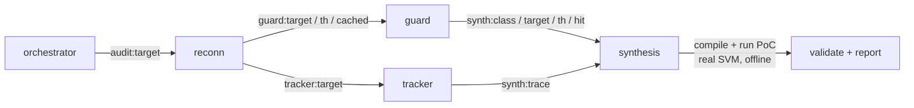

# Dark Factory

 

**Version:** `0.1.0` · [Changelog](./CHANGELOG.md) · **Requires:** agentis >= `1.18.0` · **Status:** Experimental

> An autonomous Solana/Anchor bounty auditor built as a colony federation on
> the agentis substrate. It ingests a program, detects an access-control /
> signer-authorization vulnerability, synthesizes a two-sided proof-of-concept,
> validates it through the real Solana SVM offline, and writes a standardized
> Immunefi-shaped report. Submission is human-gated — the colony never posts to
> a bounty platform.

This federation conforms to
[ADR-0003](../doc/adr/ADR-0003-federation-portability-contract.md). The agent
contract follows [ADR-0001](../doc/adr/ADR-0001-confidence-tiers.md) end-to-end.

## What the auditor does

The `auditor` colony runs a one-shot `agentis go` pipeline. Four cooperating
agents are wired by the substrate emit/listen bus (no polling):



1. **reconn** — dependency recon, distills each handler sub-graph into a
   content-addressed DAG (structural dedup cache), and looks up a prior
   verdict / federation blacklist for the exact sub-graph (audit-once).
2. **guard** — on a cache HIT reuses the verdict; on a MISS runs structural
   detection (MissingSignerCheck / IntegerOverflow).
3. **tracker** — dataflow trace: does a signer/authority guard dominate the
   state-mutation sink?
4. **synthesis** — generates a **two-sided** PoC (LLM-driven, with a
   deterministic template fallback), compiles + runs it in the hardened
   sandbox, and gates the verdict on the two-sided check: a control path that
   accepts the authorized caller (`CONTROL OK:`) AND an exploit path that
   breaks the safety invariant (`INVARIANT VIOLATED:`). Only then is the
   finding `verified`.

When `SOLANA_HARNESS_DIR` is set, synthesis drives the program through the
real `solana-runtime` SVM via `solana-program-test` + `BanksClient` (real
account model, signer/owner checks, lamport conservation); otherwise it uses
a std-only `rustc` harness (offline-deterministic).

## Offline toolchain setup (one-time)

The real-SVM path compiles against a ~711-crate dependency graph. Fetch and
warm-build it ONCE per host (the only step that needs network):

```bash
bash dark-factory/setup-solana-toolchain.sh [WORKDIR]
```

This stages the harness skeleton under `$WORKDIR/.solana-harness` and warm-builds
its dependencies so every subsequent audit run compiles + runs the generated PoC
fully offline inside the hardened sandbox. See
[`solana-harness/README.md`](./solana-harness/README.md) for the offline contract
and the hardened sandbox mask.

## Quick start

**Prerequisites**

- The `agentis` runtime binary on PATH (proprietary closed-source binary, free
  for Linux/macOS: https://github.com/Replikanti/agentis). dark-factory
  requires `agentis >= 1.18.0`.
- The Rust stable toolchain (`cargo`, `rustc`) on PATH.
- Claude Code CLI (`claude`) on PATH for the LLM synthesis path (optional — the
  deterministic template fallback runs without it).

**Recipe**

```bash
bash dark-factory/install.sh                       # idempotent setup
bash dark-factory/setup-solana-toolchain.sh        # one-time offline toolchain build (network ON)
bash dark-factory/auditor/scripts/start-colony.sh  # run one audit (one-shot pipeline)
```

The report and PoC artifacts land under `<rundir>/.agentis/sandbox/`. See the
[auditor colony README](./auditor/README.md) for the
`SOLANA_HARNESS_DIR` / `BOUNTY_TARGET` / `BOUNTY_POC` env contract.

## Run an audit (`run-audit.sh`)

**Full operator runbook: [`docs/RUNBOOK.md`](./docs/RUNBOOK.md)** — prerequisites, scope,
verdicts, where artifacts land, and the manual submission step, in one page.

`run-audit.sh` is the operator entrypoint: it runs the full pipeline against a scope **you
choose** and, on a VERIFIED finding, stages a **human-gated** submission package. Pass
**absolute** paths (the colony runs in its own working dir).

```bash
# native solana-program target
dark-factory/run-audit.sh --target "$PWD/path/to/program.rs" \
    --harness "$PWD/dark-factory/solana-harness"   # default backend = flat-cyborg (flat-rate); add --backend claude for the metered -p path

# Anchor target (+ optional frozen on-chain snapshot for state replay)
dark-factory/run-audit.sh --target "$PWD/path/to/lib.rs" \
    --anchor-harness "$PWD/dark-factory/solana-harness-anchor" \
    --snapshot "$PWD/snap.txt" --out "$PWD/audit-out"

# EVM/Solidity target (M1: Reentrancy) — verified through the real EVM (revm).
# One-time host-side: (cd dark-factory/evm-harness && npm i solc)   # pins solc 0.8.26 for compile.js
dark-factory/run-audit.sh --target "$PWD/path/to/Contract.sol" \
    --evm-harness "$PWD/dark-factory/evm-harness" --out "$PWD/audit-out"
```

On `Verdict: VERIFIED` the package lands at `<out>/submission/`: `report.md` (Immunefi-format,
embeds the PoC), `poc.rs`, `target.rs`, `snapshot.txt` (if used), and `MANIFEST.txt` marked
**PENDING HUMAN REVIEW — NOT SUBMITTED**. The colony never posts to a platform — submission is
a manual human action. `run-audit.sh` requires `--target` and never auto-picks a scope.
`--backend mock` runs offline-deterministically (structural heuristic, no LLM). Produce a
frozen snapshot with `snapshot-rpc.sh --rpc <url> --out snap.txt <pubkey>`.

## Discover bugs in custom code (`run-discovery.sh`)

`run-audit.sh` drives the DAG fork-**matcher** (`auditor.ag`): it fires only where in-scope code
**recurs a known-bug pattern**, so on a bespoke, never-forked protocol it returns nothing. Custom
contest code (a fresh stablecoin, a new vault) needs **discovery**, not matching. `run-discovery.sh`
drives the colony's discovery agent — [`auditor/agents/hunter.ag`](./auditor/agents/hunter.ag) — a
taxonomy-driven, adversarial, per-(subsystem × bug-class) audit that runs **entirely through the
agentis substrate** (`prompt` / `emit` / `learn`), so every hunt is recorded as experience and the
taxonomy's per-class fitness reweights over time. It is the colony-native form of a hand-run
multi-agent audit pass.

The operator supplies three inputs and the colony fans out one substrate agent per cell:

- `--repo <dir>` — the cloned target (use `fetch-target.sh`).
- `--scope <scope.tsv>` — `subsystem | classid,… | file,…` per line (files relative to the repo). A
  file may be written `file@fn1+fn2` to feed the hunter **only those functions** (+ the contract header)
  — slice big/complex contracts this way so a deep liquidation/redemption read fits the LLM budget.
- `--brief <brief.md>` — the protocol's invariants-to-break, **known issues to exclude**, and trust model.

```bash
dark-factory/run-discovery.sh \
    --repo "$PWD/target" --scope "$PWD/scope.tsv" --brief "$PWD/brief.md" \
    --out "$PWD/discovery-out"
# cheap wiring smoke (no real LLM):  add  --backend mock --only "<subsystem>" --classes C1
```

The bug classes live in [`auditor/bug-taxonomy.md`](./auditor/bug-taxonomy.md) (14 DeFi classes —
share-price/ERC4626, oracle, cross-chain/LZ, withdrawal-queue, access-control, accounting,
sig-replay, reentrancy, decimals, …), each with a deep "hunt" lens distilled from real audits.

Every `CANDIDATE` in `discovery-out/discovery-report.md` is a **lead, not a finding** — unverified
until it reproduces through the multi-contract Foundry gate:

```bash
dark-factory/evm-harness/forge-verify.sh --repo "$PWD/target" --poc "$PWD/Exploit.t.sol" --lz-symlink
# exit 0 = VERIFIED (the exploit PoC passes); only a VERIFIED lead is worth a human-gated submission.
```

A clean sweep (no candidate survives) is a **rigorous negative** — a valid outcome on audited code;
nothing is submitted. As with `run-audit.sh`, the colony never posts to a platform.

### Inter-agent coordination (shared blackboard, #1001)

The fan-out is no longer a flat sum of independent cells. Because every (subsystem × class) cell runs
against one shared agentis memo store, `hunter.ag` reads a rolling **blackboard**
(`dark-factory:blackboard:leads`) before it prompts and posts every `CANDIDATE` back to it (also
emitting `dark-factory:lead`). A later cell that sees a sibling's lead on the board is **steered** — its
prompt gains a FOCUS block to corroborate a hit in the same subsystem or pivot toward a related surface
a sibling already flagged — so one cell's finding changes what a later cell does. `run-discovery.sh`
logs a `↳ COORDINATION:` line when a cell is steered and appends an **Inter-agent coordination** table
to the report. The mechanism is inert on a clean sweep (no finding → identical prompt → the
rigorous-negative behavior above is unchanged). Reproduce it offline (no network, deterministic fake
LLM):

```bash
dark-factory/demo-blackboard.sh   # oracle cell posts a lead; downstream liquidation cell reads + is steered
```

This is one coordination step, not emergent behavior; a coordinator that reprioritizes/prunes the cell
manifest from the board is a follow-up.

### Self-orchestrating coordinator (`run-coordinator.sh`, #1014)

The fan-out above still runs in a **fixed order** chosen by a script + an operator. The coordinator moves
that **decision** into the substrate: [`auditor/agents/coordinator.ag`](./auditor/agents/coordinator.ag)
reads the current FACTS each step — open scope, per-class lens fitness, the blackboard, pending
unverified candidates, remaining budget, and the previous action's gate **outcome** (a fact, never an LLM
call) — and an evolving **policy**, then chooses **one** next action (`hunt` / `refute` / `poc-screen` /
`invent-method` / `stop`) by a policy-weighted **argmax** over fact-criteria (verify a pending lead before
more hunting; prefer a blackboard-flagged subsystem and a higher-fitness lens; stop on budget/dry). The
decision policy **evolves**: each action's confirmed-finding → success / dry-or-refuted → failure is
recorded with the same `learn()` mechanic the lens-fitness loop uses (#996), so
`coordinator:policy:<action-type>` reweights which decisions it leans on. `run-coordinator.sh` is a thin
**dispatcher** (not a decider): it loops {ask the coordinator → execute the chosen action → feed the
outcome back} until `stop`/budget. Reproduce both halves offline (no network, deterministic, mock
backend):

```bash
dark-factory/demo-coordinator.sh   # (a) distinct facts -> distinct actions; (b) the policy measurably evolves
dark-factory/demo-dispatch.sh      # #1014 M1: the hunt DISPATCH moved into the substrate (proof, offline)
```

`decide(options, criteria)` **is** a real substrate builtin, but offline it resolves to the first option
(it does not read the criteria text), so the coordinator does the fact+policy ranking itself and uses
`decide` as the selection step over its already-ranked list.

**#1014 M1 — the `hunt` DISPATCH is now in the substrate.** The coordinator no longer just *decides* a
hunt; in **one** `agentis go` it also *dispatches* it: it `emit`s `dark-factory:dispatch` over the
in-process bus and a sibling agent fn ([`auditor/agents/dispatcher.ag`](./auditor/agents/dispatcher.ag),
inlined gated in `coordinator.ag`) derives the gate verdict from a `HUNT_FIXTURE` fact and writes it to the
durable `coordinator:last_outcome` memo — which the shell loop **reads** instead of a shell `case`. Other
action types keep their shell dispatch; full model in [`docs/dispatch.md`](./docs/dispatch.md). v1 boundary
(the shell still dispatches the *non-hunt* actions; manifest reprioritisation is follow-up; submission
stays human-gated): [`docs/coordinator.md`](./docs/coordinator.md).

### Pre-screen a lead before the Foundry gate (`screen-leads.sh`)

`forge-verify.sh` is the heavyweight gate (a full Foundry deploy + attacker tx). Between a hunter's
*prose* PoC sketch and that repro, `screen-leads.sh` is the **cheap** gate: it lowers a lead's
machine-checkable invariant to a self-contained `.ag` PoC harness and evaluates it through the
substrate's **`eval_ag`** primitive — a metered sub-interpreter with its own CB budget — via
[`auditor/agents/poc-screener.ag`](./auditor/agents/poc-screener.ag). A reproduced screen (return
`101`, the colony's INVARIANT-VIOLATED sentinel) decides a lead is worth the forge-verify cost; a
runaway / malformed harness is **CB-exhaustion-contained** (surfaced as `inner_cb_exhausted` /
`parse_error`), so a runaway harness cannot starve or crash the screener — the screener survives.
Note: `eval_ag` does NOT sandbox `exec` in agentis v1.18.27 — a harness that calls `exec sh` escapes
to the host, so harnesses must be operator-trusted.

```bash
dark-factory/screen-leads.sh --demo          # self-contained: 3 leads -> 1 reproduced, 1 held, 1 indeterminate
dark-factory/screen-leads.sh --manifest leads.tsv    # one `lead-id | harness.ag` per line
```

A reproduced screen is still a **lead, not a finding** — verify it through `forge-verify.sh` and keep
submission human-gated. Which substrate primitives the colony adopted (and why `replicate` / `delegate`
/ `decide` / Lean / confidence-tiers do **not** currently fit) is documented in
[`docs/SUBSTRATE-PRIMITIVES.md`](./docs/SUBSTRATE-PRIMITIVES.md).

## Observe a run (`run-summary.sh`)

dark-factory runs **one-shot** (`agentis go`): no daemons, no `*:confidence` memos — so the
standalone `federation-dashboard` (which assumes daemon-tick agents) has nothing to poll (#995).
`run-summary.sh` closes that gap on the dark-factory side: after a run, point it at the same `--out`
dir and it distills the run's on-disk artifacts (the agentis **experience log** + the run report)
into one stable JSON at `<out>/run-summary.json` — runs/cells executed, candidates found, `learn()`
outcomes, **per-class fitness** (`success / attempts` from the experience rows), last-run timestamp,
and verdict — that a monitor or dashboard can poll. It only reads what the run already wrote.

```bash
dark-factory/run-discovery.sh --repo "$PWD/target" --scope scope.tsv --brief brief.md \
    --out "$PWD/discovery-out"
dark-factory/run-summary.sh --out "$PWD/discovery-out"          # -> discovery-out/run-summary.json
dark-factory/run-summary.sh --out "$PWD/discovery-out" --json | jq .verdict   # stdout is pure JSON
dark-factory/run-summary.sh --out "$PWD/discovery-out" --emit-event           # + one NDJSON event line
```

Schema + the monitor/dashboard consumer contract: [`docs/run-observability.md`](./docs/run-observability.md).

## Refute candidate leads (`run-refute.sh`)

Between discovery and a (costly) Foundry PoC there is a cheaper gate: a **second, independent skeptic**
must fail to break the lead. `run-refute.sh` drives that gate on the substrate via
[`auditor/agents/refuter.ag`](./auditor/agents/refuter.ag) — for each candidate it env-ins the
`file:fn` + claimed exploit + the relevant code, `prompt`s a hostile reader that tries to **REFUTE** the
claim against the actual control/data flow (**defaulting to REFUTED on any doubt**, so only unambiguous
leads survive), `emit`s `dark-factory:refute_verdict`, and `learn`s the attempt so refuter fitness
reweights. This is the colony-native form of the `adversarial-refute` method
([`auditor/methods/registry.md`](./auditor/methods/registry.md)) that previously ran as an external
subagent — the proven pattern (#999) for porting the colony's other deep capabilities (deep
cross-function audit, build-and-run PoC, fork-differential) onto the substrate.

```bash
# candidates.tsv: `file:fn | classid | severity | claimed exploit | code-file`  (one per line)
dark-factory/run-refute.sh --candidates "$PWD/candidates.tsv" --out "$PWD/refute-out"
# cheap wiring smoke (no real LLM):  add  --backend mock
```

A **REAL** verdict is a lead that survived a hostile read — **not a finding**. It still must reproduce
through `evm-harness/forge-verify.sh` before it counts, and submission stays a separate, explicit human
action. A **REFUTED** verdict is killed here and never reaches the forge gate. The colony never posts.

## Exercise the evolve/fitness loop (`evolve-fitness.sh`)

Every hunt the colony runs records a `learn("hunt", "<class>:<subsystem>", ..., outcome, [...])` row in
the agentis experience store; the cumulative `delta` per key (+0.15 per CANDIDATE lead, -0.15 per
rigorous SAFE) is the **per-lens fitness** that reweights which taxonomy classes the colony leans on.
`evolve-fitness.sh` drives that loop across N iterations over a built-in ground-truth corpus and prints
the BEFORE/AFTER fitness so the movement is visible — high-yield lenses (vault accounting, rounding,
reentrancy) pull ahead, speculative lenses (cross-chain, pause) fall behind. It runs the colony's REAL
recording path (`auditor/agents/fitness-driver.ag`, the identical `learn()` call `hunter.ag` makes), is
fully offline and reproducible (`--backend mock` semantics, no LLM call), and exits non-zero if the loop
fails to move fitness.

```bash
dark-factory/evolve-fitness.sh --iters 6 --json
# -> a per-lens before/after/Δ-fitness table + <out>/fitness.json; supply --corpus to use your own
#    `class | subsystem | yield` manifest.
```

## Invent new audit methods (`run-method-discovery.sh`)

The federation's **self-improvement** layer. When the current method-set plateaus, the
method-inventor proposes ONE new audit method and it is adopted into the registry only if it
**discriminates** on a known-bug control corpus. The loop is **invent → validate → adopt**:

1. **invent** — `auditor/agents/method-inventor.ag` reads the current registry
   ([`auditor/methods/registry.md`](./auditor/methods/registry.md)) + a documented GAP
   ([`auditor/methods/gap-stateful.md`](./auditor/methods/gap-stateful.md)) and proposes one new,
   distinct, concretely-runnable method (substrate-native via `agentis go`, direct-LLM as fallback).
2. **validate** — the proposal is run against the paired control corpus under
   `auditor/method-discovery/controls/`: a planted accounting/solvency bug (`BuggyBank`) plus a clean
   twin (`SafeBank`). The two-sided gate is `forge test` on the buggy suite FAILING **and** the safe
   twin PASSING — that is what makes invention empirical, not speculation.
3. **adopt** — only on two-sided discrimination is the method appended to the registry
   (`status=invented`, `fitness=0.50`). An `invented` row keeps the proposal's control-assertion
   before `status` (one more field than a `builtin` row) — that field is what `gen-agent.sh` reads
   to wire the agent's gate. The registry is operator-curated, so adoption is additive and
   re-invented same-name methods are a no-op.

```bash
# Build a /tmp control corpus (controls/ + a local forge-std under lib/), then:
dark-factory/run-method-discovery.sh /tmp/mdctl
# exit 0 = invented + validated + adopted;  2 = proposal did not discriminate (no adoption);
# 1 = the inventor produced no proposal.  Set NO_AGENTIS=1 to force the direct-LLM path.
```

Turn an adopted method into a runnable agent with `gen-agent.sh <method-name>` (#1000), which
materialises `auditor/agents/<name>.ag` from the method's registry line.

## Export / import a trained federation (`state-export.sh`)

A *trained* federation's value is its **evolved state**: the accumulated learned `memo` (fitness
weights, taxonomy/method state) and the content-addressed Merkle DAG of audited patterns.
`state-export.sh` packages that state into a portable, **checksum-verified** artifact so a trained
instance can be moved between machines. It deliberately **excludes** the federation identity (private
key), per-deployment config, and the transient sandbox — an importer keeps their OWN identity and
only inherits the learned state.

```bash
dark-factory/state-export.sh export <rundir> state.tar.gz   # package memo + DAG -> artifact
dark-factory/state-export.sh verify state.tar.gz            # recompute + compare the sha256 digest
dark-factory/state-export.sh import state.tar.gz <dest>     # overlay memo + DAG onto a fresh local store
```

`verify`/`import` prove the state blob matches the manifest digest (no in-transit corruption). The
checksum is **not** a signature: it authenticates integrity, not the source. **Sign the manifest
out-of-band** before distributing a trained federation to a third party.

## Layout

```
dark-factory/
  README.md                     # this file
  VERSION  CHANGELOG.md  BUNDLE.manifest  install.sh
  run-audit.sh                  # operator entrypoint: DAG fork-matcher audit -> human-gated package
  run-discovery.sh              # operator entrypoint: custom-code discovery (hunter fan-out) -> leads
  screen-leads.sh               # cheap substrate-native lead pre-screen (eval_ag) before forge-verify
  run-summary.sh                # one-shot run -> monitor-/dashboard-consumable run-summary.json (#995)
  run-refute.sh                 # operator entrypoint: adversarial refutation (refuter fan-out) -> verdicts
  run-coordinator.sh            # thin DISPATCHER for the self-orchestrating loop (coordinator decides; #1014; hunt dispatched in-substrate, M1)
  demo-coordinator.sh           # offline, deterministic proof of the #1014 fact-driven + evolving-policy loop
  demo-dispatch.sh              # offline, deterministic proof of the #1014 M1 substrate hunt DISPATCH
  evolve-fitness.sh             # drive the evolve/fitness loop over N iterations; show per-lens fitness move
  run-method-discovery.sh       # self-improvement: invent -> validate-on-control -> adopt a new method
  state-export.sh               # export/verify/import a trained federation's evolved state (checksum-verified)
  gen-agent.sh                  # materialise a colony-lint-valid .ag agent from an invented METHOD line (#1000)
  demo-blackboard.sh            # offline, deterministic demo of the #1001 blackboard coordination loop
  setup-solana-toolchain.sh     # one-time offline toolchain build (network ON)
  snapshot-rpc.sh               # host RPC getAccountInfo -> frozen on-chain snapshot (V4)
  calibrate-sealevel.sh         # detection+validation scorecard over the sealevel corpus (V6)
  sealevel-scorecard.md         # calibration results (3/3 true-positive, 0 false-VERIFIED)
  auditor/                      # the single colony
    agents/auditor.ag           # the DAG-match pipeline (reconn → guard → tracker → synthesis)
    agents/hunter.ag            # the custom-code discovery agent (taxonomy-driven adversarial hunt)
    agents/poc-screener.ag      # substrate-native lead pre-screen via eval_ag (sandboxed PoC harness)
    agents/refuter.ag           # the adversarial-refutation agent (independent skeptic; default REFUTED)
    agents/fitness-driver.ag    # one fitness-loop cell: hunter.ag's exact learn() over a ground-truth verdict
    agents/method-inventor.ag   # the meta-loop inventor: proposes a new audit method for a known gap (#998)
    agents/coordinator.ag       # self-orchestrating decider: one fact+policy-driven action per call (#1014); gated in-substrate hunt dispatch (M1)
    agents/dispatcher.ag        # the substrate hunt-DISPATCH agent fn (emit/listen + durable verdict memo; #1014 M1)
    agents/stateful-invariant-fuzz.ag  # generated by gen-agent.sh from the like-named method (#1000)
    methods/registry.md         # the method registry gen-agent.sh reads (METHOD| lines; #998 loop, #1000 generator)
    methods/gap-stateful.md     # a documented gap the current method-set misses (the #998 invent trigger)
    method-discovery/controls/  # paired Buggy/Safe control corpus (the two-sided adoption gate)
    bug-taxonomy.md             # 14 DeFi bug classes + per-class hunt lens (the discovery knowledge)
    slice-fns.sh                # Solidity function-slicer (scope `file@fn1+fn2` -> header + named fns)
    config/colony.example.toml  # forge.type = "none"; cb_budget
    scripts/start-colony.sh     # thin `agentis go` launcher
    README.md
  solana-harness/               # offline solana-program-test crate (real SVM, native)
  solana-harness-anchor/        # offline anchor-lang 0.31 harness (real SVM, Anchor) (V6)
  evm-harness/                  # offline revm crate: two-sided EVM PoC (real EVM, Solidity)
    forge-verify.sh             # multi-contract custom-protocol PoC gate (real Foundry deploy+exploit)
  sealevel/                     # modernized coral-xyz/sealevel-attacks lessons (corpus) (V6)
  fixtures/                     # detection fixtures (vuln + safe + rigged-harness cases)
```

## Status

Experimental, research scaffold. The Solana detection set is intentionally narrow
(MissingSignerCheck / IntegerOverflow) and the real-SVM path requires the one-time
toolchain build; an EVM/Solidity path (M1: Reentrancy, agentis-core#858) audits `.sol`
targets through the real EVM (revm) via `--evm-harness`. Submission to Immunefi /
Code4rena / Sherlock is always a separate, explicit human action — the colony never auto-posts.
