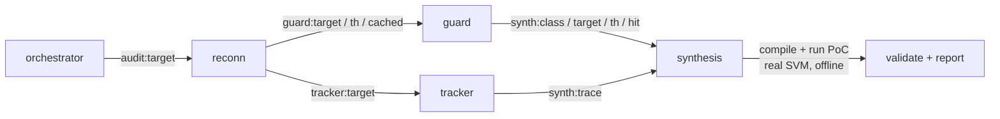

# Dark Factory

 

**Version:** `0.1.0` · [Changelog](./CHANGELOG.md) · **Requires:** agentis >= `1.18.0` · **Status:** Experimental

> An autonomous Solana/Anchor bounty auditor built as a colony federation on
> the agentis substrate. It ingests a program, detects an access-control /
> signer-authorization vulnerability, synthesizes a two-sided proof-of-concept,
> validates it through the real Solana SVM offline, and writes a standardized
> Immunefi-shaped report. Submission is human-gated — the colony never posts to
> a bounty platform.

This federation conforms to
[ADR-0003](../doc/adr/ADR-0003-federation-portability-contract.md). The agent
contract follows [ADR-0001](../doc/adr/ADR-0001-confidence-tiers.md) end-to-end.

## What the auditor does

The `auditor` colony runs a one-shot `agentis go` pipeline. Four cooperating
agents are wired by the substrate emit/listen bus (no polling):



1. **reconn** — dependency recon, distills each handler sub-graph into a
   content-addressed DAG (structural dedup cache), and looks up a prior
   verdict / federation blacklist for the exact sub-graph (audit-once).
2. **guard** — on a cache HIT reuses the verdict; on a MISS runs structural
   detection (MissingSignerCheck / IntegerOverflow).
3. **tracker** — dataflow trace: does a signer/authority guard dominate the
   state-mutation sink?
4. **synthesis** — generates a **two-sided** PoC (LLM-driven, with a
   deterministic template fallback), compiles + runs it in the hardened
   sandbox, and gates the verdict on the two-sided check: a control path that
   accepts the authorized caller (`CONTROL OK:`) AND an exploit path that
   breaks the safety invariant (`INVARIANT VIOLATED:`). Only then is the
   finding `verified`.

When `SOLANA_HARNESS_DIR` is set, synthesis drives the program through the
real `solana-runtime` SVM via `solana-program-test` + `BanksClient` (real
account model, signer/owner checks, lamport conservation); otherwise it uses
a std-only `rustc` harness (offline-deterministic).

## Offline toolchain setup (one-time)

The real-SVM path compiles against a ~711-crate dependency graph. Fetch and
warm-build it ONCE per host (the only step that needs network):

```bash
bash dark-factory/setup-solana-toolchain.sh [WORKDIR]
```

This stages the harness skeleton under `$WORKDIR/.solana-harness` and warm-builds
its dependencies so every subsequent audit run compiles + runs the generated PoC
fully offline inside the hardened sandbox. See
[`solana-harness/README.md`](./solana-harness/README.md) for the offline contract
and the hardened sandbox mask.

## Quick start

**Prerequisites**

- The `agentis` runtime binary on PATH (proprietary closed-source binary, free
  for Linux/macOS: https://github.com/Replikanti/agentis). dark-factory
  requires `agentis >= 1.18.0`.
- The Rust stable toolchain (`cargo`, `rustc`) on PATH.
- Claude Code CLI (`claude`) on PATH for the LLM synthesis path (optional — the
  deterministic template fallback runs without it).

**Recipe**

```bash
bash dark-factory/install.sh                       # idempotent setup
bash dark-factory/setup-solana-toolchain.sh        # one-time offline toolchain build (network ON)
bash dark-factory/auditor/scripts/start-colony.sh  # run one audit (one-shot pipeline)
```

The report and PoC artifacts land under `<rundir>/.agentis/sandbox/`. See the
[auditor colony README](./auditor/README.md) for the
`SOLANA_HARNESS_DIR` / `BOUNTY_TARGET` / `BOUNTY_POC` env contract.

## Run an audit (`run-audit.sh`)

**Full operator runbook: [`docs/RUNBOOK.md`](./docs/RUNBOOK.md)** — prerequisites, scope,
verdicts, where artifacts land, and the manual submission step, in one page.

`run-audit.sh` is the operator entrypoint: it runs the full pipeline against a scope **you
choose** and, on a VERIFIED finding, stages a **human-gated** submission package. Pass
**absolute** paths (the colony runs in its own working dir).

```bash
# native solana-program target
dark-factory/run-audit.sh --target "$PWD/path/to/program.rs" \
    --harness "$PWD/dark-factory/solana-harness" --backend claude

# Anchor target (+ optional frozen on-chain snapshot for state replay)
dark-factory/run-audit.sh --target "$PWD/path/to/lib.rs" \
    --anchor-harness "$PWD/dark-factory/solana-harness-anchor" \
    --snapshot "$PWD/snap.txt" --backend claude --out "$PWD/audit-out"

# EVM/Solidity target (M1: Reentrancy) — verified through the real EVM (revm).
# One-time host-side: (cd dark-factory/evm-harness && npm i solc)   # pins solc 0.8.26 for compile.js
dark-factory/run-audit.sh --target "$PWD/path/to/Contract.sol" \
    --evm-harness "$PWD/dark-factory/evm-harness" --backend claude --out "$PWD/audit-out"
```

On `Verdict: VERIFIED` the package lands at `<out>/submission/`: `report.md` (Immunefi-format,
embeds the PoC), `poc.rs`, `target.rs`, `snapshot.txt` (if used), and `MANIFEST.txt` marked
**PENDING HUMAN REVIEW — NOT SUBMITTED**. The colony never posts to a platform — submission is
a manual human action. `run-audit.sh` requires `--target` and never auto-picks a scope.
`--backend mock` runs offline-deterministically (structural heuristic, no LLM). Produce a
frozen snapshot with `snapshot-rpc.sh --rpc <url> --out snap.txt <pubkey>`.

## Discover bugs in custom code (`run-discovery.sh`)

`run-audit.sh` drives the DAG fork-**matcher** (`auditor.ag`): it fires only where in-scope code
**recurs a known-bug pattern**, so on a bespoke, never-forked protocol it returns nothing. Custom
contest code (a fresh stablecoin, a new vault) needs **discovery**, not matching. `run-discovery.sh`
drives the colony's discovery agent — [`auditor/agents/hunter.ag`](./auditor/agents/hunter.ag) — a
taxonomy-driven, adversarial, per-(subsystem × bug-class) audit that runs **entirely through the
agentis substrate** (`prompt` / `emit` / `learn`), so every hunt is recorded as experience and the
taxonomy's per-class fitness reweights over time. It is the colony-native form of a hand-run
multi-agent audit pass.

The operator supplies three inputs and the colony fans out one substrate agent per cell:

- `--repo <dir>` — the cloned target (use `fetch-target.sh`).
- `--scope <scope.tsv>` — `subsystem | classid,… | file,…` per line (files relative to the repo). A
  file may be written `file@fn1+fn2` to feed the hunter **only those functions** (+ the contract header)
  — slice big/complex contracts this way so a deep liquidation/redemption read fits the LLM budget.
- `--brief <brief.md>` — the protocol's invariants-to-break, **known issues to exclude**, and trust model.

```bash
dark-factory/run-discovery.sh \
    --repo "$PWD/target" --scope "$PWD/scope.tsv" --brief "$PWD/brief.md" \
    --backend claude --out "$PWD/discovery-out"
# cheap wiring smoke (no real LLM):  add  --backend mock --only "<subsystem>" --classes C1
```

The bug classes live in [`auditor/bug-taxonomy.md`](./auditor/bug-taxonomy.md) (14 DeFi classes —
share-price/ERC4626, oracle, cross-chain/LZ, withdrawal-queue, access-control, accounting,
sig-replay, reentrancy, decimals, …), each with a deep "hunt" lens distilled from real audits.

Every `CANDIDATE` in `discovery-out/discovery-report.md` is a **lead, not a finding** — unverified
until it reproduces through the multi-contract Foundry gate:

```bash
dark-factory/evm-harness/forge-verify.sh --repo "$PWD/target" --poc "$PWD/Exploit.t.sol" --lz-symlink
# exit 0 = VERIFIED (the exploit PoC passes); only a VERIFIED lead is worth a human-gated submission.
```

A clean sweep (no candidate survives) is a **rigorous negative** — a valid outcome on audited code;
nothing is submitted. As with `run-audit.sh`, the colony never posts to a platform.

## Layout

```
dark-factory/
  README.md                     # this file
  VERSION  CHANGELOG.md  BUNDLE.manifest  install.sh
  run-audit.sh                  # operator entrypoint: DAG fork-matcher audit -> human-gated package
  run-discovery.sh              # operator entrypoint: custom-code discovery (hunter fan-out) -> leads
  setup-solana-toolchain.sh     # one-time offline toolchain build (network ON)
  snapshot-rpc.sh               # host RPC getAccountInfo -> frozen on-chain snapshot (V4)
  calibrate-sealevel.sh         # detection+validation scorecard over the sealevel corpus (V6)
  sealevel-scorecard.md         # calibration results (3/3 true-positive, 0 false-VERIFIED)
  auditor/                      # the single colony
    agents/auditor.ag           # the DAG-match pipeline (reconn → guard → tracker → synthesis)
    agents/hunter.ag            # the custom-code discovery agent (taxonomy-driven adversarial hunt)
    bug-taxonomy.md             # 14 DeFi bug classes + per-class hunt lens (the discovery knowledge)
    slice-fns.sh                # Solidity function-slicer (scope `file@fn1+fn2` -> header + named fns)
    config/colony.example.toml  # forge.type = "none"; cb_budget
    scripts/start-colony.sh     # thin `agentis go` launcher
    README.md
  solana-harness/               # offline solana-program-test crate (real SVM, native)
  solana-harness-anchor/        # offline anchor-lang 0.31 harness (real SVM, Anchor) (V6)
  evm-harness/                  # offline revm crate: two-sided EVM PoC (real EVM, Solidity)
    forge-verify.sh             # multi-contract custom-protocol PoC gate (real Foundry deploy+exploit)
  sealevel/                     # modernized coral-xyz/sealevel-attacks lessons (corpus) (V6)
  fixtures/                     # detection fixtures (vuln + safe + rigged-harness cases)
```

## Status

Experimental, research scaffold. The Solana detection set is intentionally narrow
(MissingSignerCheck / IntegerOverflow) and the real-SVM path requires the one-time
toolchain build; an EVM/Solidity path (M1: Reentrancy, agentis-core#858) audits `.sol`
targets through the real EVM (revm) via `--evm-harness`. Submission to Immunefi /
Code4rena / Sherlock is always a separate, explicit human action — the colony never auto-posts.
