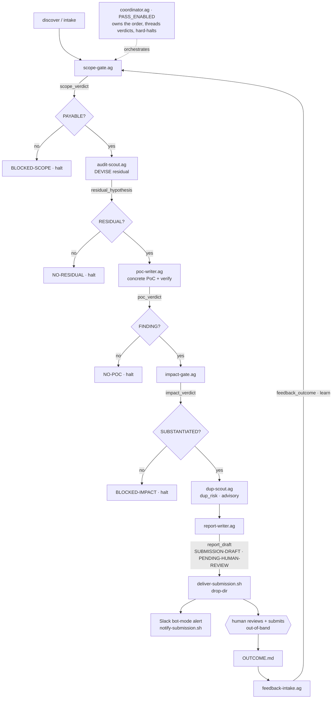

# Auditor Colony

> Part of the [Dark Factory](../) federation.

The bounty-hunt colony. What began as a single four-agent `agentis go` pipeline in
[`agents/auditor.ag`](./agents/auditor.ag) has grown into a multi-agent colony that
runs an **end-to-end, gated bounty-hunt chain** on the substrate emit/listen bus:
discover a target → **scope-gate** it (in-scope asset + eligible impact) → **devise**
the residual attack surface the prior audits missed → write and **verify** a PoC →
**impact-gate** it (is the impact substantiated through the protocol's own mechanism?)
→ estimate **dup-risk** → render a platform-shaped **report** → stage it for a
**human-gated submit** with a **feedback loop** back into learning. The hard early-exit
gates mean effort is only ever spent on **payable** surface, and **submission is human-gated
throughout — no agent ever posts to a bounty platform.**

The chain is self-orchestrated by [`agents/coordinator.ag`](./agents/coordinator.ag):
in its free mode it DECIDES the next hunt/verify action from evolving policy; in its
`PASS_ENABLED` submission-pass mode it sequences the fixed-order gate chain and hard-halts
on any blocking gate. Alongside the chain live the original **DAG fork-matcher** core (the
legacy `auditor.ag` pipeline + the pattern-memory machinery), the **custom-code discovery**
hunter, several **generate-and-verify** PoC engines, and the **method/pattern-evolution**
meta-loop. The colony is `forge.type = "none"` (no forge credentials required) and runs
fully offline once the toolchains are staged.

## Agents

Every agent is one `.ag` file under [`agents/`](./agents/); the colony runs them as
one-shot `agentis go` invocations wired by the substrate emit/listen bus (no per-agent
daemon). Bus events use the `dark-factory:<event>` namespace.

### Orchestration

| Agent | Role | Output |
|-------|------|--------|
| [`coordinator.ag`](./agents/coordinator.ag) | Self-orchestrating decider. Free mode: reads the current FACTS + an evolving POLICY and picks ONE next action (`hunt` / `refute` / `poc-screen` / `symbolic-prove` / `invariant-hunt` / `invent-method` / `stop`) by a policy-weighted argmax. `PASS_ENABLED` submission-pass mode: sequences the fixed-order gate chain (scope → devise → poc → impact → dup → report → HALT), threading each stage's verdict and hard-halting on a blocking gate. | `dark-factory:decision`, `dark-factory:policy_update`, `dark-factory:dispatch`, `dark-factory:pass_stage`; `PASS\|…` / `DISPATCH\|…` / `ORCHESTRATE\|…` |
| [`dispatcher.ag`](./agents/dispatcher.ag) | The substrate action-DISPATCH fn (#1014 M2): `listen`s the coordinator's `dark-factory:dispatch`, derives the gate verdict (fixture or live symbolic-prove route), writes the durable `coordinator:last_outcome` memo. Standalone sync-guard copy of the fn inlined in `coordinator.ag`. | `dark-factory:dispatch`; durable `coordinator:last_outcome` |

### Detection (legacy DAG fork-matcher)

| Agent | Role | Output |
|-------|------|--------|
| [`auditor.ag`](./agents/auditor.ag) | The original four-agent pipeline (reconn → guard → tracker → synthesis): distils each handler sub-graph into a content-addressed DAG (dedup cache + audit-once), runs structural detection on a MISS, and on a hit synthesises + compiles + runs a **two-sided** PoC against the real Solana SVM offline before writing the report. Fires only where in-scope code **recurs a known-bug pattern**. | `report.md`, tier-gated `submission:pending` |

### Discovery (custom code)

| Agent | Role | Output |
|-------|------|--------|
| [`zone-mapper.ag`](./agents/zone-mapper.ag) | Zone-mapping front-end (#1612, epic #1611 M1): given ONE candidate subsystem's in-scope code + the bug-class taxonomy, decides which classes plausibly apply and names/describes the zone. `map-zones.sh` invokes it per zone to **auto-derive** the `scope.tsv` discovery manifest (subsystem × bug-class) that `run-discovery.sh` then fans `hunter.ag` out over — closing the auto-map → hunt loop. | `ZONE\|<id>\|<name>\|<class-csv>\|<description>` → `zones.json` + `scope.tsv` |
| [`brief-writer.ag`](./agents/brief-writer.ag) | Brief-generation front-end (#1619, epic #1611 M2): given ONE zone's in-scope code + its bug classes + the taxonomy + (optional) audit residual/boundary, authors the DEPTH body of a per-zone hunt brief — concrete invariants-to-break per class, the folded audit residual, and prior-pattern hints. `gen-briefs.sh` invokes it per zone and slices the block into `brief_<zone_id>.md`, the format `hunter.ag` consumes via `SCOPE_BRIEF`. | `dark-factory:brief_written`; `DARK-FACTORY:BRIEF-BEGIN\|…`/`…:BRIEF-END` block / `SKIP` |
| [`hunter.ag`](./agents/hunter.ag) | Taxonomy-driven adversarial audit of bespoke code: one invocation hunts ONE bug class over ONE subsystem; `run-discovery.sh` fans out (subsystem × class). Reads/writes the shared blackboard so a sibling's lead steers a later cell. | `dark-factory:lead`, `dark-factory:hunt_result`; `CANDIDATE\|…` / `SAFE` |
| [`stateful-invariant-fuzz.ag`](./agents/stateful-invariant-fuzz.ag) | A discovery agent generated by `gen-agent.sh` from the invented `stateful-invariant-fuzz` method (targets classes C5–C12); a method-specific lens complementing hunter's taxonomy lens. | `dark-factory:method_result`; `CANDIDATE\|…` / `SAFE` |

### DEVISE (audit-aware)

| Agent | Role | Output |
|-------|------|--------|
| [`audit-scout.ag`](./agents/audit-scout.ag) | Ingests a target's OWN audit reports and derives the **RESIDUAL** attack surface — the classes/functions prior auditors did NOT cover or downgraded (the only rewardable part of an audited target). Feeds the attack engines residual-focused specs and hands `novelty-gate.sh` the exclusion boundary. | `dark-factory:residual_hypothesis`, `dark-factory:audit_boundary`; `RESIDUAL\|…` / `NO-RESIDUAL` |

### Gating (submission pass)

| Agent | Role | Output |
|-------|------|--------|
| [`scope-gate.ag`](./agents/scope-gate.ag) | Scope + eligibility gate — the highest-leverage check. PAYABLE only if the finding's LOCATION is an in-scope asset AND its IMPACT is an eligible, non-excluded, non-audit-noted class. Runs BEFORE any DEVISE/PoC spend. | `dark-factory:scope_verdict`; `SCOPE-GATE\|…` |
| [`impact-gate.ag`](./agents/impact-gate.ag) | Impact-substantiation / validity gate (after scope, before submit): SUBSTANTIATED only if the PoC drives the impact through the protocol's OWN mechanism (no hand-fed/simulated state, no privileged trigger, victim has an on-chain-provable claim). | `dark-factory:impact_verdict`; `IMPACT-GATE\|…` |
| [`dup-scout.ag`](./agents/dup-scout.ag) | Dup-risk estimator: a heuristic "already-reported" probability from observable repo/audit evidence (git freshness, patch status, fix velocity, audit coverage, hot-zone). Advisory — never halts the pass. | `dark-factory:dup_risk`; `DUP-RISK\|…` |

### PoC synthesis + verification (generate-and-verify)

| Agent | Role | Output |
|-------|------|--------|
| [`poc-writer.ag`](./agents/poc-writer.ag) | Writes ONE concrete, hand-driven attack-SEQUENCE test (hardhat mocha/ethers or non-invariant foundry) and VERIFIES it through the toolchain-parametric gate (`evm-harness/hardhat-poc.sh` / `forge-poc.sh`). A test that ran + PASSED is a FINDING; the verdict is the gate's exit code, never the LLM. | `dark-factory:poc_verdict`; `POC\|…` / `POC-FILE\|…` |
| [`invariant-prover.ag`](./agents/invariant-prover.ag) | Stateful-invariant fuzzing: the LLM writes a Foundry `Handler` + DEEP `invariant_*` properties, the fuzzer JUDGES over randomized multi-call sequences and SHRINKS a break to a minimal reproducer. RECALLs a prior winning pattern before GENERATE + PERSISTs one on a FINDING to the `invpat:*` DAG. | `dark-factory:invariant_verdict`, `dark-factory:invariant_pattern_learned`; `INVARIANT\|…` |
| [`symbolic-prover.ag`](./agents/symbolic-prover.ag) | Generate-and-verify with Halmos: the LLM writes a `*.t.sol` property spec, Halmos PROVES the invariant over all inputs (refuted by proof) or returns a concrete COUNTEREXAMPLE (confirmed). The verdict is Halmos's exit code. | `dark-factory:symbolic_verdict`; `SYMBOLIC\|…` |
| [`refuter.ag`](./agents/refuter.ag) | Adversarial refutation: an independent skeptic tries to REFUTE a candidate against the actual control/data flow, DEFAULTING TO REFUTED on any doubt, so only unambiguous leads reach the expensive forge gate. | `dark-factory:refute_verdict` |
| [`poc-screener.ag`](./agents/poc-screener.ag) | Cheap substrate-native lead pre-screen: lowers a lead to a self-contained `.ag` PoC harness and evaluates it through the metered `eval_ag` sub-interpreter (a runaway harness is CB-exhaustion-contained) before spending the heavyweight forge gate. | `dark-factory:poc_screened`; `SCREENED\|…` |

### Reporting + feedback

| Agent | Role | Output |
|-------|------|--------|
| [`report-writer.ag`](./agents/report-writer.ag) | Renders a CONFIRMED, in-scope, impact-substantiated, low-dup finding into an Immunefi-shaped 4-section submission report (Brief/Intro, Vulnerability Details, Impact Details, References) as a DRAFT ARTIFACT. Leads with the machine-checkable `SUBMISSION-DRAFT\|PENDING-HUMAN-REVIEW` human-gate marker. | `dark-factory:report_draft`; `SUBMISSION-DRAFT\|PENDING-HUMAN-REVIEW` |
| [`feedback-intake.ag`](./agents/feedback-intake.ag) | The human→federation half of the loop: reads the operator's filled-in `OUTCOME.md` from the drop-dir and folds the platform's response back into learning, ATTRIBUTED to the gate that should own the lesson (scope-gate / impact-gate / dup-scout / report-writer). Never submits, never egresses. | `dark-factory:feedback_outcome`; `FEEDBACK\|…` |

### Pattern + method evolution

| Agent | Role | Output |
|-------|------|--------|
| [`seed-patterns.ag`](./agents/seed-patterns.ag) | Seeds one known-bug pattern from a finished-contest finding into the `bugpat:exact` / `bugpat:struct` DAG memo, exactly as reconn distils it — so a target that FORKS that finding matches directly. | `bugpat:exact:<hash>` / `bugpat:struct:<hash>` memos |
| [`recall-match.ag`](./agents/recall-match.ag) | Matches one held-out target against the already-seeded `bugpat` DAG (exact + structural), mirroring reconn's hashing exactly — the recall harness. | `RECALL\|…` |
| [`share-patterns.ag`](./agents/share-patterns.ag) | Publishes every locally-seeded bug pattern to the knowledge market (`knowledge_sell`) keyed by content hash, so other federation members can buy it. | knowledge-market listings |
| [`pattern-evolver.ag`](./agents/pattern-evolver.ag) | Evolves the fuzzy matcher's granularity genome (shingle-Jaccard threshold × shingle width `k`) against the fork-pair recall fitness oracle, selecting the F-beta-max config. | `evolved:fuzzy_threshold` / `evolved:fuzzy_k` memos |
| [`method-inventor.ag`](./agents/method-inventor.ag) | The meta-loop inventor: when the method-set plateaus, proposes ONE new audit method for a documented gap, validated downstream against a known-bug control corpus before adoption. | `dark-factory:method_proposed`; `METHOD\|…` |
| [`fitness-driver.ag`](./agents/fitness-driver.ag) | Records ONE (class × subsystem) hunt attempt into the experience store via hunter's exact `learn()` call — the fitness mechanic exercised in isolation (verdict supplied by the harness, no `prompt()`). | experience-store `learn()` rows |

## The gated submission pass

The coordinator's `PASS_ENABLED` mode sequences the shipped gates into ONE fixed-order,
hard-gated pass. Each stage emits a single-line verdict the coordinator threads into the
next; a blocking gate hard-halts the pass so no effort is wasted past an unpayable point.



Reproduce the whole pass offline (deterministic, no network, no real LLM) with
[`../demo-audit-pass.sh`](../demo-audit-pass.sh); the individual gates have their own
`../demo-scope-gate.sh` / `../demo-impact-gate.sh` / `../demo-dup-scout.sh` /
`../demo-report-writer.sh` / `../demo-audit-scout.sh` / `../demo-poc-gen.sh` /
`../demo-feedback-loop.sh` proofs.

## Setup

1. Copy and edit the config:
   ```bash
   cp config/colony.example.toml config/colony.toml
   ```

2. (One-time, network ON) build the offline Solana toolchain from the
   federation root:
   ```bash
   bash ../setup-solana-toolchain.sh [WORKDIR]
   ```
   This warm-builds the harness dependency graph so the PoC compiles + runs
   fully offline. See [`../solana-harness/README.md`](../solana-harness/README.md).

3. Run one legacy DAG-match audit (one-shot pipeline):
   ```bash
   ./scripts/start-colony.sh
   ```
   The report and PoC artifacts land under `<rundir>/.agentis/sandbox/`. The full
   bounty-hunt chain (discovery, gates, submission pass) is driven from the federation
   root — see [`../README.md`](../README.md) for `run-audit.sh` / `run-discovery.sh` /
   `run-audit-pass.sh`.

dark-factory is a non-forge federation (`forge.type = "none"`); no forge
credentials are required.

## Environment contract

The audit inputs for the legacy `auditor.ag` pipeline are passed via the environment
(all optional). Export them before launching, and add each to `exec.env_passthrough`
in `.agentis/config` so the sandboxed `exec sh` can read them.

| Var | Meaning | Default |
|-----|---------|---------|
| `SOLANA_HARNESS_DIR` | Warm offline `solana-program-test` harness dir (staged by `setup-solana-toolchain.sh`). When set, PoCs run through the **real** Solana SVM; otherwise a std-only `rustc` harness is used. | unset (std-only) |
| `BOUNTY_TARGET` | Path to the in-scope program to audit. | embedded vulnerable vault |
| `BOUNTY_POC` | Path to a human-supplied PoC candidate (gated by the same two-sided `assess()` check as a generated one). | unset (generate) |
| `BOUNTY_SNAPSHOT` | Path to a host-side RPC account dump, replayed offline. | embedded frozen state |

The bounty-hunt-chain agents take their own per-stage env (each agent's `.ag` header is
the contract); the federation-root operator scripts wire it. Key operator knobs are
summarised in [`../README.md`](../README.md#operator-config-knobs).

## Tiers and human-gated submission

The legacy pipeline follows the [ADR-0001](../../doc/adr/ADR-0001-confidence-tiers.md)
tier contract via `tier("auditor")`. A verified finding is ALWAYS written as a
standardized Immunefi-shaped `report.md`. The submission marker is tier-gated:

- at `review-gated` / `autonomous` tier the colony stages the finding by
  writing a `pending_human_review` submission marker and emitting
  `submission:pending`;
- at `propose` / `shadow` / `dormant` it writes the report only.

In every case **submission is human-gated**: the colony NEVER posts to a bounty
platform. Staging a finding means a human reviewer reads the report and submits
it to Immunefi / Code4rena / Sherlock manually as a separate, explicit action. The
whole bounty-hunt chain preserves the same invariant end-to-end — `deliver-submission.sh`
refuses to stage any draft missing the `SUBMISSION-DRAFT|PENDING-HUMAN-REVIEW` marker,
and every alert path is a page to the operator's OWN channel, never a platform submission.
