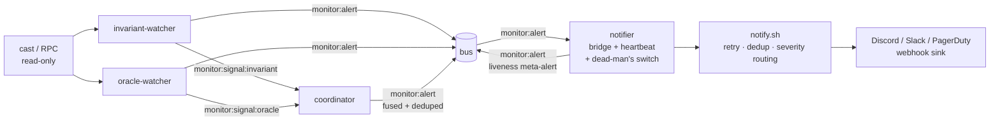

# Monitor Colony

> Part of the [Dark Factory](../) federation.

A continuous **protocol monitor**. Four cooperating agents watch a target EVM
protocol on-chain and emit reasoned, high-signal anomaly alerts on the colony bus
(`monitor:alert`); a fourth agent — the **notifier** — bridges the bus to the
configured webhook so a page is actually **delivered**, not just emitted. The
colony is **non-custodial / read-only**: every watcher only **reads** chain state
via `cast`/RPC and the notifier only sends an **outbound** notification — no agent
signs a transaction and none ever touches funds.

The hot-path verdicts are **facts** (an on-chain read + a deterministic
comparison), never an LLM opinion. Emission is gated purely on each agent's
[ADR-0001](../../doc/adr/ADR-0001-confidence-tiers.md) confidence tier as the
false-positive control: a watcher learns the protocol's normal state in `shadow`
before it is ever trusted to page.

## Agents

| Agent | Role | Output |
|-------|------|--------|
| `invariant-watcher` | Evaluates the target's protocol invariant(s) against current on-chain state; flags a violation or a thin margin-to-violation. Evaluates a single env-configured invariant, OR — when a derived watch-spec is supplied (`MONITOR_INV_SPEC`, #1086) — the WHOLE derived invariant SET | `monitor:signal:invariant` (fused), `monitor:signal:invariant:<label>` (per-invariant), `monitor:alert` (tier-gated) |
| `oracle-watcher` | Watches a price feed for deviation / staleness / out-of-bounds price | `monitor:signal:oracle`, `monitor:alert` (tier-gated) |
| `coordinator` | Fuses the watcher signals off the shared blackboard, dedups a persistent condition, decides fused severity, emits one consolidated alert | `monitor:alert` (tier-gated) |
| `notifier` | The bus→webhook **bridge** (#1092): `listen()`s for `monitor:alert` and forwards each to `scripts/notify.sh` so a page is delivered. Owns the liveness **heartbeat** + **dead-man's switch** (#1093) | webhook page (via `notify.sh`), `monitor:alert` (the dead-man's-switch meta-alert, severity `high` / kind `liveness`) |

Each agent runs as its own `agentis daemon`. The watchers post their latest
verdict to a durable blackboard memo (`monitor:signal:*`); the coordinator reads
both each tick and fuses them. The notifier consumes the consolidated
`monitor:alert` off the bus and forwards it to the configured sink.



## Confidence-tiered alerting (ADR-0001)

Every agent makes ONE `tier()` call per tick and branches once. The tier gates
**emission only** — the verdict is computed identically at every tier:

- `shadow` / `dormant` — observe + `learn()` a baseline (record the normal
  state); **no emit, no external write**.
- `propose` — emit a **draft** `monitor:alert` (low severity) for review.
- `review-gated` / `autonomous` — emit a **direct-page** `monitor:alert` (high
  severity), once the detector has proven reliable.

This is the false-positive control: a fresh watcher seeded at `shadow` learns the
protocol's normal state before it can page, and auto-promotion lifts it as its
alerts prove real over noise.

## Alert delivery — the bus→webhook bridge (#1092 / #1093 / #1094)

Emitting `monitor:alert` on the in-process bus is not the same as **delivering** a
page. The `notifier` agent closes that last-mile gap and turns the colony into a
real 24/7 pager.

- **Bridge (#1092)** — the `notifier` `listen()`s for `monitor:alert` each tick
  and forwards each alert to `scripts/notify.sh`. The alert JSON is passed to
  `notify.sh` through an **exported env var** (`MONITOR_ALERT_BODY`), never
  interpolated into the shell text, and every other dynamic value is
  `shell_escape()`d. Forwarding is gated on the notifier's ADR-0001 tier (the same
  shadow → propose → review-gated/autonomous gradient as the watchers): at
  `shadow`/`dormant` it observes only; at `propose`+ the bridge is live.
- **Heartbeat (#1093)** — when due (every `MONITOR_HEARTBEAT_INTERVAL_S`, default
  daily), the notifier sends a low-severity `heartbeat` payload through
  `notify.sh`. A missing heartbeat at the sink is itself a signal: **silence is
  meaningful**.
- **Dead-man's switch (#1093)** — if no watcher tick / no fresh `*:last_check`
  memo is observed within `MONITOR_DEADMAN_WINDOW_S` (unset / `0` ⇒ disabled), the
  notifier emits a meta-alert (`monitor:alert`, severity `high`, kind `liveness`)
  — the RPC-blind / colony-down case. This check is a memo-freshness **fact** and
  runs independent of tier (a down colony must page regardless of the bridge's
  confidence); it dedups against the last liveness signature so a persistent
  outage pages once, not every tick, and re-pages after a recovery.
- **Hardened sink (#1094)** — `notify.sh` adds, all opt-in and dash-safe:
  bounded **exponential retry/backoff** on a transient webhook failure
  (`5xx`/network; a `4xx` is not retried); **sink-side dedup** keyed on the alert
  signature with a cooldown window (`MONITOR_NOTIFY_DEDUP_COOLDOWN_S`, persisted to
  a small state file); and **severity routing** so `warn` and `high` land in
  different channels (`MONITOR_WEBHOOK_URL_WARN` / `MONITOR_WEBHOOK_URL_HIGH`, each
  falling back to `MONITOR_WEBHOOK_URL`). Unset config preserves the original
  single-webhook stdout-fallback behaviour exactly.

Read-only / non-custodial throughout: the notifier only reads the bus and sends an
outbound notification — it never signs and never touches funds.

## Derive → watch the whole invariant set (#1086)

dark-factory **derives** a target's deep invariants
([`../run-invariant-hunt.sh`](../run-invariant-hunt.sh) +
[`../auditor/agents/invariant-prover.ag`](../auditor/agents/invariant-prover.ag) +
the `../evm-harness/`). The monitor colony **watches** invariants live. `#1086`
bridges the two with [`../run-live-watch.sh`](../run-live-watch.sh): derive a
target's invariant SET **once**, emit a small static **watch-spec**, then have the
`invariant-watcher` re-check the **whole set** continuously — no re-derivation per
tick.

```
target (repo + address + RPC) ──run-live-watch.sh──► watch-spec.json ──MONITOR_INV_SPEC──► invariant-watcher (per tick)
        derive ONCE (LLM/forge)                      a static set of facts             read-only `cast` re-checks every member
```

1. **Derive once** — `run-live-watch.sh` runs the existing invariant-prover
   derivation a single time for the target (reusing `run-invariant-hunt.sh`),
   extracts the live-watchable two-sided comparisons (a view-call vs another
   view-call, or vs a literal bound), and writes a **watch-spec**: a JSON array of
   `{label, lhs_sig, rhs_sig | rhs_const, rel, margin_bp}` objects (`rel` ∈
   `le|ge|eq`). An offline `--spec-fixture <file>` path takes a hand-authored
   watch-spec **verbatim** (no LLM/forge) for the live-watchable subset.

   ```bash
   ../run-live-watch.sh \
     --repo "$PWD/target" --target Vault.sol:Vault \
     --address 0xVAULT --rpc-url https://rpc.example/x \
     --out "$PWD/watch-spec.json"
   ```

2. **Watch continuously** — point the watcher at the emitted spec and the same
   target. `MONITOR_INV_SPEC` may be the file PATH or the JSON array inline:

   ```bash
   export MONITOR_INV_SPEC="$PWD/watch-spec.json"
   export MONITOR_TARGET=0xVAULT MONITOR_RPC_URL=https://rpc.example/x
   export MONITOR_CAST="$(command -v cast)"
   # add MONITOR_INV_SPEC to exec.env_passthrough in .agentis/config, then:
   ./scripts/start-colony.sh
   ```

Each tick the watcher evaluates **every** invariant in the set with two read-only
`cast call`s, posts each member's verdict to its own `monitor:signal:invariant:<label>`
blackboard memo, and **fuses** them to the worst verdict across the set
(`violated` > `margin` > `ok`) — so one broken member pages the whole set. The
fused verdict drives the **same** tier-gated emission as the single-invariant path,
and the fused `monitor:signal:invariant` memo the `coordinator` already reads is
unchanged. With `MONITOR_INV_SPEC` **unset** the watcher's behaviour is identical
to before — the single env-configured invariant.

`run-live-watch.sh` is **read-only / non-custodial**: a watch-spec is a set of
facts to read + compare; it carries no keys and never describes a write.

## Setup

1. Copy and edit the config:
   ```bash
   cp config/colony.example.toml config/colony.toml
   ```

2. Export the watch target's environment contract (see the table below), then
   start the colony:
   ```bash
   ./scripts/start-colony.sh
   ```

3. (Optional) Wire an alert sink. Export `MONITOR_WEBHOOK_URL` (a Discord / Slack
   / PagerDuty incoming-webhook URL) **before** starting the colony and the
   `notifier` agent forwards every `monitor:alert` to it automatically — no manual
   step (#1092). Unset, the colony still runs and `notify.sh` prints each alert to
   stdout (a no-op sink). You can also drive `notify.sh` by hand for a smoke test:
   ```bash
   echo '<alert payload>' | ./scripts/notify.sh
   ```
   No secret is ever committed; the webhook URL is read from the environment.

dark-factory is a non-forge federation (`forge.type = "none"`); no forge
credentials are required.

## Environment contract

Inputs are passed via the environment (all optional). Export them before
launching, and add each to `exec.env_passthrough` in `.agentis/config` so the
sandboxed `exec sh` can read them. With no `MONITOR_CAST` / `MONITOR_RPC_URL` a
watcher reads nothing and only observes — it never raises a false alert.

| Var | Meaning | Default |
|-----|---------|---------|
| `MONITOR_CAST` | Absolute path to the `cast` binary (foundry), the read tool. | unset (observe only) |
| `MONITOR_RPC_URL` | Chain RPC endpoint `cast` reads from (read-only). | unset (observe only) |
| `MONITOR_TARGET` | Target protocol contract address (`0x...`) for the invariant. | unset |
| `MONITOR_INV_LHS_SIG` | `cast call` signature for the invariant's LHS quantity (e.g. `totalSupply()`). | unset |
| `MONITOR_INV_RHS_SIG` | Signature for the RHS quantity (e.g. `totalAssets()`); `""` ⇒ use the literal const. | unset |
| `MONITOR_INV_RHS_CONST` | Literal integer RHS bound (used when `RHS_SIG` is empty). | unset |
| `MONITOR_INV_REL` | Required relation: `le` \| `ge` \| `eq`. | `le` |
| `MONITOR_INV_MARGIN_BP` | Margin-to-violation band in basis points (0..10000). | `0` |
| `MONITOR_INV_LABEL` | Human label for the invariant (alert body). | the LHS signature |
| `MONITOR_INV_SPEC` | (#1086) A **derived watch-spec** for the whole invariant SET — an absolute PATH to the JSON file `run-live-watch.sh` emits, or the JSON array INLINE. When set, the watcher evaluates EVERY invariant in the set against live state each tick; when unset it uses the single `MONITOR_INV_*` invariant above (backward-compatible). | unset (single-invariant) |
| `MONITOR_ORACLE` | Price-feed contract address (`0x...`). | unset |
| `MONITOR_ORACLE_PRICE_SIG` | Signature returning the price. | `latestAnswer()` |
| `MONITOR_ORACLE_TS_SIG` | Signature returning the feed's last-update unix ts; `""` ⇒ skip staleness. | unset |
| `MONITOR_ORACLE_MAX_AGE` | Max feed age in seconds before STALENESS flags. | `0` (skip) |
| `MONITOR_ORACLE_DEV_BP` | Deviation band in basis points vs the last baseline. | `0` (skip) |
| `MONITOR_ORACLE_MIN` / `MONITOR_ORACLE_MAX` | Lower / upper price sanity bounds. | unset (no bound) |
| `MONITOR_ORACLE_LABEL` | Human label for the feed (alert body). | the oracle address |
| `MONITOR_WEBHOOK_URL` | Discord/Slack/PagerDuty incoming-webhook URL for `notify.sh`. **Never commit a real URL.** | unset (stdout sink) |
| `MONITOR_WEBHOOK_URL_WARN` | Channel for `warn`-severity pages (#1094 routing). | falls back to `MONITOR_WEBHOOK_URL` |
| `MONITOR_WEBHOOK_URL_HIGH` | Channel for `high`-severity pages (#1094 routing). | falls back to `MONITOR_WEBHOOK_URL` |
| `MONITOR_HEARTBEAT_INTERVAL_S` | Notifier heartbeat cadence in seconds (#1093); `0` disables. | `86400` (daily) |
| `MONITOR_DEADMAN_WINDOW_S` | Dead-man's-switch window in seconds (#1093); no fresh watcher tick within it raises a `high`/`liveness` meta-alert. | `0` (disabled) |
| `MONITOR_NOTIFY_MAX_RETRIES` | Bounded retry count on a transient webhook failure (#1094). | `3` |
| `MONITOR_NOTIFY_BACKOFF_S` | Initial retry backoff in seconds, doubled each retry (#1094). | `2` |
| `MONITOR_NOTIFY_DEDUP_COOLDOWN_S` | Sink-side dedup cooldown in seconds (#1094); `0` disables. | `0` (disabled) |
| `MONITOR_NOTIFY_STATE_DIR` | Where `notify.sh` persists last-sent signatures (#1094). | `${XDG_STATE_HOME:-$HOME/.local/state}/dark-factory-monitor` |

## Status

Experimental, lint-clean foundation. The colony scaffold + the two highest-value
watchers + the fusion coordinator + a webhook sink shipped in
[#1085](https://github.com/Replikanti/agentis-colonies/issues/1085); the
**live-watch runtime** (`run-live-watch.sh` + the `invariant-watcher`'s
`MONITOR_INV_SPEC` derived-set path) shipped in
[#1086](https://github.com/Replikanti/agentis-colonies/issues/1086); the
**alert-delivery pipeline** — the `notifier` bus→webhook bridge
([#1092](https://github.com/Replikanti/agentis-colonies/issues/1092)), the
liveness heartbeat + dead-man's switch
([#1093](https://github.com/Replikanti/agentis-colonies/issues/1093)), and the
hardened `notify.sh` (retry/backoff, sink-side dedup, severity routing,
[#1094](https://github.com/Replikanti/agentis-colonies/issues/1094)) — turns an
emitted alert into a delivered page. Follow-ups: the liquidity / governance / flow
watchers, an external dead-man's-switch cron, and a dashboard view. The colony is
**read-only** and **never** posts an alert without a configured sink — and
**never** signs or touches funds.
