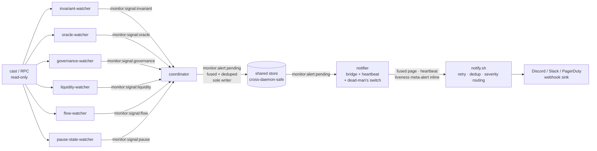

# Monitor Colony

> Part of the [Dark Factory](../) federation.

A continuous **protocol monitor**. Cooperating agents watch a target EVM
protocol on-chain and post reasoned, high-signal anomaly verdicts to a shared
blackboard (`monitor:signal:*`); the **coordinator** fuses them and writes ONE
consolidated alert to the `monitor:alert:pending` store key, and the **notifier**
reads that key and forwards the page to the configured webhook so it is actually
**delivered**, not just emitted. The colony is **non-custodial / read-only**:
every watcher only **reads** chain state via `cast`/RPC and the notifier only
sends an **outbound** notification — no agent signs a transaction and none ever
touches funds.

The hot-path verdicts are **facts** (an on-chain read + a deterministic
comparison), never an LLM opinion. Emission is gated purely on each agent's
[ADR-0001](../../doc/adr/ADR-0001-confidence-tiers.md) confidence tier as the
false-positive control: a watcher learns the protocol's normal state in `shadow`
before it is ever trusted to page.

## Proof of value

The colony's detect → deliver claim is backed by runnable artifacts (#1889):

- [`scorecard.md`](./scorecard.md) — the backtest scorecard (lead time + quiet-window
  false-positive rate), self-test row reproducible from the shipped verdict logic.
- [`backtest-self-test.sh`](./backtest-self-test.sh) — one command, no archive RPC:
  boots a local anvil, deploys a synthetic solvency break, and drives the **unmodified**
  [`backtest.sh`](./backtest.sh) to a PASS (pages at lead +1 block, 0/10 false pages).
- [`../demo-monitor.sh`](../demo-monitor.sh) — a two-layer regression guard: source-guards the
  wiring (CI-safe) and, with the toolchain present, runs the **real** `invariant-watcher.ag` +
  `coordinator.ag` + `notifier.ag` as three separate daemons over a local fixture and asserts a
  broken invariant is **delivered** to a webhook sink through the store hand-off — paged exactly
  once while it persists, and again when the fused picture changes (#1891).
- [`samples/`](./samples/) — example [`alert.json`](./samples/alert.json) /
  [`heartbeat.json`](./samples/heartbeat.json) payloads (verbatim the agents' shapes) and an
  illustrative [`report.md`](./samples/report.md) periodic summary.

## Agents

| Agent | Role | Output |
|-------|------|--------|
| `invariant-watcher` | Evaluates the target's protocol invariant(s) against current on-chain state; flags a violation or a thin margin-to-violation. Evaluates a single env-configured invariant, OR — when a derived watch-spec is supplied (`MONITOR_INV_SPEC`, #1086) — the WHOLE derived invariant SET | `monitor:signal:invariant` (fused), `monitor:signal:invariant:<label>` (per-invariant) |
| `oracle-watcher` | Watches a price feed for deviation / staleness / out-of-bounds price | `monitor:signal:oracle` |
| `governance-watcher` | Watches the governance / upgrade surface (the two EIP-1967 proxy slots — implementation + admin — plus an optional `owner()`/`admin()` view, a role-grant indicator, and a timelock-queue indicator); flags a CHANGE vs the learned baseline — the highest-value pre-exploit early-warning (#1095) | `monitor:signal:governance` |
| `liquidity-watcher` | Watches a pool / vault reserve or TVL proxy (`totalAssets()` / native balance); flags a drop beyond a learned band (sudden drain) (#1096) | `monitor:signal:liquidity` |
| `flow-watcher` | Watches net flow over a window; flags an abnormal net outflow burst vs the previous window (large outflow) (#1096) | `monitor:signal:flow` |
| `pause-state-watcher` | Watches the `paused()` / circuit-breaker boolean; flags a state transition (a protocol pausing itself is signal) (#1096) | `monitor:signal:pause` |
| `coordinator` | Fuses ALL watcher signals off the shared blackboard, dedups a persistent condition, decides fused severity, and writes ONE consolidated alert carrying the per-signal dossier — the SOLE writer of the delivery key | `monitor:alert:pending` (tier-gated) |
| `notifier` | The store→webhook **bridge** (#1092, #1891): reads `monitor:alert:pending`, dedups against the last successfully delivered payload, and forwards a new page to `scripts/notify.sh`. Owns the liveness **heartbeat** + **dead-man's switch** (#1093) | webhook page (via `notify.sh`), `notifier:last_delivered` (the dedup marker) |

Each agent runs as its own `agentis daemon`. The watchers post their latest
verdict to a durable blackboard memo (`monitor:signal:*`) — that is their only
output; the coordinator reads every signal each tick, fuses them, and writes the
consolidated alert to `monitor:alert:pending`. The notifier reads that key and
forwards a NEW alert to the configured sink.

Every hop is a **shared store** memo, never the bus: `agentis daemon` runs one
`.ag` per process and `emit()`/`listen()` are in-process only (agentis-core
#961), so a bus event never crosses the daemon boundary the shipped
`start-colony.sh` layout creates. #1891 moved the last-mile delivery hop onto the
same blackboard the watcher→coordinator hop already used. Two properties make
that safe: the coordinator is the **only** writer of `monitor:alert:pending` (no
last-writer-wins race), and the notifier dedups on the **full payload** via
`notifier:last_delivered`, advanced **only after a successful** `notify.sh`
delivery — a store read has no implicit dequeue, so a persistent condition pages
once, a failed page is retried on the next tick, and a changed alert pages again.



## Confidence-tiered alerting (ADR-0001)

Every agent makes ONE `tier()` call per tick and branches once. The tier gates
**alerting only** — the verdict is computed identically at every tier:

- `shadow` / `dormant` — observe + `learn()` a baseline (record the normal
  state); **no alert write, no external write**.
- `propose` — the coordinator writes a **draft** consolidated alert (low
  severity) to `monitor:alert:pending`; the notifier's bridge is live.
- `review-gated` / `autonomous` — the coordinator writes a **direct-page**
  consolidated alert (fused severity), once the detectors have proven reliable.

This is the false-positive control: a fresh watcher seeded at `shadow` learns the
protocol's normal state before it can page, and auto-promotion lifts it as its
alerts prove real over noise.

## Governance / upgrade + liquidity / flow / pause watchers (#1095 / #1096)

Four more read-only watchers feed the coordinator's `monitor:signal:*`
blackboard, each with the same ADR-0001 tier-gated emission as the
`invariant`/`oracle` watchers (one `tier()` call per tick, branch once; a
baseline learned via a durable memo; degrade-safe — no reader ⇒ no false flag;
every `exec sh` dynamic value `shell_escape()`d):

- **`governance-watcher` (#1095)** — the highest-value **pre-exploit
  early-warning**. The classic upgrade-attack tell is a proxy's implementation
  pointer flipping (or the admin / owner rotating) moments before a malicious
  implementation drains the protocol. The watcher reads the two canonical
  **EIP-1967** storage slots — implementation
  (`0x360894a13ba1a3210667c828492db98dca3e2076cc3735a920a3ca505d382bbc`) and admin
  (`0xb53127684a568b3173ae13b9f8a6016e243e63b6e8ee1178d6a717850b5d6103`) — via
  `cast storage`, plus an optional `owner()`/`admin()` view, a role-grant
  indicator, and a timelock-queue indicator via `cast call`, and flags a **CHANGE
  vs the learned baseline**. Verdict tokens: `impl-changed` / `admin-changed` /
  `owner-changed` (hard) / `gov-changed` (a role grant or pending timelock op,
  warn) / `ok` / `no-read`. Posts `monitor:signal:governance`.
- **`liquidity-watcher` (#1096)** — reads a pool / vault **reserve or TVL proxy**
  (`totalAssets()` or, with no view configured, the contract's native
  `cast balance`) and flags a **drop beyond a learned band** (`MONITOR_LIQ_DROP_BP`
  basis points) — a sudden drain. A rise (a deposit) is never an anomaly. Verdict:
  `drained` / `ok` / `no-read`. Posts `monitor:signal:liquidity`.
- **`flow-watcher` (#1096)** — reads the same level proxy and flags an **abnormal
  net outflow burst** over a window: a net fall since the previous reading
  exceeding `MONITOR_FLOW_OUT_BP` basis points of the held reserve (the
  flood-vs-drip distinction the absolute-level band does not make alone). Verdict:
  `outflow-burst` / `ok` / `no-read`. Posts `monitor:signal:flow`.
- **`pause-state-watcher` (#1096)** — reads the `paused()` / circuit-breaker
  boolean and flags a **state transition** vs the learned baseline. A protocol
  pausing itself usually means the team detected something wrong, often during an
  incident; a recovery is surfaced too. Verdict: `paused` (hard) / `unpaused`
  (warn) / `ok` / `no-read`. Posts `monitor:signal:pause`.

The `coordinator` fuses these new `monitor:signal:*` kinds into the consolidated
severity score, the dedup signature, **and the per-signal dossier** (the written
`monitor:alert:pending` payload carries a `"signals"` map of every watcher's
verdict) — alongside the existing `invariant` / `oracle` signals, keeping its
single-`tier()`-per-tick discipline.

## Alert delivery — the store→webhook bridge (#1092 / #1093 / #1094 / #1891)

Fusing an alert is not the same as **delivering** a page. The `notifier` agent
closes that last-mile gap and turns the colony into a real 24/7 pager.

- **Bridge (#1092, #1891)** — the `notifier` reads the `monitor:alert:pending`
  store key each tick and forwards a NEW alert to `scripts/notify.sh`. The alert
  JSON is passed to `notify.sh` through an **exported env var**
  (`MONITOR_ALERT_BODY`), never interpolated into the shell text, and every other
  dynamic value is `shell_escape()`d. Forwarding is gated on the notifier's
  ADR-0001 tier (the same shadow → propose → review-gated/autonomous gradient as
  the watchers): at `shadow`/`dormant` it observes only; at `propose`+ the bridge
  is live.
- **Delivery dedup (#1891)** — the transport is a store key, not a bus queue, so
  a read does not consume the alert. The notifier compares the pending payload
  against `notifier:last_delivered` (the last payload the sink **accepted**) and
  advances that marker **only** when `notify.sh` exits 0. Consequences, all
  intended: a persistent condition is paged exactly once; a page the sink
  rejected is retried on the next tick (which the old `listen()` dequeue could
  not do); a changed fused alert pages again. The coordinator's payload carries a
  per-write `ts`, so a genuine re-fire of an identical condition after a quiet gap
  is distinguishable from the page already delivered.
- **Heartbeat (#1093)** — when due (every `MONITOR_HEARTBEAT_INTERVAL_S`, default
  daily), the notifier sends a low-severity `heartbeat` payload through
  `notify.sh`. A missing heartbeat at the sink is itself a signal: **silence is
  meaningful**.
- **Dead-man's switch (#1093)** — if no watcher tick / no fresh `*:last_check`
  memo is observed within `MONITOR_DEADMAN_WINDOW_S` (unset / `0` ⇒ disabled), the
  notifier raises a meta-alert (severity `high`, kind `liveness`) — the RPC-blind
  / colony-down case. This check is a memo-freshness **fact** and runs independent
  of tier (a down colony must page regardless of the bridge's confidence); it
  dedups against the last liveness signature so a persistent outage pages once,
  not every tick, and re-pages after a recovery. Since #1891 the notifier
  **forwards the meta-alert inline** — it is its own producer and consumer here,
  so it needs no transport (and never writes `monitor:alert:pending`, whose sole
  writer is the coordinator). The decision, the dedup, and the payload are
  unchanged; the page simply arrives one tick sooner.
- **Hardened sink (#1094)** — `notify.sh` adds, all opt-in and dash-safe:
  bounded **exponential retry/backoff** on a transient webhook failure
  (`5xx`/network; a `4xx` is not retried); **sink-side dedup** keyed on the alert
  signature with a cooldown window (`MONITOR_NOTIFY_DEDUP_COOLDOWN_S`, persisted to
  a small state file); and **severity routing** so `warn` and `high` land in
  different channels (`MONITOR_WEBHOOK_URL_WARN` / `MONITOR_WEBHOOK_URL_HIGH`, each
  falling back to `MONITOR_WEBHOOK_URL`). Unset config preserves the original
  single-webhook stdout-fallback behaviour exactly.

Read-only / non-custodial throughout: the notifier only reads memos and sends an
outbound notification — it never signs and never touches funds.

## Derive → watch the whole invariant set (#1086)

dark-factory **derives** a target's deep invariants
([`../run-invariant-hunt.sh`](../run-invariant-hunt.sh) +
[`../auditor/agents/invariant-prover.ag`](../auditor/agents/invariant-prover.ag) +
the `../evm-harness/`). The monitor colony **watches** invariants live. `#1086`
bridges the two with [`../run-live-watch.sh`](../run-live-watch.sh): derive a
target's invariant SET **once**, emit a small static **watch-spec**, then have the
`invariant-watcher` re-check the **whole set** continuously — no re-derivation per
tick.

```
target (repo + address + RPC) ──run-live-watch.sh──► watch-spec.json ──MONITOR_INV_SPEC──► invariant-watcher (per tick)
        derive ONCE (LLM/forge)                      a static set of facts             read-only `cast` re-checks every member
```

1. **Derive once** — `run-live-watch.sh` runs the existing invariant-prover
   derivation a single time for the target (reusing `run-invariant-hunt.sh`),
   extracts the live-watchable two-sided comparisons (a view-call vs another
   view-call, or vs a literal bound), and writes a **watch-spec**: a JSON array of
   `{label, lhs_sig, rhs_sig | rhs_const, rel, margin_bp}` objects (`rel` ∈
   `le|ge|eq`). An offline `--spec-fixture <file>` path takes a hand-authored
   watch-spec **verbatim** (no LLM/forge) for the live-watchable subset.

   ```bash
   ../run-live-watch.sh \
     --repo "$PWD/target" --target Vault.sol:Vault \
     --address 0xVAULT --rpc-url https://rpc.example/x \
     --out "$PWD/watch-spec.json"
   ```

2. **Watch continuously** — point the watcher at the emitted spec and the same
   target. `MONITOR_INV_SPEC` may be the file PATH or the JSON array inline:

   ```bash
   export MONITOR_INV_SPEC="$PWD/watch-spec.json"
   export MONITOR_TARGET=0xVAULT MONITOR_RPC_URL=https://rpc.example/x
   export MONITOR_CAST="$(command -v cast)"
   # add MONITOR_INV_SPEC to exec.env_passthrough in .agentis/config, then:
   ./scripts/start-colony.sh
   ```

Each tick the watcher evaluates **every** invariant in the set with two read-only
`cast call`s, posts each member's verdict to its own `monitor:signal:invariant:<label>`
blackboard memo, and **fuses** them to the worst verdict across the set
(`violated` > `margin` > `ok`) — so one broken member pages the whole set. The
fused verdict drives the **same** tier-gated emission as the single-invariant path,
and the fused `monitor:signal:invariant` memo the `coordinator` already reads is
unchanged. With `MONITOR_INV_SPEC` **unset** the watcher's behaviour is identical
to before — the single env-configured invariant.

`run-live-watch.sh` is **read-only / non-custodial**: a watch-spec is a set of
facts to read + compare; it carries no keys and never describes a write.

## Read robustness — RPC failover + consensus (#1098)

A 24/7 monitor can't rely on a single RPC endpoint, and a flaky node must not be
confused with an invariant verdict. All chain reads route through **one** wrapper —
[`scripts/cast-read.sh`](scripts/cast-read.sh) — so the failover logic lives in a
single place instead of being copy-pasted across the six watchers' read functions
(`read_uint` / `read_view` / `read_slot` / `read_balance`).

- **Failover** — `MONITOR_RPC_URLS` is a comma-separated endpoint list, tried **in
  order** on failure; it falls back to the single `MONITOR_RPC_URL`. Kill the
  primary and reads transparently fail over to the next.
- **Read consensus** — `MONITOR_RPC_CONSENSUS` (≥2, or `1` as shorthand for 2)
  requires that many endpoints to **agree** on the value before it is returned, so a
  single lying / lagging node can't drive a false `violated`. On disagreement the
  read returns the **no-read** sentinel.
- **No-read vs verdict** — when **all** endpoints fail (or consensus can't be
  reached) the wrapper returns an empty value + non-zero exit, which every watcher
  already treats as `no-read` (observe, never a false flag). This is **distinct**
  from a real verdict and feeds the dead-man's-switch / blind path (#1093).

`cast-read.sh` is **read-only**: only `call` / `storage` / `balance` / `code` are
permitted; any write subcommand (`send`, `mktx`, `wallet`, …) is rejected. With
`MONITOR_RPC_URLS` / `MONITOR_RPC_CONSENSUS` unset a single configured endpoint
behaves exactly as before.

```bash
export MONITOR_RPC_URLS="https://rpc-a/x,https://rpc-b/y,https://rpc-c/z"
export MONITOR_RPC_CONSENSUS=2   # require 2 of the 3 to agree before flagging
# (MONITOR_CAST_READ defaults to this colony's scripts/cast-read.sh)
```

## Watch-spec drift detection (#1097)

A static watch-spec is **derived once**. When the target **upgrades** (new
implementation, changed params, new selectors) the spec silently stops matching the
deployed contract — the monitor keeps "watching" stale invariants and goes blind
without saying so. Two pieces close that gap:

- **Fingerprint at derivation** — `run-live-watch.sh` records a fingerprint of the
  deployed target next to the spec at `<spec>.fingerprint.json`: the deployed-code
  hash (`cast code`) and the EIP-1967 implementation slot value (`cast storage`).
- **Drift check** — [`scripts/check-drift.sh`](scripts/check-drift.sh) (a periodic
  job / cron) re-reads that fingerprint through `cast-read.sh` (so the failover +
  consensus apply) and pages through `notify.sh` (kind `drift`, severity **high**,
  verdict `spec-stale`) when the deployed code / impl no longer matches — the
  monitor **says** it has gone blind on a stale spec. No drift ⇒ no alert; a blind
  RPC re-read ⇒ quiet (never a false drift); an empty captured fingerprint ⇒ quiet.

```bash
# periodically (cron): flag drift + page if the target upgraded
MONITOR_INV_SPEC="$PWD/watch-spec.json" ./scripts/check-drift.sh
```

**Re-derivation hook** — on drift, re-run the derivation to produce a fresh spec +
fingerprint and hot-swap `MONITOR_INV_SPEC` (operator-gated — re-derivation needs the
LLM/forge path): `../run-live-watch.sh --rederive --repo … --target … --address …
--rpc-url …`. Both scripts are **read-only / non-custodial** throughout (`cast
code` / `cast storage` only).

## Setup

1. Copy and edit the config:
   ```bash
   cp config/colony.example.toml config/colony.toml
   ```

2. Export the watch target's environment contract (see the table below), then
   start the colony:
   ```bash
   ./scripts/start-colony.sh
   ```

3. (Optional) Wire an alert sink. Export `MONITOR_WEBHOOK_URL` (a Discord / Slack
   / PagerDuty incoming-webhook URL) **before** starting the colony and the
   `notifier` agent forwards every consolidated alert to it automatically — no
   manual step (#1092). Unset, the colony still runs and `notify.sh` prints each alert to
   stdout (a no-op sink). You can also drive `notify.sh` by hand for a smoke test:
   ```bash
   echo '<alert payload>' | ./scripts/notify.sh
   ```
   No secret is ever committed; the webhook URL is read from the environment.

dark-factory is a non-forge federation (`forge.type = "none"`); no forge
credentials are required.

## Environment contract

Inputs are passed via the environment (all optional). Export them before
launching, and add each to `exec.env_passthrough` in `.agentis/config` so the
sandboxed `exec sh` can read them. With no `MONITOR_CAST` / `MONITOR_RPC_URL` a
watcher reads nothing and only observes — it never raises a false alert.

| Var | Meaning | Default |
|-----|---------|---------|
| `MONITOR_CAST` | Absolute path to the `cast` binary (foundry), the read tool. | unset (observe only) |
| `MONITOR_RPC_URL` | Chain RPC endpoint `cast` reads from (read-only). | unset (observe only) |
| `MONITOR_RPC_URLS` | (#1098) Comma-separated list of RPC endpoints, tried IN ORDER on failure (the failover list). | falls back to `MONITOR_RPC_URL` |
| `MONITOR_RPC_CONSENSUS` | (#1098) Read-consensus quorum: `""`/`0`/`1` ⇒ first-success failover; `1` is shorthand for quorum 2; `N>=2` requires N endpoints to agree before a value is returned (a single lying / lagging node can't drive a false `violated`). | `""` (no consensus) |
| `MONITOR_CAST_READ` | (#1098) Path to `scripts/cast-read.sh`, the ONE centralized read wrapper owning the failover + consensus. `""` ⇒ watchers read `cast` directly (legacy single-endpoint behaviour). | the colony's `scripts/cast-read.sh` |
| `MONITOR_TARGET` | Target protocol contract address (`0x...`) for the invariant. | unset |
| `MONITOR_INV_LHS_SIG` | `cast call` signature for the invariant's LHS quantity (e.g. `totalSupply()`). | unset |
| `MONITOR_INV_RHS_SIG` | Signature for the RHS quantity (e.g. `totalAssets()`); `""` ⇒ use the literal const. | unset |
| `MONITOR_INV_RHS_CONST` | Literal integer RHS bound (used when `RHS_SIG` is empty). | unset |
| `MONITOR_INV_REL` | Required relation: `le` \| `ge` \| `eq`. | `le` |
| `MONITOR_INV_MARGIN_BP` | Margin-to-violation band in basis points (0..10000). | `0` |
| `MONITOR_INV_LABEL` | Human label for the invariant (alert body). | the LHS signature |
| `MONITOR_INV_SPEC` | (#1086) A **derived watch-spec** for the whole invariant SET — an absolute PATH to the JSON file `run-live-watch.sh` emits, or the JSON array INLINE. When set, the watcher evaluates EVERY invariant in the set against live state each tick; when unset it uses the single `MONITOR_INV_*` invariant above (backward-compatible). | unset (single-invariant) |
| `MONITOR_ORACLE` | Price-feed contract address (`0x...`). | unset |
| `MONITOR_ORACLE_PRICE_SIG` | Signature returning the price. | `latestAnswer()` |
| `MONITOR_ORACLE_TS_SIG` | Signature returning the feed's last-update unix ts; `""` ⇒ skip staleness. | unset |
| `MONITOR_ORACLE_MAX_AGE` | Max feed age in seconds before STALENESS flags. | `0` (skip) |
| `MONITOR_ORACLE_DEV_BP` | Deviation band in basis points vs the last baseline. | `0` (skip) |
| `MONITOR_ORACLE_MIN` / `MONITOR_ORACLE_MAX` | Lower / upper price sanity bounds. | unset (no bound) |
| `MONITOR_ORACLE_LABEL` | Human label for the feed (alert body). | the oracle address |
| `MONITOR_GOV_TARGET` | (#1095) Governed proxy address (`0x...`) for the governance watch. | falls back to `MONITOR_TARGET` |
| `MONITOR_GOV_OWNER_SIG` | (#1095) `cast call` signature returning the owner/admin address (e.g. `owner()` / `admin()`); `""` ⇒ skip the owner check (the two EIP-1967 proxy slots are always watched). | unset (slots only) |
| `MONITOR_GOV_ROLE_SIG` | (#1095) `cast call` signature returning a role-grant indicator (e.g. a member count for a fixed role); `""` ⇒ skip. | unset (skip) |
| `MONITOR_GOV_TIMELOCK_SIG` | (#1095) `cast call` signature returning a timelock-queue indicator (queued-op count / pending-op id); `""` ⇒ skip. | unset (skip) |
| `MONITOR_GOV_LABEL` | (#1095) Human label for the governed target (alert body). | the target address |
| `MONITOR_LIQ_TARGET` | (#1096) Pool / vault address (`0x...`) for the liquidity watch. | falls back to `MONITOR_TARGET` |
| `MONITOR_LIQ_SIG` | (#1096) `cast call` signature for the reserve / TVL proxy (e.g. `totalAssets()`); `""` ⇒ native `cast balance`. | unset (native balance) |
| `MONITOR_LIQ_DROP_BP` | (#1096) Drop band in basis points (0..10000); a fall past it flags a drain. | `0` (any drop) |
| `MONITOR_LIQ_LABEL` | (#1096) Human label for the pool / vault (alert body). | the target address |
| `MONITOR_FLOW_TARGET` | (#1096) Watched address (`0x...`) for the flow watch. | falls back to `MONITOR_TARGET` |
| `MONITOR_FLOW_SIG` | (#1096) `cast call` signature for the level proxy (e.g. `totalAssets()`); `""` ⇒ native `cast balance`. | unset (native balance) |
| `MONITOR_FLOW_OUT_BP` | (#1096) Per-window outflow band in basis points (0..10000); a net fall past it flags a burst. | `0` (any net outflow) |
| `MONITOR_FLOW_LABEL` | (#1096) Human label for the contract (alert body). | the target address |
| `MONITOR_PAUSE_TARGET` | (#1096) Watched address (`0x...`) for the pause-state watch. | falls back to `MONITOR_TARGET` |
| `MONITOR_PAUSE_SIG` | (#1096) `cast call` signature returning the pause / circuit-breaker boolean. | `paused()` |
| `MONITOR_PAUSE_LABEL` | (#1096) Human label for the contract (alert body). | the target address |
| `MONITOR_WEBHOOK_URL` | Discord/Slack/PagerDuty incoming-webhook URL for `notify.sh`. **Never commit a real URL.** | unset (stdout sink) |
| `MONITOR_WEBHOOK_URL_WARN` | Channel for `warn`-severity pages (#1094 routing). | falls back to `MONITOR_WEBHOOK_URL` |
| `MONITOR_WEBHOOK_URL_HIGH` | Channel for `high`-severity pages (#1094 routing). | falls back to `MONITOR_WEBHOOK_URL` |
| `MONITOR_HEARTBEAT_INTERVAL_S` | Notifier heartbeat cadence in seconds (#1093); `0` disables. | `86400` (daily) |
| `MONITOR_DEADMAN_WINDOW_S` | Dead-man's-switch window in seconds (#1093); no fresh watcher tick within it raises a `high`/`liveness` meta-alert. | `0` (disabled) |
| `MONITOR_NOTIFY_MAX_RETRIES` | Bounded retry count on a transient webhook failure (#1094). | `3` |
| `MONITOR_NOTIFY_BACKOFF_S` | Initial retry backoff in seconds, doubled each retry (#1094). | `2` |
| `MONITOR_NOTIFY_DEDUP_COOLDOWN_S` | Sink-side dedup cooldown in seconds (#1094); `0` disables. | `0` (disabled) |
| `MONITOR_NOTIFY_STATE_DIR` | Where `notify.sh` persists last-sent signatures (#1094). | `${XDG_STATE_HOME:-$HOME/.local/state}/dark-factory-monitor` |

## Status

Experimental, lint-clean foundation. The colony scaffold + the two highest-value
watchers + the fusion coordinator + a webhook sink shipped in
[#1085](https://github.com/Replikanti/agentis-colonies/issues/1085); the
**live-watch runtime** (`run-live-watch.sh` + the `invariant-watcher`'s
`MONITOR_INV_SPEC` derived-set path) shipped in
[#1086](https://github.com/Replikanti/agentis-colonies/issues/1086); the
**alert-delivery pipeline** — the `notifier` store→webhook bridge
([#1092](https://github.com/Replikanti/agentis-colonies/issues/1092),
[#1891](https://github.com/Replikanti/agentis-colonies/issues/1891)), the
liveness heartbeat + dead-man's switch
([#1093](https://github.com/Replikanti/agentis-colonies/issues/1093)), and the
hardened `notify.sh` (retry/backoff, sink-side dedup, severity routing,
[#1094](https://github.com/Replikanti/agentis-colonies/issues/1094)) — turns an
emitted alert into a delivered page. The **governance / upgrade watcher**
([#1095](https://github.com/Replikanti/agentis-colonies/issues/1095)) and the
**liquidity / flow / pause-state watchers**
([#1096](https://github.com/Replikanti/agentis-colonies/issues/1096)) extend the
fused signal set with the highest-value pre-exploit early-warnings. **Read
robustness** — RPC failover + read consensus via the centralized `cast-read.sh`
wrapper ([#1098](https://github.com/Replikanti/agentis-colonies/issues/1098)) — and
the **watch-spec drift detector** — a deployed-target fingerprint in the spec +
`check-drift.sh` ([#1097](https://github.com/Replikanti/agentis-colonies/issues/1097))
— keep a 24/7 watch from silently relying on one flaky node or watching a spec that
the target has upgraded away from. Follow-ups: an external dead-man's-switch cron and
a dashboard view. The colony is **read-only** and **never** posts an alert without a
configured sink — and **never** signs or touches funds.
