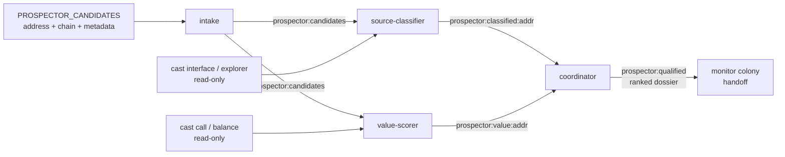

# Prospector Colony

> Part of the [Dark Factory](../) federation.

A **monitoring-target qualifier**. Four cooperating agents take a list of
candidate EVM protocols and decide which ones are worth standing up the
[`monitor`](../monitor/) colony on — and why. The colony is **non-custodial /
read-only**: every agent only **reads** public source / ABI and on-chain state
via `cast` / a verified-source explorer — it never signs a transaction and never
touches funds.

The qualification verdict is a **fact** (a source/ABI read + a read-only
on-chain value read + a deterministic comparison), never an LLM opinion. A
candidate **qualifies** as a monitoring target only when all three hard gates
hold:

1. **verified-source** — the contract exposes a real, readable source / ABI
   surface;
2. **DeFi value-invariants** — that surface matches a known value-invariant
   family (lending / vault-4626 / AMM / stablecoin / perps / staking / bridge);
3. **value-floor** — its read-only on-chain value clears a configured floor.

The handoff to the `monitor` colony is the per-target **dossier**: for a
qualifying target it names the value-invariant family and the **suggested
invariant to watch** (phrased in the `monitor`'s `MONITOR_INV_*` terms), so an
operator can stand up the monitor on exactly the right property.

## Agents

| Agent | Role | Output |
|-------|------|--------|
| `intake` | Ingests the candidate protocol list (`PROSPECTOR_CANDIDATES`, `<address>\|<chain>[\|<metadata>]` per line) onto the blackboard; validates + dedups each candidate | `prospector:candidates`, `prospector:intake` (tier-gated) |
| `source-classifier` | Reads each candidate's verified source / ABI surface and classifies whether it exposes a DeFi value-invariant family (the monitorability gate) | `prospector:classified:<addr>`, `prospector:classified` (tier-gated) |
| `value-scorer` | Reads a read-only on-chain value proxy (balance / TVL via `cast call`) for each candidate and decides whether it clears the value floor | `prospector:value:<addr>`, `prospector:value` (tier-gated) |
| `coordinator` | Fuses the three hard gates into a qualification verdict and writes the per-target dossier + qualifying index (the monitor handoff). Also annotates each dossier with the active **bounty** reward + **in-scope commit** joined from `PROSPECTOR_BOUNTY_META` ([#1459](https://github.com/Replikanti/agentis-colonies/issues/1459)) — informational only, never gates | `prospector:qualified:<addr>`, `prospector:qualified` (tier-gated) |

Each agent runs as its own `agentis daemon`. The agents coordinate via durable
blackboard memos (the `prospector:*` namespace); the coordinator reads the
per-candidate verdicts the classifier and value-scorer posted and fuses them.



## Confidence-tiered qualification (ADR-0001)

Every agent makes ONE `tier()` call per tick and branches once. The tier gates
**publication only** — the verdict is computed identically at every tier:

- `shadow` / `dormant` — score only: classify / score + `learn()` a baseline and
  write the per-target dossier; **no publish on the bus**.
- `propose` — emit a **draft** shortlist on the bus for review.
- `review-gated` / `autonomous` — publish the **ranked dossier** index directly,
  once the qualifier has proven reliable.

This is the false-positive control: a fresh agent seeded at `shadow` learns the
candidate set's normal shape before its shortlist is ever published, and
auto-promotion lifts it as its verdicts prove out.

## Hand off to the `monitor` colony

A qualifying target's dossier (`prospector:qualified:<addr>`) carries the matched
value-invariant family and a **suggested invariant to watch**, mapped to the
`monitor` colony's invariant contract. For example, a `vault-4626` target's
dossier suggests `totalAssets() ge totalSupply() (share solvency)` — which an
operator wires into the monitor as:

```bash
# from the prospector dossier for a qualifying vault-4626 target:
export MONITOR_TARGET=0xVAULT
export MONITOR_INV_LHS_SIG="totalAssets()"
export MONITOR_INV_RHS_SIG="totalSupply()"
export MONITOR_INV_REL="ge"
export MONITOR_CAST="$(command -v cast)" MONITOR_RPC_URL=https://rpc.example/x
../monitor/scripts/start-colony.sh
```

The prospector decides **which** targets and **which** property; the
[`monitor`](../monitor/README.md) colony does the continuous watching, and the
[`monitor` live-watch runtime](../monitor/README.md) can derive the full
invariant set for the chosen target.

## Rank qualified targets by bounty → audit queue ([#1459](https://github.com/Replikanti/agentis-colonies/issues/1459))

Clearing the value floor is not the same as *having the biggest active bounty*.
Expected earnings = `P(finding) × bounty size × P(novel) × P(in-scope)`, and among
already-qualified targets the **bounty size** is the dominant lever. So the operator's
finite manual-review time should flow to the biggest active bounties first.

The operator supplies `PROSPECTOR_BOUNTY_META` — public program-page data, pasted in
(read-only, **no egress**; the colony never fetches it) — as `<address>|<reward_usd>|<in_scope_commit>`
lines. The coordinator joins it (case-insensitively) onto each dossier, adding a `bounty`
reward + the `commit` the bounty covers. The bounty is **purely for ordering**: the three
hard gates stay the sole floor, and a qualified target with no bounty metadata still lists
(ranked last).

[`prospector-queue.sh`](../prospector-queue.sh) turns the qualified, bounty-annotated
dossiers into an **audit queue ranked by expected payout** in the exact format
[`run-batch.sh`](../run-batch.sh) consumes (`score<TAB>key<TAB>url<TAB>title<TAB>scope_hint`,
highest first). The `scope_hint` carries `addr:<address>` (run-batch's autoharness resolver
keys on it) + `commit:<in-scope-commit>` (audit exactly the version the bounty covers):

```bash
export PROSPECTOR_BOUNTY_META="0xVAULT|2250000|v1.2.0@0xDEPLOY
0xPOOL|900000|abc1234"
# (…run the colony so the coordinator writes the bounty-annotated dossiers…)
../prospector-queue.sh                       # live: reads the prospector:qualified blackboard
# -> ${DARK_FACTORY_DIR:-$HOME/.dark-factory}/prospector.queue (highest-bounty target first)
../run-batch.sh --queue "${DARK_FACTORY_DIR:-$HOME/.dark-factory}/prospector.queue"
```

Submission stays **human-gated**: a queued target is a lead a human (or `run-batch.sh`)
triages; nothing is ever auto-posted to a platform.

## Setup

1. Copy and edit the config:
   ```bash
   cp config/colony.example.toml config/colony.toml
   ```

2. Export the candidate list + the read tools (see the env contract below), then
   start the colony:
   ```bash
   export PROSPECTOR_CANDIDATES="0xVAULT|1|some vault
   0xPOOL|1|some pool"
   export PROSPECTOR_CAST="$(command -v cast)" PROSPECTOR_RPC_URL=https://rpc.example/x
   export PROSPECTOR_VALUE_SIG="totalAssets()" PROSPECTOR_VALUE_FLOOR=1000000000000000000000
   export PROSPECTOR_ABI_CMD='cast interface --rpc-url "$PROSPECTOR_RPC_URL" "$PROSPECTOR_ADDR" 2>/dev/null'
   ./scripts/start-colony.sh
   ```

3. Add each `PROSPECTOR_*` var (plus `PROSPECTOR_ADDR` / `PROSPECTOR_CHAIN`, which
   `source-classifier` exports into its reader) to `exec.env_passthrough` in
   `.agentis/config` so the sandboxed `exec sh` readers can see them. With no
   reader configured, a candidate classifies `no-read` and is never qualified.

dark-factory is a non-forge federation (`forge.type = "none"`); no forge
credentials are required.

## Environment contract

Inputs are passed via the environment (all optional). Export them before
launching, and add each to `exec.env_passthrough` in `.agentis/config` so the
sandboxed `exec sh` readers can read them. With no reader configured a candidate
classifies `no-read` and is never falsely qualified.

| Var | Meaning | Default |
|-----|---------|---------|
| `PROSPECTOR_CANDIDATES` | Newline-joined `<address>\|<chain>[\|<metadata>]` list of candidate protocols. address = `0x` + 40 hex; chain = EVM chain id; metadata optional. | unset (no candidates) |
| `PROSPECTOR_ABI_CMD` | Reader command template that, given a candidate's address + chain (exported as `PROSPECTOR_ADDR` / `PROSPECTOR_CHAIN`, never interpolated), prints the verified function-signature surface, one signature per line (e.g. `cast interface`, or a keyless Sourcify ABI fetch). | unset (observe only) |
| `PROSPECTOR_CAST` | Absolute path to the `cast` binary (foundry), the value-read tool. | unset (observe only) |
| `PROSPECTOR_RPC_URL` | Chain RPC endpoint `cast` reads from (read-only). | unset (observe only) |
| `PROSPECTOR_VALUE_SIG` | `cast call` signature returning the value proxy (e.g. `totalAssets()`); `""` ⇒ use the contract's native balance (`cast balance`). | unset (native balance) |
| `PROSPECTOR_VALUE_FLOOR` | Minimum value (decimal integer, in the read's own units) a candidate must hold to clear the floor. | `0` (any non-zero read clears) |
| `PROSPECTOR_BOUNTY_META` | OPTIONAL newline-joined `<address>\|<reward_usd>\|<in_scope_commit>` active-bounty list ([#1459](https://github.com/Replikanti/agentis-colonies/issues/1459)). `address` = join key (case-insensitive); `reward_usd` = program's max reward, decimal USD integer; `in_scope_commit` = the commit/deployment the bounty covers. PUBLIC program-page data the operator supplies out-of-band — **read-only, no egress**. Annotates each dossier; **never** gates qualification. | unset (no bounty dimension) |

## Status

Experimental, lint-clean foundation. This colony ships the scaffold
(`prospector/{agents,config,scripts,README.md}`, `[forge] type = "none"` per
ADR-0003), the four agents, and the confidence-tiered qualification pipeline in
[#871](https://github.com/Replikanti/agentis-colonies/issues/871). Follow-ups
(out of scope here): off-chain qualification signals (web-research scoring), and
freshness via deploy-time indexing. The colony is **read-only**, **never** signs
or touches funds, and uses **only** `cast call` / `cast balance` (never
`cast send` / a key / a write-RPC).
