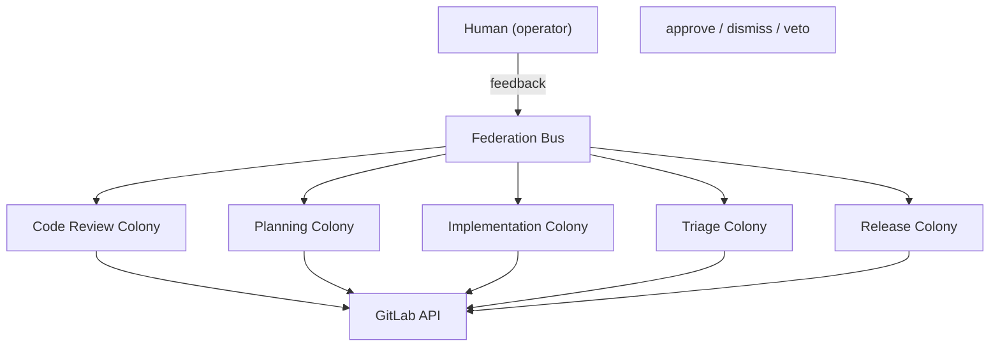

# Dev Apprenticeship

A federation of 21 agents across 5 colonies that learns your development workflow by observing how you work on GitLab. It starts silent, watches you triage issues, review code, plan work, write code, and ship releases, then gradually takes over the mechanical parts.

## Quick Start

```bash
# Clone
git clone https://github.com/Replikanti/agentis-colonies.git
cd agentis-colonies/dev-apprenticeship

# Install (interactive: checks prerequisites, configures GitLab, seeds agents)
./install.sh

# Start all 5 colonies
./start-federation.sh
```

The install script will:
1. Check that `agentis`, `claude`, and `python3` are installed
2. Create `colony.toml` configs for all 5 colonies from the example templates
3. Write your GitLab URL, project path, and API token into every config
4. Seed all 21 agents at your chosen confidence level (default: 0.5, observe-only)

After install, agents run as background daemons polling GitLab every 60 seconds.

### What you need

- [Agentis](https://github.com/Replikanti/agentis) runtime >= v1.1.3
- [Claude CLI](https://claude.ai/download) (LLM backend)
- GitLab instance with API access (personal access token with `api` scope)
- Python 3 (used by config parsing and GitLab API scripts)

### Starting and stopping

```bash
# Start everything
./start-federation.sh

# Start a single colony
./triage/scripts/start-colony.sh

# Monitor
agentis colony status

# Stop everything
agentis daemon stop --all
```

## Colonies

| Colony | Agents | What it learns | Status |
|--------|--------|---------------|--------|
| [triage](./triage/) | 4 | Issue creation, labeling, prioritization, routing | Beta |
| [code-review](./code-review/) | 5 | Style, logic, security, test coverage review, approval decisions | Beta |
| [planning](./planning/) | 4 | Scope estimation, risk assessment, task decomposition, plan review | Beta |
| [implementation](./implementation/) | 4 | Code generation, test writing, refactoring, commit conventions | Beta |
| [release](./release/) | 4 | Pre-release checks, ship decisions, changelogs, versioning | Beta |

## Why Colonies, Not Individual Agents?

A colony is fundamentally different from a bag of standalone agents doing separate jobs. Here is why the colony model matters:

**Shared context.** Agents within a colony communicate via `emit`/`listen` over the colony bus. When the style-reviewer flags a naming issue, the logic-reviewer already knows and won't produce a conflicting suggestion. Standalone agents would each operate in isolation, often contradicting each other.

**Specialization with emergent behavior.** Each agent is an expert in its narrow domain, but the colony as a whole solves problems none of them could handle alone. A code review isn't just five independent checks, it's a coordinated assessment where findings from one reviewer inform the others.

**Shared evolution.** Agents in a colony share evolutionary pressure. When the colony succeeds (the human approves its output), all agents improve together. When it fails, the fitness signal propagates to every agent, not just the one that made the visible mistake.

**Economic efficiency.** Agents share a Cognitive Budget (CB) pool. Resources flow to where they're most needed: a complex MR sends more budget to the logic-reviewer, a routine rename sends more to the style-reviewer. Standalone agents would each burn their fixed budget regardless of what the task actually needs.

**Resilience.** When one agent degrades or fails, the others continue and compensate. The colony adapts its behavior rather than producing incomplete output.

**Colony-level governance.** The operator sets rules, budgets, and autonomy thresholds for the entire colony, not for each agent individually. This makes the system manageable as the number of agents grows.

Colonies form a natural multi-agent team that is more robust and efficient than the same number of standalone agents.

## How It Works



## Autonomy Gradient

Every agent starts in **observe** mode, watching the human work, building confidence from accumulated experience. As confidence grows, autonomy increases:

| Confidence | Mode | Behavior |
|------------|------|----------|
| < 0.6 | Observe / Suggest | Agent watches and may suggest, human decides |
| < 0.85 | Draft | Agent drafts output for human review |
| >= 0.85 | Autonomous | Agent acts on its own, human can veto |

This gradient applies at every level: individual agents gain autonomy within their colony, colonies gain autonomy within the federation, and the federation gains autonomy within the broader Agentis ecosystem. Confidence grows with correct predictions and decays on stale knowledge.

## Knowledge Portability

Knowledge entries are tagged by scope:

- `personal`: developer preferences, quality bar, review criteria. Portable across projects.
- `project:<name>`: codebase-specific patterns, file coupling, false positive patterns. Stays with the project.
- `team:<name>`: shared across team members via federation. (Future)

When onboarding a new project, colonies carry over `personal` knowledge and start fresh on `project:*`. They already know how you work, they just need to learn the codebase.

## Extension Points

The following colony bus events are emitted for external consumption. They have no internal listener by design, as they represent the human-facing output of the confidence gradient. Build your own agents, webhooks, or dashboards to consume them.

| Event | Emitter | When |
|-------|---------|------|
| `triage:label_suggestion` | labeler.ag | Confidence 0.6-0.84: label suggestion for human review |
| `triage:priority_suggestion` | prioritizer.ag | Confidence 0.6-0.84: priority suggestion for human review |
| `review:decision_suggestion` | approval_decider.ag | Confidence 0.6-0.84: approve/reject suggestion for human |
| `review:escalation` | approval_decider.ag | Confidence >= 0.85: MR requires human attention (edge case) |
| `planning:draft_plan` | plan_reviewer.ag | Confidence 0.6-0.84: assembled plan for human review |
| `release:version_bumped` | version_bumper.ag | >= 0.85: after tag/release creation; 0.6-0.84: version bump suggestion |

All other events in the federation have internal consumers. The full wiring diagram:

```
triage:new_issue       -> router, prioritizer, labeler
triage:route_suggestion -> code_writer (cross-colony)
implementation:code_draft -> test_writer, refactorer, commit_composer
implementation:test_draft -> commit_composer
implementation:refactor_suggestions -> commit_composer
implementation:mr_ready -> release_checker, approval_decider (cross-colony)
review:style_findings  -> approval_decider
review:logic_findings  -> approval_decider
review:security_findings -> approval_decider
review:test_findings   -> approval_decider
planning:scope_estimate -> plan_reviewer
planning:risks         -> plan_reviewer
planning:breakdown     -> plan_reviewer
release:check_result   -> ship_decider
release:ship_decision  -> changelog_writer, version_bumper
release:changelog_draft -> version_bumper
```

## Confidence and Autonomy

Every agent starts in **observe-only** mode. A brand new federation will look silent until you seed confidence. Nothing is broken, agents are just watching.

The install script handles seeding automatically. To adjust individual agents later:

```bash
# Check current confidence
agentis memo get labeler:confidence

# Promote an agent to suggest mode
agentis memo set labeler:confidence 0.6

# Promote an agent to full autonomy
agentis memo set labeler:confidence 0.85
```

### Recommended ramp

1. **Week 1-2**: All agents at `0.5` (observe). Agents watch your GitLab activity, learn patterns, build knowledge. No visible output.
2. **Week 3+**: Promote to `0.6` (suggest). Agents emit suggestions to the colony bus. Review their output in the logs.
3. **When ready**: Promote individual agents to `0.85` (autonomous). Agents act on their own: post review comments, assign issues, create branches, open MRs. You can always veto.

### All confidence keys

| Colony | Keys |
|--------|------|
| triage | `router:confidence`, `prioritizer:confidence`, `labeler:confidence`, `issue_creator:confidence` |
| code-review | `logic_reviewer:confidence`, `style_reviewer:confidence`, `security_reviewer:confidence`, `test_reviewer:confidence`, `approval_decider:confidence` |
| planning | `scope_estimator:confidence`, `risk_assessor:confidence`, `task_decomposer:confidence`, `plan_reviewer:confidence` |
| implementation | `code_writer:confidence`, `test_writer:confidence`, `refactorer:confidence`, `commit_composer:confidence` |
| release | `ship_decider:confidence`, `changelog_writer:confidence`, `version_bumper:confidence`, `release_checker:confidence` |

## Monitoring and Troubleshooting

```bash
# Federation status
agentis colony status

# Watch a specific agent's log
tail -f .agentis/logs/logic_reviewer.log

# Inspect what the colony has learned
agentis knowledge list

# Export portable knowledge (carry to another project)
agentis knowledge export --tags personal > my-preferences.json

# Import on a new project
agentis knowledge import my-preferences.json --merge
```

### Common issues

**Agents are silent**: Check that confidence is seeded (`agentis memo get <agent>:confidence`). At 0.0, agents observe but produce no output.

**GitLab poll failed**: Verify your token has `api` scope and the project path is correct in `colony.toml`. Test with: `curl -H "PRIVATE-TOKEN: <token>" "https://gitlab.example.com/api/v4/projects/<url-encoded-project>/issues"`

**LLM errors**: Make sure `llm.backend = cli` and `llm.command = claude` are set in `.agentis/config`. The Claude CLI must be authenticated.
