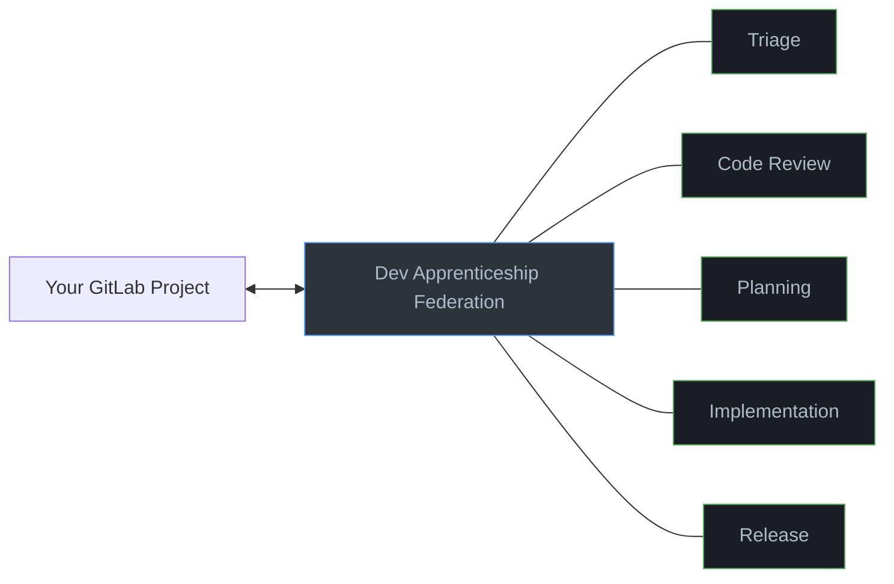
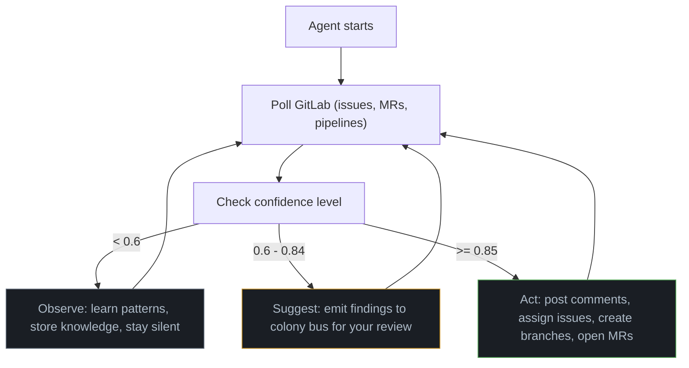
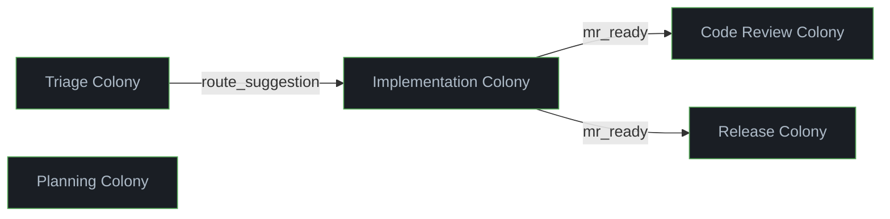

# Dev Apprenticeship

  

A federation of 21 agents that learns how you work by watching your GitLab activity. It observes how you triage issues, review merge requests, plan features, write code, and ship releases. Over time it takes over the mechanical parts, while you keep control over the decisions that matter.

The federation starts completely silent. Agents only watch. As they build confidence from your patterns, you progressively unlock autonomy: first suggestions, then full automation. You can always veto.



## What you need

- [Agentis](https://github.com/Replikanti/agentis) runtime **>= v1.1.3**
- [Claude CLI](https://claude.ai/download) (LLM backend, must be authenticated)
- GitLab instance with API access (personal access token with `api` scope)
- Python 3 and git

## Installation

```bash
git clone https://github.com/Replikanti/agentis-colonies.git
cd agentis-colonies/dev-apprenticeship
./install.sh
```

The install script walks you through setup interactively:

1. Checks that `agentis` (>= v1.1.3), `claude`, `python3`, and `git` are installed
2. Creates `colony.toml` configs for all 5 colonies from the example templates
3. Asks for your GitLab URL, project path, and API token and writes them to every config
4. Seeds all 21 agents at your chosen confidence level (default: 0.5, observe-only)

Running `install.sh` again is safe. It detects existing configs and offers to overwrite or update credentials in place.

### Manual setup (without install script)

```bash
# 1. Copy config templates
for colony in triage code-review planning implementation release; do
    cp $colony/config/colony.example.toml $colony/config/colony.toml
done

# 2. Edit each colony.toml with your GitLab URL, token, and project path

# 3. Make sure agentis is initialized and LLM is configured
agentis init
# Set in .agentis/config:
#   llm.backend = cli
#   llm.command = claude

# 4. Seed agents (start in observe-only mode)
for agent in router prioritizer labeler issue_creator \
    logic_reviewer style_reviewer security_reviewer test_reviewer approval_decider \
    scope_estimator risk_assessor task_decomposer plan_reviewer \
    code_writer test_writer refactorer commit_composer \
    ship_decider changelog_writer version_bumper release_checker; do
    agentis memo set "${agent}:confidence" 0.5
done
```

## Starting and stopping

```bash
# Start all 5 colonies (21 agents)
./start-federation.sh

# Start a single colony
./triage/scripts/start-colony.sh

# Monitor
agentis colony status

# Stop everything
agentis daemon stop --all
```

## What happens after you start

After launch, agents poll GitLab every 60 seconds. What they do depends on their confidence level.



### Week 1-2: Observe (confidence 0.5)

Agents watch your GitLab activity and build knowledge. The triage colony learns how you label and assign issues. The code-review colony learns what you flag in MR reviews. The planning colony learns how you break down work. No visible output. Check the logs to see what they are learning:

```bash
tail -f .agentis/logs/labeler.log
```

### Week 3+: Suggest (confidence 0.6)

Promote agents to the suggest tier when you are comfortable with what they have learned:

```bash
agentis memo set labeler:confidence 0.6
agentis memo set logic_reviewer:confidence 0.6
```

Agents now emit suggestions to the colony bus. Review their output in the logs. They still do not touch GitLab.

### When ready: Autonomous (confidence 0.85)

Promote individual agents to full autonomy:

```bash
agentis memo set labeler:confidence 0.85
```

At this level, agents act on their own. What each colony does autonomously:

| Colony | Autonomous actions |
|--------|--------------------|
| Triage | Creates issues, applies labels, sets priority, assigns people |
| Code Review | Posts review comments, approves MRs, requests changes |
| Planning | Posts scope/risk/breakdown plans as issue comments |
| Implementation | Creates branches, commits code and tests, opens MRs |
| Release | Runs pre-release checks, posts ship decisions, creates tags and releases |

You can always veto by reverting the action on GitLab. To demote an agent back to observe:

```bash
agentis memo set labeler:confidence 0.5
```

## What to expect

**First day**: Nothing visible. Agents are silent at confidence 0.5. Check logs to confirm they are polling GitLab and ingesting data.

**First week**: Agents accumulate knowledge entries from your GitLab activity. Run `agentis knowledge list` to see what they have learned.

**After promotion to 0.6**: You will see suggestions in the agent logs. The triage colony will suggest labels and assignees. The code-review colony will produce review findings. Review them and decide when each agent is ready for autonomy.

**After promotion to 0.85**: Agents start interacting with GitLab directly. Start with low-risk agents (labeler, style_reviewer) before promoting high-impact ones (code_writer, approval_decider).

**Ongoing**: Knowledge grows with every tick. Agents that make correct predictions gain confidence. Stale knowledge decays. The system improves continuously as long as you keep working on the GitLab project.

## Colonies

| Colony | Agents | What it learns |
|--------|--------|---------------|
| [Triage](./triage/) | 4 | Issue creation, labeling, prioritization, routing |
| [Code Review](./code-review/) | 5 | Style, logic, security, test coverage review, approval decisions |
| [Planning](./planning/) | 4 | Scope estimation, risk assessment, task decomposition, plan review |
| [Implementation](./implementation/) | 4 | Code generation, test writing, refactoring, commit conventions |
| [Release](./release/) | 4 | Pre-release checks, ship decisions, changelogs, versioning |

### How colonies collaborate

Colonies are not isolated. They pass information across the federation bus:



- **Triage -> Implementation**: When the router assigns an issue, the code_writer picks it up
- **Implementation -> Code Review**: When commit_composer opens an MR, the approval_decider triggers the review pipeline
- **Implementation -> Release**: When an MR is ready, the release_checker runs pre-release checks

Within each colony, agents communicate over the colony bus (see individual colony READMEs for internal wiring).

## Knowledge portability

Knowledge entries are tagged by scope:

- `personal`: your preferences, quality bar, review criteria. Portable across projects.
- `project:<name>`: codebase-specific patterns, file coupling, false positive patterns. Stays with the project.

When you start a new project, carry over your personal knowledge:

```bash
# Export from current project
agentis knowledge export --tags personal > my-preferences.json

# Import on new project
agentis knowledge import my-preferences.json --merge
```

The agents already know how you work. They just need to learn the new codebase.

## Troubleshooting

**Agents are silent after starting**: This is expected at confidence 0.5. Check that they are actually running: `agentis colony status`. If running, check logs: `tail -f .agentis/logs/router.log`. You should see `[router] GitLab poll...` lines.

**"GitLab poll failed" in logs**: Your token lacks the `api` scope, or the project path is wrong. Test manually:
```bash
curl -H "PRIVATE-TOKEN: <token>" \
  "https://gitlab.example.com/api/v4/projects/<url-encoded-project>/issues"
```

**"Config not found" on start**: Run `./install.sh` first, or copy the example config manually: `cp config/colony.example.toml config/colony.toml`

**LLM errors**: Make sure `.agentis/config` has `llm.backend = cli` and `llm.command = claude`. The Claude CLI must be authenticated (`claude` should work in your terminal).

**Agents not learning**: Check `agentis knowledge list`. If empty after several ticks, verify that the GitLab project has recent activity (issues, MRs, reviews) for agents to observe.

## Extension points

The following colony bus events are emitted for external consumption. They have no internal listener by design, as they represent output meant for the operator. Build your own agents, webhooks, or dashboards to consume them.

| Event | Emitter | When |
|-------|---------|------|
| `triage:label_suggestion` | labeler.ag | Confidence 0.6-0.84: label suggestion for human review |
| `triage:priority_suggestion` | prioritizer.ag | Confidence 0.6-0.84: priority suggestion for human review |
| `review:decision_suggestion` | approval_decider.ag | Confidence 0.6-0.84: approve/reject suggestion for human |
| `review:escalation` | approval_decider.ag | Confidence >= 0.85: MR requires human attention (edge case) |
| `planning:draft_plan` | plan_reviewer.ag | Confidence 0.6-0.84: assembled plan for human review |
| `release:version_bumped` | version_bumper.ag | >= 0.85: after tag/release creation; 0.6-0.84: version bump suggestion |

### Full event wiring

All 22 events in the federation and their consumers:

```
triage:new_issue             -> router, prioritizer, labeler
triage:route_suggestion      -> code_writer (cross-colony)
implementation:code_draft    -> test_writer, refactorer, commit_composer
implementation:test_draft    -> commit_composer
implementation:refactor_suggestions -> commit_composer
implementation:mr_ready      -> release_checker, approval_decider (cross-colony)
review:style_findings        -> approval_decider
review:logic_findings        -> approval_decider
review:security_findings     -> approval_decider
review:test_findings         -> approval_decider
planning:scope_estimate      -> plan_reviewer
planning:risks               -> plan_reviewer
planning:breakdown           -> plan_reviewer
release:check_result         -> ship_decider
release:ship_decision        -> changelog_writer, version_bumper
release:changelog_draft      -> version_bumper
```

## All confidence keys

| Colony | Keys |
|--------|------|
| triage | `router:confidence`, `prioritizer:confidence`, `labeler:confidence`, `issue_creator:confidence` |
| code-review | `logic_reviewer:confidence`, `style_reviewer:confidence`, `security_reviewer:confidence`, `test_reviewer:confidence`, `approval_decider:confidence` |
| planning | `scope_estimator:confidence`, `risk_assessor:confidence`, `task_decomposer:confidence`, `plan_reviewer:confidence` |
| implementation | `code_writer:confidence`, `test_writer:confidence`, `refactorer:confidence`, `commit_composer:confidence` |
| release | `ship_decider:confidence`, `changelog_writer:confidence`, `version_bumper:confidence`, `release_checker:confidence` |
