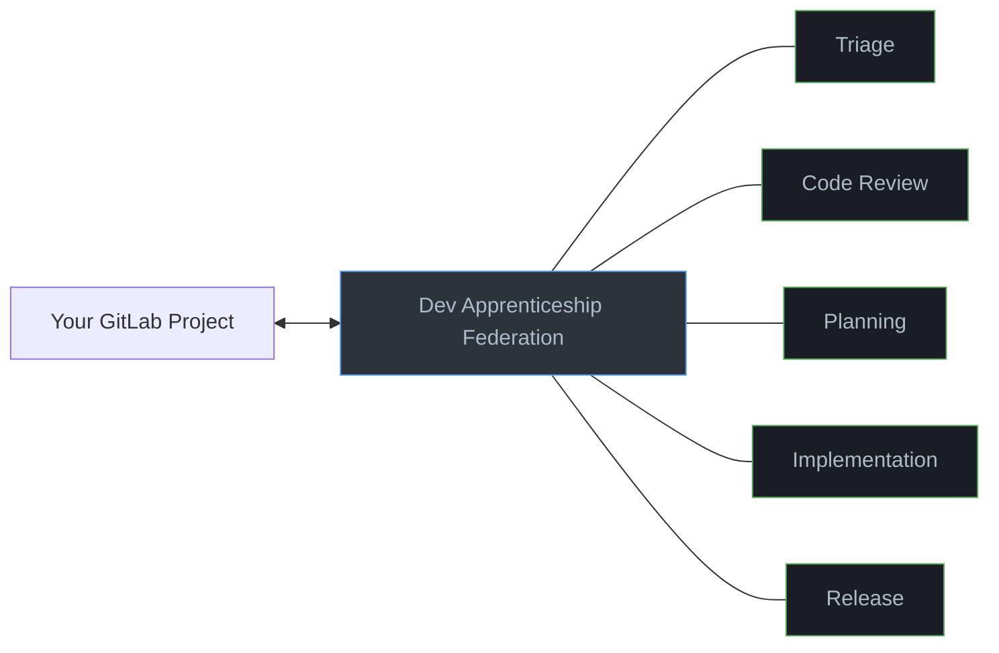
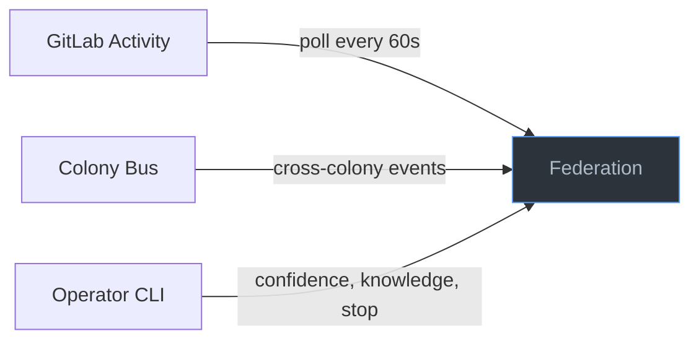
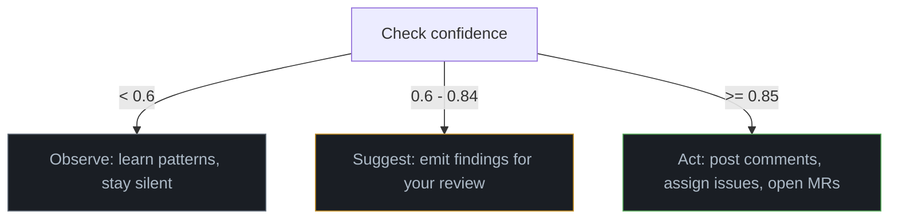

# Dev Apprenticeship

  

A federation of 21 agents that learns how you work by watching your GitLab activity. It observes how you triage issues, review merge requests, plan features, write code, and ship releases. Over time it takes over the mechanical parts, while you keep control over the decisions that matter.

The federation starts silent. Agents only watch. As they build confidence from your patterns, you progressively unlock autonomy: first suggestions, then full automation. You can always veto.

As knowledge accumulates, agents rely more on stored patterns and less on LLM inference. Early ticks are LLM-heavy (learning your style, generating summaries). Mature agents resolve most decisions from knowledge recall alone, falling back to the LLM only for novel situations.



## What you need

- [Agentis](https://github.com/Replikanti/agentis) runtime **>= v1.1.3**
- An LLM backend (Claude CLI, Ollama, or any OpenAI-compatible API)
- GitLab instance with API access (personal access token with `api` scope)
- Python 3 and git

## Installation

```bash
git clone https://github.com/Replikanti/agentis-colonies.git
cd agentis-colonies/dev-apprenticeship
./install.sh
```

The install script checks prerequisites, creates configs for all 5 colonies, writes your GitLab credentials, and seeds agent confidence levels. Running it again is safe.

## Starting and stopping

```bash
./start-federation.sh          # Start all 5 colonies (21 agents)
agentis colony status           # Monitor
agentis daemon stop --all       # Stop everything
```

## How work enters the system

Agents pick up work from three sources:

1. **GitLab polling**: Every 60 seconds, agents poll for new issues, merge requests, pipeline results, and review activity. This is the primary input. If something changes on GitLab, the relevant colony reacts on the next tick.

2. **Colony bus events**: Colonies pass work to each other over the federation bus. When triage routes an issue, the implementation colony picks it up. When implementation opens an MR, the code-review and release colonies react. You do not need to trigger these handoffs manually.

3. **Operator commands**: You can intervene directly via the agentis CLI. Adjust confidence (`agentis memo set labeler:confidence 0.85`), inspect knowledge (`agentis knowledge list`), or stop individual agents. The CLI is your control plane.



## Confidence gradient

What agents do depends on their confidence level:



**Start at 0.5 (observe)**. Agents watch your GitLab activity and build knowledge. Check logs to see what they are learning: `tail -f .agentis/logs/labeler.log`

**Promote to 0.6 (suggest)** when you trust what they have learned. Agents emit suggestions to the colony bus. They still do not touch GitLab.

```bash
agentis memo set labeler:confidence 0.6
```

**Promote to 0.85 (autonomous)** when ready. Start with low-risk agents (labeler, style_reviewer) before promoting high-impact ones (code_writer, approval_decider).

```bash
agentis memo set labeler:confidence 0.85
```

| Colony | Autonomous actions |
|--------|--------------------|
| Triage | Creates issues, applies labels, sets priority, assigns people |
| Code Review | Posts review comments, approves MRs, requests changes |
| Planning | Posts scope/risk/breakdown plans as issue comments |
| Implementation | Creates branches, commits code and tests, opens MRs |
| Release | Runs pre-release checks, posts ship decisions, creates tags and releases |

You can always demote an agent back: `agentis memo set labeler:confidence 0.5`

## What to expect

**Day 1**: Nothing visible. Agents are silent at 0.5. Check `agentis colony status` and logs to confirm they are polling.

**Week 1-2**: Knowledge entries accumulate from your GitLab activity. Run `agentis knowledge list` to inspect.

**After promotion**: Suggestions appear in logs (0.6) or directly on GitLab (0.85). Knowledge grows with every tick. Agents that predict correctly gain confidence. Stale knowledge decays. The system improves as long as you keep working on the project.

## Colonies

| Colony | Agents | What it learns |
|--------|--------|---------------|
| [Triage](./triage/) | 4 | Issue creation, labeling, prioritization, routing |
| [Code Review](./code-review/) | 5 | Style, logic, security, test coverage review, approval decisions |
| [Planning](./planning/) | 4 | Scope estimation, risk assessment, task decomposition, plan review |
| [Implementation](./implementation/) | 4 | Code generation, test writing, refactoring, commit conventions |
| [Release](./release/) | 4 | Pre-release checks, ship decisions, changelogs, versioning |

Cross-colony wiring: Triage routes issues to Implementation. Implementation signals Code Review and Release when an MR is ready. See individual colony READMEs for internal event wiring.

## Knowledge portability

Knowledge is tagged by scope: `personal` (your preferences, portable across projects) and `project:<name>` (codebase-specific, stays with the project).

```bash
agentis knowledge export --tags personal > my-preferences.json   # carry to new project
agentis knowledge import my-preferences.json --merge
```

## Troubleshooting

**Agents are silent after starting**: Expected at confidence 0.5. Check `agentis colony status`. If running, check logs: `tail -f .agentis/logs/router.log`.

**"GitLab poll failed"**: Token lacks `api` scope, or the project path is wrong.

**"Config not found"**: Run `./install.sh` or copy the template: `cp config/colony.example.toml config/colony.toml`

**LLM errors**: Check your backend configuration in `.agentis/config`. For CLI backends, verify the command works in your terminal. For HTTP backends, verify the endpoint is reachable and the API key is set.

**Agents not learning**: Run `agentis knowledge list`. If empty after several ticks, verify the GitLab project has recent activity.

## Extension points

Terminal colony bus events with no internal listener, meant for external consumption (webhooks, dashboards, custom agents):

| Event | Emitter | When |
|-------|---------|------|
| `triage:label_suggestion` | labeler | Confidence 0.6-0.84: label suggestion for human review |
| `triage:priority_suggestion` | prioritizer | Confidence 0.6-0.84: priority suggestion for human review |
| `review:decision_suggestion` | approval_decider | Confidence 0.6-0.84: approve/reject suggestion |
| `review:escalation` | approval_decider | Confidence >= 0.85: MR requires human attention |
| `planning:draft_plan` | plan_reviewer | Confidence 0.6-0.84: assembled plan for human review |
| `release:version_bumped` | version_bumper | After tag/release creation or version bump suggestion |
