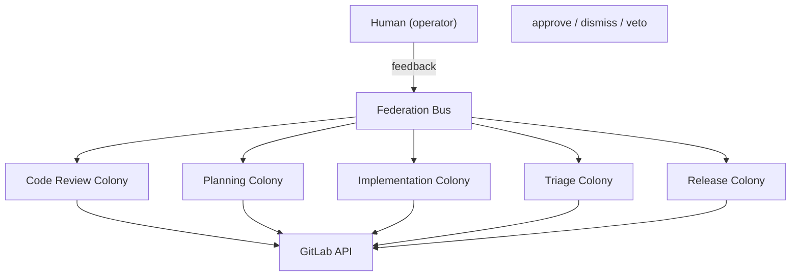

# Dev Apprenticeship

A federation of agent colonies that learns a developer's complete workflow by observing how they work, from triaging issues to shipping releases.

Each colony specializes in one part of the workflow. Together, they form a federation that covers the entire development lifecycle.

## Colonies

| Colony | Description | Status |
|--------|-------------|--------|
| [code-review](./code-review/) | Reviews merge requests: style, logic, security, test coverage, approval decisions (5 agents) | Active |
| [planning](./planning/) | Breaks down work: scope estimation, risk assessment, task decomposition, plan review (4 agents) | Active |
| [implementation](./implementation/) | Writes and refactors code: code generation, test writing, commit conventions (4 agents) | Active |
| [triage](./triage/) | Manages issues: creation, prioritization, labeling, routing (4 agents) | Active |
| [release](./release/) | Automates releases: ship decisions, changelogs, versioning, pre-release checks (4 agents) | Active |

## Why Colonies, Not Individual Agents?

A colony is fundamentally different from a bag of standalone agents doing separate jobs. Here is why the colony model matters:

**Shared context.** Agents within a colony communicate via `emit`/`listen` over the colony bus. When the style-reviewer flags a naming issue, the logic-reviewer already knows and won't produce a conflicting suggestion. Standalone agents would each operate in isolation, often contradicting each other.

**Specialization with emergent behavior.** Each agent is an expert in its narrow domain, but the colony as a whole solves problems none of them could handle alone. A code review isn't just five independent checks, it's a coordinated assessment where findings from one reviewer inform the others.

**Shared evolution.** Agents in a colony share evolutionary pressure. When the colony succeeds (the human approves its output), all agents improve together. When it fails, the fitness signal propagates to every agent, not just the one that made the visible mistake.

**Economic efficiency.** Agents share a Cognitive Budget (CB) pool. Resources flow to where they're most needed: a complex MR sends more budget to the logic-reviewer, a routine rename sends more to the style-reviewer. Standalone agents would each burn their fixed budget regardless of what the task actually needs.

**Resilience.** When one agent degrades or fails, the others continue and compensate. The colony adapts its behavior rather than producing incomplete output.

**Colony-level governance.** The operator sets rules, budgets, and autonomy thresholds for the entire colony, not for each agent individually. This makes the system manageable as the number of agents grows.

Colonies form a natural multi-agent team that is more robust and efficient than the same number of standalone agents.

## How It Works

## Autonomy Gradient

Every agent starts in **observe** mode, watching the human work, building confidence from accumulated experience. As confidence grows, autonomy increases:

| Confidence | Mode | Behavior |
|------------|------|----------|
| < 0.6 | Observe / Suggest | Agent watches and may suggest, human decides |
| < 0.85 | Draft | Agent drafts output for human review |
| >= 0.85 | Autonomous | Agent acts on its own, human can veto |

This gradient applies at every level: individual agents gain autonomy within their colony, colonies gain autonomy within the federation, and the federation gains autonomy within the broader Agentis ecosystem. Confidence grows with correct predictions and decays on stale knowledge.

## Knowledge Portability

Knowledge entries are tagged by scope:

- `personal`: developer preferences, quality bar, review criteria. Portable across projects.
- `project:<name>`: codebase-specific patterns, file coupling, false positive patterns. Stays with the project.
- `team:<name>`: shared across team members via federation. (Future)

When onboarding a new project, colonies carry over `personal` knowledge and start fresh on `project:*`. They already know how you work, they just need to learn the codebase.

## Prerequisites

- [Agentis](https://github.com/Replikanti/agentis) runtime
- GitLab instance with API access
- Claude CLI (LLM backend via Agentis `CliBackend`)
