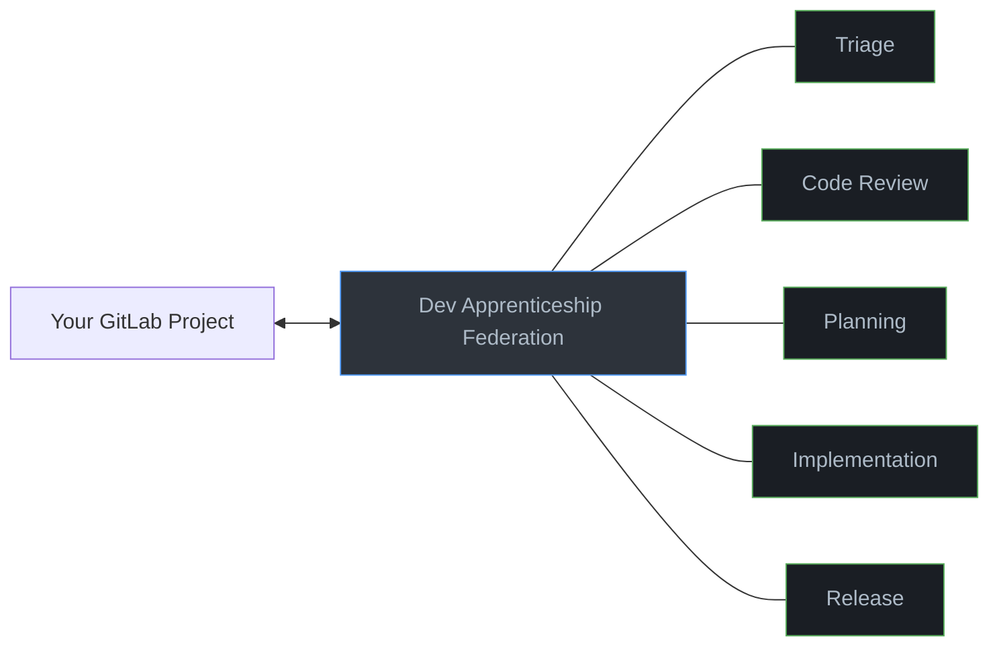
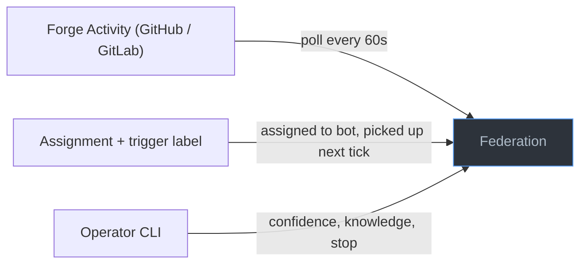
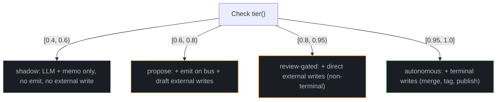

# Dev Apprenticeship

   

**Version:** `2.11.0` · [Changelog](./CHANGELOG.md) · **Requires:** agentis >= `1.22.3`

> **One example federation** built on the [`agentis-colonies`](../) platform. The platform contract every federation must satisfy is [ADR-0003](../doc/adr/ADR-0003-federation-portability-contract.md); to scaffold a different kind of federation (data-ops, research, support-triage, monitoring-ops, …) see [`doc/federation-patterns.md`](../doc/federation-patterns.md) and [`tools/new-federation.sh`](../tools/new-federation.sh).

A federation of 22 agents that learns how you work by watching your GitLab or GitHub activity. It observes how you triage issues, review merge requests, plan features, write code, and ship releases. Over time it takes over the mechanical parts, while you keep control over the decisions that matter.

The federation starts silent. Agents only watch. As you see what they are learning in the logs and trust what they would do, you progressively unlock autonomy by raising each agent's confidence memo through four named tiers — `shadow` (observe), `propose` (suggest), `review-gated` (act under review), and `autonomous` (act alone). The tier contract is defined in [`doc/adr/ADR-0001-confidence-tiers.md`](../doc/adr/ADR-0001-confidence-tiers.md) and is normative for every agent in this federation. Agents do not promote themselves; the gradient is operator-controlled. You can always veto or demote.

As knowledge accumulates, agents rely more on stored patterns and less on LLM inference. Early ticks are LLM-heavy (learning your style, generating summaries). Mature agents resolve most decisions from knowledge recall alone, falling back to the LLM only for novel situations.


```mermaid
graph LR
    GL["Your GitLab Project"]
    FED["Dev Apprenticeship Federation"]
    TR["Triage"]
    CR["Code Review"]
    PL["Planning"]
    IM["Implementation"]
    RE["Release"]

    GL <--> FED
    FED --- TR
    FED --- CR
    FED --- PL
    FED --- IM
    FED --- RE

    style FED fill:#2d333b,stroke:#539bf5,color:#adbac7
    style TR fill:#1a1e24,stroke:#57ab5a,color:#adbac7
    style CR fill:#1a1e24,stroke:#57ab5a,color:#adbac7
    style PL fill:#1a1e24,stroke:#57ab5a,color:#adbac7
    style IM fill:#1a1e24,stroke:#57ab5a,color:#adbac7
    style RE fill:#1a1e24,stroke:#57ab5a,color:#adbac7
```

## Quickstart

The zero-to-first-PR happy path. Each step links to the detailed section below.

**1. Prerequisites** ([What you need](#what-you-need)) — on `PATH`: the [`agentis`](https://github.com/Replikanti/agentis) runtime and [`flat-cyborg`](https://github.com/Replikanti/flat-cyborg) (the default LLM backend — a PTY wrapper over Claude Code), plus a logged-in `~/.claude` session so agents bill against your Claude subscription instead of the metered API. Also `python3`, `git`, and `gh` (GitHub) or `glab` (GitLab). You need a repo, a personal access token, and a **bot account** to assign work to.

**2. Install** ([Installation](#installation)) — from a clone or the release tarball:

```bash
cd dev-apprenticeship
./install.sh        # checks prereqs, writes configs + credentials, seeds confidence, wires the flat-cyborg backend
```

**3. Start** ([Starting and stopping](#starting-and-stopping)):

```bash
./start-federation.sh       # 5 colonies, 22 agents
./dashboard.sh 8420         # optional web dashboard at http://localhost:8420
```

**4. Give it work** ([How work enters the system](#how-work-enters-the-system)) — assign an issue to the bot account and add the colony's trigger label:

```bash
gh issue create --repo <owner>/<repo> --title "..." --body "..." --label implementation
gh issue edit <N> --repo <owner>/<repo> --add-assignee <bot-account>
```

On its next 60-second tick the implementation colony drafts a plan, edits the files in a local checkout, commits, pushes, and opens a PR for you to review and merge. (Planning work uses the `needs-planning` label instead.)

**5. Unlock autonomy** ([Confidence tiers](#confidence-tiers)) — agents start silent (`shadow`) and only watch. An agent opens PRs on its own only at the `autonomous` tier (confidence >= 0.95). Let it climb on good outcomes via [auto-promote](#auto-promote-and-auto-evolve-148), or bump it directly:

```bash
agentis memo set code_writer:confidence 0.97
```

**6. Stop** when you are done:

```bash
./kill-federation.sh
```

## Contents

- [Quickstart](#quickstart)
- [What you need](#what-you-need)
- [Installation](#installation)
- [Starting and stopping](#starting-and-stopping)
- [Monitoring](#monitoring)
- [How work enters the system](#how-work-enters-the-system)
- [Confidence tiers](#confidence-tiers)
- [Security](#security)
- [What to expect](#what-to-expect)
- [Auto-confidence from feedback](#auto-confidence-from-feedback-106)
- [Colonies](#colonies)
- [Rule-first replay in triage](#rule-first-replay-in-triage-1234--14291437)
- [Cost / rate instrumentation](#cost--rate-instrumentation-1114)
- [CB cap + forge rate-limit backoff](#cb-cap--forge-rate-limit-backoff-1115)
- [LLM-session concurrency cap](#llm-session-concurrency-cap-1352)
- [First real task — completion criterion & post-run triage](#first-real-task--completion-criterion--post-run-triage-1116--1118)
- [Knowledge portability](#knowledge-portability)
- [Troubleshooting](#troubleshooting)
- [Extension points](#extension-points)
- [Auto-promote and auto-evolve](#auto-promote-and-auto-evolve-148)

## What you need

- [Agentis](https://github.com/Replikanti/agentis) runtime **>= v1.22.3** (v1.8.0 adds the crystallizer builtins used by the rule-replay pilots; v1.20.0 adds the `crystallizer_search` BM25 retrieval builtin used by Stage 1b recall + retrieval-grounded prompts; v1.22.2 adds the `json_array_project` flat JSON-array projection builtin the native merge-gate verdict readers depend on; v1.22.3 adds `json_array_reduce` — filtered max-id + ascending-id body aggregate — the native `actionable_note` review-resolver reader depends on — a hard floor with no try/catch fallback, pinned by the substrate-purity Phase 2 CHANGELOG entries)
- An LLM backend (Claude CLI, Ollama, or any OpenAI-compatible API)
- GitLab instance with API access (personal access token with `api` scope)
- Python 3 and git

## Installation

Pick one of the two install paths.

**Option A — release tarball** (recommended for running the federation; install-ready, no git tree required):

```bash
VERSION=2.11.0
curl -LO https://github.com/Replikanti/agentis-colonies/releases/download/dev-apprenticeship-v${VERSION}/dev-apprenticeship-v${VERSION}.tar.gz
curl -LO https://github.com/Replikanti/agentis-colonies/releases/download/dev-apprenticeship-v${VERSION}/dev-apprenticeship-v${VERSION}.tar.gz.sha256
sha256sum -c dev-apprenticeship-v${VERSION}.tar.gz.sha256   # optional but recommended
tar xzf dev-apprenticeship-v${VERSION}.tar.gz
cd dev-apprenticeship-v${VERSION}/dev-apprenticeship
./install.sh
```

The tarball ships only the runtime surface of this federation (the federation itself plus the `tools/` scripts and `doc/` references it needs at run time). Contributor tooling (`colony-lint.sh`, tests, CI config, `CLAUDE.md`) is intentionally excluded — see [`BUNDLE.manifest`](./BUNDLE.manifest).

**Option B — clone the repo** (use this if you want to contribute or work from `main`):

```bash
git clone https://github.com/Replikanti/agentis-colonies.git
cd agentis-colonies/dev-apprenticeship
./install.sh
```

The install script checks prerequisites, creates configs for all 5 colonies, writes your GitLab credentials, and seeds agent confidence levels. Running it again is safe. See [Security](#security) for how tokens are stored and rotated.

> **Divergent `<colony>/.agentis` warnings on re-run ([#1464](https://github.com/Replikanti/agentis-colonies/issues/1464)).** `install.sh` §4 replaces each `<colony>/.agentis` with a symlink to the federation-level `.agentis`. If a real directory sits there instead, the installer inspects it and prints one of two warnings:
> - `… contains only inert slot/sandbox residue — safe to delete` — the dir holds nothing but `llm-slots/`/`sandbox/` (and at most an empty `logs/`) dropped by old cwd-fallback code paths. This is dead weight (the slot pool resolves fed-level, [#1426](https://github.com/Replikanti/agentis-colonies/pull/1426)) and losing it costs no state. Re-run with `AGENTIS_PRUNE_INERT=1 ./install.sh` to auto-remove it and restore the symlink so re-runs stop warning.
> - `… holds real state (memo/spend/logs) — skipping` — the dir contains memos, spend, or non-empty logs. The installer leaves it untouched; inspect and remove it manually before re-running so the symlink can be created.
>
> **Trigger-label overrides need env passthrough.** To override a colony's trigger label, set `trigger_label` in that colony's `config/colony.toml` **and** make sure `exec.env_passthrough` in `<fed>/.agentis/config` includes `IMPLEMENTATION_TRIGGER_LABEL,PLANNING_TRIGGER_LABEL`. `install.sh` writes this passthrough for you as of [#1185](https://github.com/Replikanti/agentis-colonies/issues/1185); without those keys the override never reaches the agents and the default trigger label (`implementation` / `needs-planning`) is used. A federation installed before #1185 needs the keys added manually (then restart the colonies).

## Starting and stopping

```bash
./start-federation.sh           # Start all 5 colonies (22 agents)
./kill-federation.sh            # Stop everything reliably (preferred)
agentis daemon stop --all       # Fallback only — known false-positive / false-negative on stale registry entries (see top-level README)
```

> Agents must be launched via `start-federation.sh` or a colony's
> `start-colony.sh`. Those scripts export `COLONY_DIR`, which the
> agents expand inside `exec sh "$COLONY_DIR/scripts/..."` at runtime.
> Launching `agentis daemon <agent>.ag` directly bypasses that export,
> so `$COLONY_DIR` expands to empty and GitLab polling fails silently.

## Monitoring

### Dashboard

A web dashboard that shows agent health, confidence levels, phase readiness with ETA, knowledge growth trends, remediation history, and a live suggestion feed. Auto-refreshes every 60 seconds. Includes a kill switch (two-click safety) to stop the entire federation from the browser.

The dashboard is a [separately-versioned standalone component](../federation-dashboard/) ([#252](https://github.com/Replikanti/agentis-colonies/issues/252)). This federation recommends `federation-dashboard >= 0.8.0` (pinned in [`.dashboard-version`](./.dashboard-version)); `install.sh` step 8 offers to install it for you, and `./dashboard.sh` is a thin resolver that finds the installed binary.

Per-agent **confidence bump** controls (▲▼) in the Confidence Levels card walk each agent through the canonical tier ladder: `shadow` (0.4) → `propose` (0.6) → `review-gated` (0.8) → `autonomous` (0.95). Promotions to `autonomous` trigger a confirmation dialog since at that level the agent performs terminal external writes (merge, tag, publish) without a second gate. Every change is appended to `.dashboard/confidence-log.jsonl` for audit. The CLI path (`agentis memo set <agent>:confidence <value>`) still works and is equivalent.

```bash
./dashboard.sh                  # http://localhost:8420
./dashboard.sh 9000             # custom port
```

The dashboard auto-discovers colonies and agents from the directory structure. It persists history in `.dashboard/history.json` so trends survive restarts.

### Right after start

Verify everything is alive:

```bash
agentis daemon list             # 22 processes, all STATE=running?
agentis federation status       # 5 colonies connected?
tail .agentis/logs/router.log   # See "[router] GitLab poll..." lines?
```

### First day

Verify agents are learning:

```bash
agentis knowledge stats         # Knowledge entries growing?
agentis memo get router:confidence  # Confidence at 0.4 (shadow seed)?
agentis stats                   # CB consumption per agent
```

### Ongoing

Check daily or when something feels off:

```bash
agentis daemon list             # Check HEALTH and QUARANTINE columns
agentis colony health           # Health per colony
agentis colony ps               # Agent lifecycle states
agentis remediation history     # Any auto-remediation actions?
```

### Warning signs

| Signal | Meaning | Action |
|--------|---------|--------|
| STATE=stopped in daemon list | Agent crashed, watchdog gave up | Check log, restart the colony |
| QUARANTINE=yes | Agent failed repeatedly, runtime isolated it | `agentis quarantine status <agent>`, fix cause, `agentis quarantine promote <agent>` |
| knowledge stats shows 0 after a day | Agents see no GitLab activity | Check token, project path, verify project has recent activity |
| One log growing much faster than others | Agent hitting errors repeatedly | `tail .agentis/logs/<agent>.log` |
| remediation history shows entries | System detected an anomaly and responded | `agentis remediation history --json` for details |

## How work enters the system

Agents pick up work from three sources:

1. **Forge polling (GitHub or GitLab)**: Every 60 seconds, agents poll for new issues, merge/pull requests, pipeline results, and review activity. This is the primary input — the GitHub forge is the proven path. If something changes on the forge, the relevant colony reacts on the next tick.

2. **Assignment-based pickup**: A colony picks up an issue when it is **assigned to the federation's bot account** *and* carries the colony's trigger label (default `implementation` for the implementation colony, `needs-planning` for planning). Such an issue is picked up on the next tick ([#1181](https://github.com/Replikanti/agentis-colonies/issues/1181)). Cross-colony bus events — triage routing an issue onward, implementation signalling code-review/release — are a **best-effort fast path, not a guarantee**: do not rely on cross-colony routing being automatic. Assigning the issue to the bot with the trigger label is the reliable trigger.

3. **Operator commands**: You can intervene directly via the agentis CLI. Adjust confidence (`agentis memo set labeler:confidence 0.95`), inspect knowledge (`agentis knowledge list`), or stop individual agents. The CLI is your control plane.

> The implementation colony's `code_writer` **edits existing files** — it fetches the current file content first and applies the change to it — not just creates new ones ([#1172](https://github.com/Replikanti/agentis-colonies/issues/1172)).


```mermaid
graph LR
    GL["Forge Activity (GitHub / GitLab)"]
    ASG["Assignment + trigger label"]
    CLI["Operator CLI"]
    FED["Federation"]

    GL -- "poll every 60s" --> FED
    ASG -- "assigned to bot, picked up next tick" --> FED
    CLI -- "confidence, knowledge, stop" --> FED

    style FED fill:#2d333b,stroke:#539bf5,color:#adbac7
```

## Confidence tiers

What agents do depends on their current tier. See [`doc/adr/ADR-0001-confidence-tiers.md`](../doc/adr/ADR-0001-confidence-tiers.md) for the normative contract.


```mermaid
graph TD
    CHECK["Check tier()"]
    SHA["shadow: LLM + memo only, no emit, no external write"]
    PRO["propose: + emit on bus + draft external writes"]
    RG["review-gated: + direct external writes (non-terminal)"]
    AUT["autonomous: + terminal writes (merge, tag, publish)"]

    CHECK -- "[0.4, 0.6)" --> SHA
    CHECK -- "[0.6, 0.8)" --> PRO
    CHECK -- "[0.8, 0.95)" --> RG
    CHECK -- "[0.95, 1.0]" --> AUT

    style SHA fill:#1a1e24,stroke:#636e7b,color:#adbac7
    style PRO fill:#1a1e24,stroke:#c69026,color:#adbac7
    style RG fill:#1a1e24,stroke:#ff8800,color:#adbac7
    style AUT fill:#1a1e24,stroke:#57ab5a,color:#adbac7
```

Agents below `0.4` are `dormant` — not yet admitted to the ladder. Fresh federations seed every agent at `0.4` (shadow).

**Start at 0.4 (shadow)**. Agents watch your GitLab activity and build knowledge. Check logs to see what they are learning: `tail -f .agentis/logs/labeler.log`

**Promote to 0.6 (propose)** when you trust what they have learned. Agents emit suggestions to the colony bus and draft external writes marked as non-authoritative. They do not post directly on your behalf. Watch all suggestions in one stream:

```bash
agentis memo set labeler:confidence 0.6
./watch-suggestions.sh          # Live feed from all 22 agent logs
```

**Promote to 0.8 (review-gated)** when proposals have been reliable. Agents now post directly on GitLab (non-terminal writes: comments, non-draft MRs). Terminal actions (merge, tag, publish, credential rotation) still require an explicit second gate.

```bash
agentis memo set labeler:confidence 0.8
```

**Promote to 0.95 (autonomous)** when the agent has demonstrated sustained success under the review gate. At this tier the agent may perform terminal writes without a second approver. Start with low-risk agents (labeler, style_reviewer) before promoting high-impact ones (code_writer, approval_decider).

```bash
agentis memo set labeler:confidence 0.95
```

| Colony | Autonomous actions |
|--------|--------------------|
| Triage | Creates issues, applies labels, sets priority, assigns people |
| Code Review | Posts review comments, approves MRs, requests changes |
| Planning | Posts scope/risk/breakdown plans as issue comments |
| Implementation | Creates branches, commits code and tests, opens MRs |
| Release | Runs pre-release checks, posts ship decisions, creates tags and releases |

You can always demote an agent back: `agentis memo set labeler:confidence 0.4`

## Security

Your GitLab personal access token is stored in plaintext in 5 files:

```
<colony>/config/colony.toml     # token = "glpat-..."
```

`install.sh` sets these to mode 0600 (owner-only). If you move a federation directory to a multi-user system or copy configs manually, re-run `chmod 600 <colony>/config/colony.toml` on each.

Rotate tokens periodically via GitLab (User Settings -> Access Tokens). Re-run `./install.sh` and answer `Y` to the "Update GitLab credentials" prompt — it accepts a new token without rewriting the colony templates.

### Migrating to vault-stored tokens (#321)

If you don't want a plaintext token on disk, the federation now understands `secret://` URIs in any `[forge.*]` `token` / `api_key` field. The token lives in your OS vault; `colony.toml` just carries a pointer.

Three backends are supported:

| Backend | URI shape | When |
|---------|-----------|------|
| `libsecret` (Linux GNOME-Keyring) | `secret://libsecret/<service>/<key>` | Linux desktop |
| `keychain` (macOS) | `secret://keychain/<service>/<account>` | macOS |
| `pass` (passwordstore.org) | `secret://pass/<path>` | cross-platform |
| `env` (existing `${VAR}` idiom) | `secret://env/<VAR>` | unattended / CI |

The `tools/secret-set.sh` helper auto-detects the backend, reads the token from stdin (no echo), writes it via the matching command, and prints the resulting URI on stdout:

```bash
# libsecret (Linux)
echo "glpat-yourtoken" | tools/secret-set.sh --service agentis-colonies --account gitlab-token
# → secret://libsecret/agentis-colonies/gitlab-token

# keychain (macOS) — same invocation, autodetected
echo "ghp_yourtoken" | tools/secret-set.sh --service agentis-colonies --account github-token
# → secret://keychain/agentis-colonies/github-token

# pass (cross-platform)
echo "glpat-yourtoken" | tools/secret-set.sh --backend pass --service agentis-colonies --account gitlab-token
# → secret://pass/agentis-colonies/gitlab-token
```

Paste the printed URI into each `colony.toml` in place of the plaintext token. `install.sh` will offer to do this for you on a fresh install — answer `y` when it asks "Store this token in your OS vault?".

The plaintext path keeps working — vault use is opt-in. `tools/colony-lint.sh` warns when it spots a plaintext forge token; set `COLONY_LINT_STRICT_SECRETS=1` to upgrade the warning to a hard fail in CI.

## LLM backend: flat-cyborg over Claude Code (default CLI, [#1131](https://github.com/Replikanti/agentis-colonies/issues/1131))

The default CLI backend for this federation is **flat-cyborg**, a PTY wrapper that drives the *interactive* Claude Code session through `tools/flat-cyborg-claude.sh`. It uses the Claude Code subscription (not the metered `claude -p` API path) and returns only the model's reply — read from a **result file** claude writes with its file-write tool ([#1219](https://github.com/Replikanti/agentis-colonies/issues/1219)); the `--extract` screen-scrape is only a fallback when the file does not appear.

Sessions are **model-routed by workload** ([#1414](https://github.com/Replikanti/agentis-colonies/issues/1414)): agent `prompt()` reasoning runs on Sonnet (`--model sonnet`, override with `CLAUDE_REASONING_MODEL`), while the heaviest workload — multi-file code generation in `tools/code-edit-in-checkout.sh` — runs on Opus (`--model opus`, override with `CODE_EDIT_MODEL`).

`install.sh` §6 wires it for you: when `flat-cyborg` is on your `PATH`, it offers (default Yes) to write `llm.backend = claude` and `llm.command = <fed>/tools/flat-cyborg-claude.sh` (with an empty `llm.args` — the prompt is the sole positional arg) into `<fed>/.agentis/config`. The wrapper path resolves from the federation root, so it works both in a source checkout and in the release bundle.

**flat-cyborg must be installed, >= 0.11.0** — get it from [Replikanti/flat-cyborg](https://github.com/Replikanti/flat-cyborg) (an installed copy self-updates with `flat-cyborg update`). If it is absent at install time, `install.sh` warns and falls back to printing the manual backend examples. The wrapper passes the prompt via `--cmd-file` (flat-cyborg >= 0.11.0) so a multi-MB context does not overflow `ARG_MAX` (#1171); an older binary fails with `unknown flag: --cmd-file`.

Two env-var knobs tune the wrapper (defaults shown):

- `FLAT_CYBORG_IDLE_MS` (`8000`) — settle window before flat-cyborg reads the screen.
- `FLAT_CYBORG_TIMEOUT_MS` (`180000`) — hard cap on a single generation.

### Code-generation fidelity ([#1152](https://github.com/Replikanti/agentis-colonies/issues/1152), resolved by [#1210](https://github.com/Replikanti/agentis-colonies/issues/1210) + [#1219](https://github.com/Replikanti/agentis-colonies/issues/1219))

flat-cyborg's `--extract` is a **TUI screen-scrape** — it reads the model's reply off the rendered terminal. The [#1117](https://github.com/Replikanti/agentis-colonies/issues/1117) first live run showed that corrupting fidelity-critical structured output: `code_writer`'s old path asked the model for file contents as a JSON array, and the terminal's line-wrapping mangled it, so commits failed. The historical workaround was switching the backend to metered `claude -p` (#1152). **That switch is no longer needed** — two changes removed the screen-scrape from every fidelity-critical path, so flat-cyborg (flat-rate subscription) stays the backend for everything:

- **Code generation never round-trips file content through the transcript** ([#1210](https://github.com/Replikanti/agentis-colonies/issues/1210)): `code_writer` drives claude to edit files directly in a per-issue local git checkout and commits the resulting `git diff` — see [the checkout-edit path](./implementation/README.md#code-generation-the-checkout-edit-path).
- **Prose replies are read from a result file** claude writes ([#1219](https://github.com/Replikanti/agentis-colonies/issues/1219)), with `--extract` only as a fallback.

## LLM backend (per-colony override, [#319](https://github.com/Replikanti/agentis-colonies/issues/319))

Every agent reads its LLM backend from `<fed>/.agentis/config` by default — that is the federation-wide pin written by `install.sh` step 4 (one of `cli` / `http` / `mock`). A colony can pin its own backend via an optional `[llm]` block in `<colony>/config/colony.toml`:

```toml
[llm]
backend = "http"               # mock | cli | http
# command = "claude"           # for cli backend
# model = "claude-sonnet-4"    # for http backend
# api_key_env = "ANTHROPIC_API_KEY"  # for http backend
```

All four keys are optional. Each set key is spliced onto every `agentis daemon` invocation as `--config-override llm.<key>=<value>`; absent keys fall through to the federation-wide default. Use this to put a low-stakes colony (e.g. `triage`) on a cheap local Ollama / OpenAI endpoint while reserving Claude for `release` / `code-review`. Edits take effect on the next colony restart (`./scripts/start-colony.sh` or the dashboard's per-agent ▶ Restart button).

The cost-cap downgrade primitive ([#318](https://github.com/Replikanti/agentis-colonies/issues/318)) takes precedence over the colony block: when the sidecar trips a daily/monthly budget breach with `on_breach = "downgrade"`, every running daemon is restarted onto `--config-override llm.backend=mock` until UTC midnight or the operator runs `tools/cost-cap.sh <fed> --override "<reason>"`. While the override file is in place, the colony's `[llm]` block is ignored entirely (downgrade snaps to mock cleanly without leaking colony-specific keys onto the daemon CLI).

This is PR 1 of a 5-PR rollout. Per-agent backend selection (e.g. `@llm("ollama")` decorators) is explicitly deferred — split the agent into its own colony if heterogeneity is real. Subsequent PRs land the portable pricing registry (`tools/llm-pricing.toml` for `cost-cap-sum.py` in metered mode), the swap-without-restart primitive (generalising the override file into a TOML doc with `model` / `endpoint` keys), the `install.sh` interactive backend prompt, and the dashboard's `cost_source` chip + per-colony backend column.

## What to expect

**Day 1**: Nothing visible. Agents are silent in `shadow` (seeded at 0.4). Check `agentis daemon list` and logs to confirm they are polling.

**Week 1-2**: Knowledge entries accumulate from your GitLab activity. Run `agentis knowledge list` to inspect.

**After promotion**: Proposals appear in logs at `propose` (0.6), direct non-terminal writes on GitLab at `review-gated` (0.8), and terminal writes (merge/tag/publish) at `autonomous` (0.95). Knowledge keeps growing with every tick.

Separately from the tier ladder, the runtime slowly decays the per-entry confidence score that `learn()` attaches to each unvalidated knowledge row — `knowledge.confidence_decay_rate` defaults to `0.01/hr`, floored at `knowledge.confidence_decay_min` (`0.05`); validated entries are left alone. This affects how much weight an old entry carries inside an agent, not which tier the agent is running at.

## Auto-confidence from feedback (#106)

Suggestions don't just sit in logs — participating agents score themselves against what you actually did. The loop is:

1. Agent emits a proposal in `propose` tier (confidence 0.6–0.8) and stashes a "pending verdict" — issue/MR id plus the payload it proposed.
2. On a later tick, agent fetches the current GitLab state of the artifact and compares.
3. Exact match → confidence `+0.02`. Partial match → `+0.005`. Mismatch → `-0.01`. Still no operator action → leave pending, re-check next tick.
4. Verdicts that age past 24 h without operator action are dropped without scoring — absence is not evidence of wrong suggestion.

**Autonomy cap**. Auto-promotion stops at **0.85** (within `review-gated`). Positive deltas above the cap are clipped; the agent has to earn *review-gated trust* automatically, but you still have to manually bump it across the `autonomous` boundary at 0.95 (via the dashboard ▲ button or `agentis memo set <agent>:confidence 0.95`) before it is permitted to perform terminal writes (merge, tag, publish). This is deliberate — the auto-loop earns propose/review-gated trust from matching your style; terminal autonomy is your call. Negative deltas are not capped, so a confident agent that goes off the rails can still be pulled back down.

**Phase 1 scope** (what ships today). The feedback loop is wired into the `labeler` agent as the reference implementation — suggested labels are compared against the labels you actually apply to the issue (set overlap).

Four more reference agents will follow in separate PRs using the same pattern:

- `style_reviewer`
- `plan_reviewer`
- `code_writer`
- `version_bumper`

Each needs its own matcher (did the MR get merged? was the plan followed? was the version tagged?). Shared infrastructure (`clamp_auto`, `signal_to_delta`, `apply_feedback`, `record_*_verdict`, `evaluate_*_verdict`, `get-issue` gitlab-api subcommand) is in place.

**Config knobs** live in each colony's `config/colony.toml` under `[feedback]`. The current shipment reads the defaults directly from the agent source (`match_rate = 0.02`, `partial_rate = 0.005`, `mismatch_rate = 0.01`, `timeout_s = 86400`, `autonomy_cap = 0.85`). The TOML section is declared so you can see where runtime-configurable knobs will land without a future config rewrite being disruptive.

**Observability**. Every delta prints one line to the agent's log: `[labeler] feedback delta 0.02 confidence 0.62 -> 0.64`. Grep that prefix to audit every confidence change the agent made to itself. The dashboard's per-agent confidence bar reflects the current memo value regardless of how it moved.

**Why not auto-promote into `autonomous`**. The cap makes the honest claim match the observed behavior: *agents learn to propose and act-under-review well*. Promoting them into terminal-write territory ought to be an explicit operator decision, not a drift that happened while you weren't looking.

## Colonies

| Colony | Agents | What it learns |
|--------|--------|---------------|
| [Triage](./triage/) | 4 | Issue creation, labeling, prioritization, routing — decisions crystallize into replayable rules (see [Rule-first replay](#rule-first-replay-in-triage-1234--14291437)) |
| [Code Review](./code-review/) | 6 | Style, logic, security, test coverage review, pre-merge QA verdicts, approval decisions |
| [Planning](./planning/) | 4 | Scope estimation, risk assessment, task decomposition, plan review |
| [Implementation](./implementation/) | 4 | Code generation, test writing, refactoring, commit conventions |
| [Release](./release/) | 4 | Pre-release checks, ship decisions, changelogs, versioning |

Cross-colony wiring: Triage routes issues to Implementation. Implementation signals Code Review and Release when an MR is ready. See individual colony READMEs for internal event wiring.

## Shared GitLab snapshot (#1111 / #1112)

Without sharing, every agent in a colony curls the same GitLab collection on every tick and passes the raw JSON straight into `prompt()`. In the Triage colony that meant the `/issues` (now `/work_items`) endpoint was fetched **three times per tick** — once each by the labeler, router, and prioritizer (four with the issue_creator) — and each copy was the full ~74 KB raw payload. The duplicate fetches throttle the API; the raw payloads waste a factor 5–10× of the model's input budget.

Two mechanisms fix this:

**One shared fetch per colony per tick (#1111).** The Triage `scripts/start-colony.sh` publishes a single snapshot of the `issues` collection:

- It fetches the collection **once** via `scripts/forge-api.sh snapshot issues` (the single fetch implementation — `gitlab-api.sh` / `github-api.sh` stay the only code that touches the network) and writes the result to the shared memo `gitlab:snapshot:issues`, with an epoch-seconds freshness key at `gitlab:snapshot:issues:ts`.
- The publish runs on full-colony bootstrap, and can be re-run any time via `scripts/start-colony.sh --snapshot-refresh` (a lightweight, daemon-free mode for a per-tick sidecar).
- **`start-federation.sh` runs a snapshot-refresh sidecar** that re-publishes the snapshot every 300 s (override via `SNAPSHOT_REFRESH_INTERVAL_S`) — deliberately **shorter than the 600 s freshness window** so a fresh snapshot is always within reach. Without it the snapshot would go stale after the first window and every agent would fall back to the per-agent direct fetch the snapshot exists to eliminate, evaporating the I/O win. The sidecar mirrors the auto-promote / cost-cap sidecars: it self-terminates once the federation has zero running daemons and is killed on `start-federation.sh` shutdown (EXIT/TERM/INT trap). It is backward-safe — a missing `triage/scripts/start-colony.sh` or a refresh failure is logged to `.agentis/logs/snapshot-refresh.log` and ignored (the snapshot step leaves the prior snapshot in place on error), so a sidecar hiccup never breaks the federation.
- Each agent reads `recall_latest("gitlab:snapshot:issues")` instead of curling the endpoint. The agent renders its role view from the snapshot via `forge-api.sh issues --from-snapshot --view <role>`, which rehydrates + projects the memo with **zero HTTP calls**.
- Because the shared snapshot is the **full** collection (not a `--since last_check` delta), `raw` is non-empty on every tick even when nothing changed. To keep the quiet-project cost down, the labeler / router / prioritizer fingerprint their projected view (SHA-256) and memo it as `<agent>:snapshot_hash`; on a tick whose fingerprint matches the last-processed one they refresh `last_check` and skip `prompt()` entirely — restoring the legacy `--since`-empty early-exit on the snapshot path.

**Compressed before it reaches `prompt()` (#1112).** The snapshot is not stored raw. `scripts/snapshot-compress.py` (reusing the normalized-subtree-hashing idea from `dark-factory/evm-harness/struct-sig.js`) transforms the raw GitLab JSON into a compact, deduplicated, structurally-chunked envelope before it lands in the memo:

- Each item is normalized to the union of role-relevant fields (everything else — `web_url`, `time_stats`, `references`, `milestone`, … — is dropped).
- Each item's normalized **structure** is content-addressed (SHA-256 of its canonical JSON); identical structures are interned once in a `chunks` table and referenced by index, so repeated structure (and unchanged structure across ticks) is stored once, not re-serialized.
- The transform is deterministic and **byte-stable** for identical input (the key that makes cross-tick caching sound). On a realistic 20-issue payload this is ~11× smaller than the raw JSON.

**Backward-safe degrade.** Every read path is total-on-failure: if the snapshot memo is missing, empty, malformed, or older than the freshness window (600 s), the agent silently falls back to its legacy direct `forge-api.sh issues` fetch. A broken or stale snapshot never hard-fails a tick. The per-colony snapshot is used only on the single-repo path; the multi-repo (`[[forge.github]]`) fan-out keeps its per-repo direct fetch.

| Memo key | Writer | Readers |
|----------|--------|---------|
| `gitlab:snapshot:issues` | `triage/scripts/start-colony.sh` (snapshot step; refreshed by the `start-federation.sh` sidecar) | labeler, router, prioritizer, issue_creator |
| `gitlab:snapshot:issues:ts` | `triage/scripts/start-colony.sh` (snapshot step; refreshed by the `start-federation.sh` sidecar) | the four agents' `snapshot_fresh()` gate |
| `<agent>:snapshot_hash` | labeler / router / prioritizer (end of tick) | the same agent's per-tick no-change gate (skip `prompt()` when the view fingerprint is unchanged) |

> The same mechanism extends to the `merge_requests` collection in the Planning / Implementation / Code Review / Release colonies; their reads are label-event-filtered rather than plain full-collection fetches, so that wiring is driven by the live run (#1117) and is not enabled yet.

## Rule-first replay in triage (#1234 / #1429–#1437)

The triage labeler, router, and prioritizer do not stay LLM-bound forever: each agent **distills your observed decisions into crystallizer rules** (content-addressed condition → action records in the agentis rule pool) and consults them **before** any LLM call:

1. **Rule match first** ([#1234](https://github.com/Replikanti/agentis-colonies/issues/1234), extended to the prioritizer in [#1430](https://github.com/Replikanti/agentis-colonies/issues/1430)): if a stored rule fires on the issue's canonical context, the agent replays it deterministically — **zero LLM calls** for that decision.
2. **BM25 recall + retrieval-grounded prompts** ([#1429](https://github.com/Replikanti/agentis-colonies/issues/1429)): when no rule fires exactly, `crystallizer_search` (agentis >= **1.20.0**, the floor pinned by the 2.5.0 release) retrieves the top-`TRIAGE_BM25_K` nearest rules and walks them as candidates / grounds the fallback LLM prompt in them, so even the LLM path is cheaper and more consistent with past decisions.
3. **Backfill** ([#1431](https://github.com/Replikanti/agentis-colonies/issues/1431)): historical operator decisions already visible on the forge are distilled into the rule pool, so replay does not start from zero on a fresh install.

Guard rails from the hardening pass ([#1435](https://github.com/Replikanti/agentis-colonies/issues/1435)–[#1437](https://github.com/Replikanti/agentis-colonies/issues/1437)): empty-keyword (`kw=`) contexts never distill, backfill, or replay; priority-label detection is exact vocabulary membership, not substring; `TRIAGE_BM25_K` is clamped; and every stage degrades to the plain LLM path on error or on a pre-1.20.0 runtime (the builtin call is try/catch-wrapped), so the pilots never hard-fail a tick. Each agent has a rollback switch (`ROUTER_RULE_FIRST=0` / `LABELER_RULE_FIRST=0` / `PRIORITIZER_RULE_FIRST=0`). Full mechanics, knob table, and memo keys: [`triage/README.md`](./triage/README.md#crystallizer-rule-replay-1234).

## Cost / rate instrumentation (#1114)

`tools/cost-rate-report.sh <fed-dir> [--json] [--baseline]` folds each colony's per-prompt spend rows (`<fed>/<colony>/.agentis/spend/<agent>.jsonl`, one row ≈ one prompt) plus `agentis stats --json --per-identity` into a machine-readable per-agent **and** per-role (per-colony) report:

- `prompts` (spend-row count), `prompts_per_hour` (rolling over the trailing window from row `ts`), `chars_in` (proxy: `avg_input_size` × prompts), `chars_out` (proxy: Σ `output_tokens`), `cost_usd` (Σ `cost_usd`, null → 0).
- A **throttle vs task-error split**: `throttle_events` counts forge-429 / `[llm.cancelled]` rows, `task_errors` counts agent failure markers — they are kept as separate fields.
- `retries` (colony-side retry markers). Spend rows do not carry a retry count today, so this reads `0` until the runtime emits it; the field is wired end to end so it lights up the moment a row stamps `retries`.

Default output is one compact line per role; `--json` emits the structured object; `--baseline` stamps the pre-fix number (~74 KB/agent) to `<fed>/.agentis/logs/cost-rate-baseline.json` so improvements are provable. `tools/cost-rate-report.sh --self-test` seeds a synthetic spend.jsonl + stats fixture and asserts every field (including the throttle-vs-error split and the baseline stamp).

**`start-federation.sh` runs a cost-rate sidecar** that re-runs the report every `COST_RATE_INTERVAL_S` (default 60 s) to `.agentis/logs/cost-rate.log` — the recorded artifact that proves "a run produces a machine-readable log with all fields". It mirrors the snapshot-refresh / cost-cap / auto-promote sidecars exactly: tick-first emit, self-terminate on zero running daemons, killed on shutdown (EXIT/TERM/INT trap), and backward-safe (skipped with a warning if the report is not executable). The real-backend baseline number, the ≥ 90 % prompt-cache-hit line, and the induced-rate-limit recovery line require a live LLM backend and are operator-run.

## CB cap + forge rate-limit backoff (#1115)

Two colony-side guardrails bound per-tick spend and survive a rate-limited forge:

- **Per-tick CB cap.** Every colony's `start-colony.sh` splices `--cb-per-tick <n>` onto each `agentis daemon` launch (normal launch **and** `--restart-agent` respawn). It is config-driven: a per-agent `cb_per_tick` under the matching `[[agents]]` entry wins, otherwise the colony-wide `[colony].cb_per_tick` (documented in `config/colony.example.toml`), otherwise `2000` (matching `daemon.cb_per_tick` in `<fed>/.agentis/config`). A single runaway tick can no longer burn the whole budget in one pass.
- **Jittered forge-429 backoff + observable rate-limited state.** Each colony's `gitlab-api.sh` retry loop adds equal-jitter on top of its existing exponential backoff (slept value in `[delay, delay + delay/2]`) so simultaneous retries from many agents do not synchronise into a thundering herd. When a forge write hits the backend rate limit, the acting agents (`approval_decider`, `risk_assessor`, `plan_reviewer`) record a growing jittered backoff window in a `<agent>:rate_limited_until` memo, emit a `<colony>:rate-limited` event, and **defer** the write to a later tick rather than mark the task failed; a successful write clears the state. `tools/test-rate-limit-backoff.sh` stubs a 429-on-every-attempt forge call and asserts the delays grow within their jitter bounds, the call gives up after the retry budget (no retry storm), and the rate-limited memo + emit + defer wiring is present.

> The LLM-backend HTTP-429 backoff and prompt cache are a separate layer that lives in the agentis runtime / LLM backend (handled upstream). The `--cb-per-tick` cap and the forge-429 backoff above are the colony-side mechanisms; the live induced-rate-limit recovery DoD line is operator-run.

## LLM-session concurrency cap (#1352)

Independent of per-tick spend, the **number of simultaneous LLM sessions** is bounded federation-wide. Every agent `prompt()`s on its tick, each spawning a `flat-cyborg` → Claude Code PTY session; on a single host 22 unbounded sessions thrash and wedge (and lowering confidence does not help — a dormant agent still `prompt()`s each tick). [`tools/lib/llm-session-slot.sh`](../tools/lib/llm-session-slot.sh) is a portable `mkdir`-based counting semaphore over `K = ${LLM_MAX_CONCURRENT:-3}` slots, acquired by **both** invocation sites — `flat-cyborg-claude.sh` (reasoning) and `code-edit-in-checkout.sh` (editing) — so the cap covers the total session count. Under contention an agent waits its turn (bounded by `LLM_SLOT_WAIT_S`, default 120 s) and then **fails open**: a prompt is only ever delayed, never dropped. Leaked slots (SIGKILL'd sessions) self-heal via PID-liveness reclaim. The slot pool lives at a fed-fixed path derived from `COLONY_DIR` so all colonies share one pool ([#1426](https://github.com/Replikanti/agentis-colonies/pull/1426)). Tune `K` to your host. Deep dive: [`doc/llm-backend.md`](../doc/llm-backend.md).

## First real task — completion criterion & post-run triage (#1116 / #1118)

Before the first real end-to-end run, two things are pinned down in writing so the run cannot fool itself: **what "done" means**, and **what happens after the run — success or failure**. Both live in [`doc/dev-apprenticeship-first-task.md`](../doc/dev-apprenticeship-first-task.md).

- **Completion criterion (#1116).** One binary, non-author-checkable condition: the federation **opened a PR that is mergeable and passes the gate green** (`colony-lint.sh` 0-failed + required CI), on a nominated ~1h bounded task, with no forbidden human help. Verify mechanically:

  ```bash
  tools/completion-gate.sh dev-apprenticeship <target-issue> --pr <PR-number>
  ```

  The gate prints `[PASS]`/`[FAIL]` per condition and an overall verdict (exit non-zero unless all pass). The doc also fixes the **human-intervention boundary** — the operator may fix the *environment* (infra, creds, prompts, I/O, restarts, tiers) but may **not** produce the *work being measured* (hand-write the diff, edit the target's code/tests, or lower the bar mid-run); crossing that line invalidates the run.
- **Post-run triage (#1118).** A standing rule that a setback produces a **diagnosis, not a shutdown**: on failure, file a new `dev-apprenticeship` issue naming the exact failure mode with `cost-rate-report.sh` (#1114) evidence and fix that; on success, record the completion and nominate the next task. **No `dev-apprenticeship` issue may be closed with a cut-reason** ("wasn't using Agentis enough") instead of a fix-reason or recorded data point.

> The run itself ([#1117](https://github.com/Replikanti/agentis-colonies/issues/1117)) is operator-driven — it needs a live federation against a real backend on a repo you know. The doc + gate above are the pre-run scaffolding that makes that run's outcome objective.

## Knowledge portability

Every `learn()` call in the federation's agents tags entries with one of `observed` (shadow tier: passive learning from GitLab activity), `emitted` (propose tier: suggestion logged with draft external write), `review-gated` (review-gated tier: direct non-terminal external write under the review gate), or `acted` (autonomous tier: terminal external write with no second gate) plus the colony name (`triage`, `code-review`, `planning`, `implementation`, `release`). See [`doc/auto-promote.md#classification`](../doc/auto-promote.md#classification) for how the auto-promote heuristic consumes these tags.

**Personal vs team (`#104`).** If you set your forge username during `./install.sh` (or in `colony.toml` under `[forge.gitlab] me = "..."` / `[forge.github] me = "..."`), three agents additionally tag their `learn()` calls as either `personal` (the issue/MR author matches your username) or `team` (anyone else):

- `labeler` — tags every tier's entries
- `prioritizer` — tags every tier's entries
- `style_reviewer` — tags only its direct-write (`review-gated` and `acted`) branches

The remaining agents still tag only the tier name + colony; widening coverage is tracked as future work. If you leave the username empty, every entry keeps the legacy `team` tag so exports stay stable.

Bulk export/import is available at the runtime level and will carry all entries as-is:

```bash
agentis knowledge export > fed-knowledge.json
agentis knowledge export --tags personal > my-preferences.json  # carry just your style
agentis knowledge import fed-knowledge.json --merge
```

Filtering by `--tags observed`, `--tags emitted`, `--tags review-gated`, `--tags acted`, `--tags <colony>`, `--tags personal`, or `--tags team` works once the matching agents have acted at least once with the relevant author context.

### Bootstrap from another federation (#323)

A fresh federation starts every agent at `confidence = 0.4` with zero rows in its experience store, so the first auto-promote step (`min_entries: 200`) is unreachable for weeks. To shorten that ramp, you can transfer experience and (optionally) knowledge from a healthy federation.

**Experience track.** `tools/experience-transfer.sh` packs each agent's `.agentis/experience/<agent_id>.jsonl` keyed by agent **name** (since `agent_id = sha8(...)` is never stable across federations) and re-imports into the recipient by remapping name to the recipient's current `agent_id`:

```bash
# Donor: pack experience tagged for the autonomous tier, last 30 days, scrubbed.
./tools/experience-transfer.sh export dev-apprenticeship \
    --out /tmp/devapp-pack.tar.gz \
    --since 2026-03-26 \
    --tags acted,emitted \
    --max-rows-per-agent 500 \
    --scrub

# Recipient (new federation, same colony layout): import the pack.
./tools/experience-transfer.sh import my-fresh-fed /tmp/devapp-pack.tar.gz
```

Imported rows are stamped with `donor=<src-fed-name>` so the auto-promote sidecar can later distinguish imported rows from native ones. Re-imports of the same pack are idempotent (rows are deduped by sha256). Agents present in the pack but missing on the recipient are reported on stderr and skipped — only same-shape colony decompositions transfer cleanly.

**`--scrub` strips:** `row.in` (free-text input excerpts), nested `row.signal.in_summary` / `row.signal.title`, and any tag matching `forge_user=*` or `assignee=*`. Default is **off** — review what you're shipping outside your org before flipping it on.

**Confidence is intentionally NOT transferred.** The recipient keeps its install-time defaults (every agent at `0.4`). Imported experience rows count toward `min_entries` / `min_acting_entries`, so the first auto-promote tick on the recipient fires fast on real local activity instead of artificially lifting confidence to a level the agent has not earned in its own environment.

**Knowledge track.** Knowledge transfer reuses the existing upstream CLI verbatim — no new tool needed:

```bash
# Donor:
agentis knowledge export --tags personal > /tmp/donor-knowledge.json

# Recipient:
agentis knowledge import /tmp/donor-knowledge.json --merge
```

## Troubleshooting

**Agents are silent after starting**: Expected in `shadow` tier (seed 0.4). Check `agentis daemon list`. If running, check logs: `tail -f .agentis/logs/router.log`.

**"GitLab poll failed"**: Token lacks `api` scope, or the project path is wrong.

**Issue reads/writes 404 on a self-hosted GitLab**: GitLab renamed the issue-tracking REST collection from `/issues` to the unified `/work_items` collection ([#1119](https://github.com/Replikanti/agentis-colonies/issues/1119)). The colony `gitlab-api.sh` helpers default to `work_items`. If your instance has **not** migrated yet, set `GITLAB_ISSUE_COLLECTION=issues` in the environment that launches the federation to pin the legacy path — no code change required. The default (`work_items`) is correct for migrated instances. This knob, like `GITLAB_CURL_MAX_TIME` / `GITLAB_CURL_RETRIES`, is read from the operator environment by each colony's `gitlab-api.sh` and is not seeded from `colony.toml`.

**"Config not found"**: Run `./install.sh` or copy the template: `cp config/colony.example.toml config/colony.toml`

**LLM errors**: Check your backend configuration in `.agentis/config`. For CLI backends, verify the command works in your terminal. For HTTP backends, verify the endpoint is reachable and the API key is set.

**Agents not learning**: Run `agentis knowledge list`. If empty after several ticks, verify the GitLab project has recent activity.

**Log growth**: Logs go to `.agentis/logs/<agent>.log` with no built-in rotation. Volume is low (a few lines per tick per agent), but with 22 agents running continuously and occasional error loops (e.g. a bad GitLab token causing one log line per retry × 6 retries × per tick) individual logs can reach tens of megabytes per day. A sample logrotate config lives at `ops/logrotate.conf` — copy it into `/etc/logrotate.d/` (requires sudo) and adjust the path to your federation root, or adapt it for a user-level cron if you prefer not to touch system logrotate.

As a zero-config fallback, `start-federation.sh` can be asked to truncate logs on start by setting `TRUNCATE_LOGS=1` in the environment. This keeps disk usage bounded between manual restarts but loses history — use logrotate for long-running federations.

## Extension points

Terminal colony bus events with no internal listener, meant for external consumption (webhooks, dashboards, custom agents):

| Event | Emitter | When |
|-------|---------|------|
| `triage:label_suggestion` | labeler | `propose` tier: label suggestion for human review |
| `triage:priority_suggestion` | prioritizer | `propose` tier: priority suggestion for human review |
| `review:decision_suggestion` | approval_decider | `propose` tier: approve/reject suggestion |
| `review:escalation` | approval_decider | `review-gated` / `autonomous`: MR requires human attention |
| `planning:draft_plan` | plan_reviewer | `propose` tier: assembled plan for human review |
| `release:version_bumped` | version_bumper | After tag/release creation or version bump suggestion |

## Auto-promote and auto-evolve (#148)

A scheduler-driven script (`tools/auto-promote.sh`) that evaluates per-agent fitness from experience data and decides when to promote (raise confidence) or evolve (mutate `.ag` source). Reads state via `agentis daemon list --json` and experience JSONL files.

### Quick start

Scheduling is installed by `./install.sh` — answer **Y** (the default) when it asks:

```
Enable auto-promote scheduling? [Y/n]:
```

The decision is persisted in `dev-apprenticeship/.auto-promote-install.toml`. `start-federation.sh` reads it on startup and spawns a sidecar that invokes `tools/auto-promote.sh` every 30 minutes while the federation is up. The sidecar dies when the federation is torn down (`kill-federation.sh`, Ctrl-C), so no scheduling state lingers system-wide.

> **Shutdown drift:** after `kill-federation.sh` sweeps the daemons in a second terminal, the sidecar exits on its next poll, so the foreground `start-federation.sh` terminal may take up to `interval_s` seconds (default 30 min) to return. Ctrl-C in the foreground terminal reaps the sidecar instantly via the `EXIT` trap.

To change your mind, re-run `./install.sh` and answer the prompt again.

Log: `.agentis/logs/auto-promote.log`. Manual runs are still possible:

```bash
# Dry-run (default) — log what would happen, take no action:
./tools/auto-promote.sh dev-apprenticeship

# Live mode — actually promote/evolve:
./tools/auto-promote.sh dev-apprenticeship --live
```

Configuration lives in `tools/auto-promote-config.yaml` (rules and `dry_run`). Decisions are journaled to `tools/auto-promote-journal.jsonl` (append-only, one JSON line per decision).

### Decision rules

**Promote** (confidence step-up along the three-step ladder `0.4 → 0.6 → 0.8 → 0.95`, i.e. `shadow → propose → review-gated → autonomous`):
- Minimum 200 experience entries
- At least 48 hours of runtime
- Reject rate below 5%
- Delta slope non-negative over last 100 entries

**Evolve** (`.ag` source mutation via `agentis evolve`):
- Negative delta slope sustained over 1000 entries, OR
- Reject rate above 20%

### Safety guards

1. **Federation check**: exits cleanly when `agentis daemon list --json` returns empty
2. **Lock file**: `tools/.auto-promote.lock` prevents overlapping scheduler runs
3. **Confidence seeded**: skips agents where `recall_latest` returns null
4. **PID liveness**: `kill -0` check before acting on a daemon
5. **Dry-run default**: all actions are logged but not executed until you flip `dry_run: false` in the config

### Roadmap: 3 layers of self-governance

| Layer | Where | Status |
|-------|-------|--------|
| **1 — External scheduler** | `tools/auto-promote.sh` + `start-federation.sh` sidecar (#216) | Shipped (#148) |
| **2 — Supervisor agent** | `meta/agents/conductor.ag` | Planned (separate ticket) |
| **3 — Daemon self-decide** | agentis-core | Long-horizon (needs months of L1+L2 data) |

**Layer 1** (this) runs as a dumb scheduler tick. It cannot observe the federation in real time — it snapshots state once per invocation, evaluates rules, and exits. Good enough for 30-minute decision cadence.

**Layer 2** lifts the same logic into a native `.ag` agent (`conductor.ag`) running inside a new `meta` colony. The supervisor ticks every 5 minutes, reads other agents' state via the agentis API, and emits structured `promote`/`evolve` events. The federation learns how to manage itself — and you can evolve the supervisor too. Requires agentis-core support for cross-agent state reads (currently sandboxed).

**Layer 3** gives each daemon a self-governance loop: track own metrics, decide when to self-promote, write memo, signal restart. Most invasive design with open questions about uncontrolled escalation. Out of scope until layers 1+2 have run for months and we have data on whether self-promote is desirable.
