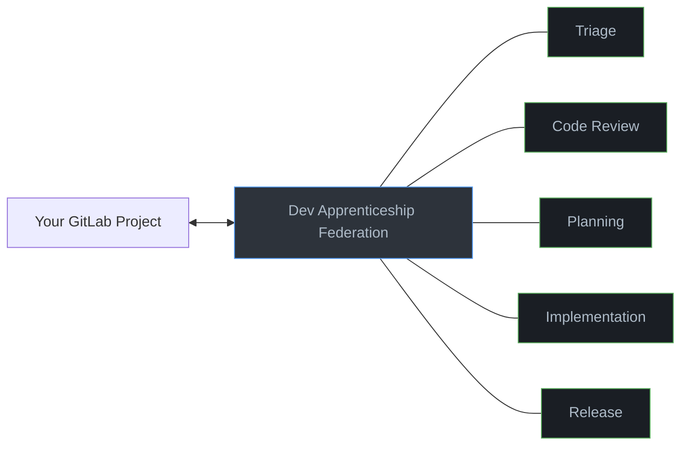
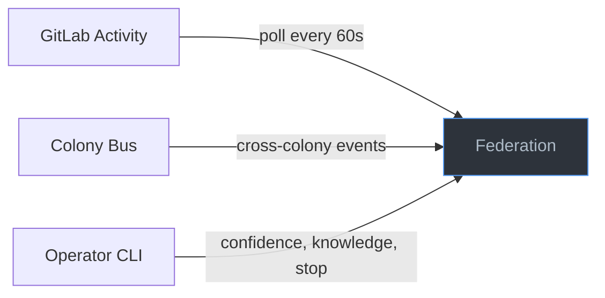
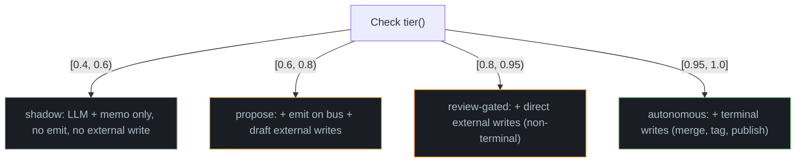

# Dev Apprenticeship

  

A federation of 21 agents that learns how you work by watching your GitLab activity. It observes how you triage issues, review merge requests, plan features, write code, and ship releases. Over time it takes over the mechanical parts, while you keep control over the decisions that matter.

The federation starts silent. Agents only watch. As you see what they are learning in the logs and trust what they would do, you progressively unlock autonomy by raising each agent's confidence memo through four named tiers — `shadow` (observe), `propose` (suggest), `review-gated` (act under review), and `autonomous` (act alone). The tier contract is defined in [`doc/adr/ADR-0001-confidence-tiers.md`](../doc/adr/ADR-0001-confidence-tiers.md) and is normative for every agent in this federation. Agents do not promote themselves; the gradient is operator-controlled. You can always veto or demote.

As knowledge accumulates, agents rely more on stored patterns and less on LLM inference. Early ticks are LLM-heavy (learning your style, generating summaries). Mature agents resolve most decisions from knowledge recall alone, falling back to the LLM only for novel situations.


```mermaid
graph LR
    GL["Your GitLab Project"]
    FED["Dev Apprenticeship Federation"]
    TR["Triage"]
    CR["Code Review"]
    PL["Planning"]
    IM["Implementation"]
    RE["Release"]

    GL <--> FED
    FED --- TR
    FED --- CR
    FED --- PL
    FED --- IM
    FED --- RE

    style FED fill:#2d333b,stroke:#539bf5,color:#adbac7
    style TR fill:#1a1e24,stroke:#57ab5a,color:#adbac7
    style CR fill:#1a1e24,stroke:#57ab5a,color:#adbac7
    style PL fill:#1a1e24,stroke:#57ab5a,color:#adbac7
    style IM fill:#1a1e24,stroke:#57ab5a,color:#adbac7
    style RE fill:#1a1e24,stroke:#57ab5a,color:#adbac7
```

## What you need

- [Agentis](https://github.com/Replikanti/agentis) runtime **>= v1.4.0** (provides the `tier()` builtin required by the four-tier confidence gating in all 21 agents)
- An LLM backend (Claude CLI, Ollama, or any OpenAI-compatible API)
- GitLab instance with API access (personal access token with `api` scope)
- Python 3 and git

## Installation

```bash
git clone https://github.com/Replikanti/agentis-colonies.git
cd agentis-colonies/dev-apprenticeship
./install.sh
```

The install script checks prerequisites, creates configs for all 5 colonies, writes your GitLab credentials, and seeds agent confidence levels. Running it again is safe.

## Starting and stopping

```bash
./start-federation.sh           # Start all 5 colonies (21 agents)
agentis daemon stop --all       # Stop everything
```

> Agents must be launched via `start-federation.sh` or a colony's
> `start-colony.sh`. Those scripts export `COLONY_DIR`, which the
> agents expand inside `exec sh "$COLONY_DIR/scripts/..."` at runtime.
> Launching `agentis daemon <agent>.ag` directly bypasses that export,
> so `$COLONY_DIR` expands to empty and GitLab polling fails silently.

## Monitoring

### Dashboard

A web dashboard that shows agent health, confidence levels, phase readiness with ETA, knowledge growth trends, remediation history, and a live suggestion feed. Auto-refreshes every 60 seconds. Includes a kill switch (two-click safety) to stop the entire federation from the browser.

Per-agent **confidence bump** controls (▲▼) in the Confidence Levels card walk each agent through the canonical tier ladder: `shadow` (0.4) → `propose` (0.6) → `review-gated` (0.8) → `autonomous` (0.95). Promotions to `autonomous` trigger a confirmation dialog since at that level the agent performs terminal external writes (merge, tag, publish) without a second gate. Every change is appended to `.dashboard/confidence-log.jsonl` for audit. The CLI path (`agentis memo set <agent>:confidence <value>`) still works and is equivalent.

```bash
./dashboard.sh                  # http://localhost:8420
./dashboard.sh 9000             # custom port
```

The dashboard auto-discovers colonies and agents from the directory structure. It persists history in `.dashboard/history.json` so trends survive restarts.

### Right after start

Verify everything is alive:

```bash
agentis daemon list             # 21 processes, all STATE=running?
agentis federation status       # 5 colonies connected?
tail .agentis/logs/router.log   # See "[router] GitLab poll..." lines?
```

### First day

Verify agents are learning:

```bash
agentis knowledge stats         # Knowledge entries growing?
agentis memo get router:confidence  # Confidence at 0.4 (shadow seed)?
agentis stats                   # CB consumption per agent
```

### Ongoing

Check daily or when something feels off:

```bash
agentis daemon list             # Check HEALTH and QUARANTINE columns
agentis colony health           # Health per colony
agentis colony ps               # Agent lifecycle states
agentis remediation history     # Any auto-remediation actions?
```

### Warning signs

| Signal | Meaning | Action |
|--------|---------|--------|
| STATE=stopped in daemon list | Agent crashed, watchdog gave up | Check log, restart the colony |
| QUARANTINE=yes | Agent failed repeatedly, runtime isolated it | `agentis quarantine status <agent>`, fix cause, `agentis quarantine promote <agent>` |
| knowledge stats shows 0 after a day | Agents see no GitLab activity | Check token, project path, verify project has recent activity |
| One log growing much faster than others | Agent hitting errors repeatedly | `tail .agentis/logs/<agent>.log` |
| remediation history shows entries | System detected an anomaly and responded | `agentis remediation history --json` for details |

## How work enters the system

Agents pick up work from three sources:

1. **GitLab polling**: Every 60 seconds, agents poll for new issues, merge requests, pipeline results, and review activity. This is the primary input. If something changes on GitLab, the relevant colony reacts on the next tick.

2. **Colony bus events**: Colonies pass work to each other over the federation bus. When triage routes an issue, the implementation colony picks it up. When implementation opens an MR, the code-review and release colonies react. You do not need to trigger these handoffs manually.

3. **Operator commands**: You can intervene directly via the agentis CLI. Adjust confidence (`agentis memo set labeler:confidence 0.95`), inspect knowledge (`agentis knowledge list`), or stop individual agents. The CLI is your control plane.


```mermaid
graph LR
    GL["GitLab Activity"]
    BUS["Colony Bus"]
    CLI["Operator CLI"]
    FED["Federation"]

    GL -- "poll every 60s" --> FED
    BUS -- "cross-colony events" --> FED
    CLI -- "confidence, knowledge, stop" --> FED

    style FED fill:#2d333b,stroke:#539bf5,color:#adbac7
```

## Confidence tiers

What agents do depends on their current tier. See [`doc/adr/ADR-0001-confidence-tiers.md`](../doc/adr/ADR-0001-confidence-tiers.md) for the normative contract.


```mermaid
graph TD
    CHECK["Check tier()"]
    SHA["shadow: LLM + memo only, no emit, no external write"]
    PRO["propose: + emit on bus + draft external writes"]
    RG["review-gated: + direct external writes (non-terminal)"]
    AUT["autonomous: + terminal writes (merge, tag, publish)"]

    CHECK -- "[0.4, 0.6)" --> SHA
    CHECK -- "[0.6, 0.8)" --> PRO
    CHECK -- "[0.8, 0.95)" --> RG
    CHECK -- "[0.95, 1.0]" --> AUT

    style SHA fill:#1a1e24,stroke:#636e7b,color:#adbac7
    style PRO fill:#1a1e24,stroke:#c69026,color:#adbac7
    style RG fill:#1a1e24,stroke:#ff8800,color:#adbac7
    style AUT fill:#1a1e24,stroke:#57ab5a,color:#adbac7
```

Agents below `0.4` are `dormant` — not yet admitted to the ladder. Fresh federations seed every agent at `0.4` (shadow).

**Start at 0.4 (shadow)**. Agents watch your GitLab activity and build knowledge. Check logs to see what they are learning: `tail -f .agentis/logs/labeler.log`

**Promote to 0.6 (propose)** when you trust what they have learned. Agents emit suggestions to the colony bus and draft external writes marked as non-authoritative. They do not post directly on your behalf. Watch all suggestions in one stream:

```bash
agentis memo set labeler:confidence 0.6
./watch-suggestions.sh          # Live feed from all 21 agent logs
```

**Promote to 0.8 (review-gated)** when proposals have been reliable. Agents now post directly on GitLab (non-terminal writes: comments, non-draft MRs). Terminal actions (merge, tag, publish, credential rotation) still require an explicit second gate.

```bash
agentis memo set labeler:confidence 0.8
```

**Promote to 0.95 (autonomous)** when the agent has demonstrated sustained success under the review gate. At this tier the agent may perform terminal writes without a second approver. Start with low-risk agents (labeler, style_reviewer) before promoting high-impact ones (code_writer, approval_decider).

```bash
agentis memo set labeler:confidence 0.95
```

| Colony | Autonomous actions |
|--------|--------------------|
| Triage | Creates issues, applies labels, sets priority, assigns people |
| Code Review | Posts review comments, approves MRs, requests changes |
| Planning | Posts scope/risk/breakdown plans as issue comments |
| Implementation | Creates branches, commits code and tests, opens MRs |
| Release | Runs pre-release checks, posts ship decisions, creates tags and releases |

You can always demote an agent back: `agentis memo set labeler:confidence 0.4`

## Security

Your GitLab personal access token is stored in plaintext in 5 files:

```
<colony>/config/colony.toml     # token = "glpat-..."
```

`install.sh` sets these to mode 0600 (owner-only). If you move a federation directory to a multi-user system or copy configs manually, re-run `chmod 600 <colony>/config/colony.toml` on each.

Rotate tokens periodically via GitLab (User Settings -> Access Tokens). Re-run `./install.sh` and answer `Y` to the "Update GitLab credentials" prompt — it accepts a new token without rewriting the colony templates.

Out-of-scope (not implemented): integration with a system secret store (Secret Service, macOS Keychain, `pass`). If you need that today, replace `token = "..."` with a reference your shell evaluates before starting the federation.

## What to expect

**Day 1**: Nothing visible. Agents are silent in `shadow` (seeded at 0.4). Check `agentis daemon list` and logs to confirm they are polling.

**Week 1-2**: Knowledge entries accumulate from your GitLab activity. Run `agentis knowledge list` to inspect.

**After promotion**: Proposals appear in logs at `propose` (0.6), direct non-terminal writes on GitLab at `review-gated` (0.8), and terminal writes (merge/tag/publish) at `autonomous` (0.95). Knowledge keeps growing with every tick. The runtime slowly decays the per-entry confidence score that `learn()` attaches to each unvalidated knowledge row (`knowledge.confidence_decay_rate`, default 0.01/hr, floor `knowledge.confidence_decay_min` 0.05; validated entries are left alone), which is a separate dial from the per-agent promotion level — it affects how much weight an old entry carries inside an agent, not which tier the agent is running at.

## Auto-confidence from feedback (#106)

Suggestions don't just sit in logs — participating agents score themselves against what you actually did. The loop is:

1. Agent emits a proposal in `propose` tier (confidence 0.6–0.8) and stashes a "pending verdict" — issue/MR id plus the payload it proposed.
2. On a later tick, agent fetches the current GitLab state of the artifact and compares.
3. Exact match → confidence `+0.02`. Partial match → `+0.005`. Mismatch → `-0.01`. Still no operator action → leave pending, re-check next tick.
4. Verdicts that age past 24 h without operator action are dropped without scoring — absence is not evidence of wrong suggestion.

**Autonomy cap**. Auto-promotion stops at **0.85** (within `review-gated`). Positive deltas above the cap are clipped; the agent has to earn *review-gated trust* automatically, but you still have to manually bump it across the `autonomous` boundary at 0.95 (via the dashboard ▲ button or `agentis memo set <agent>:confidence 0.95`) before it is permitted to perform terminal writes (merge, tag, publish). This is deliberate — the auto-loop earns propose/review-gated trust from matching your style; terminal autonomy is your call. Negative deltas are not capped, so a confident agent that goes off the rails can still be pulled back down.

**Phase 1 scope** (what ships today). The feedback loop is wired into the `labeler` agent as the reference implementation. Suggested labels are compared against the labels you actually apply to the issue (set overlap). The remaining four reference agents — `style_reviewer`, `plan_reviewer`, `code_writer`, `version_bumper` — will follow in separate PRs using the same pattern. Each needs its own matcher (did the MR get merged? was the plan followed? was the version tagged?) but the infrastructure (`clamp_auto`, `signal_to_delta`, `apply_feedback`, `record_*_verdict`, `evaluate_*_verdict`, `get-issue` gitlab-api subcommand) is in place.

**Config knobs** live in each colony's `config/colony.toml` under `[feedback]`. The current shipment reads the defaults directly from the agent source (`match_rate = 0.02`, `partial_rate = 0.005`, `mismatch_rate = 0.01`, `timeout_s = 86400`, `autonomy_cap = 0.85`). The TOML section is declared so you can see where runtime-configurable knobs will land without a future config rewrite being disruptive.

**Observability**. Every delta prints one line to the agent's log: `[labeler] feedback delta 0.02 confidence 0.62 -> 0.64`. Grep that prefix to audit every confidence change the agent made to itself. The dashboard's per-agent confidence bar reflects the current memo value regardless of how it moved.

**Why not auto-promote into `autonomous`**. The cap makes the honest claim match the observed behavior: *agents learn to propose and act-under-review well*. Promoting them into terminal-write territory ought to be an explicit operator decision, not a drift that happened while you weren't looking.

## Colonies

| Colony | Agents | What it learns |
|--------|--------|---------------|
| [Triage](./triage/) | 4 | Issue creation, labeling, prioritization, routing |
| [Code Review](./code-review/) | 5 | Style, logic, security, test coverage review, approval decisions |
| [Planning](./planning/) | 4 | Scope estimation, risk assessment, task decomposition, plan review |
| [Implementation](./implementation/) | 4 | Code generation, test writing, refactoring, commit conventions |
| [Release](./release/) | 4 | Pre-release checks, ship decisions, changelogs, versioning |

Cross-colony wiring: Triage routes issues to Implementation. Implementation signals Code Review and Release when an MR is ready. See individual colony READMEs for internal event wiring.

## Knowledge portability

Every `learn()` call in the federation's agents tags entries with one of `observed` (shadow tier: passive learning from GitLab activity), `emitted` (propose tier: suggestion logged with draft external write), or `acted` (review-gated / autonomous tier: direct external write) plus the colony name (`triage`, `code-review`, `planning`, `implementation`, `release`).

**Personal vs team (`#104`).** If you set your GitLab username during `./install.sh` (or in `colony.toml` under `[gitlab] me = "..."`), three agents (`labeler`, `prioritizer`, `style_reviewer`) additionally tag their `acted` learn calls as either `personal` (the issue/MR author matches your username) or `team` (anyone else). The remaining agents still tag only `observed|emitted|acted` + colony; widening coverage is tracked as future work. If you leave the username empty, every entry keeps the legacy `team` tag so exports stay stable.

Bulk export/import is available at the runtime level and will carry all entries as-is:

```bash
agentis knowledge export > fed-knowledge.json
agentis knowledge export --tags personal > my-preferences.json  # carry just your style
agentis knowledge import fed-knowledge.json --merge
```

Filtering by `--tags observed`, `--tags emitted`, `--tags acted`, `--tags <colony>`, `--tags personal`, or `--tags team` works once the matching agents have acted at least once with the relevant author context.

## Troubleshooting

**Agents are silent after starting**: Expected in `shadow` tier (seed 0.4). Check `agentis daemon list`. If running, check logs: `tail -f .agentis/logs/router.log`.

**"GitLab poll failed"**: Token lacks `api` scope, or the project path is wrong.

**"Config not found"**: Run `./install.sh` or copy the template: `cp config/colony.example.toml config/colony.toml`

**LLM errors**: Check your backend configuration in `.agentis/config`. For CLI backends, verify the command works in your terminal. For HTTP backends, verify the endpoint is reachable and the API key is set.

**Agents not learning**: Run `agentis knowledge list`. If empty after several ticks, verify the GitLab project has recent activity.

**Log growth**: Logs go to `.agentis/logs/<agent>.log` with no built-in rotation. Volume is low (a few lines per tick per agent), but with 21 agents running continuously and occasional error loops (e.g. a bad GitLab token causing one log line per retry × 6 retries × per tick) individual logs can reach tens of megabytes per day. A sample logrotate config lives at `ops/logrotate.conf` — copy it into `/etc/logrotate.d/` (requires sudo) and adjust the path to your federation root, or adapt it for a user-level cron if you prefer not to touch system logrotate.

As a zero-config fallback, `start-federation.sh` can be asked to truncate logs on start by setting `TRUNCATE_LOGS=1` in the environment. This keeps disk usage bounded between manual restarts but loses history — use logrotate for long-running federations.

## Extension points

Terminal colony bus events with no internal listener, meant for external consumption (webhooks, dashboards, custom agents):

| Event | Emitter | When |
|-------|---------|------|
| `triage:label_suggestion` | labeler | `propose` tier: label suggestion for human review |
| `triage:priority_suggestion` | prioritizer | `propose` tier: priority suggestion for human review |
| `review:decision_suggestion` | approval_decider | `propose` tier: approve/reject suggestion |
| `review:escalation` | approval_decider | `review-gated` / `autonomous`: MR requires human attention |
| `planning:draft_plan` | plan_reviewer | `propose` tier: assembled plan for human review |
| `release:version_bumped` | version_bumper | After tag/release creation or version bump suggestion |

## Auto-promote / auto-evolve (#148)

An external cron script that evaluates per-agent fitness from experience data and decides when to promote (raise confidence) or evolve (mutate `.ag` source). Runs outside the federation, reads state via `agentis daemon list --json` and experience JSONL files.

### Quick start

```bash
# Dry-run (default) — log what would happen, take no action:
./tools/auto-promote.sh dev-apprenticeship

# Live mode — actually promote/evolve:
./tools/auto-promote.sh dev-apprenticeship --live

# Cron entry (every 30 minutes):
# */30 * * * * cd /path/to/agentis-colonies && ./tools/auto-promote.sh dev-apprenticeship >> /var/log/auto-promote.log 2>&1
```

Configuration lives in `tools/auto-promote-config.yaml`. Decisions are journaled to `tools/auto-promote-journal.jsonl` (append-only, one JSON line per decision).

### Decision rules

**Promote** (confidence step-up along the three-step ladder `0.4 → 0.6 → 0.8 → 0.95`, i.e. `shadow → propose → review-gated → autonomous`):
- Minimum 200 experience entries
- At least 48 hours of runtime
- Reject rate below 5%
- Delta slope non-negative over last 100 entries

**Evolve** (`.ag` source mutation via `agentis evolve`):
- Negative delta slope sustained over 1000 entries, OR
- Reject rate above 20%

### Safety guards

1. **Federation check**: exits cleanly when `agentis daemon list --json` returns empty
2. **Lock file**: `tools/.auto-promote.lock` prevents overlapping cron runs
3. **Confidence seeded**: skips agents where `recall_latest` returns null
4. **PID liveness**: `kill -0` check before acting on a daemon
5. **Dry-run default**: all actions are logged but not executed until you flip `dry_run: false` in the config

### Roadmap: 3 layers of self-governance

| Layer | Where | Status |
|-------|-------|--------|
| **1 — External cron** | `tools/auto-promote.sh` | Shipped (#148) |
| **2 — Supervisor agent** | `meta/agents/conductor.ag` | Planned (separate ticket) |
| **3 — Daemon self-decide** | agentis-core | Long-horizon (needs months of L1+L2 data) |

**Layer 1** (this) runs as a dumb cron job. It cannot observe the federation in real time — it snapshots state once per invocation, evaluates rules, and exits. Good enough for 30-minute decision cadence.

**Layer 2** lifts the same logic into a native `.ag` agent (`conductor.ag`) running inside a new `meta` colony. The supervisor ticks every 5 minutes, reads other agents' state via the agentis API, and emits structured `promote`/`evolve` events. The federation learns how to manage itself — and you can evolve the supervisor too. Requires agentis-core support for cross-agent state reads (currently sandboxed).

**Layer 3** gives each daemon a self-governance loop: track own metrics, decide when to self-promote, write memo, signal restart. Most invasive design with open questions about uncontrolled escalation. Out of scope until layers 1+2 have run for months and we have data on whether self-promote is desirable.
