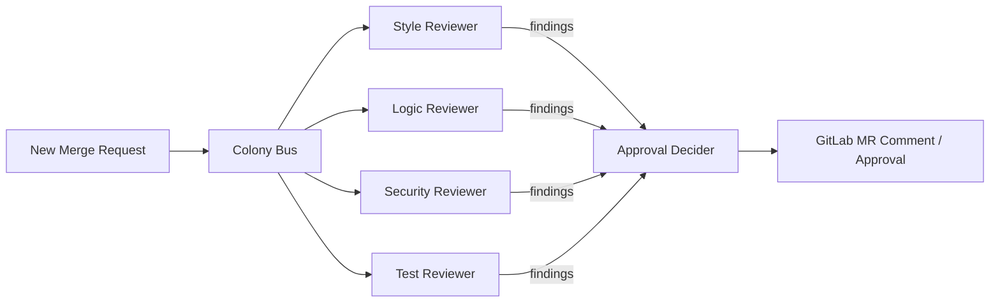

# Code Review Colony

> Part of the [Dev Apprenticeship](../) federation.

A colony of five specialized agents that learn how you review code. They observe your merge request interactions on GitLab (what you approve, what you flag, what you dismiss) and gradually take over routine review work.

> **Fresh colony is silent by default.** Every agent's confidence starts at `0.0` (observe-only) and stays there until you seed the memo store. See [Confidence gradient](../README.md#confidence-gradient) in the federation README for the ramp procedure.

## Agents

| Agent | File | Learns | Autonomy after |
|-------|------|--------|----------------|
| Style Reviewer | `agents/style_reviewer.ag` | Naming conventions, formatting preferences, import ordering | ~10 observations |
| Logic Reviewer | `agents/logic_reviewer.ag` | Edge cases, off-by-one errors, null handling, race conditions | ~20 observations |
| Security Reviewer | `agents/security_reviewer.ag` | Injection risks, auth checks, secret exposure, dependency vulnerabilities | ~15 observations |
| Test Reviewer | `agents/test_reviewer.ag` | Coverage expectations, test quality, missing edge case tests | ~15 observations |
| Approval Decider | `agents/approval_decider.ag` | When to approve, request changes, or escalate (aggregates findings from other reviewers) | ~25 observations |

## How It Works



When a new merge request appears, all four reviewers analyze it in parallel, each from their own perspective. They publish findings to the colony bus. The Approval Decider aggregates those findings, weighs severity, and produces the final review action: approve, request changes, or escalate to the human.

## Setup

1. Copy and edit the config:
   ```bash
   cp config/colony.example.toml config/colony.toml
   ```

2. Configure your GitLab connection:
   ```toml
   [gitlab]
   url = "https://gitlab.example.com"
   token = "glpat-..."
   project = "your-org/your-project"
   ```

3. Configure the LLM backend:
   ```toml
   [llm]
   # Only "backend" is read today. "cli" uses the agentis daemon default CLI adapter.
   backend = "cli"
   ```

4. Start the colony:
   ```bash
   ./scripts/start-colony.sh
   ```

## Providing Feedback

For now, the colony learns passively by watching your existing GitLab review comments: the agents call `learn()` with patterns extracted from human review notes on merge requests. Just keep reviewing code the way you normally do.

An explicit feedback channel (for approving or dismissing individual findings) is planned for a future version.

## Monitoring

```bash
# Colony status
agentis colony status

# Watch a specific agent
tail -f .agentis/logs/logic_reviewer.log
```

## Knowledge

After running for a while, inspect what the colony has learned:

```bash
# List all knowledge entries
agentis knowledge list

# Export personal knowledge (portable to other projects)
agentis knowledge export --tags personal > my-preferences.json

# Import on a new project
agentis knowledge import my-preferences.json --merge
```
