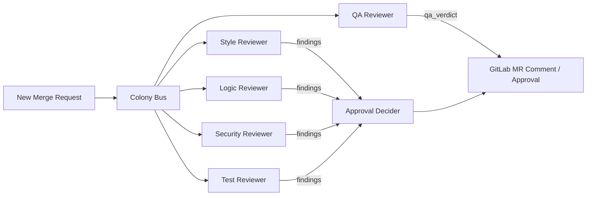

# Code Review Colony

> Part of the [Dev Apprenticeship](../) federation.

A colony of six specialized agents that learn how you review code. They observe your merge request interactions on GitLab (what you approve, what you flag, what you dismiss) and gradually take over routine review work.

> **Fresh colony is silent by default.** Every agent's confidence starts at `0.0` (observe-only) and stays there until you seed the memo store. See [Confidence gradient](../README.md#confidence-gradient) in the federation README for the ramp procedure.

## Agents

| Agent | File | Learns | Autonomy after |
|-------|------|--------|----------------|
| Style Reviewer | `agents/style_reviewer.ag` | Naming conventions, formatting preferences, import ordering | ~10 observations |
| Logic Reviewer | `agents/logic_reviewer.ag` | Edge cases, off-by-one errors, null handling, race conditions | ~20 observations |
| Security Reviewer | `agents/security_reviewer.ag` | Injection risks, auth checks, secret exposure, dependency vulnerabilities | ~15 observations |
| Test Reviewer | `agents/test_reviewer.ag` | Coverage expectations, test quality, missing edge case tests | ~15 observations |
| QA Reviewer | `agents/qa_reviewer.ag` | Pre-merge QA: completeness of the diff vs the linked issue, description claims vs the committed diff, and a default-skeptical adversarial refutation | ~15 observations |
| Approval Decider | `agents/approval_decider.ag` | When to approve, request changes, or escalate (aggregates findings from other reviewers) | ~25 observations |

## How It Works


```mermaid
graph LR
    MR["New Merge Request"]
    SR["Style Reviewer"]
    LR["Logic Reviewer"]
    SCR["Security Reviewer"]
    TR["Test Reviewer"]
    QA["QA Reviewer"]
    AD["Approval Decider"]
    GL["GitLab MR Comment / Approval"]
    CB["Colony Bus"]

    MR --> CB
    CB --> SR
    CB --> LR
    CB --> SCR
    CB --> TR
    CB --> QA
    SR -- findings --> AD
    LR -- findings --> AD
    SCR -- findings --> AD
    TR -- findings --> AD
    QA -- qa_verdict --> GL
    AD --> GL
```

When a new merge request appears, all four advisory reviewers analyze it in parallel, each from their own perspective. They publish findings to the colony bus. The Approval Decider aggregates those findings, weighs severity, and produces the final review action: approve, request changes, or escalate to the human. The QA Reviewer runs a separate pre-merge QA pass (see below) whose verdict lands as its own MR note; gating approval on that verdict is a planned follow-up (step 3 of #1359).

## Pre-merge QA verdict (#1401, #1405)

`qa_reviewer` is a QA pass **distinct from** the advisory logic/security/style/test notes. For each open, non-draft MR it judges three dimensions:

1. **completeness** — does the committed diff actually address the whole linked issue (resolved from the `fix/issue-<n>` branch name, else a closing-keyword reference — `Fixes`/`Closes`/`Resolves #<n>` — in the description, [#1514](https://github.com/Replikanti/agentis-colonies/issues/1514); a bare `#<n>` context mention is no longer used) and every site/test the MR description claims to touch? Partial or claim-only changes fail.
2. **description-vs-diff** — is every claim in the MR description backed by the committed diff? Overstatements fail (e.g. "audits every X" / "adds a regression test" with no such test in the diff — cross-ref #1349).
3. **adversarial** (#1405) — an independent, **default-skeptical** second opinion that actively tries to **refute** the change: given the MR diff and the linked issue it hunts for one concrete input/state/sequence where the change is wrong, incomplete, or breaks an adjacent consumer. It is framed to refute, never to summarize; a concrete refutation fails the dimension with a one-line reason.

It posts ONE structured verdict note per MR head:

```
QA verdict: completeness=pass|fail, description-vs-diff=pass|fail, adversarial=pass|fail
- completeness: <one-line reason, only when failed>
- description-vs-diff: <one-line reason, only when failed>
- adversarial: <one-line refutation, only when failed>
```

**Cross-provider adversarial backend (optional).** By default the adversarial refutation runs through the colony's own LLM backend (the same one `prompt()` uses). When the operator sets the `QA_ADVERSARIAL_LLM_CMD` env var to an alternative `llm.command` backend (e.g. a different provider's wrapper script), the refutation is instead piped through *that* command (prompt on stdin, reply on stdout — the same contract `flat-cyborg-claude.sh` honours), so the second opinion can come from an independent model. The env var only **reroutes** the dimension; its absence never disables it.

The note is memo-deduped on a fingerprint of the MR diff (`qa_reviewer:verdict_head:<iid>`), so an unchanged MR is never re-prompted or re-posted; a new push re-triggers a fresh verdict. Tier semantics match the other reviewers: shadow observes (memo + learn only), propose emits `review:qa_verdict` on the bus, review-gated posts a draft-flagged note, autonomous posts the note directly. `review:qa_verdict` is an extension point until #1359 step 3 wires it into `approval_decider` — gating approval/merge on the QA verdict remains out of scope here.

## Early-exit on quiet ticks (#147)

`logic_reviewer`, `style_reviewer`, `security_reviewer`, and `approval_decider` follow the federation's **delta-check + early-exit** convention so a quiet repo costs ~0 LLM calls/h:

- **MR reviewers** (`logic`, `style`, `security`): a single `forge-api.sh merge-requests --since <last_check> --view reviewer` call filters server-side. An empty response (`[]`) → refresh `last_check` and `return` before any `prompt()`.
- **Approval decider**: has no forge poll. It listens on four bus topics (`review:{style,logic,security,test}_findings`); when all four `listen()` calls return Void (the empty inbox case), `return` before any `prompt()`. `last_check` is still refreshed on the early-exit path so operators can distinguish "nothing to do" from "daemon stalled".

See `agents/logic_reviewer.ag` for the canonical MR-reviewer shape and `agents/approval_decider.ag` for the event-driven variant.

## Setup

1. Copy and edit the config:
   ```bash
   cp config/colony.example.toml config/colony.toml
   ```

2. Configure your forge connection. For GitLab:
   ```toml
   [forge]
   type = "gitlab"

   [forge.gitlab]
   url     = "https://gitlab.example.com"
   token   = "glpat-..."
   project = "your-org/your-project"
   ```
   For GitHub, set `[forge].type = "github"` and populate `[forge.github]` (see `colony.example.toml`).

3. (Optional) Pin a per-colony LLM backend via the `[llm]` block in `colony.toml` (#319). Each set key is spliced onto every daemon as `--config-override llm.<key>=<value>`; absent keys fall through to the federation-wide default in `<fed>/.agentis/config`. See `dev-apprenticeship/README.md#llm-backend-per-colony-override-319`.
   ```toml
   [llm]
   backend = "cli"
   # command = "claude"
   # model = "claude-sonnet-4"
   # api_key_env = "ANTHROPIC_API_KEY"
   ```

4. Start the colony:
   ```bash
   ./scripts/start-colony.sh
   ```

## Providing Feedback

For now, the colony learns passively by watching your existing GitLab review comments: the agents call `learn()` with patterns extracted from human review notes on merge requests. Just keep reviewing code the way you normally do.

An explicit feedback channel (for approving or dismissing individual findings) is planned for a future version.

## Monitoring

```bash
# Colony status
agentis daemon list

# Watch a specific agent
tail -f .agentis/logs/logic_reviewer.log
```

## Knowledge

After running for a while, inspect what the colony has learned:

```bash
# List all knowledge entries
agentis knowledge list

# Filter by real tags this colony emits
agentis knowledge list --tags code-review
agentis knowledge list --tags observed      # shadow-tier passive learning
agentis knowledge list --tags emitted       # propose-tier suggestions
agentis knowledge list --tags review-gated  # review-gated direct non-terminal writes
agentis knowledge list --tags acted         # autonomous terminal writes

# style_reviewer additionally tags its direct-write (review-gated + acted)
# branches with `personal` or `team` based on the MR author (requires
# `[forge.gitlab] me = "..."` / `[forge.github] me = "..."` in colony.toml
# — see dev-apprenticeship/README.md).
agentis knowledge list --tags personal      # style_reviewer on your MRs
agentis knowledge list --tags team          # style_reviewer on others' MRs

# Bulk export/import (carries every entry as-is)
agentis knowledge export > review-knowledge.json
agentis knowledge import review-knowledge.json --merge
```
