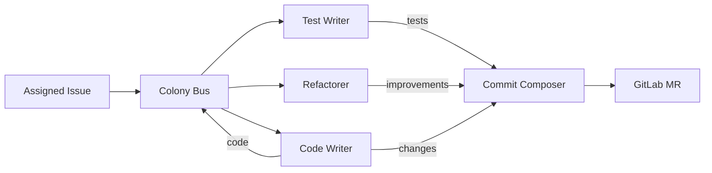

# Implementation Colony

> Part of the [Dev Apprenticeship](../) federation.

A colony of four agents that learn how you write code. They observe your commits, merge requests, and code patterns on GitLab — learning your conventions, test habits, and refactoring style.

## Agents

| Agent | File | Learns | Autonomy after |
|-------|------|--------|----------------|
| Code Writer | `agents/code_writer.ag` | Code patterns, idioms, naming conventions, architecture preferences | ~30 observations |
| Test Writer | `agents/test_writer.ag` | Test structure, assertion style, coverage expectations, fixture patterns | ~20 observations |
| Refactorer | `agents/refactorer.ag` | Code smells you fix, refactoring patterns, when to extract vs inline | ~25 observations |
| Commit Composer | `agents/commit_composer.ag` | Commit message conventions, change grouping, what goes in one commit vs many | ~10 observations |

## How It Works



When an issue is assigned, the Code Writer produces an implementation draft. The Test Writer generates tests and the Refactorer suggests improvements — both informed by what the Code Writer produced. The Commit Composer packages everything into well-structured commits following learned conventions and opens a merge request.

## Setup

1. Copy and edit the config:
   ```bash
   cp config/colony.example.toml config/colony.toml
   ```

2. Configure your GitLab connection in `colony.toml`.

3. Start the colony:
   ```bash
   ./scripts/start-colony.sh
   ```
