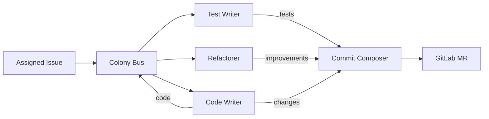

# Implementation Colony

> Part of the [Dev Apprenticeship](../) federation.

A colony of four agents that learn how you write code. They observe your commits, merge requests, and code patterns on GitLab, learning your conventions, test habits, and refactoring style.

## Agents

| Agent | File | Learns | Autonomy after |
|-------|------|--------|----------------|
| Code Writer | `agents/code_writer.ag` | Code patterns, idioms, naming conventions, architecture preferences | ~30 observations |
| Test Writer | `agents/test_writer.ag` | Test structure, assertion style, coverage expectations, fixture patterns | ~20 observations |
| Refactorer | `agents/refactorer.ag` | Code smells you fix, refactoring patterns, when to extract vs inline | ~25 observations |
| Commit Composer | `agents/commit_composer.ag` | Commit message conventions, change grouping, what goes in one commit vs many | ~10 observations |

## How It Works


```mermaid
graph LR
    IS["Assigned Issue"]
    CW["Code Writer"]
    TW["Test Writer"]
    RF["Refactorer"]
    CC["Commit Composer"]
    GL["GitLab MR"]
    CB["Colony Bus"]

    IS --> CB
    CB --> CW
    CW -- code --> CB
    CB --> TW
    CB --> RF
    TW -- tests --> CC
    RF -- improvements --> CC
    CW -- changes --> CC
    CC --> GL
```

When an issue is assigned, the Code Writer produces an implementation draft. The Test Writer generates tests and the Refactorer suggests improvements, both informed by what the Code Writer produced. The Commit Composer packages everything into well-structured commits following learned conventions and opens a merge request.

## Code generation: the checkout-edit path

On the autonomous tier the Code Writer does not round-trip file content through the LLM transcript. Instead it edits a **real local git checkout** and the federation commits the resulting `git diff` (Approach A, #1210). A detached launcher (`tools/code-edit-job.sh`, via `setsid`) runs `tools/code-edit-in-checkout.sh` in the background; the agent polls for completion across ticks and opens the PR/MR when the job finishes. This works on both **GitHub** and **GitLab** (`FORGE_TYPE`), and editing a real tree sidesteps the TUI screen-scrape corruption the old edit-JSON path suffered on large files.

Since v2.4.0 the attempt / continuation / verify / finalize loop is **driven by `code_writer.ag` itself** ([#1354](https://github.com/Replikanti/agentis-colonies/issues/1354)): the agent fires one `--one-attempt` / `--reuse` / `--finalize` primitive per tick instead of delegating the whole multi-attempt loop to the shell orchestrator. The `[implementation] ag_driven_edit_loop` config key controls it — an **absent key resolves to ON**; only an explicit `false`/`0`/`no`/`off` opts back into the legacy in-shell loop. **Epic-class issues (`--decompose`) default to the in-shell path**; the `AG_DECOMPOSE_LOOP` knob (default OFF, [#1422](https://github.com/Replikanti/agentis-colonies/issues/1422) M1+M2) opts an epic into the AG-driven decompose loop, where `code_writer` decomposes the epic and drives the subtasks on one branch → one PR. The default keeps epics on the untouched in-shell `--decompose` loop until the M3 burn-in ([#1537](https://github.com/Replikanti/agentis-colonies/issues/1537)) flips it and deletes the in-shell path.

### Complex (multi-file) tasks

The orchestrator handles tasks bigger than a single edit. All knobs are environment variables exported into the daemon's environment before `start-federation.sh`. `code_writer` launches the edit worker via `exec sh`, which runs under the **sanitized** env (agentis strips every var not on `exec.env_passthrough`), so each knob below is registered on that allowlist by `install.sh` — an operator export reaches `code-edit-in-checkout.sh` only because of that registration ([#1460](https://github.com/Replikanti/agentis-colonies/issues/1460); the same #1428 class that hit `getenv()` knobs). A hand-customized allowlist that drops one silently falls back to the default (`install.sh` warns loudly; `tools/check-getenv-allowlist.sh` enforces it in CI).

| Knob | Default | Effect |
|------|---------|--------|
| `CODE_EDIT_MAX_ATTEMPTS` | `3` | Re-drive a session that timed out **with progress** ("you were interrupted, finish it") instead of giving up after one shot. |
| `CODE_EDIT_TOTAL_BUDGET_MS` | `1500000` | Overall wall-clock budget across all attempts. |
| `CODE_EDIT_TIMEOUT_MS` | `600000` | Per-attempt flat-cyborg edit timeout. |
| `CODE_EDIT_VERIFY_CMD` | _(auto)_ | Verify gate run after a settled attempt, inside the checkout, token-scrubbed. An explicit command wins; otherwise it auto-detects `npm test` / `make test` / `pytest`; if none, it falls back to a fast change-scoped check (`bash -n` + `shellcheck` on changed shell files, and runs any changed `test-*.sh`). A red gate is fed back and re-driven until green or the budget runs out — the PR's own CI is the authoritative full gate. Set to `true` to force-skip. |
| `CODE_EDIT_VERIFY_TIMEOUT_MS` | `300000` | Verify gate timeout. |
| `CODE_EDIT_MAX_SUBTASKS` | `8` | With `--decompose`, the cap on the number of sub-edits an epic is split into (run one-per-subtask on one branch → one PR). |
| `CODE_EDIT_MODEL` | `opus` | `claude --model` for the editing session (workload-based routing, #1414 — reasoning sessions run on `sonnet` via `CLAUDE_REASONING_MODEL`). |
| `CODE_EDIT_EFFORT` | `high` | `claude --settings effortLevel` for the editing session (invalid values fall back to `high`). |

The Code Writer passes `--decompose` automatically when the assigned issue carries the epic label (`planning:labels:epic`, default `epic`, #1257); ordinary issues stay single-shot. Each detached job runs in a **per-issue workspace** (`.agentis/workspaces/<colony>/<owner>-<repo>/issue-<iid>`) so concurrent jobs never collide, and any process still rooted in that workspace is reaped when the job ends.

## Setup

1. Copy and edit the config:
   ```bash
   cp config/colony.example.toml config/colony.toml
   ```

2. Configure your GitLab connection in `colony.toml`.

3. (Optional) Override `[implementation] trigger_label` if your project uses a label other than `implementation` to signal an issue is ready for implementation work. Scoped labels (`DEV::in progress`) and labels with spaces are supported — `--data-urlencode` handles the encoding (#225).

4. (Optional) Override `[forge.gitlab] default_branch` (or `[forge.github] default_branch`) if your project's primary branch is not `main` (e.g. `master`, `develop`, `trunk`). `code_writer` uses this as the MR/PR target branch when opening merge/pull requests (#224).

5. (Optional) Pin a per-colony LLM backend via the `[llm]` block in `colony.toml` (#319). Each set key is spliced onto every daemon as `--config-override llm.<key>=<value>`; absent keys fall through to the federation-wide default in `<fed>/.agentis/config`. See `dev-apprenticeship/README.md#llm-backend-per-colony-override-319`.

6. Start the colony:
   ```bash
   ./scripts/start-colony.sh
   ```
