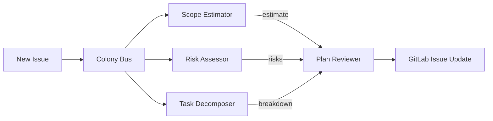

# Planning Colony

> Part of the [Dev Apprenticeship](../) federation.

A colony of four agents that learn how you plan work. They observe how you break down issues, estimate scope, assess risks, and review plans on GitLab — and gradually take over the routine parts of planning.

## Agents

| Agent | File | Learns | Autonomy after |
|-------|------|--------|----------------|
| Scope Estimator | `agents/scope_estimator.ag` | Scope preferences, phase count, story point calibration, what gets rejected as too large | ~20 observations |
| Risk Assessor | `agents/risk_assessor.ag` | Dependency risks, integration risks, what historically blocks delivery | ~15 observations |
| Task Decomposer | `agents/task_decomposer.ag` | How you split issues into subtasks, granularity preferences, ordering | ~20 observations |
| Plan Reviewer | `agents/plan_reviewer.ag` | Review criteria, common objections, implicit standards, when a plan is "good enough" | ~15 observations |

## How It Works



When a new issue needs planning, the Scope Estimator, Risk Assessor, and Task Decomposer each analyze it from their perspective. Their outputs flow to the Plan Reviewer, which evaluates the combined plan against learned standards and either publishes it or flags it for human review.

## Setup

1. Copy and edit the config:
   ```bash
   cp config/colony.example.toml config/colony.toml
   ```

2. Configure your GitLab connection in `colony.toml`.

3. Start the colony:
   ```bash
   ./scripts/start-colony.sh
   ```
