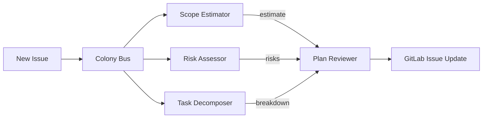

# Planning Colony

> Part of the [Dev Apprenticeship](../) federation.

A colony of four agents that learn how you plan work. They observe how you break down issues, estimate scope, assess risks, and review plans on GitLab, and gradually take over the routine parts of planning.

> **Fresh colony is silent by default.** Every agent's confidence starts at `0.0` (observe-only) and stays there until you seed the memo store. See [Confidence gradient](../README.md#confidence-gradient) in the federation README for the ramp procedure.

## Agents

| Agent | File | Learns | Autonomy after |
|-------|------|--------|----------------|
| Scope Estimator | `agents/scope_estimator.ag` | Scope preferences, phase count, story point calibration, what gets rejected as too large | ~20 observations |
| Risk Assessor | `agents/risk_assessor.ag` | Dependency risks, integration risks, what historically blocks delivery | ~15 observations |
| Task Decomposer | `agents/task_decomposer.ag` | How you split issues into subtasks, granularity preferences, ordering | ~20 observations |
| Plan Reviewer | `agents/plan_reviewer.ag` | Review criteria, common objections, implicit standards, when a plan is "good enough" | ~15 observations |

## How It Works


```mermaid
graph LR
    IS["New Issue"]
    SE["Scope Estimator"]
    RA["Risk Assessor"]
    TD["Task Decomposer"]
    PR["Plan Reviewer"]
    GL["GitLab Issue Update"]
    CB["Colony Bus"]

    IS --> CB
    CB --> SE
    CB --> RA
    CB --> TD
    SE -- estimate --> PR
    RA -- risks --> PR
    TD -- breakdown --> PR
    PR --> GL
```

When a new issue needs planning, the Scope Estimator, Risk Assessor, and Task Decomposer each analyze it from their perspective. Their outputs flow to the Plan Reviewer, which evaluates the combined plan against learned standards and either publishes it or flags it for human review.

## Early-exit on quiet ticks (#147)

`plan_reviewer` follows the federation's **delta-check + early-exit** convention so ticks on a quiet project cost ~0 LLM calls:

1. Peer outputs (`planning:scope_estimate`, `planning:risks`, `planning:breakdown`) are listened for and stashed per-issue.
2. A single cheap `exec sh` call to `forge-api.sh issues --needs-planning --view planning` tells us whether any open issue still lacks a plan. An empty response (`[]`) means everything is already planned.
3. On empty: refresh `plan_reviewer:last_check` and `return` **before** any `prompt()` — no Claude invocation.
4. The newest-issue iid is extracted with `json_get` (mechanical JSON read, zero LLM cost) instead of a `prompt()`; the assembly prompt only runs once all three peer slots are filled for the target issue.

## Setup

1. Copy and edit the config:
   ```bash
   cp config/colony.example.toml config/colony.toml
   ```

2. Configure your GitLab connection in `colony.toml`.

3. (Optional) Override `[planning] trigger_label` if your project uses a label other than `needs-planning` to signal an issue is ready for planning. Scoped labels (`DEV::not started`) and labels with spaces are supported — `--data-urlencode` handles the encoding (#223).

4. (Optional) Retune `[planning.labels]` if your project uses a different label taxonomy for incidents and epics (#226). Values are free-text and injected verbatim into the `risk_assessor` and `task_decomposer` prompt context, so operators can list comma-separated label names or describe non-label patterns (e.g. `epic = "umbrella-issue pattern, parent/child references in description"`). Defaults preserve pre-#226 vocabulary (`incident, bug, blocker` / `epic`).

5. Start the colony:
   ```bash
   ./scripts/start-colony.sh
   ```
