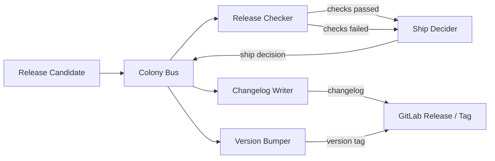

# Release Colony

> Part of the [Dev Apprenticeship](../) federation.

A colony of four agents that learn how you ship software. They observe your release decisions, changelog writing, versioning, and pre-release checks on GitLab — and gradually automate the routine parts of the release process.

## Agents

| Agent | File | Learns | Autonomy after |
|-------|------|--------|----------------|
| Ship Decider | `agents/ship_decider.ag` | Ship/no-ship thresholds per issue type, blocker patterns, risk tolerance | ~15 observations |
| Changelog Writer | `agents/changelog_writer.ag` | Changelog style, what to include/exclude, grouping conventions, audience | ~10 observations |
| Version Bumper | `agents/version_bumper.ag` | Semver strategy (when to bump major/minor/patch), pre-release tag conventions | ~10 observations |
| Release Checker | `agents/release_checker.ag` | Pre-release validation steps, dependency checks, CI gate requirements | ~15 observations |

## How It Works



When a release candidate is ready, the Release Checker runs pre-release validation (CI status, dependency audit, migration safety). The Ship Decider weighs the results against learned thresholds and makes a ship/no-ship call. If shipping, the Changelog Writer compiles the release notes and the Version Bumper determines the correct version number — both following conventions learned from past releases.

## Setup

1. Copy and edit the config:
   ```bash
   cp config/colony.example.toml config/colony.toml
   ```

2. Configure your GitLab connection in `colony.toml`.

3. Start the colony:
   ```bash
   ./scripts/start-colony.sh
   ```
