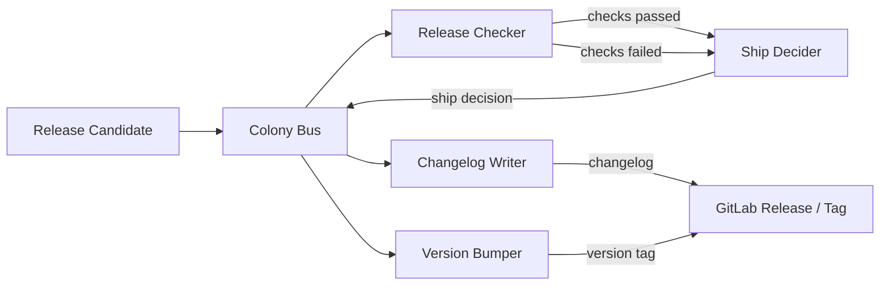

# Release Colony

> Part of the [Dev Apprenticeship](../) federation.

A colony of four agents that learn how you ship software. They observe your release decisions, changelog writing, versioning, and pre-release checks on GitLab, and gradually automate the routine parts of the release process.

## Agents

| Agent | File | Learns | Autonomy after |
|-------|------|--------|----------------|
| Ship Decider | `agents/ship_decider.ag` | Ship/no-ship thresholds per issue type, blocker patterns, risk tolerance | ~15 observations |
| Changelog Writer | `agents/changelog_writer.ag` | Changelog style, what to include/exclude, grouping conventions, audience | ~10 observations |
| Version Bumper | `agents/version_bumper.ag` | Semver strategy (when to bump major/minor/patch), pre-release tag conventions | ~10 observations |
| Release Checker | `agents/release_checker.ag` | Pre-release validation steps, dependency checks, CI gate requirements | ~15 observations |

## How It Works


```mermaid
graph LR
    RC["Release Candidate"]
    RCH["Release Checker"]
    SD["Ship Decider"]
    CW["Changelog Writer"]
    VB["Version Bumper"]
    GL["GitLab Release / Tag"]
    CB["Colony Bus"]

    RC --> CB
    CB --> RCH
    RCH -- checks passed --> SD
    RCH -- checks failed --> SD
    SD -- ship decision --> CB
    CB --> CW
    CB --> VB
    CW -- changelog --> GL
    VB -- version tag --> GL
```

When a release candidate is ready, the Release Checker runs pre-release validation (CI status, dependency audit, migration safety). The Ship Decider weighs the results against learned thresholds and makes a ship/no-ship call. If shipping, the Changelog Writer compiles the release notes and the Version Bumper determines the correct version number, both following conventions learned from past releases.

## Early-exit on quiet ticks (#147)

All four release agents follow the federation's **delta-check + early-exit** convention so ticks on a quiet repo cost ~0 LLM calls/h:

- **`ship_decider`** / **`release_checker`**: a cheap `forge-api.sh merge-requests --state merged --since <last_check> --per-page 1` query answers "has anything release-worthy landed?" in one HTTP call. Combined with a `listen()` on the relevant event (`release:check_result` for ship_decider, `implementation:mr_ready` for release_checker), if both signals are empty the tick refreshes `last_check` and `return`s **before** any `prompt()` — including the release-pattern learning prompt that used to run every tick.
- **`version_bumper`** / **`changelog_writer`**: pure event-driven. Each listens for `release:ship_decision`; empty inbox → refresh `last_check` and `return` before the tag/release-style learning prompt. The learn-from-history prompts only run on ticks where a ship decision actually arrived.

The learn-on-demand shape is intentional: past releases don't change between ticks, so re-analyzing them every minute wastes Claude calls. Gating pattern learning behind the delta-check keeps the cost proportional to real activity.

## Setup

1. Copy and edit the config:
   ```bash
   cp config/colony.example.toml config/colony.toml
   ```

2. Configure your GitLab connection in `colony.toml`.

3. (Optional) Override `[forge.gitlab] default_branch` (or `[forge.github] default_branch`) if your project's primary branch is not `main` (e.g. `master`, `develop`, `trunk`). `version_bumper` passes this to `forge-api.sh create-tag` as the tag's source ref (#224).

4. (Optional) Pin a per-colony LLM backend via the `[llm]` block in `colony.toml` (#319). Each set key is spliced onto every daemon as `--config-override llm.<key>=<value>`; absent keys fall through to the federation-wide default in `<fed>/.agentis/config`. See `dev-apprenticeship/README.md#llm-backend-per-colony-override-319`.

5. Start the colony:
   ```bash
   ./scripts/start-colony.sh
   ```
