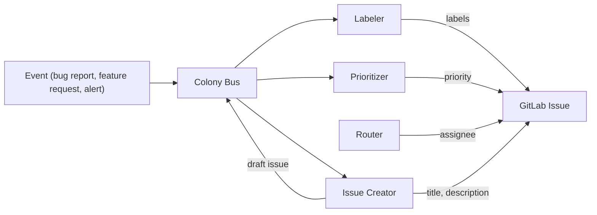

# Triage Colony

> Part of the [Dev Apprenticeship](../) federation.

A colony of four agents that learn how you manage issues. They observe how you create, label, prioritize, and route issues on GitLab, and gradually take over the mechanical parts of issue management.

## Agents

| Agent | File | Learns | Autonomy after |
|-------|------|--------|----------------|
| Issue Creator | `agents/issue_creator.ag` | Formulation style, title conventions, description templates, what warrants an issue | ~10 observations |
| Labeler | `agents/labeler.ag` | Label taxonomy, auto-classification rules, which labels co-occur | ~10 observations |
| Prioritizer | `agents/prioritizer.ag` | Priority criteria, urgency calibration, severity vs impact tradeoffs | ~15 observations |
| Router | `agents/router.ag` | Assignment patterns, team expertise mapping, load balancing across assignees | ~15 observations |

## How It Works



When a new event arrives (bug report, support ticket, alert), the Issue Creator drafts the issue with learned title and description conventions. The Labeler, Prioritizer, and Router each add their metadata (labels, priority level, and assignee) based on patterns learned from past decisions.

## Setup

1. Copy and edit the config:
   ```bash
   cp config/colony.example.toml config/colony.toml
   ```

2. Configure your GitLab connection in `colony.toml`.

3. Start the colony:
   ```bash
   ./scripts/start-colony.sh
   ```
