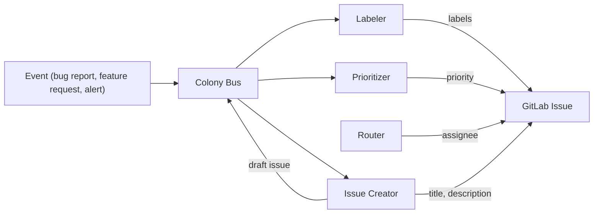

# Triage Colony

> Part of the [Dev Apprenticeship](../) federation.

A colony of four agents that learn how you manage issues. They observe how you create, label, prioritize, and route issues on GitLab, and gradually take over the mechanical parts of issue management.

> **Fresh colony is silent by default.** Every agent's confidence starts at `0.0` (observe-only) and stays there until you seed the memo store. See [Confidence gradient](../README.md#confidence-gradient) in the federation README for the ramp procedure.

## Agents

| Agent | File | Learns | Autonomy after |
|-------|------|--------|----------------|
| Issue Creator | `agents/issue_creator.ag` | Formulation style, title conventions, description templates, what warrants an issue | ~10 observations |
| Labeler | `agents/labeler.ag` | Label taxonomy, auto-classification rules, which labels co-occur | ~10 observations |
| Prioritizer | `agents/prioritizer.ag` | Priority criteria, urgency calibration, severity vs impact tradeoffs | ~15 observations |
| Router | `agents/router.ag` | Assignment patterns, team expertise mapping, load balancing across assignees | ~15 observations |

## How It Works


```mermaid
graph LR
    EV["Event (bug report, feature request, alert)"]
    IC["Issue Creator"]
    LB["Labeler"]
    PR["Prioritizer"]
    RT["Router"]
    GL["GitLab Issue"]
    CB["Colony Bus"]

    EV --> CB
    CB --> IC
    IC -- draft issue --> CB
    CB --> LB
    CB --> PR
    LB -- labels --> GL
    PR -- priority --> GL
    RT -- assignee --> GL
    IC -- title, description --> GL
```

When a new event arrives (bug report, support ticket, alert), the Issue Creator drafts the issue with learned title and description conventions. The Labeler, Prioritizer, and Router each add their metadata (labels, priority level, and assignee) based on patterns learned from past decisions.

## Early-exit on quiet ticks (#147)

Reactive agents (`router`, `prioritizer`) follow a **delta-check + early-exit** pattern so a quiet GitLab project costs ~0 LLM calls/h on the 60-second tick interval:

1. `recall_latest("<agent>:last_check")` → an ISO-8601 timestamp (empty on first ever tick).
2. A single cheap `exec sh` call to `forge-api.sh issues --since <last_check> --view <agent>` filters server-side. An empty response (`[]`, 2 chars) means "nothing new".
3. On empty: refresh `last_check` and `return` **before** any `prompt()` — no Claude invocation at all.
4. On non-empty: proceed to the normal learning/analysis prompts.

The last-check refresh inside the early-exit branch is load-bearing — otherwise the `--since` window never advances on quiet projects and each tick would keep re-querying the same gap. This is the conventional structure for all reactive agents in this federation; see `agents/router.ag` and `agents/prioritizer.ag` for the canonical shape.

## Shared issues snapshot (#1111 / #1112)

All four agents read the same `issues` collection, so without sharing the endpoint is fetched once per agent per tick (3–4× the same payload). Instead, `scripts/start-colony.sh` publishes **one** compressed snapshot per colony per tick:

- **Fetch once + compress:** `scripts/forge-api.sh snapshot issues` fetches the collection a single time and pipes it through `scripts/snapshot-compress.py`, producing a compact, deduplicated, structurally-chunked envelope (#1112) — the bytes that reach `prompt()` are this compact form, not raw JSON.
- **Publish to a shared memo:** the envelope is written to `gitlab:snapshot:issues` with an epoch-seconds freshness key at `gitlab:snapshot:issues:ts`. Re-run the publish standalone with `./scripts/start-colony.sh --snapshot-refresh`.
- **Keep it fresh:** `start-federation.sh` runs a snapshot-refresh sidecar that re-runs `--snapshot-refresh` every 300 s (`SNAPSHOT_REFRESH_INTERVAL_S` override) — shorter than the 600 s freshness window, so the snapshot never goes stale and the agents never permanently fall back to per-agent fetches. The sidecar self-terminates when the federation stops and is backward-safe (refresh failures are logged, not fatal).
- **Agents read the memo:** each agent's `issues_cmd()` first tries `snapshot_issues_cmd(<view>)`, which `recall_latest()`s the snapshot and (when fresh, ≤ 600 s) renders its role view via `forge-api.sh issues --from-snapshot --view <view>` — **zero HTTP**. A missing / empty / stale / malformed snapshot returns `""`, so the agent transparently falls back to its legacy direct `forge-api.sh issues` fetch (backward-safe). The shared snapshot is used only on the single-repo path; the multi-repo (`[[forge.github]]`) fan-out keeps its per-repo direct fetch.
- **No-change gate:** because the snapshot is the full collection (not a `--since` delta), `raw` is non-empty every tick even when nothing changed. `labeler` / `router` / `prioritizer` fingerprint (SHA-256) their projected view, memo it as `<agent>:snapshot_hash`, and skip `prompt()` on a tick whose fingerprint matches the last-processed one — restoring the quiet-project early-exit on the snapshot path. `issue_creator`'s suggest prompt is already gated by `poll_inbox()`.

| Key | Written by | Read by |
|-----|-----------|---------|
| `gitlab:snapshot:issues` | `start-colony.sh` snapshot step (refreshed by the `start-federation.sh` sidecar) | `labeler`, `router`, `prioritizer`, `issue_creator` |
| `gitlab:snapshot:issues:ts` | `start-colony.sh` snapshot step (refreshed by the `start-federation.sh` sidecar) | each agent's `snapshot_fresh()` gate |
| `<agent>:snapshot_hash` | `labeler` / `router` / `prioritizer` (end of tick) | the same agent's per-tick no-change gate |

## Crystallizer rule replay (#1234)

Mature triage agents distil their high-frequency, low-variance decisions into
**deterministic rules** and replay them **without an LLM call** (cheaper +
faster), and rules that stop performing are **demoted and retired**. This is the
agentis-core crystallizer substrate (`distill` /
`crystallizer_lookup_with_confidence` / `crystallizer_record_use` /
`knowledge_validate`, agentis ≥ 1.8.0). Three agents carry the pilot today:
`labeler` (the first, #1235), `router` (#1234) and `prioritizer` (#1430). The
demote signal is **free** — the operator keeping or changing what the agent
applied is a natural deterministic verifier, so no separate skeptic is needed.

Each agent runs three stages every tick:

1. **Replay (Stage 1).** Before `prompt()`, the agent builds a deterministic,
   keyword-signature context for the chosen issue and calls
   `crystallizer_lookup_with_confidence(<category>, ctx, min_conf)`. On a hit ≥
   `min_conf` it applies the rule's action across all four tier branches
   (autonomous writes directly, review-gated drafts a note, propose emits,
   shadow/dormant observes) and **skips the LLM entirely**.
2. **Distil (Stage 2).** When no rule hit, the LLM decides as before and the
   agent distils that decision — `learn(<category>, canonical_ctx, action)` then
   `distill(<category>, coarse_ctx, action)` + `knowledge_validate()`. After ≥ 3
   validations agentis-core crystallizes the class into a replayable rule.
3. **Demote (Stage 3).** A reality-check on a later tick reads back what the
   operator actually did and threads the rule id into
   `crystallizer_record_use(rule_id, kept?, +0.1 / -0.15)` — a kept decision
   reinforces the rule, an operator override demotes it. agentis-core compaction
   retires a rule at `success_rate < 0.5 && use_count ≥ 20`.

`router`'s category is `route`, keyed on the first **unassigned** issue's
keyword+label signature; its action slot is the normalized assignee username.
Router had no reality-check before this pilot, so `evaluate_route_verdict()` is
new: it stashes a pending verdict when it suggests/drafts an assignment, then a
later tick reads back the issue's current assignee and treats a **reassignment
away** from the suggested username as the demote signal (and a **kept**
assignment as reinforcement).

`prioritizer`'s category is `prioritize` (#1430), keyed on the first
**unprioritized** issue's keyword + non-priority-label signature; its action
slot is the normalized single priority label. "Priority-like" is detected
deterministically (label starts with `priority`, matches `^P<digits>$`,
equals `urgent`, or appears in the operator's `triage:labels:priority`
vocabulary, #226) — issues routinely carry *other* labels from the labeler,
so only a priority-like label counts as a reality-check signal: a kept label
reinforces, a different priority-like label without ours demotes. The
autonomous rule-hit branch deliberately records **no** single-slot verdict
(the agent just wrote the label — the check would read its own write back as
"kept"); the longer-horizon revert check is the labeler #203 multi-slot soak
mechanism, a follow-up shared with router.

Host-run `.agentis` persists crystallized rules on disk across restarts, so no
container-style persistence wiring is needed.

### Stage 1b: BM25 recall + retrieval-grounded prompts (#1429)

Stage 1's recall is structurally narrow: the canonical context matches a
**fixed keyword vocabulary** and the crystallizer lookup is a **prefix test**
on that signature — an issue whose text falls outside the vocab is a
guaranteed miss → guaranteed LLM call, forever. Stage 1b (agentis ≥ 1.20.0,
`crystallizer_search`, ADR-0009 Phase 1.5) closes that gap in two moves on
every Stage 1 miss:

1. **BM25 recall.** The agent BM25-ranks the whole crystallized rule pool
   against the issue's *real text* (labeler: title + description; router:
   title + labels) and walks the top `TRIAGE_BM25_K` candidates. Because
   `crystallizer_search` ranks across **all** action types and its JSON
   carries no `expected_outcome`, each candidate is **class-confirmed**
   before firing: its `condition` is re-probed through
   `crystallizer_lookup_with_confidence(<class>, cond, min_conf)` — a hit
   proves a rule of *this agent's* class at ≥ `min_conf` matches that
   condition family. BM25 score is a relevance signal, never a trust
   signal; the confidence threshold and the ADR-0001 tier contract apply
   exactly as in Stage 1. A confirmed hit fires through the same shared
   fire path (`crystallizer_record_use` optimistic stamp, tier-gated apply,
   memo stamps, **no LLM call**) tagged `bm25-hit` (Stage 1 hits are tagged
   `prefix-hit`; both keep the `rule-hit` tag the auto-promote efficiency
   bonus keys on).
2. **Retrieval-grounded prompt (RAG fallback).** When no candidate clears
   the confidence bar, the ≥ 0.5-confidence candidates are appended to the
   decide `prompt()` context as "similar past decisions" — more consistent
   LLM decisions → faster crystallization of new rules → compounding
   rule-hit rate.

A pre-v1.20.0 host degrades gracefully: the `crystallizer_search` call is
try/catch-wrapped, so Stage 1b silently falls through to the LLM path.
Source-asserted by `tools/test-bm25-recall-gates.sh`.

**Operator knobs** (process env, read via `getenv`; set them in
`scripts/start-colony.sh`'s environment or export before launch — every knob
must be on the `install.sh` `exec.env_passthrough` allowlist or it is
silently inert, #1426/#1428; `install.sh` registers all seven since #1429):

| Knob | Default | Effect |
|------|---------|--------|
| `ROUTER_RULE_FIRST` | on (any value ≠ `0`) | `0` short-circuits the **entire** router pilot — Stage 1 replay, Stage 1b BM25 recall, Stage 2 distil, and the verdict recording + reality-check — to the LLM path. Behaviour is byte-identical to pre-pilot routing (no extra `exec sh` subprocess, no distil rows, no pending verdicts). The rollback switch. |
| `ROUTER_RULE_CONFIDENCE` | `0.85` | Minimum confidence for a rule-first hit (Stage 1 **and** Stage 1b). Raise to replay only very well-established rules; lower to replay more aggressively. |
| `ROUTER_BM25_RECALL` | on (any value ≠ `0`) | `0` short-circuits Stage 1b only (BM25 recall + prompt grounding); Stage 1 prefix replay stays on. |
| `TRIAGE_BM25_K` | `3` | Top-k for `crystallizer_search` (shared by labeler + router). `0` disables recall + grounding via the builtin's `k<=0` empty-list contract. |

`labeler` exposes the equivalent `LABELER_RULE_FIRST` / `LABELER_RULE_CONFIDENCE`
/ `LABELER_BM25_RECALL` knobs, and `prioritizer` the equivalent
`PRIORITIZER_RULE_FIRST` / `PRIORITIZER_RULE_CONFIDENCE` /
`PRIORITIZER_BM25_RECALL` (#1430). Setting the agent's `*_RULE_FIRST=0` is
the safe rollback if a replayed rule misbehaves: the agent reverts to
LLM-only decisions immediately on the next tick, and any stale pending
verdict from an earlier enabled run is ignored rather than scored.

## Bootstrapping the rule pool (#1431)

BM25 retrieval can only rank what is already **in** the rule pool — and the
pool otherwise grows only from runtime LLM decisions (Stage 2), so a fresh
federation starts cold: zero rules, zero Stage 1/1b hits, every decide tick
pays the LLM. The forge already holds the training data — every labeled /
assigned / prioritized issue is an operator-confirmed (context → action)
pair — and the ingestion path extracts it **deterministically, with zero
LLM calls**:

- **One-shot historical backfill** (run once after install, or any time):

  ```bash
  # Preview what would be ingested (no writes). The forge fetch needs the
  # GITLAB_*/GITHUB_* env exported; for an env-free preview point it at a
  # pre-fetched dump instead:
  #   forge-api.sh issues --view raw > /tmp/issues.json   (from a sourced shell)
  tools/backfill-crystallizer.sh --fed-dir $PWD \
      --issues-json /tmp/issues.json --dry-run
  # Ingest for real (env-sourced path — recommended):
  ./triage/scripts/start-colony.sh --ingest
  ```

  The env-sourced path runs in `--incremental` mode, which sweeps history
  **oldest-first** at `BACKFILL_MAX_ISSUES` (default 200) issues per run and
  advances the `triage:ingest:cursor` memo monotonically — a large backlog
  drains across successive sidecar ticks with nothing skipped. Export a
  higher `BACKFILL_MAX_ISSUES` before the first run to drain faster.

  The tool pages raw issues via `forge-api.sh issues --view raw`, builds
  the SAME canonical contexts the agents build (shared builder
  `tools/lib/canonical-context.py`, drift-guarded by
  `tools/test-canonical-context.sh`), takes the operator's actual decision
  as the canonical action (labels minus priority-like ones for `label`,
  first assignee for `route`, the priority-like label for `prioritize`),
  and replays each triple through `learn()` → `distill()` →
  `knowledge_validate()` in a generated `.ag` driver executed with
  `agentis go` from the federation root. Classes seen ≥ 3 times reach the
  crystallize gate and materialize as replayable rules on the daemons'
  next M141 pass. Re-runs are idempotent (KnowledgeEntry ids are
  content-addressed; repeats re-validate instead of duplicating).

- **Continuous ingestion sidecar:** `start-federation.sh` spawns a
  crystallizer-ingest sidecar that re-runs
  `triage/scripts/start-colony.sh --ingest` every
  `TRIAGE_INGEST_INTERVAL_S` seconds (default 3600; `0` disables). The
  incremental mode only processes issues updated since the
  `triage:ingest:cursor` memo and advances the cursor afterwards — the
  pool keeps tracking the operator's live decisions even on issues the
  agents never touched.

Backfilled `learn()` rows carry the `backfill` tag (alongside `distilled`,
`triage`) and run under `agentis go` — they never land in the daemons'
acting-path experience buckets, so auto-promote fitness is unaffected. A
backfilled rule that fires wrongly is corrected by the same demote loop as
any other rule (`crystallizer_record_use` reality-check, retirement at the
core thresholds).

## Setup

1. Copy and edit the config:
   ```bash
   cp config/colony.example.toml config/colony.toml
   ```

2. Configure your GitLab connection in `colony.toml`.

3. (Optional) Retune `[triage.labels] priority` if your project uses a different priority-label taxonomy (#226). The value is free-text and injected verbatim into the `prioritizer` prompt context, so operators can list comma-separated label names (e.g. `"P0, P1, P2, P3"`, or `"severity::1, severity::2, severity::3"`). Default preserves pre-#226 vocabulary (`priority::critical/high/medium/low, P1-P4, urgent`).

4. (Optional) Pin a per-colony LLM backend via the `[llm]` block in `colony.toml` (#319). Each set key is spliced onto every daemon as `--config-override llm.<key>=<value>`; absent keys fall through to the federation-wide default in `<fed>/.agentis/config`. See `dev-apprenticeship/README.md#llm-backend-per-colony-override-319`.

5. Start the colony:
   ```bash
   ./scripts/start-colony.sh
   ```
