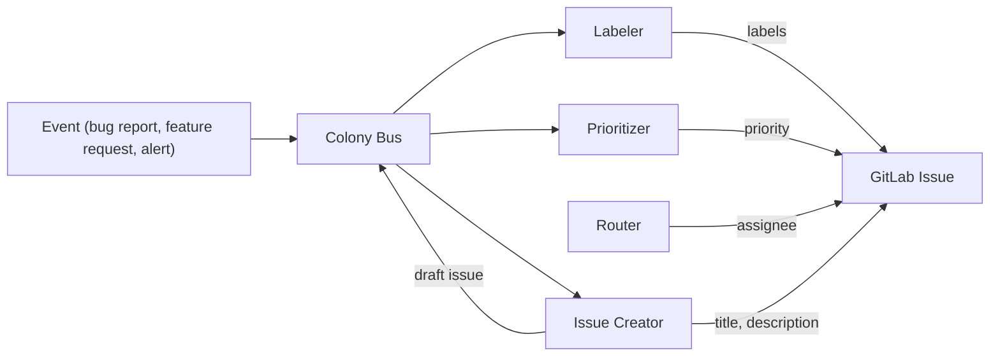

# Triage Colony

> Part of the [Dev Apprenticeship](../) federation.

A colony of four agents that learn how you manage issues. They observe how you create, label, prioritize, and route issues on GitLab, and gradually take over the mechanical parts of issue management.

> **Fresh colony is silent by default.** Every agent's confidence starts at `0.0` (observe-only) and stays there until you seed the memo store. See [Confidence gradient](../README.md#confidence-gradient) in the federation README for the ramp procedure.

## Agents

| Agent | File | Learns | Autonomy after |
|-------|------|--------|----------------|
| Issue Creator | `agents/issue_creator.ag` | Formulation style, title conventions, description templates, what warrants an issue | ~10 observations |
| Labeler | `agents/labeler.ag` | Label taxonomy, auto-classification rules, which labels co-occur | ~10 observations |
| Prioritizer | `agents/prioritizer.ag` | Priority criteria, urgency calibration, severity vs impact tradeoffs | ~15 observations |
| Router | `agents/router.ag` | Assignment patterns, team expertise mapping, load balancing across assignees | ~15 observations |

## How It Works


```mermaid
graph LR
    EV["Event (bug report, feature request, alert)"]
    IC["Issue Creator"]
    LB["Labeler"]
    PR["Prioritizer"]
    RT["Router"]
    GL["GitLab Issue"]
    CB["Colony Bus"]

    EV --> CB
    CB --> IC
    IC -- draft issue --> CB
    CB --> LB
    CB --> PR
    LB -- labels --> GL
    PR -- priority --> GL
    RT -- assignee --> GL
    IC -- title, description --> GL
```

When a new event arrives (bug report, support ticket, alert), the Issue Creator drafts the issue with learned title and description conventions. The Labeler, Prioritizer, and Router each add their metadata (labels, priority level, and assignee) based on patterns learned from past decisions.

## Early-exit on quiet ticks (#147)

Reactive agents (`router`, `prioritizer`) follow a **delta-check + early-exit** pattern so a quiet GitLab project costs ~0 LLM calls/h on the 60-second tick interval:

1. `recall_latest("<agent>:last_check")` → an ISO-8601 timestamp (empty on first ever tick).
2. A single cheap `exec sh` call to `gitlab-api.sh issues --since <last_check> --view <agent>` filters server-side. An empty response (`[]`, 2 chars) means "nothing new".
3. On empty: refresh `last_check` and `return` **before** any `prompt()` — no Claude invocation at all.
4. On non-empty: proceed to the normal learning/analysis prompts.

The last-check refresh inside the early-exit branch is load-bearing — otherwise the `--since` window never advances on quiet projects and each tick would keep re-querying the same gap. This is the conventional structure for all reactive agents in this federation; see `agents/router.ag` and `agents/prioritizer.ag` for the canonical shape.

## Setup

1. Copy and edit the config:
   ```bash
   cp config/colony.example.toml config/colony.toml
   ```

2. Configure your GitLab connection in `colony.toml`.

3. (Optional) Retune `[triage.labels] priority` if your project uses a different priority-label taxonomy (#226). The value is free-text and injected verbatim into the `prioritizer` prompt context, so operators can list comma-separated label names (e.g. `"P0, P1, P2, P3"`, or `"severity::1, severity::2, severity::3"`). Default preserves pre-#226 vocabulary (`priority::critical/high/medium/low, P1-P4, urgent`).

4. Start the colony:
   ```bash
   ./scripts/start-colony.sh
   ```
