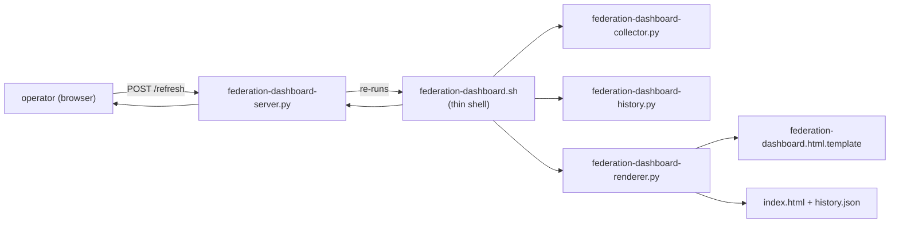

# Federation dashboard reference

`tools/federation-dashboard.sh` is the generic web dashboard for any
Agentis federation. It auto-discovers the colony and agent layout, pulls
per-agent state from the `agentis` CLI and from on-disk logs /
experience stores, and serves a single-page HTML UI with operator
controls (promote, demote, evolve, restart, quarantine, kill switch).

This document is the reference for the dashboard's feature inventory,
its helper-script architecture, and the regression guards that keep
that architecture intact across macOS + Linux.

## Scope

- **Included:** invocation, feature inventory, helper-script split,
  template sentinels, the macOS bash heredoc gotcha, test harness.
- **Excluded:** the button-gating logic itself (lives per-agent in the
  `.ag` `confidence_gates` sections and is surfaced via #160), the
  kill-switch OS-level shutdown semantics (in `tools/kill-federation.sh`
  and #162), and the per-colony `.ag` conventions (in `CLAUDE.md`).

## Invocation

```bash
./tools/federation-dashboard.sh <federation-dir> [port]
./tools/federation-dashboard.sh dev-apprenticeship            # default port 8420
./tools/federation-dashboard.sh dev-apprenticeship 9000
```

The federation directory must contain colony subdirectories, each with
`agents/*.ag` and `config/colony.toml`. Dashboard state (rendered HTML,
history JSON) is written under `<federation-dir>/.dashboard/`.

Prerequisites: `agentis`, `python3`.

The `dev-apprenticeship/dashboard.sh` wrapper is the end-user entry
point for that federation; it calls this script with the correct
`--fed-dir` and adds kill-switch integration.

## Feature inventory

| Feature | Issue | Summary |
|---|---|---|
| Auto-discovery | — | Walks `<fed>/*/agents/*.ag` to build the colony/agent grid. No hardcoded names. |
| Promote / demote / evolve buttons | [#160](https://github.com/Replikanti/agentis-colonies/issues/160) | Gate on per-agent `.ag` `confidence_gates` + fitness signal. Disabled buttons open a **Why** sidebar with evidence and remediation. |
| Kill switch | [#161](https://github.com/Replikanti/agentis-colonies/issues/161), [#162](https://github.com/Replikanti/agentis-colonies/issues/162) | Invokes `tools/kill-federation.sh --json`. Failures surface in a persistent notification region (not overwriting the button label). |
| Timeline | [#158](https://github.com/Replikanti/agentis-colonies/issues/158) | Parses raw epoch-ms log lines; renders human-readable timestamps with ISO + relative tooltip; per-federation **Clear** cursor. |
| 5-layer log filter | [#167](https://github.com/Replikanti/agentis-colonies/issues/167) | Per-(agent,class) cursor, per-row dismiss (`×`), class chips, time-mode toggle (ABS / REL), auto-hide stale errors. |
| Stale-error auto-clear | [#167](https://github.com/Replikanti/agentis-colonies/issues/167) | Explicit **Clear stale** button snapshots a per-(agent, error) cursor for agents that have ticked cleanly in the last hour. |
| `agent_last_ok_ts` | [#167](https://github.com/Replikanti/agentis-colonies/issues/167) | Server-side field on every agent record (always emitted, defaults to `0` when no parseable non-error log line is seen). Backs stale-error auto-clear. |

## Architecture



The shell script is a thin orchestrator. Every multi-line content
block — Python code, HTML, CSS, JS — lives in its own standalone file.

| File | Role |
|---|---|
| `tools/federation-dashboard.sh` | Entry point; discovers colonies / agents, calls the four Python helpers once per regen, launches the server. |
| `tools/federation-dashboard-collector.py` | Produces a single JSON blob with per-agent enriched data (experience stats, `.ag` descriptions, log lines, PID liveness, event timeline, confidence change history). |
| `tools/federation-dashboard-history.py` | Appends a single snapshot (per-colony avg confidence skipping null agents per [#143](https://github.com/Replikanti/agentis-colonies/issues/143), plus experience totals) to `history.json` and prunes entries older than 7 days. |
| `tools/federation-dashboard-renderer.py` | Reads the template and substitutes 10 named sentinels with values supplied as positional args, then atomically writes `index.html`. |
| `tools/federation-dashboard.html.template` | Static HTML page (CSS + body + JS) with 10 `{{SENTINEL}}` placeholders. Edit this file, not the shell script, to change markup / styling / JS. |
| `tools/federation-dashboard-server.py` | HTTP server that serves the rendered HTML plus REST endpoints (`/refresh`, `/confidence`, `/restart`, `/quarantine`, `/evolve`, `/cleanup`, `/start`, `/kill`). |

### Template sentinels

The renderer substitutes exactly 10 placeholders. Adding a new sentinel
requires updating both the renderer's positional-arg contract and the
template:

| Sentinel | Value source |
|---|---|
| `{{FED_NAME}}` | Basename of the federation directory. |
| `{{FED_NAME_JS}}` | `FED_NAME` JSON-escaped for embedding in a JS string literal (handles `"`, `\`). |
| `{{COLONY_COUNT}}` | Count of discovered colonies. |
| `{{AGENT_COUNT}}` | Count of discovered agents. |
| `{{EPOCH}}` | Unix epoch at render time. |
| `{{TIMESTAMP}}` | ISO-8601 UTC timestamp at render time. |
| `{{COLLECTOR_JSON}}` | Full collector output (single JSON blob). |
| `{{HISTORY}}` | Contents of `history.json`. |
| `{{REMEDIATION}}` | Remediation text surfaced by the Why sidebar when a button is gated. |
| `{{COLONY_LIST_JS}}` | JS array literal of `{agent, colony}` pairs used by the client. |

A missing sentinel renders the literal `{{NAME}}` text verbatim in the
served HTML. The regression harness (test 18) catches that.

## macOS bash heredoc gotcha

`tools/federation-dashboard.sh` ships with a hard rule: **zero
heredocs, of any kind**. The split in the table above is the
consequence of that rule, enforced by regression tests 13–19 in
`tools/test-timeline-rendering.sh`.

### Why

macOS bash 3.2 / 5.3 mis-parses heredocs in two related ways:

1. Single-quoted heredoc delimiters (e.g. `<<'PY'`) do not fully
   suppress expansion when the body contains backtick sequences
   inside Python comments or `\'` JS escapes — especially when the
   heredoc is nested inside `$(...)`. The body gets re-scanned and
   the parser errors with spurious "syntax error near unexpected
   token" messages at runtime.
2. `<<'JSEOF'` blocks containing a bare `\'` inside a JS string
   crashed the parser at line 962 of the previous monolithic
   `federation-dashboard.sh`, even though the delimiter was
   single-quoted. [#172](https://github.com/Replikanti/agentis-colonies/issues/172)
   documents the final diagnosis.

The fix history is:

- [#170](https://github.com/Replikanti/agentis-colonies/issues/170) —
  extracted the Python heredocs that were nested in `$()` into
  `federation-dashboard-collector.py` and
  `federation-dashboard-server.py`.
- [#172](https://github.com/Replikanti/agentis-colonies/issues/172) —
  extracted the remaining JS / CSS / HTML heredocs into
  `federation-dashboard.html.template` + `-renderer.py` + `-history.py`,
  eliminating **all** heredocs from the shell script.

**Do not re-inline any helper or the template back into the shell.**
The tests below will fail on every CI run. If a future change needs
multi-line content, add it as another standalone file and pass it
through the Python helper.

### Regression guards

`tools/test-timeline-rendering.sh` runs 19 tests; the architecture
guards are:

| Test | Checks |
|---|---|
| 13 | `federation-dashboard-collector.py` exists and is valid Python ([#170](https://github.com/Replikanti/agentis-colonies/issues/170)). |
| 14 | `federation-dashboard-server.py` exists and is valid Python ([#170](https://github.com/Replikanti/agentis-colonies/issues/170)). |
| 15 | No `<<'P` heredoc nested inside `$()` in `federation-dashboard.sh` ([#170](https://github.com/Replikanti/agentis-colonies/issues/170)). |
| 16 | `federation-dashboard-renderer.py` exists and is valid Python ([#172](https://github.com/Replikanti/agentis-colonies/issues/172)). |
| 17 | `federation-dashboard-history.py` exists and is valid Python ([#172](https://github.com/Replikanti/agentis-colonies/issues/172)). |
| 18 | Template contains all 10 renderer sentinels ([#172](https://github.com/Replikanti/agentis-colonies/issues/172)). |
| 19 | `federation-dashboard.sh` contains zero heredocs of any kind ([#172](https://github.com/Replikanti/agentis-colonies/issues/172)). |

Tests 1–12 cover timeline rendering, cursor namespacing, tooltip wiring,
`/kill` endpoint smoke, unit-mismatch guards, and `agent_last_ok_ts`
emission.

## REST endpoints

Served by `federation-dashboard-server.py`:

| Endpoint | Purpose |
|---|---|
| `/refresh` | Re-run collector / history / renderer; reload `index.html`. |
| `/confidence` | Read or write `<agent>:confidence`. Backs the promote / demote controls. |
| `/restart` | Restart a daemon (per-agent) after a confidence change. |
| `/quarantine` | Mark an agent as quarantined; the daemon loop honours the flag on next tick. |
| `/evolve` | Invoke `agentis evolve` on an agent. |
| `/cleanup` | Prune experience / memo state for a quarantined or killed agent. |
| `/start` | Restart a federation (per-colony). |
| `/kill` | Invoke `tools/kill-federation.sh --json` and surface the result in the notification region. |

## Related

- [`tools/federation-dashboard.sh`](../tools/federation-dashboard.sh) — thin-shell entry point.
- [`tools/kill-federation.sh`](../tools/kill-federation.sh) — OS-level shutdown, consumed by `/kill`.
- [`tools/test-timeline-rendering.sh`](../tools/test-timeline-rendering.sh) — regression harness (19 tests).
- [#158](https://github.com/Replikanti/agentis-colonies/issues/158) — timeline rendering + Clear cursor.
- [#160](https://github.com/Replikanti/agentis-colonies/issues/160) — button gating + Why sidebar.
- [#161](https://github.com/Replikanti/agentis-colonies/issues/161) — kill button + notification region.
- [#162](https://github.com/Replikanti/agentis-colonies/issues/162) — `kill-federation.sh --json` for dashboard integration.
- [#167](https://github.com/Replikanti/agentis-colonies/issues/167) — 5-layer log filter + `agent_last_ok_ts`.
- [#170](https://github.com/Replikanti/agentis-colonies/issues/170) — collector / server extraction.
- [#172](https://github.com/Replikanti/agentis-colonies/issues/172) — renderer / history / template extraction; zero-heredoc rule.
