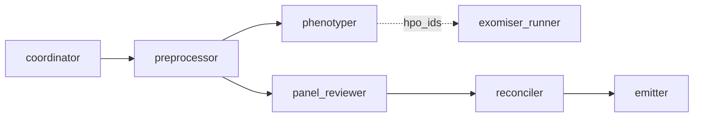
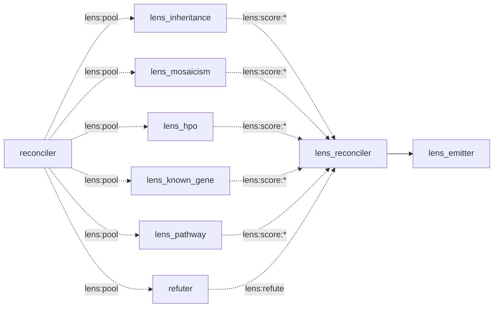

# Baseline Colony

> Part of the [Grand Rounds](../) federation (MVA Hackathon 2026, Track 1).

A one-shot `agentis go` clinical-genomics prioritization pipeline. A single
source file, [`agents/pipeline.ag`](./agents/pipeline.ag), wires seven
cooperating agents (a coordinator + six stage agents) over the substrate
emit/listen bus; each owns a decision-shaped slice of the workflow while
external binaries (`bcftools`, the pinned Exomiser container) do only the bulk
data transforms. It is NOT a ticking daemon colony — it runs to completion under
one declared `cb` budget.

## Agents

| Agent | Stage | Owns (decision-shaped) | External (bulk) |
|-------|-------|------------------------|-----------------|
| `coordinator` | 0 | resolve exactly-one VCF / .docx, seed the bus | `ls` |
| `preprocessor` | 1 | build the contig-rename map from the header, verify the post-condition, refuse on any REF mismatch | `bcftools annotate/norm/index` over ~5M records |
| `phenotyper` | 2 | extract phenotype text, derive + verify the HPO set, enforce the hash-pinned operator gate (D6) | `unzip -p`, `grep` vs `hp.obo` |
| `exomiser_runner` | 3 (opt-in) | render the analysis YAML, compute the idempotency hash, verify outputs | the pinned Exomiser container run (blocking, inline timeout) |
| `panel_reviewer` | 4 | per-variant FILTER/GT/VAF classification, biallelic vs candidate compound-het (unphased) pairing — incl. hard-filter-FAILED records | `bcftools view -R` (no `-f PASS`) |
| `reconciler` | 5 | apply the EPCR evidence-tier ladder, assign primary/secondary, cap at 10 | (reads already-narrowed TSVs) |
| `emitter` | 6 | build the CSV, validate the schema, refuse to emit on any violation | one `printf` redirect |



The panel → reconcile → emit chain is anchored on the normalized VCF (broadcast
on the memo, since `listen` is consume-once and four stages read it), so it does
not block on the Exomiser stage. `exomiser_runner` is **opt-in**
(`MVA_RUN_EXOMISER=1`): its output is not yet consumed by `reconcile` (the
Exomiser → reconcile merge is a documented later revision, [#2031]), so it is
gated OFF by default rather than burn a multi-hour run for discarded output.

[#2031]: https://github.com/Replikanti/agentis-colonies/issues/2031

## The `.ag` / external boundary

Per-element `.ag` processing costs a measured 40–363 CB/element, so **no bulk
record stream ever enters `.ag`**: every stage narrows externally first, `.ag`
sees only tens-to-hundreds of rows, and the final candidate set (≤ 10 rows) is
entirely `.ag`-resident. Each stage records the row count it handed to `.ag` in
`$MVA_WORK_DIR/stage-rows.tsv` (the live test's M6 regression guard).

## The operator review gate (D6)

After drafting the HPO set the pipeline **stops** and refuses to emit a CSV
until an operator reviews `$MVA_WORK_DIR/phenotype/hpo-draft.txt` and stores its
SHA-256 in `$MVA_APPROVAL_FILE`. Editing the draft after approval changes its
hash and re-arms the gate, so an approval can never be silently stale.

## M3 lens fan-out + refute gate (opt-in: `MVA_LENS_MODE=1`)

The M3 differentiator ([#2040](https://github.com/Replikanti/agentis-colonies/issues/2040))
layers a devise→refute reasoning stage onto the M1 candidate pool, replaying the
dark-factory `refuter.ag` pattern in genomics. It is **opt-in** (default off, so
the baseline submission is byte-for-byte unchanged) and adds a SECOND submission
`agentis-federation_lens.csv` alongside the baseline one. All lens/refute/
reconcile LOGIC lives in `agents/pipeline.ag`; it reuses the M1 schema validator
+ writer (`emit_submission`) rather than duplicating it.

| Agent | Owns (decision-shaped) |
|-------|------------------------|
| `lens_inheritance` | de-novo vs biallelic/comp-het vs X-linked fit (single proband, no parents) |
| `lens_mosaicism` | somatic/mosaic support from VAF + the `LowVAF` hard-filter (MVA is mosaic) |
| `lens_hpo` | gene↔phenotype overlap against the approved HPO set |
| `lens_known_gene` | known-MVA-gene / spindle-assembly-checkpoint priority |
| `lens_pathway` | plausible novel gene outside the known panel |
| `refuter` | per-candidate adversarial refutation on four axes (benign-in-population, wrong inheritance fit, phenotype mismatch, artifact); fail-open-tags what it cannot assess |
| `lens_reconciler` | merge lens agreement (promotes a rung) + refutation (demotes into `refuted.tsv`) via the substrate `decide()`; re-rank, cap ≤10 |
| `lens_emitter` | write + validate `agentis-federation_lens.csv` (reusing M1's `emit_submission`) |



Each lens is blind to the others and makes ONE scoring `prompt()` over the whole
≤10-candidate pool (never per-element); the refuter runs one bounded `prompt()`
per candidate. The candidate pool + approved HPO set fan out on the memo bus
(`lens:pool` / `lens:hpo`) because `listen` is consume-once. Lens tunables live
in [`settings/epcr.yml`](./settings/epcr.yml) next to the evidence-tier ladder:
`lens_score_threshold`, `lens_agreement_promote_min`, `benign_population_af`.
The D6 approval gate governs the lens submission too (the HPO set feeds
`lens_hpo`). Refuted candidates are excluded from the ranked CSV and recorded in
`$MVA_WORK_DIR/refuted.tsv` for transparency.

## Setup

1. Wire the environment allowlist + timeout (writes `.agentis/config`):
   ```bash
   ../install.sh
   ```
2. Fetch public reference data (tens of GB, idempotent):
   ```bash
   ./scripts/fetch-reference-data.sh
   ```
3. Export the data-dir contract and run:
   ```bash
   export MVA_DATA_DIR=... MVA_WORK_DIR=... MVA_OUT_DIR=...
   ./scripts/start-colony.sh
   ```
   Review the HPO draft, store its hash in `$MVA_APPROVAL_FILE`, then re-run to
   resume. The schema-valid CSV lands at
   `$MVA_OUT_DIR/agentis-federation_baseline.csv`. Set `MVA_LENS_MODE=1` to also
   run the M3 lens fan-out and emit `agentis-federation_lens.csv` (above).

Config keys: [`config/colony.example.toml`](./config/colony.example.toml).
Tool pins + the EPCR ladder + the gene panel:
[`settings/`](./settings/tools.env).

## Test coverage split

CI cannot execute `.ag` (no `agentis` binary on runners), so coverage is split:

- [`demo-baseline.sh`](./demo-baseline.sh) — offline, CI-safe: the leak-guard
  mutation test, fixture purity, `.ag` source-guards, and the `cb_budget`
  match. Wired into `tools/colony-lint.sh`.
- [`demo-baseline-live.sh`](./demo-baseline-live.sh) — runs the REAL agents
  through `agentis go` against a synthetic data dir and asserts on OUTPUT
  artifacts, every assertion a mutation check (a no-op stage produces an
  identical output and fails). Covers the baseline chain (M1–M6) AND the M3 lens
  mode (L1 wiring+schema, L2 refute-demotes, L3 lens-agreement reorder, L4
  fail-open), each keyed on an input-driven structural consequence, never an
  exact LLM score. Requires `agentis` + `zip` and `bcftools` — the
  latter either native OR the pinned biocontainer
  (`quay.io/biocontainers/bcftools:1.19--h8b25389_0`, run via `podman`/`docker`
  when it is already present locally; it is never pulled over the network here).
  `samtools` is optional (the `.ag`'s `bcftools norm -f` lets htslib auto-build
  the reference `.fai`). SKIPs loudly when `agentis` or a bcftools source is
  absent, so CI (no `agentis` binary) still skips.

**Stage 3 (Exomiser) is deliberately NOT covered by the live test** — the
multi-tens-of-GB bundle and hour-scale run put it in the operator end-to-end
run on real data, not the fast mutation suite. Every OTHER stage (normalize →
HPO/contig filter → panel review → D6 gate → reconcile → emit) runs end-to-end
and produces a schema-valid CSV.

The four-tier confidence contract in
[ADR-0001](../../doc/adr/ADR-0001-confidence-tiers.md) is normative for any
future ticking agent; these one-shot agents are out of its scope (no `fn tick`).
