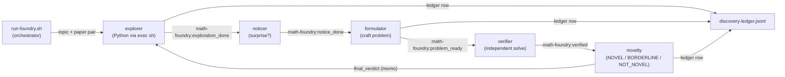

# Math Foundry

 

**Version:** `0.1.0` · [Changelog](./CHANGELOG.md) · **Requires:** agentis >= `1.4.1`

Compute-first novelty discovery federation. Five colonies cooperate to
surface competition-style math problems whose answers required real
computation to discover — not problems that an LLM could have written
from its prior. The architectural distinction is codified in
[ADR-0008](../doc/adr/ADR-0008-compute-first-novelty.md): the
**explorer** agents emit Python code that runs in the hermetic agentis
sandbox via `exec sh`, and the LLM becomes a translator between
computational discoveries and natural-language problems rather than
the source of novelty itself.

## Colonies

| Colony | Description | Agents |
|--------|-------------|--------|
| [explorer](./explorer/) | Compute-first: LLM emits Python, `exec sh` runs it, agent captures stdout | 1 |
| [noticer](./noticer/) | Reads (code, stdout) and flags surprises (small specific numbers, pattern breaks) | 1 |
| [formulator](./formulator/) | Crafts a competition-style problem whose answer IS the surprise | 1 |
| [verifier](./verifier/) | Independently solves the problem and ACCEPT / REJECT / NEEDS_REVISION | 1 |
| [novelty](./novelty/) | Strict referee: defaults to NOT_NOVEL unless the answer cannot be reduced to a named classical result | 1 |

## Pipeline



Each tick the orchestrator picks a topic (round-robin over
`FOUNDRY_TOPICS`) and samples two distinct papers from the cached
arxiv corpus. The explorer asks the LLM for a Python script that
explores the topic given the paper context, runs the script in the
hermetic sandbox, and writes the (code, stdout) pair to memo. The
chain then translates the computational output into a problem,
independently verifies it, and gates the final NOVEL / BORDERLINE /
NOT_NOVEL verdict on the strict novelty referee.

## Quickstart

```bash
./install.sh                                  # interactive setup
python3 tools/fetch-papers.py --help          # one-time arxiv corpus bootstrap
bash tools/run-foundry.sh --dry-run           # orchestrator dry-run
bash tools/run-foundry.sh                     # real run -- spawns 5 colonies in podman
```

## Tier contract

Every agent in this federation gates its behaviour on the four-tier
confidence ladder defined in
[ADR-0001](../doc/adr/ADR-0001-confidence-tiers.md):

- `shadow` — observe + memo, no emit, no external write
- `propose` — emit on bus + draft external writes
- `review-gated` — direct external writes (non-terminal)
- `autonomous` — terminal external writes (merge, tag, ack alert, post reply, …)

## Known limitations (Phase 1)

- **Settlement drift** (#591). The explorer's settlement path keys
  the novelty verdict on `tick - HOLD_PERIOD`, which assumes the
  five-colony chain advances in lockstep with the orchestrator's
  tick stream. In practice, daemon ticks drift relative to each
  other so the explorer occasionally reads a verdict for the wrong
  tick. Documented in
  [ADR-0008](../doc/adr/ADR-0008-compute-first-novelty.md) as an
  accepted Phase 1 limitation; Phase 2 will key settlement on an
  explicit tick-id pointer.
- **One daemon per colony** (`FOUNDRY_DAEMONS_PER_COLONY=1`). The
  M2-Malthusian replicate gate inside `explorer.ag` will grow the
  explorer population once fitness > threshold, but Phase 1 ships
  with a single seed per colony. Phase 2 will scale the seed count
  + tune replication economics per the discovery ledger from Phase
  1 demo runs.
