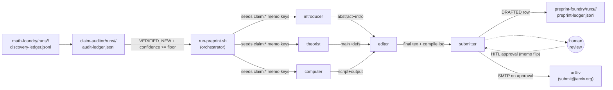

# Preprint Foundry

 

**Version:** `0.1.0` · [Changelog](./CHANGELOG.md) · **Requires:** agentis >= `1.4.1`

Preprint-generation federation for the third tier of the math
pipeline (#596). When `claim-auditor` tags an upstream math-foundry
observation as `audit_verdict: VERIFIED_NEW` with confidence at or
above the floor, this federation drafts a full LaTeX preprint with
reproducibility code, runs editorial polish + `latexmk` compile, and
packages an arXiv-ready submission tarball. The final dispatch to the
arXiv email gateway is gated on an explicit human-in-the-loop (HITL)
approval flag; the federation never auto-submits.

## Colonies

| Colony | Description | Agents |
|--------|-------------|--------|
| [introducer](./introducer/) | Drafts the abstract + LaTeX Section 1 Introduction from the audited claim + 4 search reports | 1 |
| [theorist](./theorist/) | Produces LaTeX Section 2 (Preliminaries) + Section 3 (Main Result) with proof sketch or computational-experiment description | 1 |
| [computer](./computer/) | Generates a standalone reproducibility script (Python/SymPy/GAP) + runs it inside the container for sanity | 1 |
| [editor](./editor/) | Synthesises a single `main.tex` (amsart), runs `latexmk -pdf`, repair-retries on compile fail, hallucination-checks against reproducibility output | 1 |
| [submitter](./submitter/) | Builds `arxiv-metadata.json` + `submission.tar.gz`, drafts cover letter with AI disclosure, writes `status: DRAFTED` ledger row, sends only on HITL approval | 1 |

## Pipeline



The producer-consumer contract with claim-auditor + math-foundry is
file-based: claim-auditor's `audit-ledger.jsonl` is read-only input
to this federation, plus best-effort recall of the upstream `.agentis/`
memo store. preprint-foundry writes its own `preprint-ledger.jsonl`.
Neither upstream federation needs to know about preprint-foundry.

## Phased pipeline

The three writer colonies (introducer / theorist / computer) read the
seeded claim memo at `upstream_tick = tick - 1` and run in parallel.
The editor waits one extra tick (`tick - 2`) for all three to publish
their per-pid memo keys. The submitter waits one further tick
(`tick - 3`) for the editor's compile to settle.

| Colony | reads at upstream_tick = | writes at |
|---|---|---|
| introducer | `tick_idx - 1` | upstream_tick |
| theorist | `tick_idx - 1` | upstream_tick |
| computer | `tick_idx - 1` | upstream_tick |
| editor | `tick_idx - 2` | upstream_tick |
| submitter | `tick_idx - 3` | upstream_tick |

## Quickstart

```bash
./install.sh                                                                # prerequisite + config copy
cp config/authors.toml.example config/authors.toml && $EDITOR config/authors.toml
export PREPRINT_SOURCE_AUDIT_RUN=/path/to/claim-auditor/runs/<id>
export PREPRINT_SOURCE_FOUNDRY_RUN=/path/to/math-foundry/runs/<id>
bash tools/run-preprint.sh --dry-run --source-audit-run $PREPRINT_SOURCE_AUDIT_RUN --source-foundry-run $PREPRINT_SOURCE_FOUNDRY_RUN
bash tools/run-preprint.sh --source-audit-run $PREPRINT_SOURCE_AUDIT_RUN --source-foundry-run $PREPRINT_SOURCE_FOUNDRY_RUN
```

Output: `preprint-foundry/runs/<ts>/` containing `preprint-ledger.jsonl`
plus per-claim sub-directories
(`laptop-node/preprints/<claim-id>/`) with `main.tex`, `main.pdf`,
`reproducibility.{py,g}`, `reproducibility-output.txt`,
`arxiv-metadata.json`, `submission.tar.gz`.

## Cross-federation memo read paths

The orchestrator (`tools/run-preprint.sh`) probes two upstream run
dirs to recover the full context for each audited claim:

```
# claim-auditor's per-searcher reports (tier 2 evidence)
arxiv_search:<auditor_pid>:report:tick-<auditor_tick>
oeis_search:<auditor_pid>:report:tick-<auditor_tick>
groupprops_search:<auditor_pid>:report:tick-<auditor_tick>
scholar_search:<auditor_pid>:report:tick-<auditor_tick>

# math-foundry's formulator (tier 1 problem context)
formulator:<source_pid>:problem_text:tick-<source_tick>
formulator:<source_pid>:answer:tick-<source_tick>
formulator:<source_pid>:novelty_claim:tick-<source_tick>

# math-foundry's explorer (tier 1 computational evidence)
explorer:<source_pid>:code:tick-<source_tick>
explorer:<source_pid>:output:tick-<source_tick>
explorer:<source_pid>:goal:tick-<source_tick>
```

When an upstream memo store is unreachable (frozen tarball, different
host, garbage-collected state), the orchestrator falls back to handing
the .ag agents the raw audit-row JSON as the problem context. The
writer agents' `if len(problem_text) == 0 { return; }` early-exit then
applies and the row is skipped that tick.

## Env-var matrix

All env vars are read by `tools/run-preprint.sh`. Defaults are tuned
for an Opus-class drafting workload where one tick =
LLM call + LaTeX compile (~3-5 min observed end-to-end).

| Env var | Default | Purpose |
|---|---|---|
| `PREPRINT_SOURCE_AUDIT_RUN` | (required) | Path to claim-auditor run dir or audit-ledger.jsonl path. |
| `PREPRINT_SOURCE_FOUNDRY_RUN` | (required) | Path to original math-foundry run dir (for explorer/formulator memo recall). |
| `PREPRINT_LLM_BACKEND` | `claude` | Routed into hermetic `.agentis/config` as `llm.backend`. |
| `PREPRINT_CLAUDE_MODEL` | `opus` | Default model (drafting needs reasoning). |
| `PREPRINT_CLAUDE_EFFORT` | `medium` | Effort knob. |
| `PREPRINT_HOST_CLAUDE_DIR` | `$HOME/.claude` | Bind-mounted into the container for Claude CLI session. |
| `PREPRINT_TICK_INTERVAL_S` | `180` | Seconds between ticks. |
| `PREPRINT_TOTAL_TICKS` | `30` | Number of ticks to drive. |
| `PREPRINT_AUDITOR_CONFIDENCE_FLOOR` | `0.7` | Skip audit rows below this confidence. |
| `PREPRINT_AUTHOR_CONFIG` | `<fed>/config/authors.toml` | Path to author metadata (required by submitter). |
| `PREPRINT_DAEMON_CB_PER_TICK` | `2000` | Per-tick CB replenishment (mirrors #579). |
| `PREPRINT_DAEMON_HEARTBEAT_MS` | `1800000` | Watchdog heartbeat (mirrors #583). |
| `PREPRINT_LATEXMK_MAX_PASSES` | `3` | Max latexmk attempts inside editor.ag. |
| `PREPRINT_RUN_DIR` | auto-timestamped | Output dir override. |
| `PREPRINT_IMAGE_TAG` | `preprint-foundry:latest` | Built from `tools/Containerfile.preprint`. |
| `PREPRINT_ARXIV_GATEWAY` | `submit@arxiv.org` | arXiv email submission gateway. |
| `PREPRINT_ARXIV_FROM` | (first author email) | `From:` header for SMTP. |
| `PREPRINT_SMTP_HOST` | `localhost` | SMTP relay host. |
| `PREPRINT_SMTP_PORT` | `25` | SMTP relay port. |
| `PREPRINT_DRY_RUN` | `""` | `1` = emit_step the plan, skip podman. |

## Output: preprint-ledger.jsonl rows

The submitter colony writes one row per per-claim status transition.
A single claim accrues a `DRAFTED` row first, then either a
`SUBMITTED` row (after HITL approval) or a `HUMAN_REJECTED` row.

```json
{
  "ts": <epoch_ms>,
  "source_audit_run": "<claim-auditor-run-id>",
  "source_claim_id": "claim-<source_pid>-t<source_tick>",
  "preprint_path": "/run-root/preprints/<claim-id>/",
  "title": "...",
  "abstract": "<plain ASCII, <= 1920 chars>",
  "arxiv_category": "math.GR",
  "msc_codes_csv": "20D60,20E45",
  "status": "DRAFTED|HUMAN_APPROVED|SUBMITTED|ARXIV_ACCEPTED|ARXIV_REJECTED|HUMAN_REJECTED",
  "latex_compile_ok": true,
  "arxiv_id": "2611.XXXXX",
  "submission_ts": <epoch_ms>
}
```

## Human-in-loop (HITL) workflow

The submitter colony WILL NOT send any preprint to arXiv until a
human flips its per-claim approval flag. The flag is just a memo
write the submitter reads on its next tick.

### Reviewing a DRAFTED row

```bash
# List all DRAFTED rows from the latest run.
bash tools/review-cli.sh

# Render the PDF for a specific claim in an external viewer.
bash tools/review-cli.sh --show <claim-id>

# Approve a claim (writes submitter:<claim-id>:human_status = "approved").
bash tools/review-cli.sh --approve <claim-id>

# Reject a claim (writes :human_status = "rejected" + :human_reject_reason).
bash tools/review-cli.sh --reject <claim-id> --reason "wrong invariant on order 60"
```

Equivalent direct memo write (when the helper is unavailable):

```bash
# Inside the container's run-root:
agentis memo set submitter:claim-<id>:human_status approved
```

On its next tick the submitter observes the flag and either sends
the SMTP message + writes `status: SUBMITTED`, or writes
`status: HUMAN_REJECTED`. Both paths are terminal for that claim.

### arXiv endorsement workflow

First submission per arXiv account per primary category needs an
endorsement from an already-published author in the same category.
The federation cannot automate this; the workflow is:

1. Author creates an arXiv account at <https://arxiv.org/user/register>.
2. Author requests endorsement via
   <https://arxiv.org/auth/need-endorsement>; arXiv shows a 6-character
   endorsement code.
3. An already-published author in the same primary category enters
   that code at <https://arxiv.org/auth/endorse>.
4. Once endorsed, append the category to `arxiv_endorser_for` in
   `config/authors.toml` so subsequent submissions to that category
   skip the step.

Subsequent submissions to already-endorsed categories from the same
account proceed without re-endorsement.

## External network access

Unlike math-foundry, this federation needs outbound:

- SMTP to `$PREPRINT_ARXIV_GATEWAY` (default `submit@arxiv.org`) when
  a human approves a draft.
- HTTPS to `arxiv.org` for moderation-status lookup (optional, Phase
  2 enhancement; v0.1 only reads the post-submission outcome from
  email).
- HTTP to TeX Live's CTAN mirrors only at container build time; not
  at run time.

The orchestrator does NOT pass `--network none` to podman. Rootless
podman's default slirp4netns egress is used. No inbound ports are
opened.

## Tier contract

Every agent in this federation gates its behaviour on the four-tier
confidence ladder defined in
[ADR-0001](../doc/adr/ADR-0001-confidence-tiers.md):

- `shadow` — observe + memo, no emit, no external write
- `propose` — emit on bus + draft external writes (LaTeX file writes,
  reproducibility script writes, DRAFTED ledger row)
- `review-gated` — direct external writes (non-terminal)
- `autonomous` — terminal external writes (arXiv SMTP send)

Seed confidence: `0.7` (propose) for every agent. The HITL gate on
the submitter is an INDEPENDENT check that fires regardless of tier;
arXiv send only happens when both (a) the tier permits external
writes and (b) `human_status == "approved"` for the specific claim.

## Known limitations (Phase 1)

- **Single LLM-backend block.** The hermetic `.agentis/config` block
  injects one model across all 5 colonies (default `opus`). The
  per-colony split called out in #596 (Opus for introducer / theorist
  / editor, Sonnet for computer / submitter) is documented but not
  yet applied; it requires per-colony `AGENTIS_ROOT` (Phase 2).
- **No auto-revise on ARXIV_REJECTED.** Rejection from arXiv
  moderation terminates the pipeline for that claim; the row is left
  for human follow-up. Auto-revise from a rejection reason is a
  Phase 2 candidate.
- **No Lean / Mathlib formalisation.** Reach goal for algebraic
  claims; out of scope for v0.1.
- **Single-author / single-human-coauthor only.** The submitter
  reads all `[[authors]]` entries from `config/authors.toml` and
  joins them with "; "; arXiv-specific multi-author quirks
  (per-author endorsement, cross-account verification) are not
  modelled.
- **Batch consume, not incremental tail.** `tools/run-preprint.sh`
  reads the source audit-ledger once at the top of the tick loop;
  tailing a still-growing ledger is deferred.
- **No persistent published-claim cache.** Two pipeline runs against
  the same audit-ledger row will draft two preprints. Operator must
  manually filter in `tools/review-cli.sh` before approving.
- **No `auto-promote.sh` schedule integration.** This federation
  does not (yet) install an auto-promote sidecar; the tier seeds
  are set once at bootstrap and never moved.
