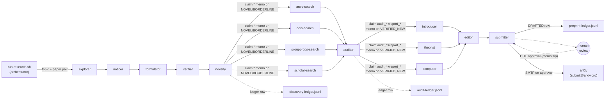

# Research Foundry

 

**Version:** `0.1.0` · [Changelog](./CHANGELOG.md) · **Requires:** agentis >= `1.7.18`

Consolidated research federation (#638): 18 colonies cooperate to
take a topic + paper pair from a cached arXiv corpus and drive an
end-to-end pipeline through compute-first novelty discovery,
literature audit, and arXiv preprint generation. The final dispatch
to the arXiv email gateway is gated on an explicit human-in-the-loop
(HITL) approval flag; the federation never auto-submits.

Replaces three retired federations (`math-foundry/` +
`claim-auditor/` + `preprint-foundry/`) and their three per-fed
orchestrators with one orchestrator + one container.

## Colonies

### Math pipeline (compute-first novelty discovery)

| Colony | Description | Agents |
|--------|-------------|--------|
| [explorer](./explorer/) | Compute-first: LLM emits Python, `exec sh` runs it, agent captures stdout. `knowledge_market` buyer (#741) at all tiers from propose upward | 1 |
| [noticer](./noticer/) | Calibrated triage (#775): reads (code, stdout) and flags surprises (small specific numbers, pattern breaks); biases toward `surprise_found=true` when uncertain | 1 |
| [skeptic](./skeptic/) | Calibrated counter-argument (#773): challenges noticer's surprise claims; biases against premature dismissal | 1 |
| [formulator](./formulator/) | Crafts a competition-style problem whose answer IS the surprise | 1 |
| [verifier](./verifier/) | Independently solves the problem and ACCEPT / NEEDS_REVISION / REJECT / FALSIFIED_LAGRANGE (mechanical divisibility sanity gate, #784) | 1 |
| [novelty](./novelty/) | Calibrated triage referee (#775, #777): biases toward BORDERLINE when uncertain, marks NOT_NOVEL only on near-EXACT re-derivation of a named classical result; participates in `knowledge_market` (#792) at propose tier upward | 1 |

### Claim audit (literature verification)

| Colony | Description | Agents |
|--------|-------------|--------|
| [arxiv-search](./arxiv-search/) | Searches arXiv for prior matches against the claim | 1 |
| [oeis-search](./oeis-search/) | Looks up integer-sequence A-numbers in the OEIS | 1 |
| [groupprops-search](./groupprops-search/) | Queries the Groupprops wiki for group-theory matches | 1 |
| [scholar-search](./scholar-search/) | Searches Google Scholar / semantic-scholar for prior art | 1 |
| [auditor](./auditor/) | Synthesises the four search reports + theorist Lean verdict (#745) + prior_advocate report into VERIFIED_NEW / VERIFIED_BY_LEAN / KNOWN_PRIOR / NEEDS_HUMAN. VERIFIED_BY_LEAN requires both `lean_verdict='verified'` AND `proof_kind='full'` (#795 + #797) | 1 |
| [prior_advocate](./prior_advocate/) | Adversarial-reviewer agent: argues every claim is already known, cites the closest classical anchor; participates in `knowledge_market` (#741) at propose tier upward | 1 |

### Preprint pipeline (LaTeX + reproducibility + arXiv submission)

| Colony | Description | Agents |
|--------|-------------|--------|
| [introducer](./introducer/) | Drafts the abstract + LaTeX Section 1 Introduction from the audited claim + 4 search reports | 1 |
| [theorist](./theorist/) | Produces LaTeX Section 2 (Preliminaries) + Section 3 (Main Result) with proof sketch or computational-experiment description; also translates the theorem statement to Lean 4 and runs `lean` against it (#745, #795) for formal verification of the claim | 1 |
| [computer](./computer/) | Generates a standalone reproducibility script (Python/SymPy/GAP) + runs it inside the container for sanity | 1 |
| [editor](./editor/) | Synthesises a single `main.tex` (amsart), runs `latexmk -pdf`, repair-retries on compile fail, hallucination-checks against reproducibility output | 1 |
| [reviewer](./reviewer/) | Calibrated reproducibility reviewer (#777): extracts every numerical / symbolic claim from `main.tex` and verifies each against the reproducibility stdout; emits approved / rejected verdict. Gates the submitter via the `reviewer:<claim>:approved` memo | 1 |
| [submitter](./submitter/) | Builds `arxiv-metadata.json` + `submission.tar.gz`, drafts cover letter with AI disclosure, writes `status: DRAFTED` ledger row, sends only on HITL approval | 1 |

## Pipeline



Each tick the orchestrator picks a topic (round-robin over
`RESEARCH_TOPICS`) and samples two distinct papers from the cached
arXiv corpus. Only the explorer is seeded -- the remaining 17 daemons
form the downstream cascade inside the same container, reading each
other's memo keys directly via the shared `.agentis/` store. The
novelty agent seeds `claim:*:tick-N` keys for the four searchers when
its verdict is NOVEL or BORDERLINE; the auditor agent seeds
`claim:audit_*:tick-M` + `claim:report_*:tick-M` keys for the five
preprint colonies when its verdict is VERIFIED_NEW.

Cross-tick learning between agents happens via the `knowledge_market`
substrate primitive (#741, #792): novelty `knowledge_sell`s its claims
keyed on `permutation_order_facts:<topic>` / `known_priors:<topic>`,
and explorer + prior_advocate `knowledge_buy` against the same topic
on subsequent ticks. Empirical: a 75-tick claude run produces ~40 live
market entries with `samples > 1` confirming buyers find sellers
in-run.

## Phased pipeline

Per-tick depth from explorer-seed to DRAFTED preprint row is roughly
9-10 ticks. At the default 120s orchestrator tick this gives a first
preprint in about 18-20 minutes.

## Quickstart

```bash
./install.sh                                  # interactive setup
python3 tools/fetch-papers.py --help          # one-time arXiv corpus bootstrap
cp config/authors.toml.example config/authors.toml && $EDITOR config/authors.toml
bash tools/run-research.sh --dry-run          # orchestrator dry-run
bash tools/run-research.sh                    # real run -- spawns 18 colonies in podman
```

Output: `research-foundry/runs/<ts>/` containing
`discovery-ledger.jsonl`, `audit-ledger.jsonl`,
`preprint-ledger.jsonl`, and `replication-ledger.jsonl` (#801: these
are symlinks at the run-root that resolve into `laptop-node/`, the
container's `/run-root` bind-mount target where the daemons actually
write). The ledgers are forensic audit trails; downstream colonies
read each other via the shared memo store, not via the ledger files.
Per-claim sub-directories live at `laptop-node/preprints/<claim-id>/`
with `main.tex`, `main.pdf`, `reproducibility.{py,g}`,
`reproducibility-output.txt`, `arxiv-metadata.json`,
`submission.tar.gz`.

## Tier contract

Every agent in this federation gates its behaviour on the four-tier
confidence ladder defined in
[ADR-0001](../doc/adr/ADR-0001-confidence-tiers.md):

- `shadow` -- observe + memo, no emit, no external write
- `propose` -- emit on bus + draft external writes
- `review-gated` -- direct external writes (non-terminal)
- `autonomous` -- terminal external writes (publish, ack alert, post reply, ...)

## Empirical reality (post-substrate-exercise unlock)

A 75-tick claude flat-tariff run on main HEAD post-#799/#806-#809
exercises the full cascade end-to-end:

- **24 promote events** fire (vs 0 pre-#799 when auto-promote thresholds
  were sized for multi-day deployments only).
- **8 / 18 daemons reach autonomous tier** (conf ≥ 0.95) within the
  75-tick window. The substrate primitives gated on autonomous —
  `replicate()`, audit-guard `decide()` (#761), `_publish_*`'s terminal
  ledger writes — therefore exercise on real workload.
- **40 PDFs published** end-to-end (editor → submitter draft path).
- **111 reviewer verdicts** (72 approved + 39 rejected = 65% approval).
- **22 audit-ledger rows + 186 discovery-ledger rows + 19
  preprint-ledger rows + 5 replication-ledger rows** confirm all four
  autonomous-tier ledger sinks are firing.
- **~40 `knowledge_market` entries** with `samples > 1` confirm
  cross-tick learning between agents.

The federation amplifies the underlying LLM faithfully; the bottleneck
for novelty production is now content design (explorer prompts, topic
seeds), not infrastructure. Claude with the current prior_advocate +
auditor pair produces 0 % `VERIFIED_NEW` on the default mathematical
topics — every claim resolves to a classical anchor under
prior_advocate's encyclopedic math reach. As of #813, Mathlib 4
(pinned `v4.13.0`) is bundled in the container so `theorist` can
formalize real theorems against real Mathlib types (`Real`, `Complex`,
`ZMod`, `Polynomial`, `SimpleGraph`, `Permutations`, ...) — the
`VERIFIED_BY_LEAN` certificate can now be earned by a genuine
non-trivial proof, not just a structural `Prop` axiom-shell.

## Known limitations

- **DAEMONS_PER_COLONY defaults to 1.** The M2-Malthusian replicate
  gate inside `explorer.ag` and other LLM-heavy colonies will grow
  populations once fitness > threshold; the operator can force a
  bootstrap higher with `RESEARCH_DAEMONS_PER_COLONY=N`. Empirical
  validation runs in 2026-05 used `2`.
- **Single auto-promote config across all 18 colonies.** Per-colony
  prereq variation is deferred (extend `auto-promote-decisions.py`
  with per-colony override blocks). Current thresholds are calibrated
  for finite-run research windows (#799: `min_acting_entries: 10`,
  `min_runtime_hours: 0.5`, autonomous override `min_acting: 30`).
- **Mathlib `v4.13.0` is bundled in the container** (#813). Theorist's
  `_run_lean_check` invokes `lake env --dir=$MATHLIB_SHELL lean
  <file>` so any LLM-generated `.lean` source can `import Mathlib`
  (whole library) or targeted namespaces. The `True := trivial`
  placeholder fallback (#795) is still rejected at the publish path
  so the `VERIFIED_BY_LEAN` certificate cannot be earned by a trivial
  Prop. Stock-Lean fallback path is preserved for operators who strip
  the mathlib layer (set `MATHLIB_SHELL=` empty); the container is
  ~3 GB larger with mathlib than without.
- **Legacy `learn()` tag-string literals.** The 15 agents still emit
  `"math-foundry"` / `"claim-auditor"` / `"preprint-foundry"` from
  their `learn()` calls (preserved per #638's scope). A future PR
  will migrate these to a single `"research-foundry"` tag.
