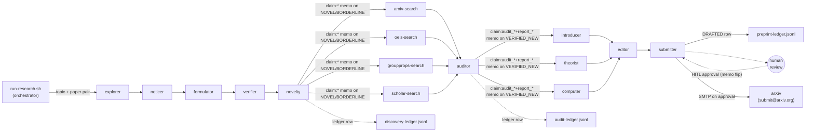

# Research Foundry

 

**Version:** `0.1.0` · [Changelog](./CHANGELOG.md) · **Requires:** agentis >= `1.7.12`

Consolidated research federation (#638): 18 colonies cooperate to
take a topic + paper pair from a cached arXiv corpus and drive an
end-to-end pipeline through compute-first novelty discovery,
literature audit, and arXiv preprint generation. The final dispatch
to the arXiv email gateway is gated on an explicit human-in-the-loop
(HITL) approval flag; the federation never auto-submits.

Replaces three retired federations (`math-foundry/` +
`claim-auditor/` + `preprint-foundry/`) and their three per-fed
orchestrators with one orchestrator + one container.

## Colonies

### Math pipeline (compute-first novelty discovery)

| Colony | Description | Agents |
|--------|-------------|--------|
| [explorer](./explorer/) | Compute-first: LLM emits Python, `exec sh` runs it, agent captures stdout | 1 |
| [noticer](./noticer/) | Reads (code, stdout) and flags surprises (small specific numbers, pattern breaks) | 1 |
| [formulator](./formulator/) | Crafts a competition-style problem whose answer IS the surprise | 1 |
| [verifier](./verifier/) | Independently solves the problem and ACCEPT / REJECT / NEEDS_REVISION | 1 |
| [novelty](./novelty/) | Strict referee: defaults to NOT_NOVEL unless the answer cannot be reduced to a named classical result | 1 |

### Claim audit (literature verification)

| Colony | Description | Agents |
|--------|-------------|--------|
| [arxiv-search](./arxiv-search/) | Searches arXiv for prior matches against the claim | 1 |
| [oeis-search](./oeis-search/) | Looks up integer-sequence A-numbers in the OEIS | 1 |
| [groupprops-search](./groupprops-search/) | Queries the Groupprops wiki for group-theory matches | 1 |
| [scholar-search](./scholar-search/) | Searches Google Scholar / semantic-scholar for prior art | 1 |
| [auditor](./auditor/) | Synthesises the four search reports into VERIFIED_NEW / KNOWN_PRIOR / NEEDS_HUMAN | 1 |

### Preprint pipeline (LaTeX + reproducibility + arXiv submission)

| Colony | Description | Agents |
|--------|-------------|--------|
| [introducer](./introducer/) | Drafts the abstract + LaTeX Section 1 Introduction from the audited claim + 4 search reports | 1 |
| [theorist](./theorist/) | Produces LaTeX Section 2 (Preliminaries) + Section 3 (Main Result) with proof sketch or computational-experiment description | 1 |
| [computer](./computer/) | Generates a standalone reproducibility script (Python/SymPy/GAP) + runs it inside the container for sanity | 1 |
| [editor](./editor/) | Synthesises a single `main.tex` (amsart), runs `latexmk -pdf`, repair-retries on compile fail, hallucination-checks against reproducibility output | 1 |
| [submitter](./submitter/) | Builds `arxiv-metadata.json` + `submission.tar.gz`, drafts cover letter with AI disclosure, writes `status: DRAFTED` ledger row, sends only on HITL approval | 1 |

## Pipeline



Each tick the orchestrator picks a topic (round-robin over
`RESEARCH_TOPICS`) and samples two distinct papers from the cached
arXiv corpus. Only the explorer is seeded -- the remaining 14 daemons
form the downstream cascade inside the same container, reading each
other's memo keys directly via the shared `.agentis/` store. The
novelty agent seeds `claim:*:tick-N` keys for the four searchers when
its verdict is NOVEL or BORDERLINE; the auditor agent seeds
`claim:audit_*:tick-M` + `claim:report_*:tick-M` keys for the five
preprint colonies when its verdict is VERIFIED_NEW.

## Phased pipeline

Per-tick depth from explorer-seed to DRAFTED preprint row is roughly
9-10 ticks. At the default 120s orchestrator tick this gives a first
preprint in about 18-20 minutes.

## Quickstart

```bash
./install.sh                                  # interactive setup
python3 tools/fetch-papers.py --help          # one-time arXiv corpus bootstrap
cp config/authors.toml.example config/authors.toml && $EDITOR config/authors.toml
bash tools/run-research.sh --dry-run          # orchestrator dry-run
bash tools/run-research.sh                    # real run -- spawns 18 colonies in podman
```

Output: `research-foundry/runs/<ts>/` containing
`discovery-ledger.jsonl`, `audit-ledger.jsonl`,
`preprint-ledger.jsonl` (forensic audit trails only; not consumed by
the pipeline) plus per-claim sub-directories
(`laptop-node/preprints/<claim-id>/`) with `main.tex`, `main.pdf`,
`reproducibility.{py,g}`, `reproducibility-output.txt`,
`arxiv-metadata.json`, `submission.tar.gz`.

## Tier contract

Every agent in this federation gates its behaviour on the four-tier
confidence ladder defined in
[ADR-0001](../doc/adr/ADR-0001-confidence-tiers.md):

- `shadow` -- observe + memo, no emit, no external write
- `propose` -- emit on bus + draft external writes
- `review-gated` -- direct external writes (non-terminal)
- `autonomous` -- terminal external writes (publish, ack alert, post reply, ...)

## Known limitations (Phase 1)

- **One daemon per colony.** The M2-Malthusian replicate gate inside
  `explorer.ag` will grow the explorer population once fitness >
  threshold, but Phase 1 ships with a single seed per colony. Phase 2
  will scale the seed count + tune replication economics per the
  discovery ledger from Phase 1 demo runs.
- **Single auto-promote config across all 18 colonies.** Today the
  consolidated config adopts preprint-foundry's most-lenient
  prerequisites (`min_acting_entries: 10`, `min_runtime_hours: 1.5`).
  The fastest-producing math colonies (explorer / formulator) that
  today auto-promoted at 0.5h are gated at 1.5h here. Per-colony
  prereq variation is deferred as a Phase 2 chore (extend
  `auto-promote-decisions.py` with per-colony override blocks).
- **Legacy `learn()` tag-string literals.** The 15 agents still emit
  `"math-foundry"` / `"claim-auditor"` / `"preprint-foundry"` from
  their `learn()` calls (preserved per #638's scope). Phase 2 will
  migrate these to a single `"research-foundry"` tag.
